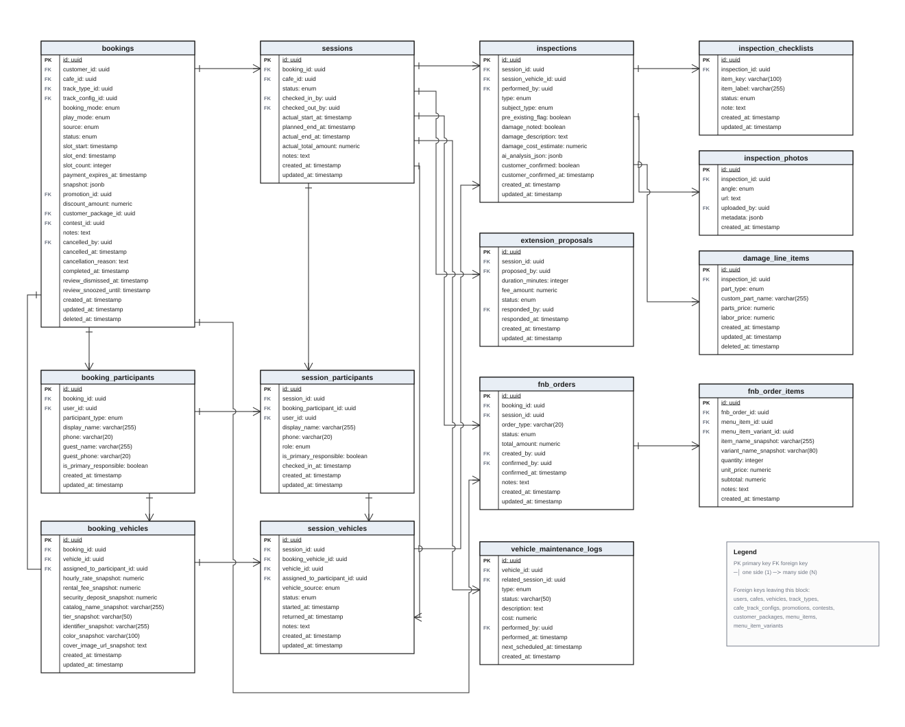

# Database Design for Operation Service

The Operation Service covers everything that happens **once a booking exists and the
customer arrives at the branch**: check-in, the live session, vehicle handover
inspections, on-site F&B, slot extensions, and vehicle maintenance. Fourteen tables
belong to this block.

The diagram below is generated from the live schema of `rcfeild_db`
(`information_schema` dump), not from the entity classes — `vehicle_maintenance_logs`
has no TypeORM entity and would be missing otherwise.

*Figure. Database Design for Operation Service*

---

## Table Descriptions

| No | Table | Description |
|----|-------|-------------|
| 01 | `bookings` | The root record of a reservation. Holds the reserved slot (`slot_start`, `slot_end`, `slot_count`), the play mode (RENTAL / BYOC), the booking channel (`source`), the lifecycle `status`, and the immutable `snapshot` (JSONB) of prices agreed at booking time. Every downstream money calculation reads the snapshot, never the current price list. |
| 02 | `booking_participants` | The people covered by a booking. A participant is either a registered user (`user_id`) or a walk-in guest identified only by `guest_name` / `guest_phone`. Exactly one row carries `is_primary_responsible`, which is the person accountable for damage. |
| 03 | `booking_vehicles` | The vehicles reserved by a booking, with a full price and identity snapshot taken at booking time (`hourly_rate_snapshot`, `rental_fee_snapshot`, `catalog_name_snapshot`, `tier_snapshot`, …). Because the snapshot lives here, later edits to the vehicle catalogue cannot change an existing booking's charges. |
| 04 | `sessions` | The live play session created at check-in. Records who checked the customer in and out, the actual start, the planned end, the actual end, and the running `actual_total_amount`. A session stays ACTIVE until the vehicles are inspected and returned — passing `planned_end_at` is an alert threshold, not a state transition. |
| 05 | `session_participants` | The people who actually showed up, materialised from `booking_participants` at check-in with the real `checked_in_at` time and their operational `role` (DRIVER, PLAYER, SPECTATOR, GUARDIAN). Splitting this from `booking_participants` keeps the booked plan separate from what really happened. |
| 06 | `session_vehicles` | The vehicles in play during a session. `vehicle_source` distinguishes a rented vehicle from a customer-owned (BYOC) one; `booking_vehicle_id` is null for a BYOC vehicle because none was reserved. Tracks per-vehicle `started_at` / `returned_at` and status (ASSIGNED, IN_USE, RETURNED, DAMAGED). |
| 07 | `inspections` | The handover record. One inspection per vehicle per direction: CHECK_IN when the vehicle is handed over, CHECK_OUT when it comes back, STAFF_HANDOVER between shifts. `pre_existing_flag` marks damage that was already there, and `customer_confirmed_at` records the customer's acknowledgement — this is the evidence that settles damage disputes. |
| 08 | `inspection_checklists` | The per-item verdict inside an inspection (`item_key` / `item_label` + status OK, SCRATCHED, BROKEN, MISSING, DIRTY, NEEDS_REVIEW). Storing the label alongside the key preserves the wording the staff actually saw, even if the checklist template changes later. |
| 09 | `inspection_photos` | Photographic evidence attached to an inspection, one row per shot, tagged by `angle` (FRONT, BACK, LEFT, RIGHT and four auxiliary angles). The image itself is stored on Cloudinary; only the URL and upload metadata are persisted here. |
| 10 | `damage_line_items` | The itemised damage bill produced by staff at check-out: one row per damaged part, each with its own `parts_price` and `labor_price`. The amount charged to the customer is the sum of these two columns across all rows — there is no damage multiplier anywhere in the system. Soft-deleted (`deleted_at`) so a line removed during review remains auditable. |
| 11 | `extension_proposals` | A proposal to extend a running session, raised by staff and answered by the customer. Stores the proposed `duration_minutes`, the resulting `fee_amount`, and the outcome (PENDING, APPROVED, REJECTED, EXPIRED, CANCELLED). An extension is a prospective agreement only: once the 10-minute check-out grace period has elapsed, the return must be resolved instead. |
| 12 | `fnb_orders` | A food and beverage order. `order_type` separates a pre-order placed with the booking (settled in the single up-front payment) from an on-site order added during the session (paid directly to the branch). `session_id` is null for a pre-order because no session existed yet. |
| 13 | `fnb_order_items` | The lines of an F&B order, with a name and price snapshot (`item_name_snapshot`, `variant_name_snapshot`, `unit_price`) so a later menu edit cannot retroactively change a served order. |
| 14 | `vehicle_maintenance_logs` | Maintenance work on a rental vehicle: SCHEDULED servicing, REPAIR, or INSPECTION. `related_session_id` links the work back to the session whose check-out revealed the damage, which is what connects the operational record to the maintenance cost. |

---

## Enumerations used in this block

| Column | Type | Values |
|--------|------|--------|
| `bookings.booking_mode` | `booking_mode_enum` | SINGLE, PACKAGE, SUBSCRIPTION |
| `bookings.play_mode` | `play_mode_enum` | RENTAL, BYOC, MIXED&nbsp;¹ |
| `bookings.source` | `booking_source_enum` | APP, STAFF_MANUAL, SYSTEM_SUBSCRIPTION, CONTEST |
| `bookings.status` | `booking_status_enum` | PENDING, AWAITING_PAYMENT, CONFIRMED, CANCELLED, NO_SHOW, COMPLETED |
| `booking_participants.participant_type` | `participant_type_enum` | BOOKER, REGISTERED_USER, WALK_IN_GUEST |
| `sessions.status` | `session_status_enum` | CHECKED_IN, ACTIVE, EXTENDING, CHECKING_OUT, COMPLETED, CANCELLED |
| `session_participants.role` | `participant_role_enum` | DRIVER, PLAYER, SPECTATOR, GUARDIAN |
| `session_vehicles.vehicle_source` | `vehicle_source_enum` | RENTAL, BYOC |
| `session_vehicles.status` | `session_vehicle_status_enum` | ASSIGNED, IN_USE, RETURNED, DAMAGED |
| `inspections.type` | `inspection_type_enum` | CHECK_IN, CHECK_OUT, STAFF_HANDOVER |
| `inspections.subject_type` | `inspection_subject_type_enum` | RENTAL_VEHICLE, BYOC_VEHICLE |
| `inspection_checklists.status` | `inspection_item_status_enum` | OK, SCRATCHED, BROKEN, MISSING, DIRTY, NEEDS_REVIEW |
| `inspection_photos.angle` | `photo_angle_enum` | FRONT, BACK, LEFT, RIGHT, TOP, BOTTOM, DETAIL, OTHER |
| `damage_line_items.part_type` | `damage_part_type` | TIRE_WHEEL, SPOILER, CHASSIS, MOTOR, SHELL, SERVO, REMOTE, OTHER |
| `extension_proposals.status` | `extension_proposal_status_enum` | PENDING, APPROVED, REJECTED, EXPIRED, CANCELLED |
| `fnb_orders.status` | `fnb_order_status_enum` | PENDING, CONFIRMED, PREPARING, DELIVERED, CANCELLED |
| `vehicle_maintenance_logs.type` | `maintenance_type_enum` | SCHEDULED, REPAIR, INSPECTION |

¹ `MIXED` exists in the database enum but no code path can produce it and no booking uses it.

---

## Foreign keys leaving the block

These columns reference tables owned by other services and are therefore drawn as
plain `FK` columns rather than as boxes:

| From | To |
|------|----|
| `bookings.customer_id`, `bookings.cancelled_by`, `sessions.checked_in_by`, `sessions.checked_out_by`, `inspections.performed_by`, `inspection_photos.uploaded_by`, `extension_proposals.proposed_by`, `extension_proposals.responded_by`, `fnb_orders.created_by`, `fnb_orders.confirmed_by`, `vehicle_maintenance_logs.performed_by`, `booking_participants.user_id`, `session_participants.user_id` | `users` |
| `bookings.cafe_id`, `sessions.cafe_id` | `cafes` |
| `booking_vehicles.vehicle_id`, `session_vehicles.vehicle_id`, `vehicle_maintenance_logs.vehicle_id` | `vehicles` |
| `bookings.track_type_id` | `track_types` |
| `bookings.track_config_id` | `cafe_track_configs` |
| `bookings.promotion_id` | `promotions` |
| `bookings.contest_id` | `contests` |
| `bookings.customer_package_id` | `customer_packages` |
| `fnb_order_items.menu_item_id` | `menu_items` |
| `fnb_order_items.menu_item_variant_id` | `menu_item_variants` |

Payment records (`payment_transactions`, `payment_components`) are deliberately not
part of this block — they belong to the Payment Engine and are joined through
`bookings.id`.

:::warning Two relationships have no database constraint
`bookings.track_type_id → track_types.id` and `fnb_order_items.fnb_order_id →
fnb_orders.id` are enforced only in application code; PostgreSQL has no `FOREIGN KEY`
for either. They are drawn as FK columns above because that is the intended design,
but the constraint is missing in the current schema.
:::
