# Screen Flow: Admin Web

**Last updated:** 2026-08-13

Sơ đồ luồng màn hình cho vai trò **ADMIN** (đội RCField vận hành phần mềm). Dựng từ mã nguồn thật, không phải từ bản thiết kế:

| Thành phần trên sơ đồ | Lấy từ |
|---|---|
| Đường dẫn từng màn hình | `rcfield-fe/src/app/router/route-paths.ts` |
| Màn hình nào có thật, ai vào được | `rcfield-fe/src/app/router/routes.tsx` (`guardRoute(..., ["admin"])`) |
| Sáu nhóm menu và thứ tự mục | `rcfield-fe/src/pages/admin/components/AdminShell.tsx` (`adminNavGroups`) |
| Nhãn nút và hộp thoại | Chính các trang trong `rcfield-fe/src/pages/admin/` |

## Quy ước hình khối

| Hình | Nghĩa |
|---|---|
| Bo tròn, nền xanh lá | Điểm vào / ra phiên làm việc |
| Lục giác, nền xanh dương | Tiêu đề nhóm trên thanh menu trái |
| Chữ nhật, nền vàng đậm | Màn hình có URL riêng |
| Chữ nhật, nền vàng nhạt | Hộp thoại hoặc thao tác ngay trên màn hình đó, không đổi URL |
| Chữ nhật, nền đỏ | Màn hình tồn tại nhưng không có lối vào từ giao diện |

## Sơ đồ

```mermaid
flowchart LR
  %% ─────────────────────────── Phiên làm việc ───────────────────────────
  LOGIN(["Đăng nhập<br/>/login"])
  DASH["Bảng điều khiển<br/>/admin/dashboard"]
  PROFILE["Hồ sơ cá nhân<br/>/profile"]
  GUIDE["Hướng dẫn quản trị<br/>/admin/guide"]
  LOGOUT(["Đăng xuất"])

  LOGIN -->|"Đăng nhập bằng<br/>tài khoản vai trò ADMIN"| DASH
  DASH -->|"Bấm 'Hồ sơ cá nhân'"| PROFILE
  DASH -->|"Bấm 'Hướng dẫn quản trị'"| GUIDE
  DASH -->|"Bấm 'Đăng xuất'"| LOGOUT
  LOGOUT -.->|"Xoá phiên"| LOGIN

  %% ─────────────────────── Sáu nhóm trên thanh menu ───────────────────────
  NAV_PARTNER{{"Nhóm menu<br/>ĐỐI TÁC"}}
  NAV_FIN{{"Nhóm menu<br/>TÀI CHÍNH"}}
  NAV_CAT{{"Nhóm menu<br/>DANH MỤC"}}
  NAV_BOT{{"Nhóm menu<br/>TRỢ LÝ ẢO"}}
  NAV_SYS{{"Nhóm menu<br/>HỆ THỐNG"}}

  DASH --> NAV_PARTNER
  DASH --> NAV_FIN
  DASH --> NAV_CAT
  DASH --> NAV_BOT
  DASH --> NAV_SYS

  %% ───────────────────────────── Đối tác ─────────────────────────────
  PROV["Tài khoản Provider<br/>/admin/providers"]
  PROV_DETAIL["Chi tiết Provider<br/>/admin/providers/:providerId"]
  PROV_APPROVE["Duyệt tài khoản"]
  PROV_REJECT["Từ chối tài khoản<br/>(nhập lý do)"]
  PROV_SUSPEND["Tạm khoá / Mở khoá<br/>(nhập lý do)"]
  CAFE["Duyệt cơ sở<br/>/admin/cafes"]
  CAFE_ACT["Duyệt · Tạm ngưng ·<br/>Kích hoạt lại cơ sở"]
  UPGRADE["Yêu cầu nâng gói<br/>/admin/payment-requests"]
  UPGRADE_OK["Xác nhận thanh toán"]
  UPGRADE_NO["Từ chối yêu cầu<br/>(nhập lý do)"]

  NAV_PARTNER -->|"Bấm 'Tài khoản Provider'"| PROV
  NAV_PARTNER -->|"Bấm 'Duyệt cơ sở'"| CAFE
  NAV_PARTNER -->|"Bấm 'Yêu cầu nâng gói'"| UPGRADE

  PROV -->|"Bấm vào dòng trong bảng"| PROV_DETAIL
  PROV -->|"Bấm 'Duyệt'"| PROV_APPROVE
  PROV -->|"Bấm 'Từ chối'"| PROV_REJECT
  PROV -->|"Bấm 'Tạm khoá' / 'Mở khoá'"| PROV_SUSPEND
  PROV_DETAIL -->|"Bấm 'Từ chối'"| PROV_REJECT
  PROV_DETAIL -->|"Bấm 'Tạm khoá'"| PROV_SUSPEND
  CAFE -->|"Bấm nút trạng thái trên dòng"| CAFE_ACT
  UPGRADE -->|"Bấm 'Xác nhận'"| UPGRADE_OK
  UPGRADE -->|"Bấm 'Từ chối'"| UPGRADE_NO

  %% ───────────────────────────── Tài chính ─────────────────────────────
  LEDGER["Sổ giao dịch<br/>/admin/payments"]
  LEDGER_FILTER["Lọc theo trạng thái<br/>và loại giao dịch"]
  FEE["Phí tổ chức giải<br/>/admin/contest-fee-orders"]
  FEE_OK["Xác nhận đơn phí"]
  FEE_NO["Từ chối đơn phí<br/>(nhập lý do)"]

  NAV_FIN -->|"Bấm 'Sổ giao dịch'"| LEDGER
  NAV_FIN -->|"Bấm 'Phí tổ chức giải'"| FEE
  LEDGER -->|"Chọn bộ lọc"| LEDGER_FILTER
  FEE -->|"Bấm 'Xác nhận'"| FEE_OK
  FEE -->|"Bấm 'Từ chối'"| FEE_NO

  %% ───────────────────────────── Danh mục ─────────────────────────────
  PLAN["Gói dịch vụ<br/>/admin/subscription-plans"]
  PLAN_EDIT["Chỉnh sửa gói<br/>(giá · hạn mức)"]
  AMEN["Tiện ích cơ sở<br/>/admin/amenities"]
  AMEN_ADD["Thêm tiện ích mới"]
  AMEN_EDIT["Chỉnh sửa tiện ích"]
  AMEN_DEL["Xoá tiện ích<br/>(xác nhận)"]
  TRACK["Loại đường chạy<br/>/admin/track-types"]
  TRACK_EDIT["Thêm / Chỉnh sửa<br/>loại đường chạy"]

  NAV_CAT -->|"Bấm 'Gói dịch vụ'"| PLAN
  NAV_CAT -->|"Bấm 'Tiện ích cơ sở'"| AMEN
  NAV_CAT -->|"Bấm 'Loại đường chạy'"| TRACK
  PLAN -->|"Bấm 'Chỉnh sửa'"| PLAN_EDIT
  AMEN -->|"Bấm 'Thêm mới'"| AMEN_ADD
  AMEN -->|"Bấm 'Chỉnh sửa'"| AMEN_EDIT
  AMEN -->|"Bấm 'Xoá'"| AMEN_DEL
  TRACK -->|"Bấm 'Thêm' / 'Chỉnh sửa'"| TRACK_EDIT

  %% ───────────────────────────── Trợ lý ảo ─────────────────────────────
  CHAT["Cuộc trò chuyện<br/>/admin/system-chat"]
  CHAT_NEW["Cuộc trò chuyện mới"]
  CHAT_CFG["Giao diện · Tin nhắn chào ·<br/>Gợi ý nhanh · Chỉ dẫn"]
  CHANNEL["Kênh Messenger<br/>/admin/channels"]
  KB["Kho kiến thức<br/>/admin/knowledge-base"]
  KB_UP["Upload tài liệu mới"]

  NAV_BOT -->|"Bấm 'Cuộc trò chuyện'"| CHAT
  NAV_BOT -->|"Bấm 'Kênh Messenger'"| CHANNEL
  NAV_BOT -->|"Bấm 'Kho kiến thức'"| KB
  CHAT -->|"Bấm 'Cuộc trò chuyện mới'"| CHAT_NEW
  CHAT -->|"Mở bảng cấu hình"| CHAT_CFG
  KB -->|"Kéo thả / chọn file"| KB_UP

  %% ───────────────────────────── Hệ thống ─────────────────────────────
  POPUP["Popup trang chủ<br/>/admin/featured-popups"]
  POPUP_NEW["Tạo popup mới"]
  FLAG["Cấu hình hệ thống<br/>/admin/feature-flags"]
  FLAG_QUOTA["Bật/tắt tính năng<br/>· Sửa hạn mức"]

  NAV_SYS -->|"Bấm 'Popup trang chủ'"| POPUP
  NAV_SYS -->|"Bấm 'Cấu hình hệ thống'"| FLAG
  POPUP -->|"Bấm 'Tạo popup mới'"| POPUP_NEW
  FLAG -->|"Bấm vào ô hạn mức"| FLAG_QUOTA

  %% ──────────────────── Màn hình chưa có lối vào ────────────────────
  USERS["Quản lý người dùng<br/>/admin/users"]
  USERS_ACT["Điều chỉnh điểm uy tín ·<br/>Lịch sử · Khoá tài khoản"]

  DASH -.->|"Không có mục menu nào trỏ tới —<br/>chỉ vào được bằng cách gõ URL"| USERS
  USERS -->|"Bấm nút trên dòng"| USERS_ACT

  %% ───────────────────────────── Định dạng ─────────────────────────────
  classDef screen fill:#fdf0d5,stroke:#c9a227,stroke-width:1px,color:#1c1b1b
  classDef action fill:#fffaed,stroke:#ddc47e,stroke-width:1px,color:#1c1b1b
  classDef nav fill:#e6ecf5,stroke:#7189ad,stroke-width:1px,color:#1c1b1b
  classDef entry fill:#e4efdd,stroke:#6b8f5a,stroke-width:1px,color:#1c1b1b
  classDef orphan fill:#fbe3e3,stroke:#c14c4c,stroke-width:1px,color:#1c1b1b

  class DASH,PROFILE,GUIDE,PROV,PROV_DETAIL,CAFE,UPGRADE,LEDGER,FEE,PLAN,AMEN,TRACK,CHAT,CHANNEL,KB,POPUP,FLAG screen
  class PROV_APPROVE,PROV_REJECT,PROV_SUSPEND,CAFE_ACT,UPGRADE_OK,UPGRADE_NO,LEDGER_FILTER,FEE_OK,FEE_NO,PLAN_EDIT,AMEN_ADD,AMEN_EDIT,AMEN_DEL,TRACK_EDIT,CHAT_NEW,CHAT_CFG,KB_UP,POPUP_NEW,FLAG_QUOTA,USERS_ACT action
  class NAV_PARTNER,NAV_FIN,NAV_CAT,NAV_BOT,NAV_SYS nav
  class LOGIN,LOGOUT entry
  class USERS orphan
```



## Một phát hiện khi dựng sơ đồ

`/admin/users` được đăng ký trong `routes.tsx` và có đủ chức năng (điều chỉnh điểm uy tín, xem lịch sử, khoá tài khoản), nhưng **không mục menu nào trỏ tới**. Rà toàn bộ mã frontend, `routePaths.adminUsers` chỉ xuất hiện ở hai tệp định nghĩa router — không nơi nào dùng để tạo liên kết.

Nghĩa là admin chỉ vào được màn hình này bằng cách gõ thẳng URL. Cần quyết định: bổ sung vào nhóm menu, hay gỡ hẳn màn hình.

## Xuất file ảnh

```bash
cd docs/diagrams/screen-flow
npx -y @mermaid-js/mermaid-cli@11 \
  -i admin-screen-flow.mmd \
  -o admin-screen-flow.svg \
  -c mermaid-config.json \
  -b white
```

**Không được bỏ `-c mermaid-config.json`.** Mặc định Mermaid gói mọi nhãn chữ vào thẻ `<foreignObject>` — tức là nhét HTML vào trong SVG. Trình duyệt đọc được, nhưng draw.io, Word và Illustrator thì không: hình vẫn hiện đủ khung và mũi tên, riêng **chữ biến mất sạch**. Tệp cấu hình tắt `htmlLabels`, ép Mermaid vẽ nhãn bằng thẻ `<text>` chuẩn SVG. Kiểm lại sau khi xuất:

```bash
grep -c foreignObject admin-screen-flow.svg   # phải ra 0
```

Cần PNG cho chỗ không nhận SVG thì đổi đuôi tệp đầu ra và thêm `-w 2600` để đặt chiều rộng.

## Ba tệp dùng vào việc gì

| Tệp | Mở bằng |
|---|---|
| `admin-screen-flow.svg` | Trình duyệt, Preview, Word, draw.io — đây là **tệp hình** |
| `admin-screen-flow.mmd` | Trình soạn thảo văn bản — đây là **mã nguồn**, mở bằng draw.io sẽ báo lỗi `Start tag expected` vì tệp bắt đầu bằng `%%` chứ không phải `<` |
| `mermaid-config.json` | Không mở trực tiếp, chỉ truyền vào lệnh xuất |

Muốn sửa sơ đồ ngay trong draw.io thành các khối kéo thả được: **Arrange → Insert → Advanced → Mermaid**, rồi dán nội dung tệp `.mmd` vào. Đừng dùng File → Open với tệp `.mmd`.
