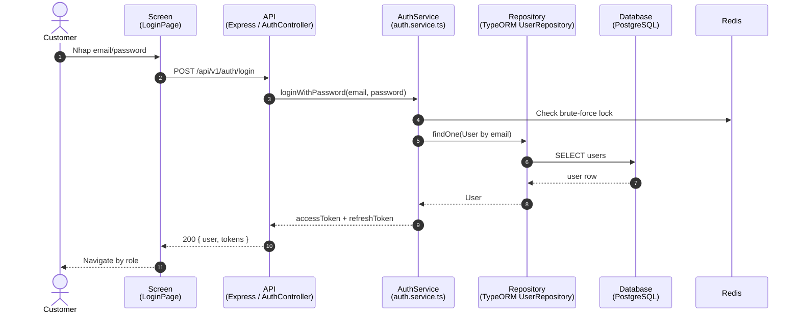

# Sequence Diagrams - RCField

**Last updated:** 2026-08-06

Cac file trong thu muc nay mo ta luong end-to-end o muc actor/screen/controller/service/repository/database/third-party.

## Diagram Style

Tat ca sequence diagram trong thu muc nay dung chung thu tu tu trai sang phai:

1. `Actor`
2. `Screen (<ScreenName>)` hoac `Component (<ComponentName>)`
3. `API (Express / <ControllerName>)`
4. `Service (<service>.ts)` hoac `Repository (TypeORM)`
5. `Database/Cache` nhu PostgreSQL, Redis
6. `Third-party` nhu VNPay, Cloudinary, Facebook, Gemini

Khong ghi chung chung `API`, `DB`, `App` neu flow co source code ro rang. Vi du:

### Sequence Notation

- `participant X as Screen (CreateBookingPage)` = man hinh/component that hien tren FE.
- `API->>API: validate request body / auth role` = self-call, mui ten vong ve chinh no. Dung de bieu thi xu ly noi bo trong cung controller/service nhu validate, map DTO, compute amount, build response.
- `activate X` / `deactivate X` = thoi gian object dang xu ly request.
- `alt/else/end` = validate branch hoặc business error path.
- `loop` = lap qua danh sach row/item/event.
- `opt` = buoc co the co hoac khong.

Moi file sequence chinh nen co them `classDiagram` ngan cho cac class/entity lien quan den chuc nang do.
Doc cung business rules va architecture docs truoc khi implement endpoint hoac test
tich hop.

| File | Luong | Doc khi nao |
|---|---|---|
| [`sequence-flow-admin-operations.md`](./sequence-flow-admin-operations.md) | Admin dashboard, provider review, payment requests, catalogs, feature flags, featured popups, KB/channel/cafe moderation | Truoc khi lam admin screens/controllers |
| [`sequence-flow-provider-operations.md`](./sequence-flow-provider-operations.md) | Provider dashboard, KYC, cafe/config/pricing/menu/package/promotion/vehicle/staff/channel/KB/contest fee | Truoc khi lam provider workspace |
| [`sequence-flow-staff-operations.md`](./sequence-flow-staff-operations.md) | Staff activation, daily booking queue, walk-in, check-in, inspection, F&B, extension, maintenance, contest event day | Truoc khi lam staff workspace |
| [`sequence-flow-customer-public-operations.md`](./sequence-flow-customer-public-operations.md) | Public explore, auth, profile, favorites, notifications, booking, packages, reviews, contests, racing, chat | Truoc khi lam public/customer flows |
| [`sequence-flow-booking-lifecycle.md`](./sequence-flow-booking-lifecycle.md) | Booking lifecycle tong quat: create, payment, check-in, checkout, incident, settlement | Truoc khi lam booking/session/payment |
| [`sequence-flow-booking-operations.md`](./sequence-flow-booking-operations.md) | Van hanh tai quan: scan QR, F&B on-site, extension, checkout damage | Truoc khi lam Staff app operations |
| [`sequence-flow-contest-lifecycle.md`](./sequence-flow-contest-lifecycle.md) | Contest lifecycle: create/open, register, payment, check-in, race result, complete/cancel | Truoc khi lam contest/tournament |
| [`sequence-flow-contest-vehicle-operations.md`](./sequence-flow-contest-vehicle-operations.md) | Contest vehicle operations: booking-linked rental, BYOC review, check-in, correction, leaderboard guard | Truoc khi lam luong xe contest, review hoac match ops |
| [`sequence-flow-provider-onboarding-subscription.md`](./sequence-flow-provider-onboarding-subscription.md) | Provider onboarding, subscription, grace/expired jobs | Truoc khi lam SaaS subscription/provider guard |
| [`sequence-flow-rag-chat.md`](./sequence-flow-rag-chat.md) | Chat widget/full-page chat, SSE, Facebook Messenger webhook, RAG core | Truoc khi lam AI chat, KB, Messenger |
| [`sequence-flow-redis-usage.md`](./sequence-flow-redis-usage.md) | Redis usage: auth brute force, booking locks, BYOC counter, FB nonce/dedup | Truoc khi dung cache/lock/dedup |
| [`sequence-flow-revenue-payout.md`](./sequence-flow-revenue-payout.md) | Revenue, commission, provider payout | Truoc khi lam settlement/payout dashboard |
| [`sequence-flow-supporting-operations.md`](./sequence-flow-supporting-operations.md) | Support CRUD/utility summary: auth/profile, cafe/menu/pricing/packages/promotions/vehicles, reviews, staff invite, notifications, upload | Doc nhanh khi can overview ngan |
| [`sequence-flow-2026-08-finance-and-operations.md`](./sequence-flow-2026-08-finance-and-operations.md) | Bank-transfer booking payment, PayOS subscription, contest ledger, itemized damage charge, custom menu categories | Khi cap nhat Report 4 theo cac feature 016-019 va backend 2026-08 |

## Coverage Matrix

| Controller group | Main screen/component | Sequence doc |
|---|---|---|
| `admin-dashboard`, `admin-provider`, `admin-payment-request`, `admin-subscription-plan`, `admin-amenity`, `admin-track-type`, `admin-feature-flags`, `featured-popup`, `contest-fee`, admin `kb/system/cafe` | `AdminDashboardPage`, `AdminProvidersPage`, `AdminPaymentRequestsPage`, `AdminSubscriptionPlansPage`, `AdminAmenitiesPage`, `AdminTrackTypesPage`, `AdminFeatureFlagsPage`, `AdminFeaturedPopupsPage`, `AdminKnowledgeBasePage` | `sequence-flow-admin-operations.md` |
| `provider-onboarding`, `provider-dashboard`, `ai-revenue-analytics`, `cafe`, `cafe-image`, `cafe-track-config`, `pricing`, `menu`, `menu-category`, `package`, `promotion`, `vehicle-catalog`, `vehicle`, `staff`, `fb-channel`, provider `kb/chat`, `review`, `contest`, `contest-fee`, `payment-request` | `ProviderDashboardPage`, `ProviderCafesPage`, `ProviderConfigurationPage`, `ProviderMenuPage`, `ProviderPackagesPage`, `ProviderPromotionsPage`, `ProviderVehiclesPage`, `ProviderStaffPage`, `ChannelSettingsPage`, `ProviderContestWorkspacePage` | `sequence-flow-provider-operations.md` |
| `staff-invite`, `staff`, `session`, staff `booking`, `upload`, staff `contest`, `vehicle`, `customer-package`, `notification` | `StaffActivatePage`, `StaffDashboardPage`, `StaffTodayBookingsPage`, `StaffSessionDetailPage`, `StaffInspectionPage`, `StaffCheckoutSummaryPage`, `StaffFnbOrdersPage`, `StaffPackagesPage`, `StaffMaintenancePage`, `StaffContestRuntimePage` | `sequence-flow-staff-operations.md` |
| `auth`, public/customer `cafe`, `featured-popup`, `favorite`, `review`, `customer-package`, `booking`, `session`, `vnpay`, `contest`, `racing-network`, `notification`, `chat`, public `vehicle` | `LandingPage`, `ExplorePage`, `CafeDetailPage`, `LoginPage`, `CustomerProfilePage`, `CreateBookingPage`, `BookingDetailPage`, `CustomerPackagesPage`, `CustomerReviewsPage`, `PublicContestDetailPage`, `CustomerContestRegistrationsPage`, `ChatWidget` | `sequence-flow-customer-public-operations.md` |
| Deep booking/payment/session state machine | Booking/customer/staff/payment screens | `sequence-flow-booking-lifecycle.md`, `sequence-flow-booking-operations.md`, `sequence-flow-revenue-payout.md` |
| Deep contest lifecycle/vehicle/runtime state machine | Provider/public/staff contest screens | `sequence-flow-contest-lifecycle.md`, `sequence-flow-contest-vehicle-operations.md` |
| RAG chat and Redis internals | Chat/channel/auth/booking screens | `sequence-flow-rag-chat.md`, `sequence-flow-redis-usage.md` |

## Related Architecture Docs

- [`docs/architecture/00-system-overview.md`](../../architecture/00-system-overview.md)
- [`docs/architecture/01-booking-session.md`](../../architecture/01-booking-session.md)
- [`docs/architecture/03-contest.md`](../../architecture/03-contest.md)
