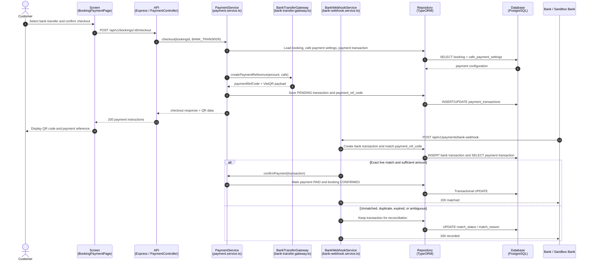
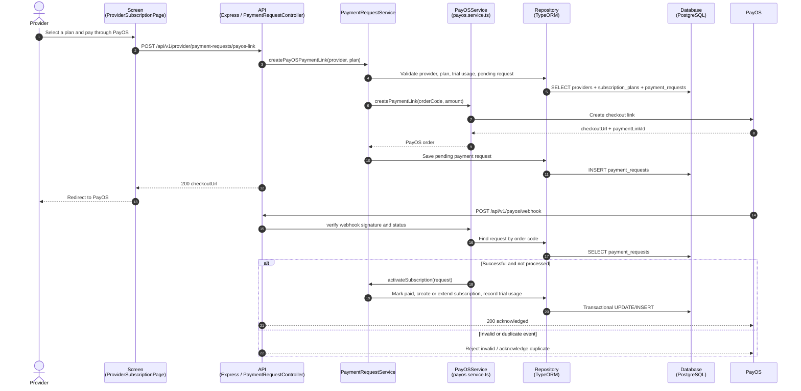
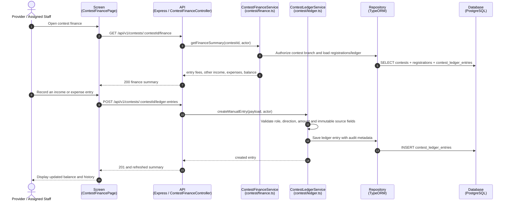
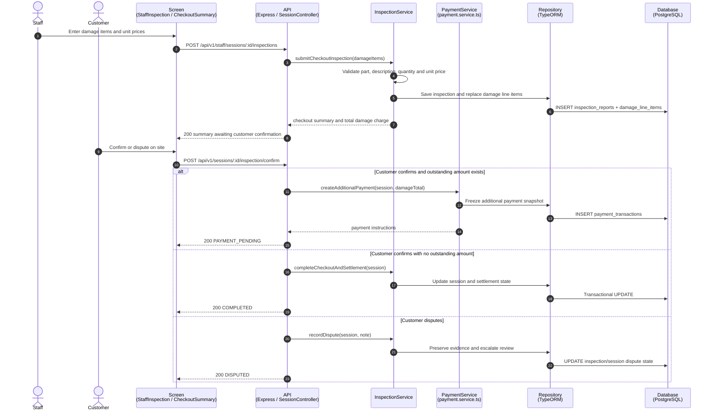
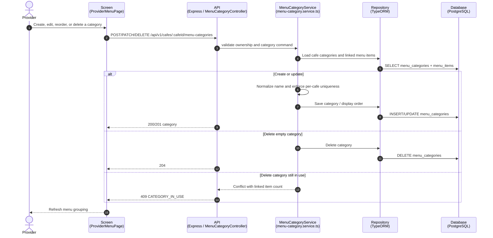
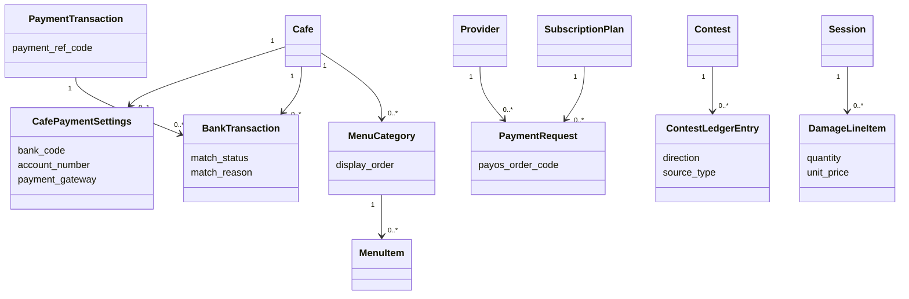

# Sequence Flow: August 2026 Finance and Operations Update

**Last updated:** 2026-08-13  
**Scope:** bank-transfer booking payment, PayOS provider subscription, contest finance, itemized damage charge, and custom menu categories.

The diagrams follow the established RCField sequence layout: actor, concrete screen, Express controller, service, TypeORM repository, PostgreSQL, then third-party systems.

## 1. Booking Checkout by Bank Transfer and Webhook Reconciliation

## 2. Provider Subscription Checkout through PayOS

## 3. Contest Finance Ledger and Summary

## 4. Itemized Damage Charge, Customer Confirmation, and Additional Payment

## 5. Provider Custom Menu Category Management

## 6. Class Diagram: Finance and Operations Update

## Reference

- `docs/spec/03-payment-engine.md`
- `docs/spec/04-inspection-flow.md`
- `docs/spec/05-api-contracts.md`
- `docs/spec/06-database.md`
- `specs/016-damage-charge-redesign/`
- `specs/017-custom-menu-categories/`
- `specs/018-contest-finance/`
- `specs/019-cafe-bank-payment/`
