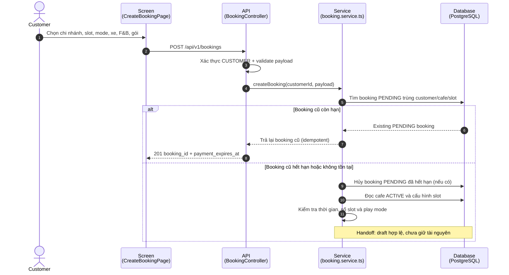
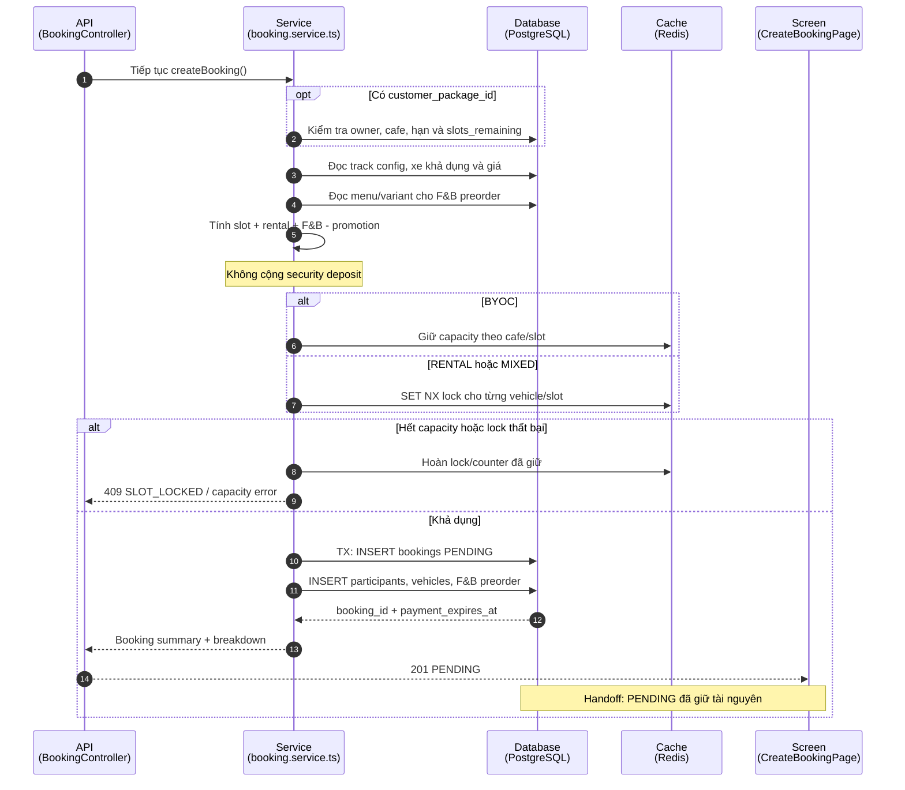
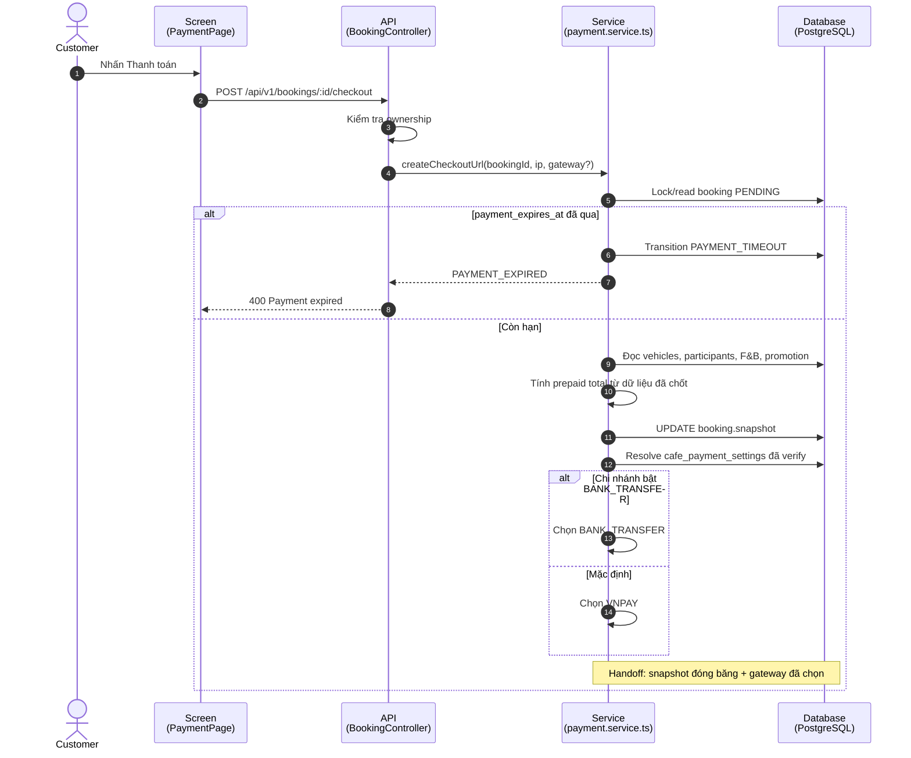
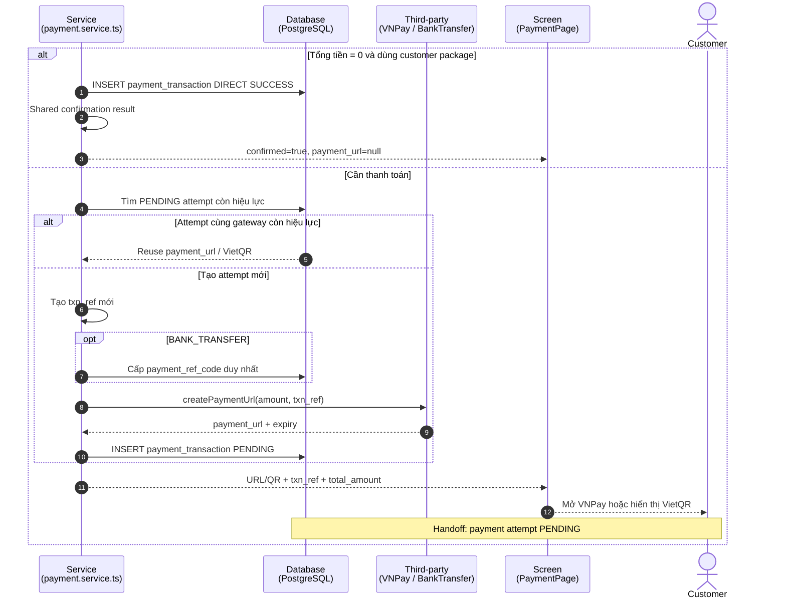
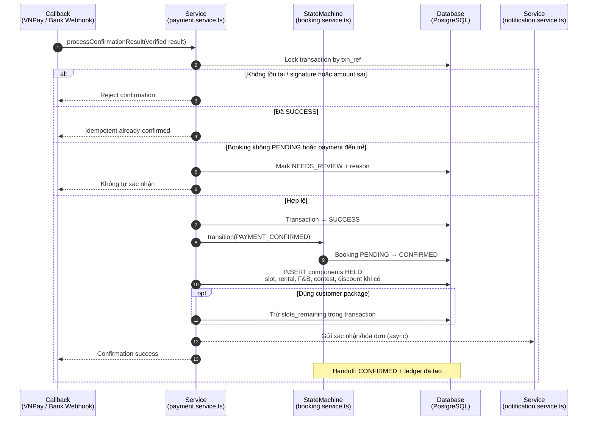
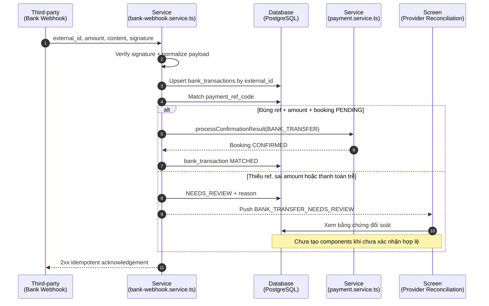

# Sequence Flow: Booking and Payment Management (Report 4)

Các hình dưới đây được chia nhỏ cho khổ dọc. Mỗi hình kết thúc ở một trạng thái bàn giao rõ ràng và hình kế tiếp tiếp tục từ trạng thái đó. Đối chiếu ngày 2026-08-13 với booking/payment services, bank webhook/reconciliation và `03-payment-engine.md`.

## 1. Booking Request and Draft Reuse

## 2. Availability, Price Snapshot, and Pending Booking

## 3. Checkout Snapshot and Payment Method Resolution

## 4. Payment Initiation: Direct, VNPay, or VietQR

## 5. Shared Payment Confirmation and Booking Ledger

## 6. Bank Transfer Webhook and Reconciliation Review

