# Sequence Flow: Contest Lifecycle

**Last updated**: 2026-06-23  
**Status**: Active for compact contest implementation  
**Related rules**: `docs/spec/business-rules/BR-contest.md`  
**Architecture**: `docs/architecture/03-contest.md`

Tài liệu này mô tả luồng end-to-end hiện tại: Provider tạo contest, Customer đăng ký, Staff/Provider check-in, Provider/Staff tạo match linh hoạt, nhập kết quả, advance winner và publish leaderboard. Schema dùng `contest_matches` và `contest_match_participants`, không dùng class/round/heat/result/reward tables cũ.

---

## 0. Identifiers

| Field | Value | Notes |
|---|---|---|
| Contest owner | `provider_id` | Provider tạo và sở hữu contest |
| Participating branches | `contest_cafes` | Một contest có nhiều cafe tham gia |
| Registration scope | Contest-level | Customer không chọn chi nhánh khi đăng ký |
| Contest status | `DRAFT -> OPEN -> CLOSED -> RUNNING -> COMPLETED` | `CANCELLED` là terminal |
| Registration status | `PENDING -> CONFIRMED -> CHECKED_IN` | `CANCELLED` cho hủy |
| Schedule unit | `contest_matches` | Match/heat/time-attack/final đều là match |
| Match participant | `contest_match_participants` | Không hard-code A/B, hỗ trợ nhiều driver |
| Leaderboard | `contests.config.leaderboard` | Snapshot phase này |
| Monitoring | `contest_audit_logs` | Ghi mọi mutation quan trọng |

---

## 1. Provider tạo Contest DRAFT

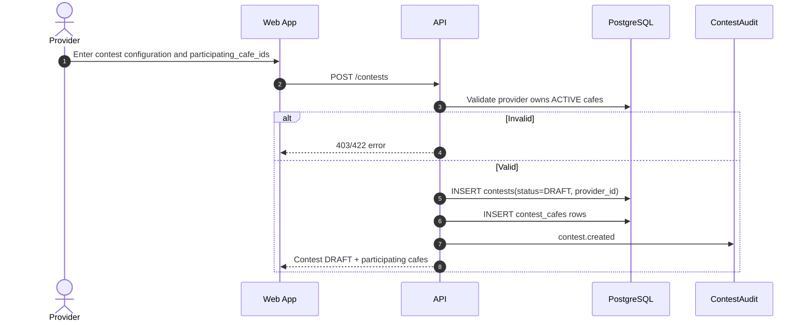

---

## 2. Open registration

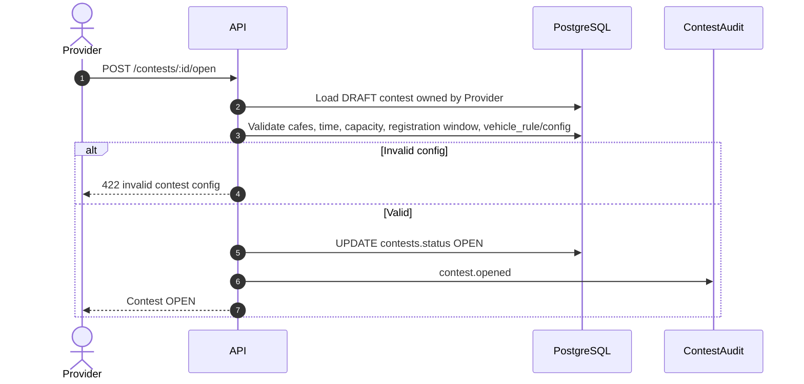

---

## 3. Customer đăng ký

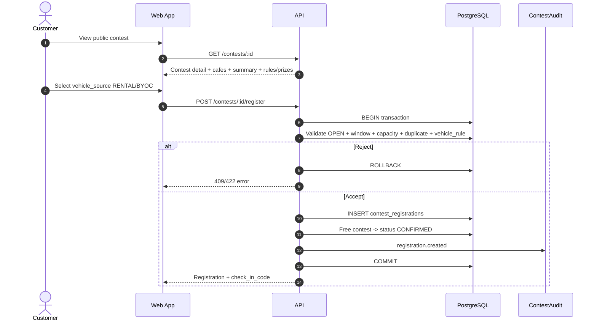

---

## 4. Close registration

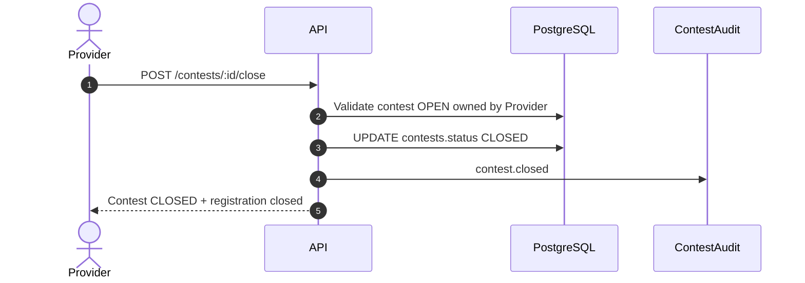

---

## 5. Staff/Provider check-in

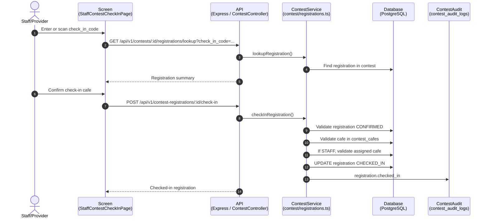

---

## 6. Generate matches

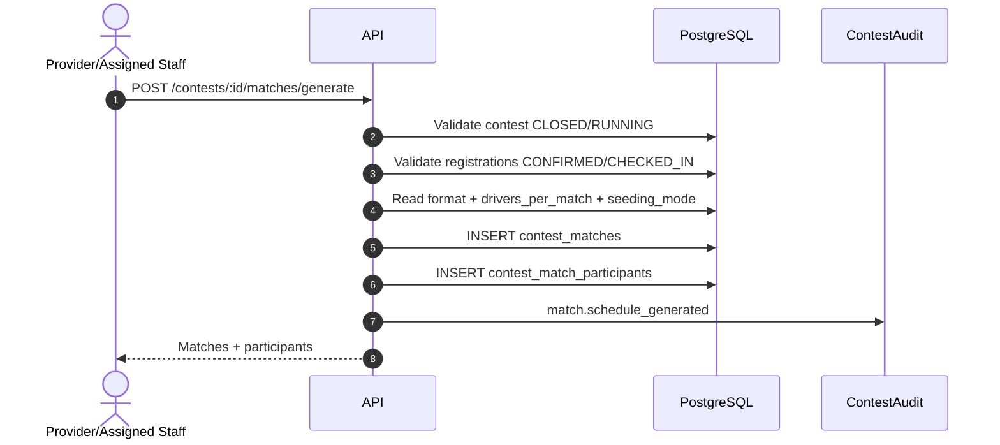

---

## 7. Drag/drop participants

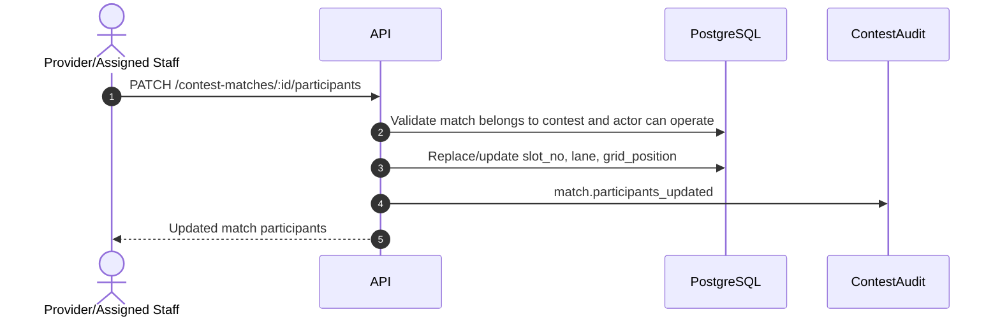

---

## 8. Submit result and advance

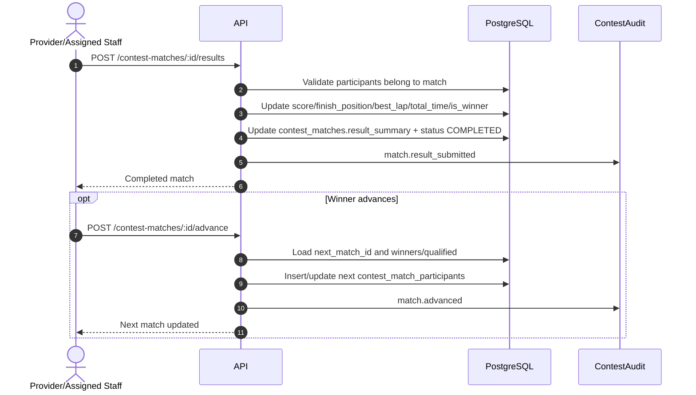

---

## 9. Publish leaderboard

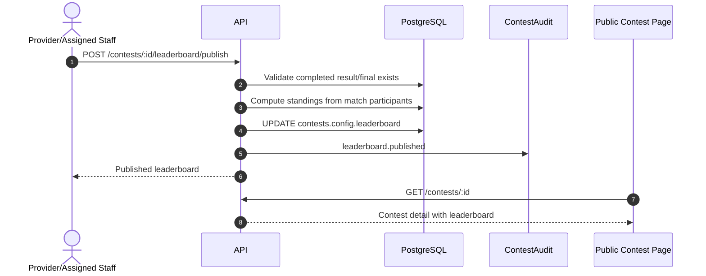

---

## 10. Cancel contest or registration

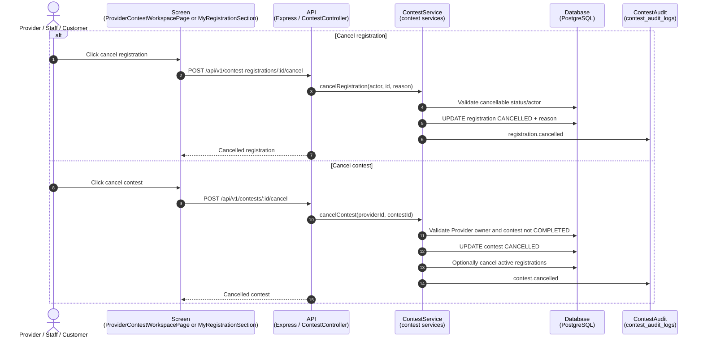

---

## 11. Class Diagram: Contest Lifecycle

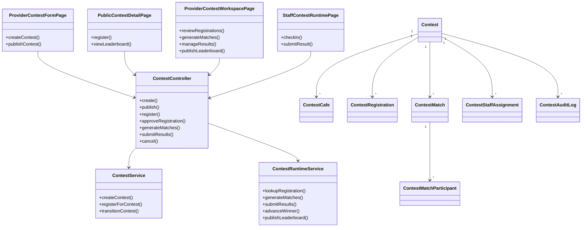

---

## Reference

- `docs/architecture/03-contest.md` — module architecture
- `docs/architecture/diagrams/contest-lifecycle-flow.md` — lifecycle flowchart
- `docs/spec/business-rules/BR-contest.md` — business rules
- `docs/spec/05-api-contracts.md` — endpoint contract
- `docs/spec/06-database.md` — current contest schema
