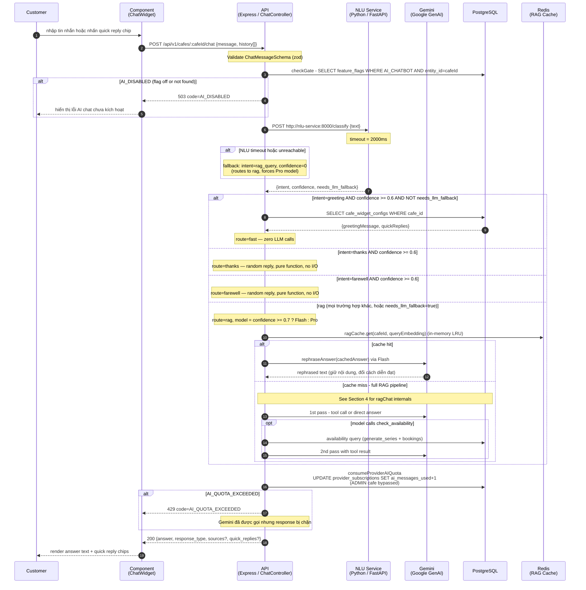
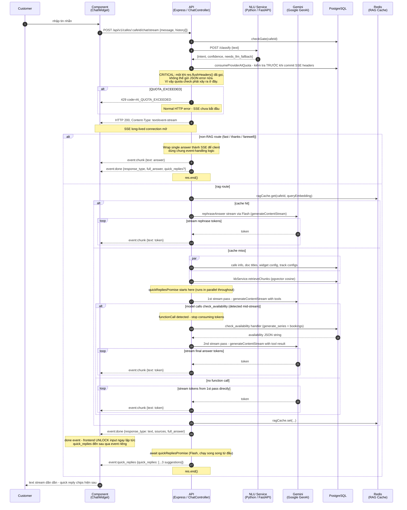
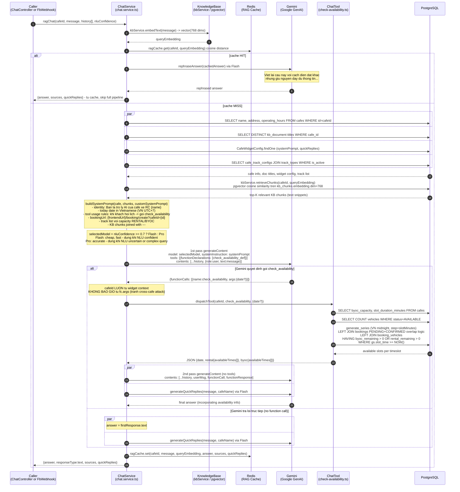
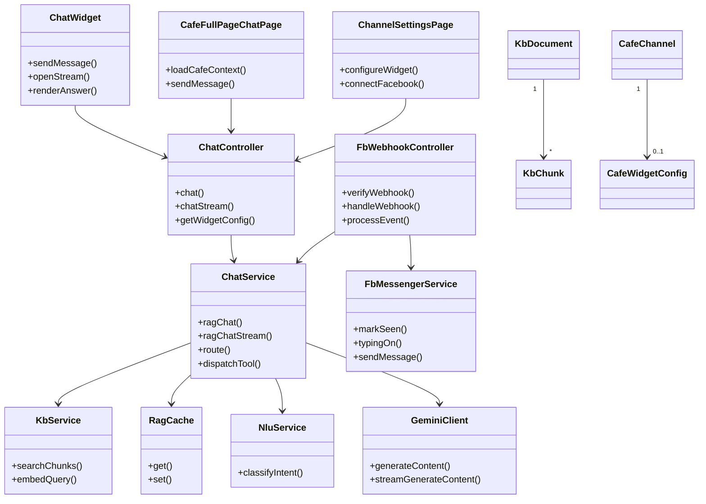

# Sequence Flow: RAG Chat — Widget, Full Page & Facebook Messenger

Mô tả toàn bộ luồng AI chat trên 3 channel (Widget, Full Page, Facebook Messenger) — từ message routing qua NLU, RAG core với function calling, đến SSE streaming và FB Messenger delivery — dựa trên code thực tế tại `chat.service.ts`, `chat.controller.ts`, `fb-webhook.controller.ts`, `chat-tools/`, `fb-messenger.service.ts`, và `config/nlu.ts`.

> See **Reference** at the bottom for related docs and legend.

---

## 0. Identifiers

| Field | Value | Notes |
|-------|-------|-------|
| Endpoint | `POST /api/v1/cafes/:cafeId/chat` | Widget/FullPage non-streaming |
| Endpoint | `POST /api/v1/cafes/:cafeId/chat/stream` | Widget/FullPage SSE |
| Endpoint | `GET /api/v1/webhook/facebook` | Facebook webhook verification |
| Endpoint | `POST /api/v1/webhook/facebook` | Facebook message events |
| Feature Flag | `AI_CHATBOT` entity_type=CAFE, entity_id=cafeId | Admin-toggle per cafe |
| ChatRoute | `fast / thanks / farewell / rag` | NLU routing result |
| NLU Fallback | `intent=rag_query, confidence=0` | Timeout (2000ms) or NLU unreachable |
| Model selection | `nluConfidence >= 0.7 → Flash, else → Pro` | Applies to rag route only |
| Redis key | `fb:cafe-session:{pageId}:{psid}` TTL 86400s | FB session — which cafeId user selected |
| Redis key | `facebook:processed:{pageId}:{mid}` NX EX 300 | FB message dedup |
| SSE events | `chunk / done / quick_replies` | 3 event types for streaming channel |
| Tool | `check_availability` | Only Gemini tool currently registered |

---

## 1. Widget / Full Page Chat — Non-Streaming (POST /chat)

Luồng đồng bộ của Widget embed và Full Page Chat — cùng dùng chung endpoint, handler và service. `fullPageEnabled` là flag UI-only trong `cafe_widget_configs`, **không có sự khác biệt backend**.



> **Lưu ý**: `consumeProviderAIQuota` gọi **sau khi** Gemini đã generate xong. Nếu quota bị exceeded, response bị chặn nhưng Gemini token đã tiêu. Đây là trade-off chấp nhận được vì `fast/thanks/farewell` không tốn LLM, còn `rag` route thì Gemini call đã không thể thu hồi.

---

## 2. Widget / Full Page Chat — SSE Streaming (POST /chat/stream)

Khác biệt chính so với non-streaming: quota check trước `flushHeaders`, non-RAG routes cũng được wrap thành SSE events để client dùng chung protocol, và RAG streaming phát token ngay khi Gemini sinh ra.



> **SSE event protocol:**
> - `event:chunk` — token text fragment, accumulate on client
> - `event:done` — full answer + sources; triggers input unlock
> - `event:quick_replies` — 3 contextual follow-up suggestions (Flash, parallel)

---

## 3. Facebook Messenger Webhook

Facebook gọi webhook với mọi tin nhắn và backend trả `200 OK` trước khi xử lý bất đồng bộ. Source hiện tại ánh xạ mỗi Facebook Page trực tiếp tới một `CafeChannel`, đẩy event qua BullMQ, khóa tuần tự theo PSID và dùng Redis để chống xử lý trùng. Luồng được tách thành ba sequence nhỏ để giữ nội dung đọc được khi import vào Report 4.

### 3.1 Webhook Intake and Queue Dispatch

```mermaid
sequenceDiagram
    autonumber
    participant FBU as Facebook User
    participant FBAPI as Facebook<br/>Graph API
    participant WH as API<br/>(Express / FbWebhook)
    participant Q as BullMQ<br/>fb-chat Queue

    FBU->>FBAPI: gửi tin nhắn vào Page
    FBAPI->>WH: POST /api/v1/webhook/facebook {object:page, entry:[...]}
    WH-->>FBAPI: 200 OK (ngay lập tức)
    alt payload.object != page
        Note over WH: return, không enqueue
    else FB_CHAT_QUEUE_ENABLED = false
        Note over WH: log warn và bỏ qua event
    else valid Page events
        loop mỗi entry và messaging event
            WH->>Q: add process {event, pageId}<br/>attempts=3, exponential backoff 2s
            Q-->>WH: job id
            Note over WH: log enqueued; lỗi enqueue được log async
        end
    end
```

### 3.2 Queue Worker, PSID Ordering and Deduplication

```mermaid
sequenceDiagram
    autonumber
    participant Q as BullMQ<br/>fb-chat Queue
    participant W as FbChatWorker
    participant RDS as Redis<br/>Lock / Dedup
    participant WH as processEvent()
    participant DB as PostgreSQL

    Q->>W: process {event, pageId}
    W->>RDS: SET fb:psid-lock:{pageId}:{psid} 1 EX 30 NX
    alt lock chưa lấy được
        loop poll 300ms, tối đa 15s
            W->>RDS: retry SET NX
        end
        alt timeout
            Note over W: throw; BullMQ retry theo job policy
        end
    end
    W->>WH: processEvent(event, pageId)
    alt echo hoặc message không có text
        WH-->>W: return
    else text message
        WH->>DB: find CONNECTED FACEBOOK_MESSENGER CafeChannel by pageId
        alt channel không tồn tại
            Note over WH: log unknown page_id và return
        else channel hợp lệ
            Note over WH: decrypt page token; cafeId lấy trực tiếp từ channel
            WH->>RDS: SET facebook:processed:{pageId}:{mid} 1 EX 300 NX
            alt dedup hit
                WH-->>W: return
            else first delivery
                Note over WH: tiếp tục AI processing (Section 3.3)
            end
        end
    end
    W->>RDS: DEL fb:psid-lock:{pageId}:{psid}
```

### 3.3 AI Routing and Messenger Response Delivery

```mermaid
sequenceDiagram
    autonumber
    participant WH as processEvent()
    participant DB as PostgreSQL
    participant FBAPI as Facebook<br/>Graph API
    participant NLU as NLU Service<br/>(Python / FastAPI)
    participant GEM as Gemini / RAG
    participant FBU as Facebook User

    WH->>DB: SELECT provider_id, role for cafeId
    par sender actions
        WH->>FBAPI: markSeen(psid)
    and
        WH->>FBAPI: typingOn(psid)
    end
    WH->>DB: checkGate(cafeId)
    alt provider role != ADMIN
        WH->>DB: incrementAIQuota(providerId)
    end
    WH->>NLU: route(text) / classify intent
    NLU-->>WH: route + confidence
    alt fast / thanks / farewell
        Note over WH: build deterministic answer
    else rag
        WH->>GEM: ragChat(cafeId, text, [], confidence)
        GEM-->>WH: answer + quick replies
    end

    Note over WH: FbMessengerFormatter.format(response)<br/>stripMarkdown: [text](url) -> text (URL bi mat!)<br/>truncate <= 2000 chars, quickReplies max 5 title max 20
    Note over WH: elapsed = Date.now() - typingAt<br/>if elapsed < 1500ms -> sleep (1500 - elapsed)ms
    WH->>FBAPI: POST /me/messages {text, quick_replies?}
    FBAPI->>FBU: tin nhan duoc deliver voi quick reply buttons
    alt AI disabled hoặc quota exceeded
        WH->>FBAPI: sendText(service unavailable)
        FBAPI->>FBU: fallback support message
    else unexpected error
        Note over WH: log processing error; worker job completes
    end
```

> **Current channel mapping**: Mỗi Facebook Page được ánh xạ 1:1 tới một `CafeChannel`; flow chọn chi nhánh và Redis cafe session trong phiên bản tài liệu cũ không còn nằm trong webhook runtime hiện tại.

---

## 4. RAG Core — Embed, Retrieve, Generate, Function Call

Luồng bên trong `ragChat()` và `ragChatStream()` — dùng chung bởi cả 3 channels. Sự khác biệt duy nhất: stream variant dùng `generateContentStream` thay vì `generateContent`, yield token ngay khi có.



> **ragChatStream khác gì ragChat?**
> Mọi logic giống nhau, chỉ khác delivery:
> - Dùng `generateContentStream` thay `generateContent`
> - 1st pass: yield tokens khi chưa có function call; detect function call → break stream
> - 2nd pass (nếu có tool call): stream lại với tool result
> - `quickRepliesPromise` được khởi tạo ngay từ đầu, chạy song song với cả 2 passes

---

## 5. Decision Logic Summary

| Condition | Result |
|-----------|--------|
| `AI_CHATBOT` feature flag tắt hoặc không có | `503 AI_DISABLED` |
| AI quota vượt giới hạn tháng | `429 AI_QUOTA_EXCEEDED` |
| Admin-owned cafe | Gate bypassed + quota bypassed hoàn toàn |
| NLU timeout (>2000ms) hoặc unreachable | Fallback: `route=rag`, `confidence=0` → buộc Pro model |
| `intent=greeting`, `confidence >= 0.6`, `needs_llm_fallback=false` | `route=fast` → đọc `greetingMessage` từ widget config, zero LLM |
| `intent=thanks`, `confidence >= 0.6`, `needs_llm_fallback=false` | `route=thanks` → random reply, no I/O |
| `intent=farewell`, `confidence >= 0.6`, `needs_llm_fallback=false` | `route=farewell` → random reply, no I/O |
| `needs_llm_fallback=true` (NLU uncertain) | `route=rag`, `confidence=0` → Pro model forced |
| `route=rag`, `nluConfidence >= 0.7` | Flash model (faster, cheaper) |
| `route=rag`, `nluConfidence < 0.7` | Pro model (more accurate) |
| ragCache hit | Rephrase cached answer via Flash — skip full pipeline |
| Gemini 1st pass → `functionCalls` present | Execute `check_availability` → 2nd pass |
| Gemini 1st pass → no `functionCalls` | Use `firstResponse.text` directly |
| FB: single cafe per page | Auto-select cafeId silently, no message to user |
| FB: multiple cafes per page | Send quick reply selection prompt (max 13 options) |
| FB: session expired or reset keyword | Clear Redis session → re-prompt cafe selection |
| FB: message dedup Redis hit | Return silently (idempotency guard) |

---

## 6. Channel Comparison

| Feature | Widget | Full Page Chat | Facebook Messenger |
|---------|--------|----------------|-------------------|
| Endpoint | `POST /cafes/:id/chat` | **Giống Widget** | `POST /webhook/facebook` |
| Streaming | `POST /cafes/:id/chat/stream` (SSE) | **Giống Widget** | Không có streaming |
| Conversation history | Client gửi `history[]` | **Giống Widget** | Luôn `[]` — không có memory |
| Session management | Client-managed | **Giống Widget** | Redis `fb:cafe-session` (24h TTL) |
| Message dedup | Không | Không | Redis NX EX 300 |
| Typing indicator | Không | Không | `markSeen` + `typingOn` + min 1500ms wait |
| Auth gate | Không (public endpoint) | **Giống Widget** (`fullPageEnabled` là UI flag) | PSID-based (no JWT) |
| Quota check timing | Sau khi generate (non-stream) / Trước khi generate (stream) | **Giống Widget** | Trước khi generate |
| Quota function | `consumeProviderAIQuota(cafeId)` | **Giống Widget** | `incrementAIQuota(providerId)` trực tiếp |
| Response format | JSON `{answer, response_type, quick_replies}` | **Giống Widget** | `FbMessengerFormatter` (strip markdown) |
| Markdown links | Được giữ nguyên | **Giống Widget** | **Bị xóa** — `[text](url)` → `text` |
| Quick replies limit | Không giới hạn cứng | **Giống Widget** | Max 5, title <= 20 chars |
| Multi-cafe | `cafeId` trong URL path | **Giống Widget** | Redis session + quick reply selection |
| Response timing | Sau khi xử lý xong | **Giống Widget** | `200 OK` ngay lập tức (fire-and-forget) |
| Error on AI failure | HTTP error JSON | **Giống Widget** | `sendText` fallback message qua Messenger |

---

## 7. Key Files

### Backend (`rcfeild-be/src`)

| Area | Path | Note |
|------|------|------|
| Controller (Widget) | `src/controllers/chat.controller.ts` | `chat()`, `chatStream()`, `getWidgetConfig()` |
| Controller (FB) | `src/controllers/fb-webhook.controller.ts` | `verifyWebhook()`, `handleWebhookEvent()`, `processEvent()` |
| Routes (Widget) | `src/routes/chat.routes.ts` | Mounted at `/api/v1/cafes/:cafeId` |
| Core Service | `src/services/chat.service.ts` | `ragChat()`, `ragChatStream()`, `route()`, `fastAnswer()`, `checkGate()` |
| Tools Dispatcher | `src/services/chat-tools/index.ts` | `toolDefinitions`, `dispatchTool()` |
| Tool: Availability | `src/services/chat-tools/check-availability.ts` | `handler()` — queries pgvector + bookings |
| FB Messenger API | `src/services/fb-messenger.service.ts` | `markSeen()`, `typingOn()`, `sendMessage()` |
| FB Formatter | `src/services/fb-messenger.formatter.ts` | `FbMessengerFormatter.format()`, `stripMarkdown()` |
| NLU Client | `src/config/nlu.ts` | `classifyIntent()` — HTTP call to NLU microservice |
| Widget Config Entity | `src/models/cafe-widget-config.entity.ts` | `greetingMessage`, `systemPrompt`, `fullPageEnabled` |

### NLU Microservice (`nlu-service/`)

| Area | Path | Note |
|------|------|------|
| FastAPI server | `nlu-service/main.py` | `POST /classify` endpoint |
| Classifier | `nlu-service/classifier.py` | `classify()` — PyTorch intent classification |
| Intents config | `nlu-service/intents/rcfield.json` | Intent definitions + examples |

### Frontend (`rcfield-fe/src`)

| Area | Path | Note |
|------|------|------|
| Full Page Chat | `src/pages/public/CafeFullPageChatPage.tsx` | `fullPageEnabled` UI gate |
| Route paths | `src/app/router/route-paths.ts` | `cafeChat: "/cafes/:cafeSlug/chat"` |

---

## 8. Open Questions

1. **FB link delivery gap**: `FbMessengerFormatter.stripMarkdown()` xóa hoàn toàn URL khỏi `[text](url)` — nếu AI gửi booking link, user chỉ thấy text, không có link. Cần thêm Button Template support cho FB Messenger? (cần `buttonUrl` field mới trong `FbFormattedMessage`)

2. **No conversation memory trên Facebook**: `ragChat` luôn nhận `history=[]` từ FB channel. Decision này có chủ ý (tránh Redis complexity) hay là tech debt? Nếu cần memory, cần lưu conversation turns trong Redis session key.

3. **Quota timing inconsistency**: Non-streaming `chat()` gọi `consumeProviderAIQuota` sau khi Gemini đã generate xong (tốn token dù quota exceeded). Streaming `chatStream()` gọi trước `flushHeaders` (đúng). Có cần align?

4. **NLU fallback → Pro model**: Khi NLU timeout, `confidence=0` → Pro model được gọi cho mọi message. Đây là path tốn kém nhất. Nên dùng Flash khi NLU unavailable (fail-cheap) hay Pro (fail-safe/accurate)?

---

## 9. Application Flow Overview

```mermaid
flowchart LR
    subgraph Channels["3 Chat Channels"]
        direction TB
        W["Widget / Full Page<br/>POST /cafes/:id/chat<br/>POST /cafes/:id/chat/stream"]
        FB["Facebook Messenger<br/>POST /webhook/facebook"]
    end

    subgraph Gate["Gate and Routing"]
        direction TB
        FG["checkGate<br/>(AI_CHATBOT flag)"]
        NLU["NLU Service<br/>(Python FastAPI)<br/>timeout=2000ms"]
        RT{"route()"}
    end

    subgraph FastRoutes["Fast Routes - no LLM"]
        direction TB
        FAST["fast - greetingMessage<br/>from widget config"]
        TH["thanks - random reply"]
        FW["farewell - random reply"]
    end

    subgraph RAGPipeline["RAG Pipeline"]
        direction TB
        EMBED["embedText(message)<br/>vector 768-dim"]
        CACHE{"ragCache<br/>(in-memory LRU)"}
        REPHRASE["rephraseAnswer<br/>via Flash"]
        DB1["4x parallel DB queries<br/>(cafe, docs, config, tracks)"]
        CHUNKS["pgvector retrieve<br/>top-K KB chunks"]
        PROMPT["buildSystemPrompt<br/>(+ bookingUrl)"]
        GEM1["Gemini 1st pass<br/>(with tools)"]
        TOOL{"function<br/>call?"}
        AVAIL["check_availability<br/>(generate_series + bookings)"]
        GEM2["Gemini 2nd pass<br/>(with tool result)"]
        QR["generateQuickReplies<br/>via Flash (parallel)"]
        SETCACHE["ragCache.set(...)"]
    end

    subgraph Delivery["Response Delivery"]
        direction TB
        JSON_W["Widget non-stream<br/>HTTP 200 JSON"]
        SSE["Widget stream<br/>SSE: chunk / done / quick_replies"]
        FBFMT["FbMessengerFormatter<br/>(strip markdown, 2000 chars max)"]
        FBSEND["FB Graph API<br/>sendMessage"]
    end

    W -->|POST /chat| FG
    W -->|POST /chat/stream| FG
    FB -->|fire-and-forget| FG

    FG -->|pass| NLU
    FG -->|AI_DISABLED| X1["503 error / FB fallback text"]:::error

    NLU -->|classify| RT
    NLU -->|timeout| RT

    RT -->|fast| FAST
    RT -->|thanks| TH
    RT -->|farewell| FW
    RT -->|rag| EMBED

    FAST --> JSON_W
    TH --> JSON_W
    FW --> JSON_W

    EMBED --> CACHE
    CACHE -->|hit| REPHRASE
    CACHE -->|miss| DB1
    REPHRASE --> JSON_W
    DB1 --> CHUNKS --> PROMPT --> GEM1
    GEM1 --> TOOL
    TOOL -->|yes| AVAIL
    AVAIL --> GEM2
    GEM2 --> QR
    QR --> SETCACHE --> JSON_W

    TOOL -->|no| QR

    JSON_W -->|Widget stream| SSE
    JSON_W -->|Facebook| FBFMT --> FBSEND

    classDef happy fill:#e6f4ea,stroke:#1e8449,color:#0d3d1f
    classDef error fill:#fde2e2,stroke:#c0392b,color:#7a1f1f
    classDef wait  fill:#fff4d6,stroke:#b8860b,color:#5c3c00

    class FAST,TH,FW,REPHRASE happy
    class X1 error
    class AVAIL,GEM2 wait
```



---

## 10. Class Diagram: RAG Chat



---

## Reference

### Source files analyzed
- `rcfeild-be/src/controllers/chat.controller.ts` — widget/full page chat handlers
- `rcfeild-be/src/controllers/fb-webhook.controller.ts` — Facebook webhook
- `rcfeild-be/src/services/chat.service.ts` — ragChat, ragChatStream, route, checkGate, fastAnswer
- `rcfeild-be/src/services/chat-tools/index.ts` — toolDefinitions, dispatchTool
- `rcfeild-be/src/services/chat-tools/check-availability.ts` — availability tool handler
- `rcfeild-be/src/services/fb-messenger.service.ts` — markSeen, typingOn, sendMessage
- `rcfeild-be/src/services/fb-messenger.formatter.ts` — FbMessengerFormatter
- `rcfeild-be/src/config/nlu.ts` — classifyIntent, timeout, fallback
- `rcfeild-be/nlu-service/main.py` — NLU FastAPI server
- `rcfeild-be/nlu-service/classifier.py` — PyTorch intent classifier
- `rcfeild-be/src/routes/chat.routes.ts` — chat routes
- `rcfeild-be/src/models/cafe-widget-config.entity.ts` — CafeWidgetConfig entity
- `rcfield-fe/src/app/router/route-paths.ts` — cafeChat route

### Legend
- **ChatController** = `rcfeild-be/src/controllers/chat.controller.ts`
- **FbWebhook** = `rcfeild-be/src/controllers/fb-webhook.controller.ts`
- **NLU Service** = Python FastAPI microservice tại `http://nlu-service:8000`
- **Gemini** = Google GenAI via `@google/genai` SDK; Flash = fast/cheap, Pro = accurate
- **ragCache** = in-memory LRU cache (không phải Redis); keyed by `(cafeId, queryEmbedding)` cosine distance
- `-->>` = response / async return
- `->>` = request / call
- `par/and/end` = parallel fan-out
- `alt/else/end` = conditional branch

---

*Last updated: 2026-06-16 · Based on: chat.service.ts, chat.controller.ts, fb-webhook.controller.ts, chat-tools/, fb-messenger.service.ts, fb-messenger.formatter.ts, config/nlu.ts, nlu-service/main.py*
