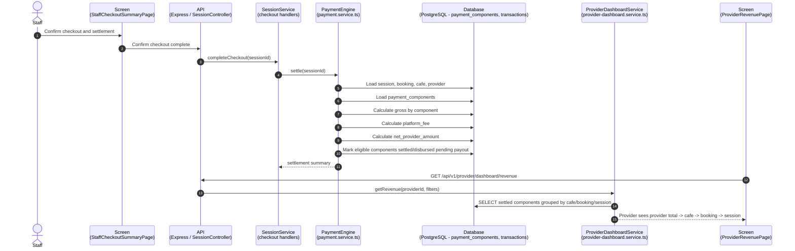
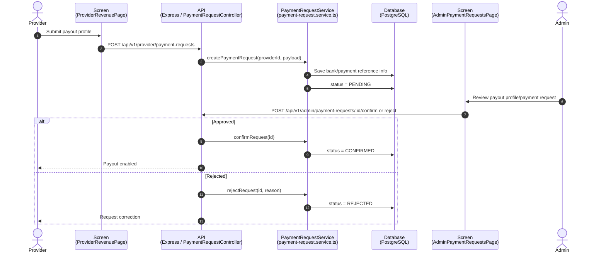
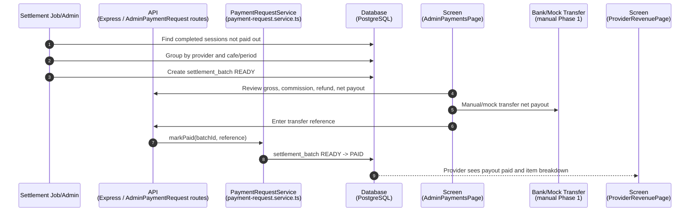
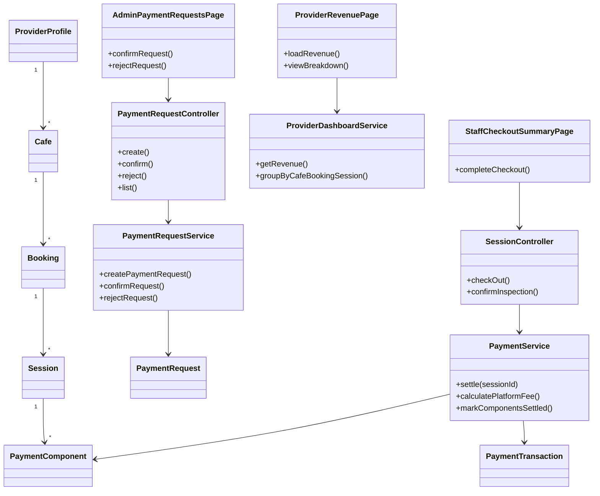
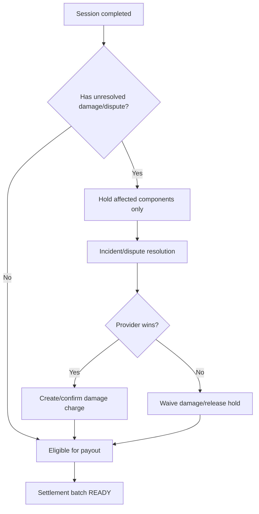

# Sequence Flow: Revenue, Commission and Provider Payout

**Last updated**: 2026-06-04  
**Status**: Draft for mentor review  
**Related rules**: `docs/spec/business-rules/BR-revenue-payment-provider.md`

---

## 1. Settlement theo session và chi nhánh

---

## 2. Provider payout profile

---

## 3. Manual/mock payout Phase 1

---

## 4. Class Diagram: Revenue and Payout

---

## 5. Dispute hold không block toàn provider

