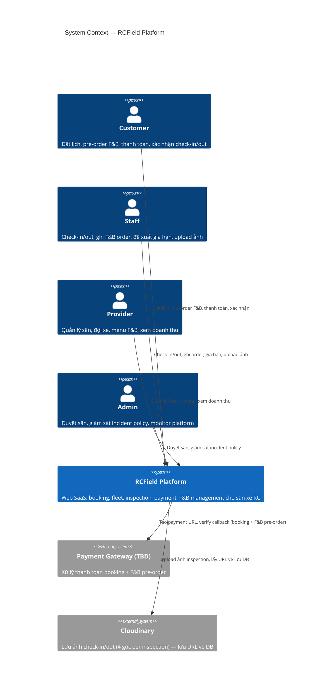
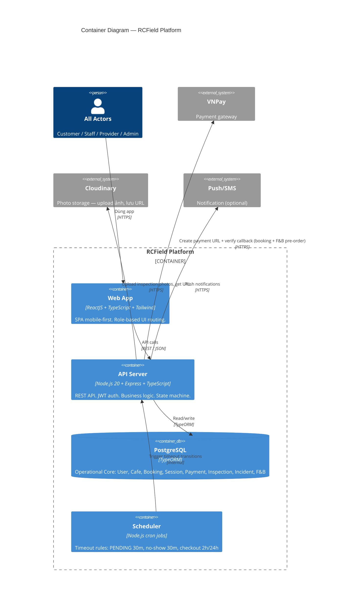
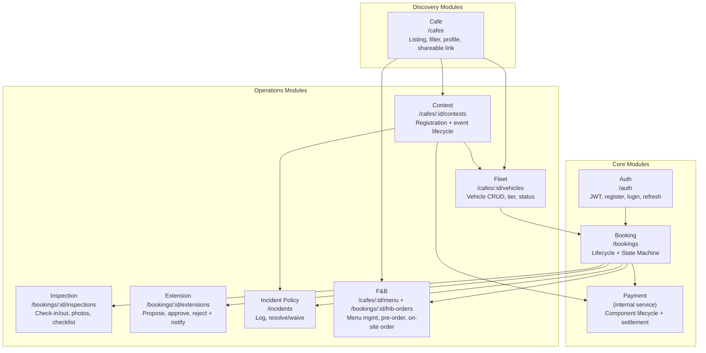
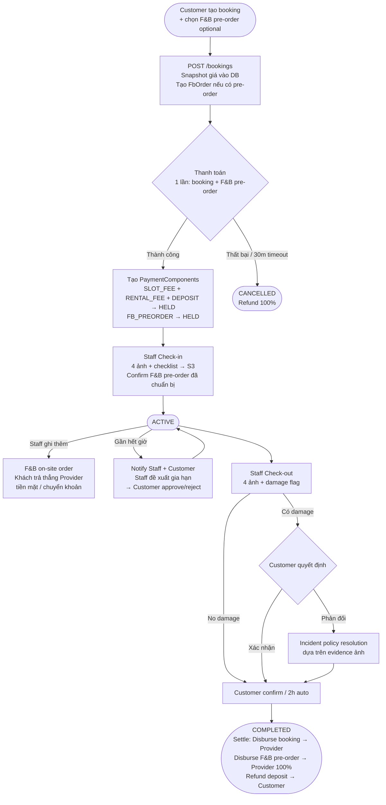

# Architecture: System Overview

**Last updated**: 2026-05-16
**Status**: Draft — đang hoàn thiện dần

> Tài liệu này mô tả kiến trúc tổng thể của RCField ở mức system level.
> Đọc `docs/spec/00-overview.md` để hiểu business context trước.

---

## 1. System Context (C4 Level 1)

Toàn bộ hệ thống RCField gồm 1 platform phục vụ 4 nhóm actor, tương tác qua Web App duy nhất,
tích hợp với 2 external system (VNPay, S3).



---

## 2. Actor & App Matrix

| Actor | Role | Là ai | App | Device target |
|-------|------|-------|-----|--------------|
| Customer | CUSTOMER | Khách đặt lịch chơi xe | Web (mobile-first) | Mobile browser |
| Staff | STAFF | Nhân viên từng chi nhánh | Web (mobile-first) | Mobile browser |
| Provider | PROVIDER | Chủ doanh nghiệp RC (quản lý toàn chuỗi) | Web | Desktop/tablet |
| Admin | ADMIN | Team RCField — bên bán phần mềm | Web (admin portal) | Desktop |

> Tất cả 4 actor dùng chung 1 React web app — routing và UI render dựa trên `UserRole` từ JWT.
> Provider xem aggregate toàn chuỗi + drill-down từng chi nhánh. Phase 1 kiểm soát Staff bằng account/provider policy; bảng `staff_cafe_assignments` chuyển sang Phase 2.

---

## 3. Container Diagram (C4 Level 2)



---

## 4. Domain Modules

Hệ thống chia thành các module theo domain, mỗi module có router + controller + service riêng.



---

## 5. Tech Stack

### Backend (`rcfield-app/apps/api`)

| Layer | Technology | Ghi chú |
|-------|-----------|---------|
| Runtime | Node.js 20+ | LTS |
| Language | TypeScript strict mode | `noImplicitAny`, strict null checks |
| Framework | Express.js | Router-per-domain architecture |
| ORM | TypeORM | Entity-based, migration-first |
| Database | PostgreSQL | Tất cả data — không dùng NoSQL |
| Auth | JWT + RBAC | 4 roles: CUSTOMER, PROVIDER, STAFF, ADMIN |
| Validation | zod | Schema reusable, type inference — bắt buộc trên mọi request body |
| Payment | Gateway TBD (VNPay / MoMo / VietQR) | Verify server-side signature |
| Storage | Cloudinary | Upload ảnh inspection — lưu URL về DB |
| Jobs | node-cron | Timeout rules (PENDING 30m, no-show, checkout auto-confirm) |

### Frontend (`rcfield-app/apps/web`)

| Layer | Technology | Ghi chú |
|-------|-----------|---------|
| Framework | ReactJS | Vite build |
| Language | TypeScript strict mode | |
| Styling | Tailwind CSS | Mobile-first |
| Server state | React Query | Fetch, cache, invalidate API data |
| Client state | Zustand | Auth session, UI state |
| HTTP client | Axios | Centralized API client |
| Language | Vietnamese | Toàn bộ UI tiếng Việt |

---

## 6. Data Flow — Booking Lifecycle (tóm tắt)



---

## 7. Security & Auth

```
Request → JWT Middleware → RBAC Guard → Controller → Service
              │                │
              │                └─ Kiểm tra role (CUSTOMER/PROVIDER/STAFF/ADMIN)
              └─ Verify token, extract userId + role
```

- **JWT**: access token (short-lived) + refresh token
- **RBAC**: mỗi endpoint khai báo role được phép, guard reject 403 nếu không đủ quyền
- **Trust score**: Customer có `trust_score` (0–100, default 100) — ảnh hưởng eligibility thuê xe RESTRICTED tier
- **Snapshot**: giá được lock vào `booking.snapshot` lúc tạo — không thể thay đổi sau đó

---

## 8. External Integrations

### Payment Gateway (TBD)

> Payment gateway chưa được chốt (VNPay / MoMo / VietQR). Flow dưới đây mô tả cơ chế chung,
> không phụ thuộc vào provider cụ thể.

```
Customer              Web App           API Server          Gateway
   │── đặt lịch ────>│                     │                   │
   │  (+ F&B nếu có) │── POST /bookings ──>│                   │
   │                  │<── paymentUrl ──────│── tạo URL ────────│
   │<── redirect ─────│                     │                   │
   │──────────────────────────────────────────── thanh toán ───>│
   │                  │<── callback + params ──────────────────│
   │                  │── POST /payment/confirm ──>│            │
   │                  │                    │── verify ─────────>│
   │                  │                    │<── valid ──────────│
   │                  │<─── CONFIRMED ─────│                   │
```

**Dòng tiền:**
```
Booking (slot + rental + deposit):  Gateway → Platform → disburse Provider (trừ 15% fee)
F&B pre-order:                      Gateway → Platform → disburse Provider (100%, 0% fee)
F&B on-site (thêm tại quán):        Tiền mặt / chuyển khoản thẳng Provider (ngoài Platform)
```

### S3 Storage

- Path convention: `inspections/{booking_id}/{check_in|check_out}/{angle}.jpg`
- 4 angles bắt buộc: `front`, `back`, `left`, `right`
- Upload trước khi ghi DB — nếu upload thất bại, reject toàn bộ inspection request

---

## 9. Key Architectural Decisions

| Quyết định | Lý do | Tham khảo |
|-----------|-------|-----------|
| Snapshot-first payment | Giá xe/slot có thể thay đổi — dùng snapshot đảm bảo tính toán đúng | `03-payment-engine.md` |
| Component-based payment | Mỗi khoản tiền có vòng đời độc lập → dễ audit, refund từng phần | `03-payment-engine.md` |
| Immutable ledger | Không edit amount component đã tạo — tạo component mới | `03-payment-engine.md` |
| Single state machine | Mọi booking state change đều qua `BookingService.transition()` | `02-state-machine.md` |
| Evidence-based handover | 4 ảnh + checklist tại mỗi điểm bàn giao → incident có bằng chứng số | `04-inspection-flow.md` |
| Contest là event domain riêng | Contest không phải booking giả; entry fee/result/leaderboard cần lifecycle riêng | `03-contest.md` |
| Express.js cho backend | Team 4 người, timeline 4 tháng — Express đủ đơn giản và an toàn triển khai | `docs/adr/002-backend-framework-express.md` |
| Role-based routing (FE) | 1 app cho 4 actor — đơn giản hóa deployment | — |
| F&B pre-order gộp 1 payment | Customer không muốn trả 2 lần — gộp booking + F&B vào 1 transaction | — |
| F&B on-site tách riêng | Tiền chạy thẳng Provider, Platform không thể làm trung gian cho F&B at-venue | — |
| Payment gateway TBD | Chưa chốt provider — tách interface, dễ swap sau | — |

---

## 10. Open Questions (Architecture level)

1. **Payment gateway**: Chưa chốt provider (VNPay / MoMo / VietQR). Cần quyết định trước TP-2.

2. **Payment IPN**: Có cần server-to-server callback từ gateway không? Tránh trường hợp Customer đóng browser sau khi thanh toán thành công.

3. **Slot extension notification**: Notify khi còn bao nhiêu phút? (15 phút? 10 phút?) Cần confirm.

4. **F&B QR code**: Platform generate QR động hay Provider tự upload QR tài khoản ngân hàng?

5. **Platform fee disbursement**: 15% trừ trực tiếp khi disburse hay tạo thêm component `PLATFORM_FEE` riêng?

6. **Notification service**: Chưa chọn provider (Firebase FCM? Twilio SMS?). Cần quyết định trước TP-2.

7. **Hosting / Deployment**: Chưa xác định — cloud provider, Docker, CI/CD. Cần quyết định trong TP-3.

---

## Reference

- `docs/spec/00-overview.md` — Business context, actors, scope
- `docs/spec/01-domain-model.md` — Entities, enums, ERD
- `docs/spec/02-state-machine.md` — Booking state machine
- `docs/spec/03-payment-engine.md` — Payment component lifecycle
- `docs/spec/04-inspection-flow.md` — Check-in/out protocol
- `docs/spec/05-api-contracts.md` — REST API endpoints
- `docs/architecture/03-contest.md` — Contest architecture
- `docs/diagrams/sequence/sequence-flow-booking-lifecycle.md` — End-to-end sequence diagram
- `docs/diagrams/sequence/sequence-flow-contest-lifecycle.md` — Contest lifecycle sequence diagram
- `docs/adr/002-backend-framework-express.md` — Framework decision record

---

*Last updated: 2026-05-16 · Status: Draft*
