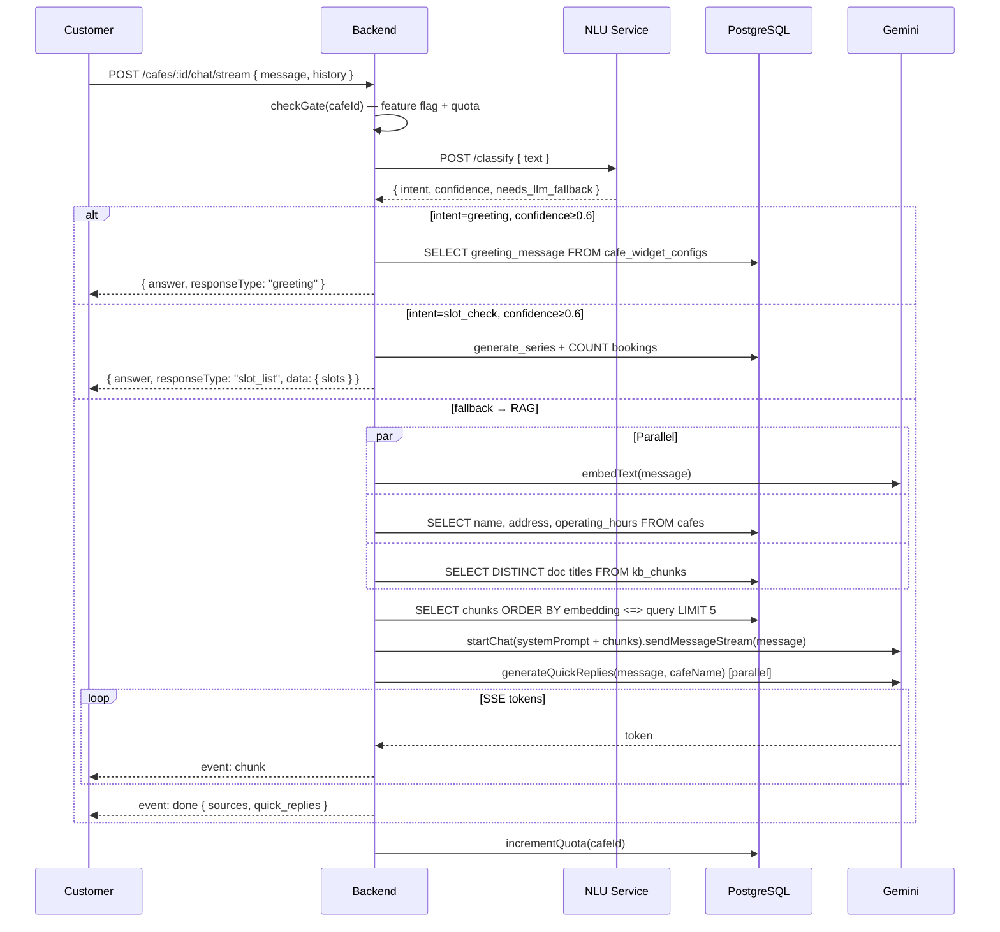

# Architecture: Branch AI Chat & RAG

**Last Updated:** 2026-05-17  
**Spec refs:** `specs/002-branch-ai-chat-rag/plan.md`, `specs/002-branch-ai-chat-rag/research.md`

---

## Tóm tắt

Mỗi chi nhánh (cafe) có một AI chat widget riêng. Customer gửi câu hỏi tự nhiên bằng tiếng Việt — hệ thống phân loại intent, chọn đường xử lý phù hợp, và trả lời dựa trên knowledge base của đúng chi nhánh đó.

Provider upload tài liệu (PDF/DOCX/TXT) vào knowledge base. Hệ thống tự động parse → chunk → embed → lưu vector để phục vụ retrieval.

---

## 1. Component Map

```
Browser (Customer)
  │
  ├─ POST /cafes/:cafeId/chat          ← REST, trả về JSON ngay
  └─ POST /cafes/:cafeId/chat/stream   ← SSE, stream token-by-token

Backend (Express)
  │
  ├─ chat.controller.ts   ← validate request, điều phối route
  ├─ chat.service.ts      ← routing logic, fast/slot/rag handlers
  ├─ kb.service.ts        ← embed, retrieve, upsert chunks
  └─ kb.controller.ts     ← upload/list/delete documents + debug endpoint

NLU Service (Python FastAPI :8000)
  └─ /classify            ← keyword matching, trả { intent, confidence, needs_llm_fallback }

External
  ├─ Gemini text-embedding-001  ← embed query + embed chunks
  └─ Gemini 2.5 Pro / 2.0 Flash ← generate answer
      (model chọn dựa trên NLU confidence)

Database (PostgreSQL)
  ├─ kb_documents         ← metadata tài liệu
  ├─ kb_chunks            ← text + vector(768) per chunk
  └─ cafe_widget_configs  ← greeting message, quick replies, theme
```

---

## 2. Chat Request Flow



---

## 3. NLU Routing Logic

```
message
  │
  ▼
NLU Service (keyword matching)
  │
  ├─ intent=greeting   confidence≥0.6   needs_llm_fallback=false  →  fast
  ├─ intent=slot_check confidence≥0.6   needs_llm_fallback=false  →  slot_check
  └─ otherwise                                                     →  rag
```

| Route | Handler | Latency | External call |
|-------|---------|---------|---------------|
| `fast` | `fastAnswer()` — đọc widget config | ~5ms | Không |
| `slot_check` | `slotCheck()` — query bookings table | ~30ms | Không |
| `rag` | `ragChatStream()` — embed + retrieve + LLM | ~2–10s | Gemini |

NLU timeout → tự động fallback sang `rag`. Backend log warning kèm hướng dẫn `npm run nlu`.

---

## 4. Model Selection

```
nluConfidence ≥ 0.7  →  GOOGLE_SUPPORT_MODEL  (gemini-2.0-flash)   — query đơn giản, có ngữ cảnh rõ
nluConfidence < 0.7  →  GOOGLE_MODEL          (gemini-2.5-pro)      — query phức tạp, cần suy luận
```

Cả hai model đều nhận cùng system prompt + retrieved chunks.

---

## 5. Document Ingestion Flow

```
Provider upload file (multipart, max 10MB)
  │
  ▼
kb.controller: uploadDocument()
  │
  ├─ Parse text
  │     PDF  → pdf-parse
  │     DOCX → mammoth
  │     TXT/MD → direct read
  │
  ├─ Chunk text (~500 tokens, overlap 100 tokens)
  │
  ├─ Embed each chunk — Gemini text-embedding-001 (768 dims)
  │
  ├─ INSERT INTO kb_chunks (cafe_id, document_id, chunk_text, chunk_index, embedding)
  │
  └─ UPDATE kb_documents SET status = 'INDEXED'   (hoặc 'FAILED' nếu lỗi)
```

File gốc **không lưu vào disk**. `raw_content` (text đã parse) lưu trong `kb_documents.raw_content`.

---

## 6. RAG Retrieval

```sql
SELECT chunk_text
FROM kb_chunks
WHERE cafe_id = $1
ORDER BY embedding <=> $2::vector   -- cosine distance (pgvector)
LIMIT 5
```

Namespace isolation hoàn toàn theo `cafe_id` — mỗi chi nhánh chỉ thấy chunks của mình.

Score debug: `1 - (embedding <=> query::vector)` → cosine similarity, range [0, 1].  
Threshold verdict: ≥0.75 good · ≥0.5 weak · <0.5 no_match.

---

## 7. Data Model

```
kb_documents
  id               UUID PK
  cafe_id          UUID → cafes.id
  title            text
  original_filename text
  content_type     enum (POLICY / FAQ / ANNOUNCEMENT / CUSTOM)
  raw_content      text          ← text đã parse, không lưu file gốc
  status           enum (PENDING / INDEXED / FAILED)
  created_by       UUID → users.id
  created_at / updated_at / deleted_at

kb_chunks
  id               UUID PK
  cafe_id          UUID → cafes.id   ← denormalized để query nhanh hơn
  document_id      UUID → kb_documents.id
  chunk_text       text
  chunk_index      int
  embedding        vector(768)
  created_at / updated_at

cafe_widget_configs
  cafe_id          UUID PK → cafes.id
  greeting_message text
  position         text    (BOTTOM_RIGHT / BOTTOM_LEFT)
  primary_color    text    (#hex)
  avatar_url       text?
  quick_replies    jsonb   (string[])
  created_at / updated_at
```

Index cần thiết:
```sql
CREATE INDEX ON kb_chunks USING ivfflat (embedding vector_cosine_ops) WITH (lists = 100);
CREATE INDEX ON kb_chunks (cafe_id);
```

---

## 8. API Endpoints

```
-- Public (không cần auth) --
POST   /api/cafes/:cafeId/chat               JSON response (non-streaming)
POST   /api/cafes/:cafeId/chat/stream        SSE stream
GET    /api/cafes/:cafeId/chat/config        Widget config (greeting, colors)
GET    /api/cafes/:cafeId/kb/debug?query=... Debug retrieval scores

-- Provider only (JWT + PROVIDER role) --
PUT    /api/cafes/:cafeId/chat/config        Cập nhật widget config
GET    /api/cafes/:cafeId/kb/documents       List tài liệu đã upload
POST   /api/cafes/:cafeId/kb/documents       Upload tài liệu mới
DELETE /api/cafes/:cafeId/kb/documents/:id   Xóa tài liệu + chunks
```

---

## 9. Feature Flag & Quota

```
feature_flags table:
  feature_key = 'AI_CHATBOT'
  entity_type = 'CAFE'
  entity_id   = cafeId
  is_enabled  = true/false
  config = {
    "monthly_quota": 1000,
    "used_this_month": 42,
    "quota_reset_day": 1
  }
```

`checkGate()` chạy trước mọi chat request. Nếu disabled → 503. Nếu hết quota → 429.  
`incrementQuota()` chạy sau khi response thành công.

---

## 10. SSE Protocol

```
Content-Type: text/event-stream
Cache-Control: no-cache

event: chunk
data: {"text":"Giá thuê xe "}

event: chunk
data: {"text":"tiêu chuẩn là "}

event: done
data: {"response_type":"text","sources":["rc-arena-hanoi-kb.md"],"quick_replies":["Xe nào phù hợp?","Kiểm tra lịch trống","Cách đặt lịch?"],"full_answer":"..."}
```

Client nhận `chunk` events để render progressive text. `done` event chứa metadata đầy đủ.

---

## 11. Environment Variables

```bash
GOOGLE_API_KEY=...
GOOGLE_EMBEDDING_MODEL=gemini-embedding-001     # default
GOOGLE_MODEL=gemini-2.5-pro                     # complex queries
GOOGLE_SUPPORT_MODEL=gemini-2.0-flash           # simple queries + quick replies gen
NLU_URL=http://localhost:8000                   # default
NLU_TIMEOUT_MS=500                              # default
```

---

## 12. Dev Tools

| Tool | Lệnh | Mô tả |
|------|------|-------|
| NLU service | `npm run nlu` | Khởi động FastAPI :8000 với hot reload |
| Demo widget | `npm run ui` | Serve HTML demo qua :5500 (kill port cũ trước) |
| KB debug UI | `http://localhost:5500/kb-debug.html` | Test retrieval score, upload doc, login |
| KB CLI | `npm run test:kb -- --cafe <id> --query "..."` | Test nhanh từ terminal |

---

## Reference

- [`specs/002-branch-ai-chat-rag/plan.md`](../../specs/002-branch-ai-chat-rag/plan.md) — Technical context, constitution check
- [`specs/002-branch-ai-chat-rag/research.md`](../../specs/002-branch-ai-chat-rag/research.md) — Key decisions (pgvector, NLU routing, chunking)
- [`specs/002-branch-ai-chat-rag/data-model.md`](../../specs/002-branch-ai-chat-rag/data-model.md) — Entity definitions chi tiết
- [`specs/002-branch-ai-chat-rag/contracts/api.md`](../../specs/002-branch-ai-chat-rag/contracts/api.md) — API contracts đầy đủ
- [`nlu-service/README.md`](../../../rcfeild-be/nlu-service/README.md) — Hướng dẫn chạy NLU service
