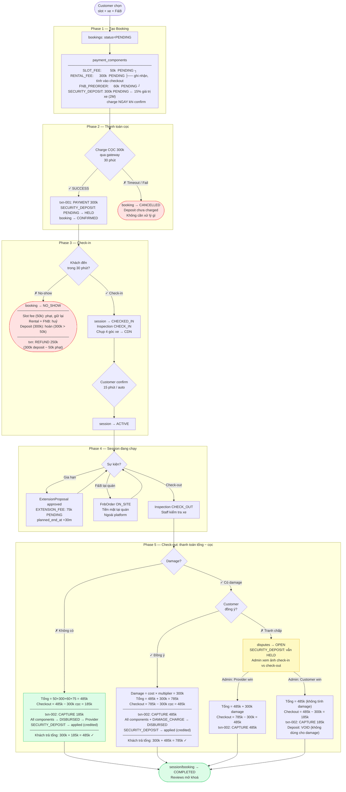

# Booking Lifecycle Flow — Case A (RENTAL)

> Happy path đi thẳng xuống. Nhánh rẽ phải là unhappy / edge case.
>
> **Thanh toán 2 bước:**
> - Khi confirm: charge **cọc** (15% giá trị xe) → HELD
> - Khi checkout: charge **tổng chi phí − cọc** = số tiền thực tế phải trả
> - Không có refund trong luồng thông thường



---

## Công thức thanh toán

```
checkout_amount = tổng_chi_phí − security_deposit

tổng_chi_phí = SLOT_FEE + RENTAL_FEE + FNB_PREORDER + EXTENSION_FEE + DAMAGE_CHARGE (nếu có)
```

| Case | Tổng chi phí | − Cọc (300k) | Checkout | Tổng khách trả |
|---|---|---|---|---|
| Không damage, không ext | 410k | −300k | **110k** | 300+110 = 410k |
| Không damage, có ext 75k | 485k | −300k | **185k** | 300+185 = 485k |
| Có damage 300k, có ext | 785k | −300k | **485k** | 300+485 = 785k |

> Deposit luôn được khấu trừ 1-1 vào tổng. Không có VOID, không có REFUND trong luồng thông thường.
> Ngoại lệ: No-show → deposit > phạt slot_fee → hoàn phần chênh lệch.

## Nguyên tắc deposit

| Rule | Mô tả |
|---|---|
| Công thức | `security_deposit = vehicle.market_value × 15%` |
| Ví dụ | Xe 2,000,000đ → deposit 300,000đ |
| Snapshot | `booking_vehicles.security_deposit_snapshot` — cố định tại thời điểm đặt |
| Không áp dụng discount | Deposit thu đủ, không giảm giá |
| Extension cap | `max_extension_fee = security_deposit × 50%` |

## File liên quan

- [`booking-data-flow.md`](./booking-data-flow.md) — chi tiết từng bảng DB per phase
- [`docs/spec/03-payment-engine.md`](../../spec/03-payment-engine.md) — payment rules, damage charge, platform fee
