# Contest Lifecycle Flow — Compact Tournament Phase

> Happy path đi thẳng xuống. Nhánh rẽ phải là edge case hoặc phần backlog. Phase này dùng `contest_matches` + `contest_match_participants`, không dùng class/round/heat/result/reward tables cũ.

```mermaid
flowchart TD
    START([Provider muốn tổ chức contest]) --> CFG

    subgraph PH0[Phase 0 — Config]
        CFG[Nhập name, description, banner, rules_text] --> CAFES[Chọn participating_cafe_ids]
        CAFES --> CAFECHECK{Cafe ACTIVE và thuộc Provider?}
        CAFECHECK -->|No| BLOCK_CREATE([Reject create/update])
        CAFECHECK -->|Yes| TIME[Chọn track_type_id + starts_at/ends_at]
        TIME --> CAP[Cấu hình capacity, entry_fee, registration window]
        CAP --> FORMAT[Cấu hình format + drivers_per_match + prizes]
        FORMAT --> DRAFT[Save contests.status = DRAFT + contest_cafes]
        DRAFT --> AUDIT_CREATED[Audit contest.created]
    end

    AUDIT_CREATED --> OPEN_REQ

    subgraph PH1[Phase 1 — Open Registration]
        OPEN_REQ[Provider gọi open] --> VALID_OPEN{Config đầy đủ?}
        VALID_OPEN -->|No| BLOCK_OPEN([Reject open])
        VALID_OPEN -->|Yes| OPEN[Contest DRAFT -> OPEN]
        OPEN --> AUDIT_OPEN[Audit contest.opened]
    end

    AUDIT_OPEN --> REG_START

    subgraph PH2[Phase 2 — Participant Registration]
        REG_START[Customer xem contest public] --> REG_POST[POST /contests/:id/register]
        REG_POST --> REG_VALID{OPEN + còn chỗ + đúng rule xe?}
        REG_VALID -->|No| REG_REJECT([Reject registration])
        REG_VALID -->|Yes| REG_CREATED[contest_registrations created]
        REG_CREATED --> FREE{entry_fee = 0?}
        FREE -->|Yes| CONFIRMED[registration CONFIRMED]
        FREE -->|No| PAYMENT_GAP[PENDING/manual payment until CONTEST_ENTRY phase]
        CONFIRMED --> AUDIT_REG[Audit registration.created]
    end

    AUDIT_REG --> CLOSE_REQ

    subgraph PH3[Phase 3 — Close Registration]
        CLOSE_REQ{Provider close hoặc registration_closes_at tới?} -->|Not yet| REG_START
        CLOSE_REQ -->|Close| CLOSED[Contest OPEN -> CLOSED]
        CLOSED --> AUDIT_CLOSED[Audit contest.closed]
    end

    AUDIT_CLOSED --> CHECKIN

    subgraph PH4[Phase 4 — Event Check-in]
        CHECKIN[Staff/Provider lookup check_in_code] --> LOOKUP{Registration CONFIRMED?}
        LOOKUP -->|No| CHECKIN_REJECT([Reject check-in])
        LOOKUP -->|Yes| CAFE_VALID{Cafe check-in thuộc contest_cafes?}
        CAFE_VALID -->|No| WRONG_CAFE([Reject wrong branch])
        CAFE_VALID -->|Yes| STAFF_VALID{Nếu STAFF: assigned cafe hợp lệ?}
        STAFF_VALID -->|No| STAFF_REJECT([Reject staff permission])
        STAFF_VALID -->|Yes| CHECKED_IN[registration -> CHECKED_IN]
        CHECKED_IN --> AUDIT_CHECKIN[Audit registration.checked_in]
    end

    AUDIT_CHECKIN --> GENERATE

    subgraph PH5[Phase 5 — Generate Schedule]
        GENERATE[Provider/Staff generate matches] --> GEN_VALID{Contest CLOSED/RUNNING và registrations hợp lệ?}
        GEN_VALID -->|No| GEN_REJECT([Reject generate])
        GEN_VALID -->|Yes| MATCHES[Create contest_matches]
        MATCHES --> PARTICIPANTS[Create contest_match_participants]
        PARTICIPANTS --> AUDIT_GEN[Audit match.schedule_generated]
    end

    AUDIT_GEN --> RUN_MATCH

    subgraph PH6[Phase 6 — Race Operation]
        RUN_MATCH[Run match/heat/final] --> REORDER{Cần drag/drop slot?}
        REORDER -->|Yes| PATCH_PARTICIPANTS[PATCH participants lane/slot/grid]
        PATCH_PARTICIPANTS --> AUDIT_PARTICIPANTS[Audit match.participants_updated]
        REORDER -->|No| RESULT
        AUDIT_PARTICIPANTS --> RESULT[Submit manual result]
        RESULT --> RESULT_VALID{Result hợp lệ?}
        RESULT_VALID -->|No| RESULT_REJECT([Reject result])
        RESULT_VALID -->|Yes| COMPLETE_MATCH[Update participant results + match COMPLETED]
        COMPLETE_MATCH --> AUDIT_RESULT[Audit match.result_submitted]
        AUDIT_RESULT --> ADVANCE{Có next_match_id?}
        ADVANCE -->|Yes| ADVANCE_WINNER[Advance winner/qualified]
        ADVANCE_WINNER --> AUDIT_ADVANCE[Audit match.advanced]
        AUDIT_ADVANCE --> RUN_MATCH
        ADVANCE -->|No| PUBLISH
    end

    subgraph PH7[Phase 7 — Leaderboard]
        PUBLISH[Publish leaderboard] --> LEADER_VALID{Có completed result/final?}
        LEADER_VALID -->|No| PUBLISH_REJECT([Reject publish])
        LEADER_VALID -->|Yes| LEADERBOARD[Update contests.config.leaderboard]
        LEADERBOARD --> AUDIT_LEADER[Audit leaderboard.published]
        AUDIT_LEADER --> COMPLETED[Contest RUNNING -> COMPLETED when finalized]
    end

    OPEN --> CANCELQ{Provider cancels?}
    CLOSED --> CANCELQ
    CANCELQ -->|Yes| CANCELLED[contest -> CANCELLED + optional registration cancel]
    CANCELLED --> AUDIT_CANCEL[Audit contest.cancelled]
    CANCELQ -->|No| REG_START

    style BLOCK_CREATE fill:#fee2e2,stroke:#ef4444
    style BLOCK_OPEN fill:#fee2e2,stroke:#ef4444
    style REG_REJECT fill:#fee2e2,stroke:#ef4444
    style PAYMENT_GAP fill:#fef9c3,stroke:#eab308
    style CHECKIN_REJECT fill:#fee2e2,stroke:#ef4444
    style WRONG_CAFE fill:#fee2e2,stroke:#ef4444
    style STAFF_REJECT fill:#fee2e2,stroke:#ef4444
    style GEN_REJECT fill:#fee2e2,stroke:#ef4444
    style RESULT_REJECT fill:#fee2e2,stroke:#ef4444
    style PUBLISH_REJECT fill:#fee2e2,stroke:#ef4444
    style COMPLETED fill:#dcfce7,stroke:#22c55e
    style CANCELLED fill:#fee2e2,stroke:#ef4444
```

---

## Data touched by phase

| Phase | Tables / services |
|---|---|
| Config | `contests`, `contest_cafes`, `contest_audit_logs` |
| Open/Close/Cancel | `contests.status`, `contest_audit_logs` |
| Register | `contest_registrations`, `contest_audit_logs` |
| Event day | `contest_registrations.checked_in_*`, `contest_audit_logs` |
| Generate schedule | `contest_matches`, `contest_match_participants`, `contest_audit_logs` |
| Result/advance | `contest_match_participants`, `contest_matches.result_summary`, `contest_audit_logs` |
| Leaderboard | `contests.config.leaderboard`, `contest_audit_logs` |

---

## Related files

- [../03-contest.md](../03-contest.md) — architecture narrative
- [../../spec/business-rules/BR-contest.md](../../spec/business-rules/BR-contest.md) — business rules
- [../../diagrams/sequence/sequence-flow-contest-lifecycle.md](../../diagrams/sequence/sequence-flow-contest-lifecycle.md) — sequence diagrams
