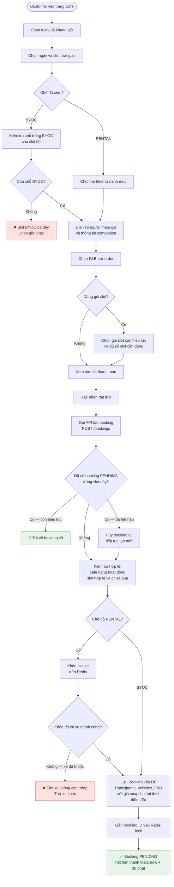
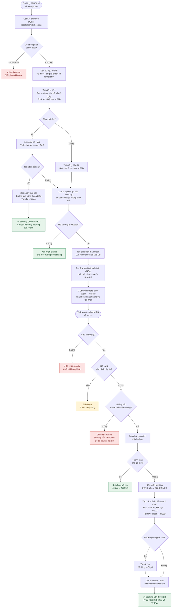
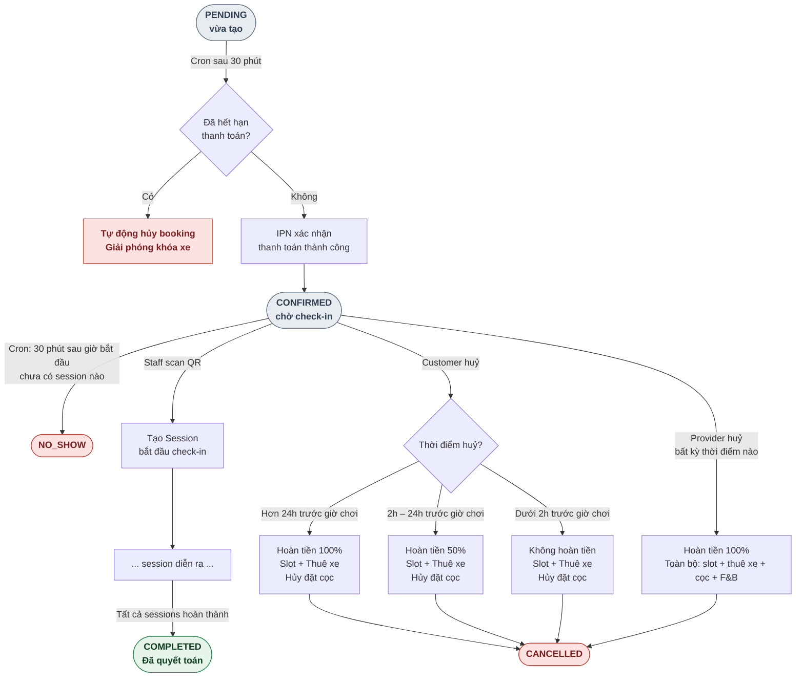
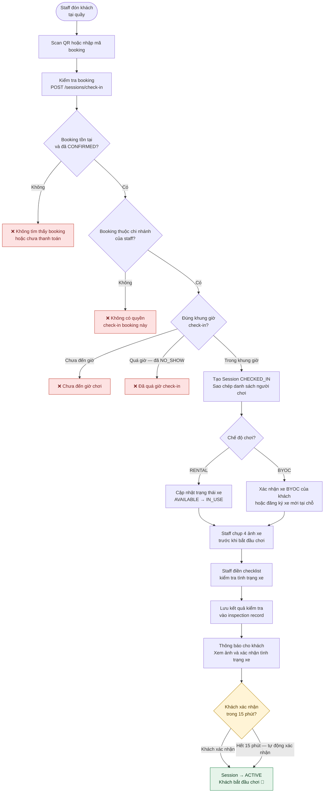
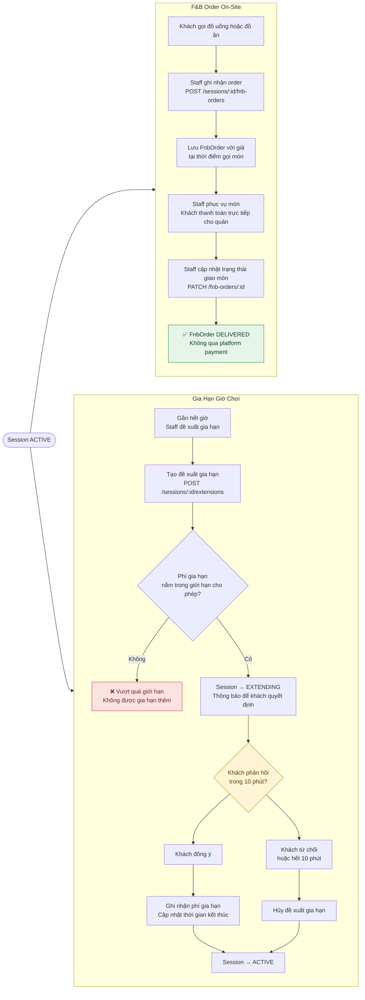
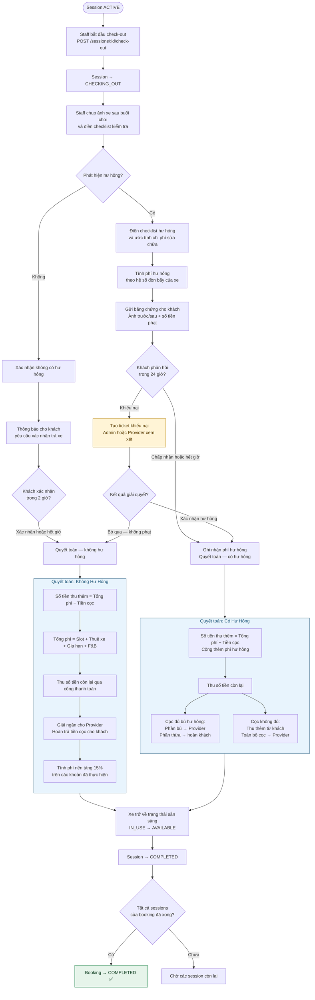

# Activity Flow: Booking Lifecycle (Full)

Mô tả toàn bộ luồng hoạt động — từ khi Customer chọn slot đến khi session kết thúc và thanh toán được quyết toán. Bao gồm tất cả nhánh: RENTAL / BYOC, thanh toán VNPay / gói slot, check-in, gia hạn, check-out không damage / có damage / dispute.

> Dựa trên code thực tế tại `booking.service.ts`, `payment.service.ts`, `session.service.ts`, `inspection.service.ts` và spec `02-state-machine.md`, `03-payment-engine.md`, `04-inspection-flow.md`.

---

## 0. Identifiers

| Field | Value | Ghi chú |
|-------|-------|---------|
| **Booking status** | `PENDING → CONFIRMED → COMPLETED / CANCELLED / NO_SHOW` | Mọi transition qua `booking.service.transition()` |
| **Session status** | `CHECKED_IN → ACTIVE → EXTENDING / CHECKING_OUT → COMPLETED` | |
| **Payment components** | `SLOT_FEE, RENTAL_FEE, SECURITY_DEPOSIT, FNB_PREORDER, EXTENSION_FEE, DAMAGE_CHARGE` | Status: `PENDING → HELD → DISBURSED / REFUNDED` |
| **Timeout: PENDING** | 30 phút | Cron auto-cancel, release Redis locks |
| **Timeout: NO_SHOW** | `slot_start + 30 phút` | Cron mark NO_SHOW nếu chưa có session |
| **Timeout: CHECKED_IN** | 15 phút | Auto-confirm check-in nếu customer không confirm |
| **Timeout: EXTENDING** | 10 phút | Auto-reject extension, quay lại ACTIVE |
| **Timeout: CHECKING_OUT (no damage)** | 2 giờ | Auto-confirm checkout |
| **Timeout: CHECKING_OUT (damage)** | 24 giờ | Auto-confirm damage charge |
| **Extension fee cap** | ≤ 50% `security_deposit` | Tổng tất cả extension fees trong 1 session |
| **Platform fee** | 15% trên consummated components | Không tính FNB on-site |
| **Checkout amount** | `total_charges − security_deposit` | Khách chỉ phải trả thêm phần chênh |

---

## 1. Đặt lịch — Tạo Booking

Customer bắt đầu từ trang cafe detail, chọn slot và hoàn tất checkout form.

---

## 2. Thanh toán

Sau khi booking PENDING được tạo, frontend ngay lập tức gọi checkout. Có 3 nhánh tuỳ theo trường hợp.

---

## 3. Booking Lifecycle — Timeout & Cancel Paths

Sau khi booking CONFIRMED, có 3 con đường kết thúc: hoàn thành, huỷ, hoặc no-show.

---

## 4. Check-in — Tạo Session

Staff scan QR code hoặc nhập booking code của Customer. Flow khác nhau giữa RENTAL và BYOC.

---

## 5. Trong Session — F&B Order & Gia Hạn

Hai hoạt động có thể xảy ra song song trong khi session đang ACTIVE.

---

## 6. Check-out & Settlement

Staff khởi động check-out khi Customer chuẩn bị rời sân. Có 3 nhánh: không damage, có damage, Customer khiếu nại.

---

## 7. Payment Component Lifecycle

Vòng đời của từng PaymentComponent — từ khi tạo đến khi quyết toán.

```mermaid
flowchart LR
    subgraph AT_CONFIRM["Khi Booking CONFIRMED"]
        direction TB
        C1[SLOT_FEE → PENDING]
        C2[RENTAL_FEE mỗi xe → PENDING]
        C3[SECURITY_DEPOSIT mỗi xe → HELD]
        C4[FNB_PREORDER → PENDING]
    end

    subgraph IN_SESSION["Trong Session ACTIVE"]
        direction TB
        C5[EXTENSION_FEE → PENDING\nkhi khách duyệt gia hạn]
        C6[DAMAGE_CHARGE → PENDING\nkhi checkout phát hiện hư hỏng]
    end

    subgraph AT_SETTLE["Khi Session COMPLETED"]
        direction TB
        S1["SLOT_FEE → DISBURSED\nGiải ngân cho Provider"]
        S2["RENTAL_FEE → DISBURSED\nGiải ngân cho Provider"]
        S3A["SECURITY_DEPOSIT → DISBURSED\nProvider nhận (nếu bù hư hỏng)"]
        S3B["SECURITY_DEPOSIT → REFUNDED\nHoàn khách (nếu không hư hỏng\nhoặc cọc dư)"]
        S4["FNB_PREORDER → DISBURSED\nGiải ngân cho Provider"]
        S5["EXTENSION_FEE → DISBURSED\nGiải ngân cho Provider (nếu có)"]
        S6["DAMAGE_CHARGE → DISBURSED\nGiải ngân cho Provider (nếu có)"]
    end

    AT_CONFIRM --> IN_SESSION
    IN_SESSION --> AT_SETTLE

    subgraph CANCEL_PATH["Khi Booking CANCELLED"]
        direction TB
        R1["SLOT_FEE → Không thu\nHoàn theo quy tắc R1/R2"]
        R2["RENTAL_FEE → Không thu\nHoàn theo quy tắc R1/R2"]
        R3["SECURITY_DEPOSIT → REFUNDED\nHủy hold, hoàn lại khách"]
        R4["FNB_PREORDER → Không thu"]
    end

    classDef held fill:#fff4d6,stroke:#b8860b,color:#5c3c00
    classDef disbursed fill:#e6f4ea,stroke:#1e8449,color:#0d3d1f
    classDef refunded fill:#e8f4fd,stroke:#1a5276,color:#1a5276
    classDef pending fill:#f8f9fa,stroke:#6c757d,color:#495057
```

---

## 8. Tổng quan trạng thái — Quick Reference

### Booking States

| State | Từ | Sang | Trigger |
|-------|-----|------|---------|
| `PENDING` | — | `CONFIRMED` | IPN vnp_ResponseCode=00 |
| `PENDING` | — | `CANCELLED` | Timeout 30 phút (cron) |
| `CONFIRMED` | — | `NO_SHOW` | slot_start+30m, không có session (cron) |
| `CONFIRMED` | — | `CANCELLED` | Customer/Provider cancel |
| `CONFIRMED` | — | `COMPLETED` | Tất cả sessions COMPLETED |

### Session States

| State | Từ | Sang | Trigger |
|-------|-----|------|---------|
| `CHECKED_IN` | — | `ACTIVE` | Customer confirm baseline (hoặc timeout 15m) |
| `ACTIVE` | — | `EXTENDING` | Staff đề xuất gia hạn |
| `ACTIVE` | — | `CHECKING_OUT` | Staff bấm check-out |
| `EXTENDING` | — | `ACTIVE` | Customer approve/reject (hoặc timeout 10m) |
| `CHECKING_OUT` | — | `COMPLETED` | Customer confirm checkout (hoặc timeout 2h/24h) |

### Refund Rules Summary

| Tình huống | SLOT_FEE | RENTAL_FEE | DEPOSIT |
|-----------|----------|------------|---------|
| Customer huỷ > 24h trước | 100% | 100% | void |
| Customer huỷ 2h–24h trước | 50% | 50% | void |
| Customer huỷ < 2h trước | 0% | 0% | void |
| Provider huỷ (bất kỳ lúc) | 100% | 100% | void |
| No-show (Customer) | 0% | 0% | void |
| Checkout — không hư hỏng | N/A | N/A | REFUNDED |
| Checkout — có hư hỏng | N/A | N/A | Partially/Fully DISBURSED |

---

## Reference

### Spec docs
- `docs/spec/02-state-machine.md` — Booking & Session state transitions chi tiết
- `docs/spec/03-payment-engine.md` — Payment components, settlement, refund rules (R1/R2/R3)
- `docs/spec/04-inspection-flow.md` — Check-in / Check-out protocol, ảnh evidence

### Sequence diagrams liên quan
- `docs/diagrams/sequence/sequence-flow-booking-lifecycle.md` — Create booking, VNPay IPN, cancel
- `docs/diagrams/sequence/sequence-flow-booking-operations.md` — Check-in, F&B, extension, checkout

### Source code
- `rcfeild-be/src/services/booking.service.ts` — `createBooking`, `cancelBooking`, `transition`
- `rcfeild-be/src/services/payment.service.ts` — `createCheckoutUrl`, `processConfirmation`, settlement
- `rcfeild-be/src/services/session.service.ts` — `createSession`, `checkout`, `settle`
- `rcfeild-be/src/services/inspection.service.ts` — Inspection evidence, checklist
- `rcfeild-be/src/jobs/booking-timeout.job.ts` — Cron: PENDING timeout, NO_SHOW detection

### Naming Convention
- **Action nodes** `[...]`: Cụm động từ ngắn gọn — mô tả **việc gì xảy ra**, không có code syntax
- **Decision nodes** `{...}`: Câu hỏi Yes/No bằng ngôn ngữ tự nhiên — không dùng tên biến
- **Terminal nodes** `([...])`: Tên trạng thái (enum value) giữ nguyên tiếng Anh vì là hằng số hệ thống
- **Edge labels**: Điều kiện ngắn (`Có`, `Không`, `Hết giờ`, `Xác nhận`)

### Legend
- `[Rectangle]` = Action / Step
- `{Diamond}` = Decision point
- `([Rounded])` = Start / End state
- ✅ = Terminal success state
- ❌ = Terminal error / rejection
- 🔁 = Idempotent return

---

*Last updated: 2026-06-21 · Based on: 02-state-machine.md, 03-payment-engine.md, 04-inspection-flow.md, booking.service.ts, payment.service.ts*
