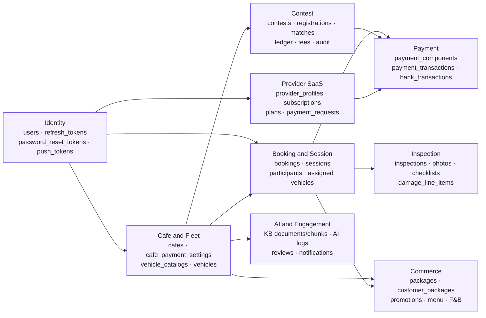
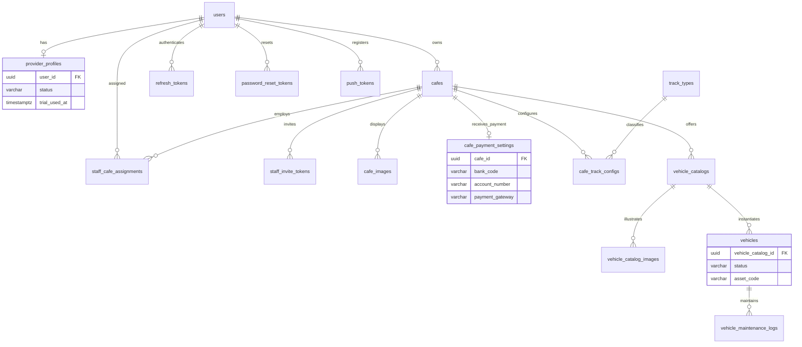
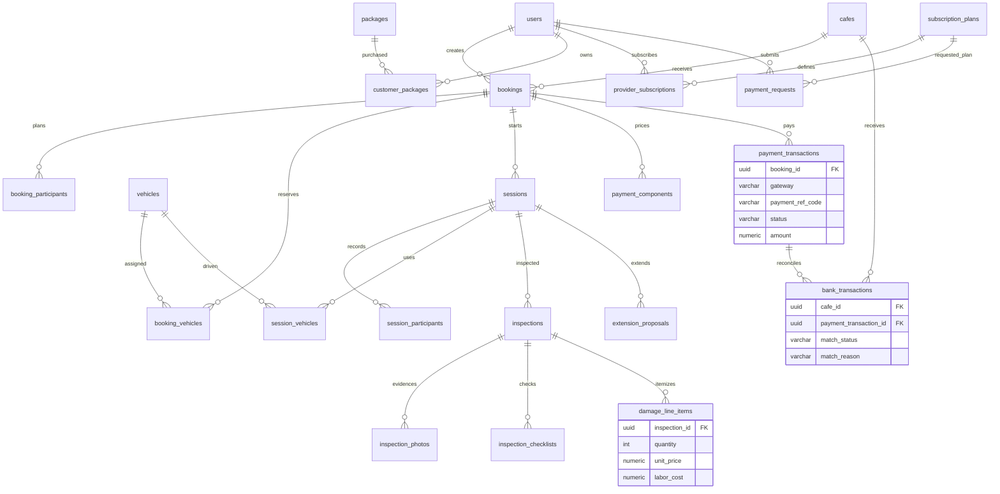
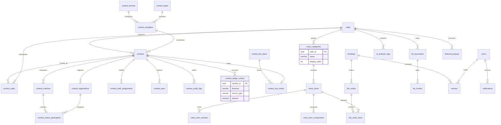

# Report 4 Database Design Diagrams

**Baseline:** `docs/spec/06-database.md` and `backend/src/models` at 2026-08-13.

These four diagrams replace Figures 15-18 in Report 4 while preserving its existing database-section grouping. The DOCX uses compact grouped renderings for print legibility; the detailed ER relationships below remain the engineering reference.

## Figure 15. RCField Core Database Design

## Figure 16. Account, Branch, and Fleet Database Design

## Figure 17. Booking, Session, Payment, and Subscription Database Design

## Figure 18. Contest, AI, F&B, Review, and Notification Database Design

