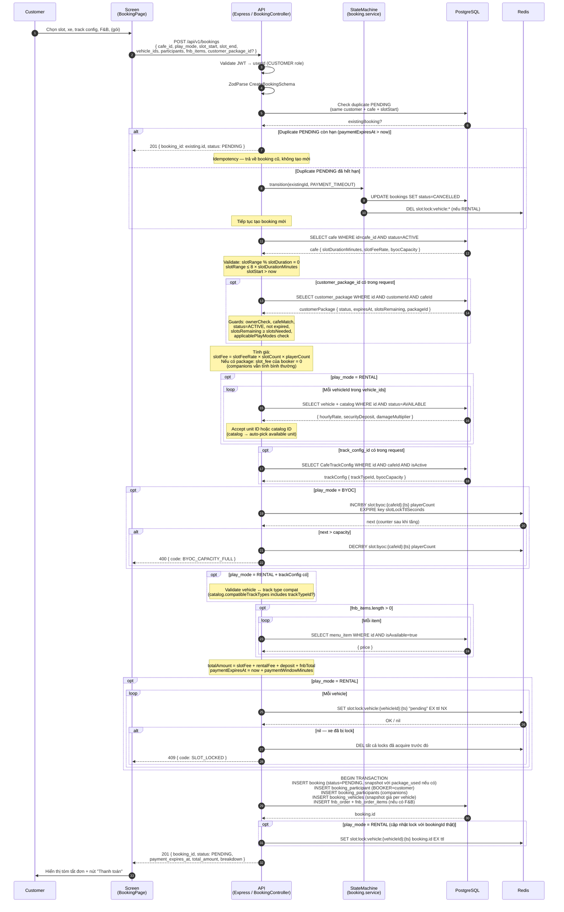
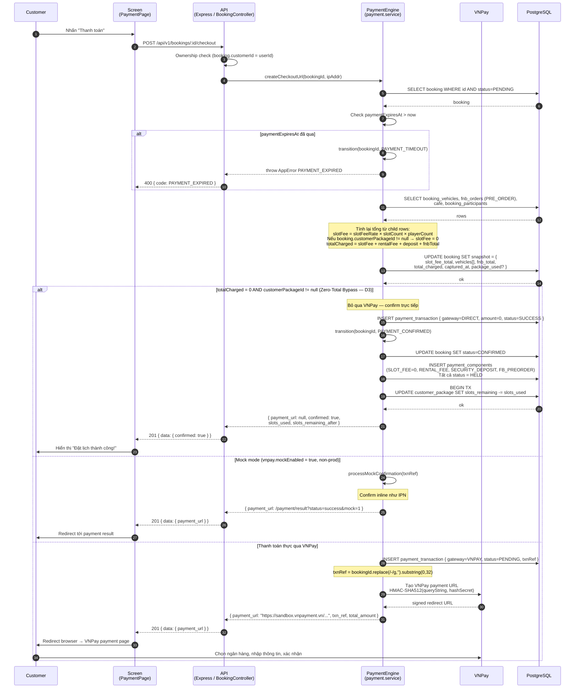
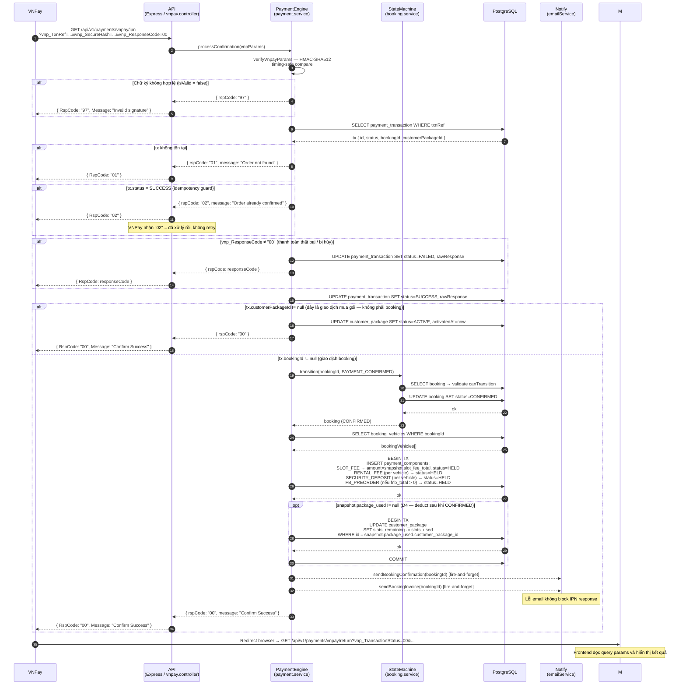
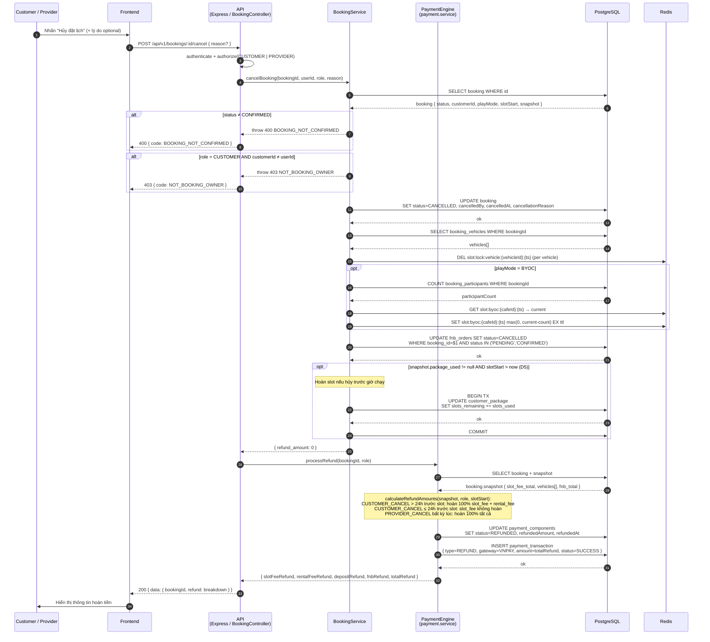
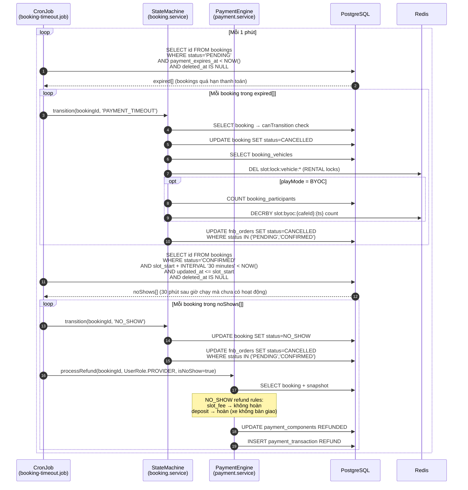
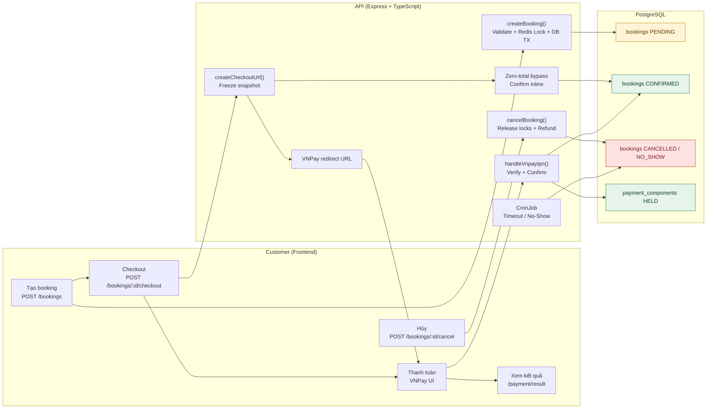
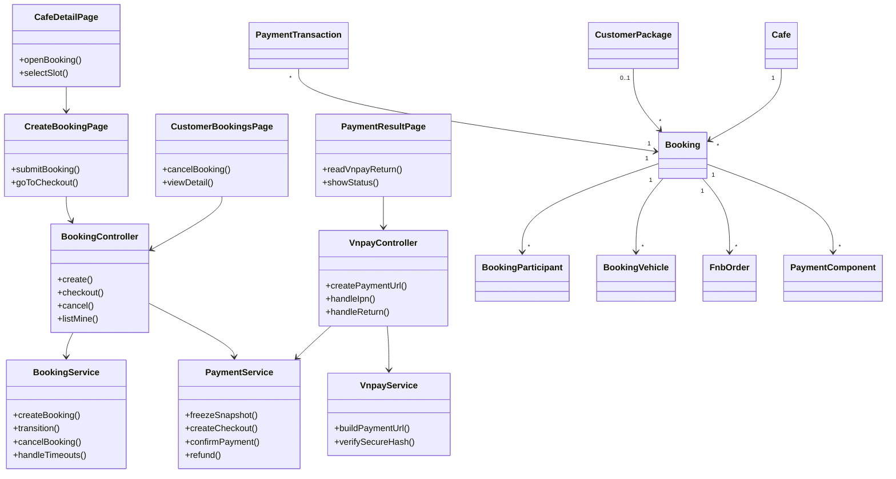

# Sequence Flow: Booking Lifecycle

Mô tả toàn bộ vòng đời đặt lịch — từ lúc Customer tạo booking, qua thanh toán VNPay, đến khi hủy hoặc hoàn tất — dựa trên code thực tế tại `booking.service.ts`, `payment.service.ts`, `vnpay.service.ts`, `booking.controller.ts`, và `booking-timeout.job.ts`.

> See **Reference** at the bottom for related docs and legend.

---

## 0. Identifiers

| Field | Value | Notes |
|-------|-------|-------|
| Entity | `Booking` | Bảng `bookings` |
| Entity | `BookingVehicle` | Bảng `booking_vehicles` — snapshot giá thuê xe |
| Entity | `BookingParticipant` | Bảng `booking_participants` |
| Entity | `FnbOrder` / `FnbOrderItem` | Pre-order F&B khi đặt lịch |
| Entity | `PaymentTransaction` | Giao dịch VNPay / DIRECT / MOCK |
| Entity | `PaymentComponent` | Các thành phần phân bổ tiền (SLOT_FEE, RENTAL_FEE, SECURITY_DEPOSIT, FB_PREORDER) |
| Entity | `CustomerPackage` | Gói slot đã mua — trừ `slots_remaining` khi booking CONFIRMED |
| Endpoint | `POST /api/v1/bookings` | createBooking — CUSTOMER only |
| Endpoint | `POST /api/v1/bookings/:id/checkout` | Freeze snapshot + tạo VNPay URL |
| Endpoint | `GET /api/v1/payments/vnpay/ipn` | VNPay server gọi callback sau giao dịch |
| Endpoint | `GET /api/v1/payments/vnpay/return` | Redirect về sau khi khách thanh toán xong |
| Endpoint | `POST /api/v1/bookings/:id/cancel` | Hủy đặt lịch — CUSTOMER hoặc PROVIDER |
| Endpoint | `GET /api/v1/provider/cafes/:cafeId/bookings` | Danh sách lịch theo ngày — PROVIDER / STAFF |
| Event | `PAYMENT_CONFIRMED` | `PENDING → CONFIRMED` |
| Event | `PAYMENT_TIMEOUT` | `PENDING → CANCELLED` (cron hoặc khi tạo lại) |
| Event | `CUSTOMER_CANCEL` / `PROVIDER_CANCEL` | `CONFIRMED → CANCELLED` (qua `cancelBooking()`) |
| Event | `NO_SHOW` | `CONFIRMED → NO_SHOW` (cron sau 30 phút) |
| Event | `COMPLETE` | `CONFIRMED → COMPLETED` (inspection checkout flow) |
| Redis key | `slot:lock:vehicle:{vehicleId}:{ts}` | SET NX EX — lock xe RENTAL |
| Redis key | `slot:byoc:{cafeId}:{ts}` | INCRBY / DECRBY — đếm chỗ BYOC |

---

## 1. Create Booking

Customer gọi `POST /api/v1/bookings`. Service thực hiện toàn bộ validation, tính giá, lock Redis và persist DB trong một transaction.

---

## 2. Checkout — Freeze Snapshot & VNPay

Customer nhấn "Thanh toán". Service tính lại tổng từ các child rows, đóng băng vào `booking.snapshot`, rồi tạo URL VNPay hoặc confirm inline nếu zero-total.

---

## 3. VNPay IPN Callback — Xác Nhận Thanh Toán

VNPay server gọi IPN endpoint sau khi giao dịch hoàn tất. Handler idempotent — an toàn khi gọi nhiều lần cho cùng một `txnRef`.

---

## 4. Cancel Booking

Customer hoặc Provider hủy một booking đang ở trạng thái `CONFIRMED`. Lưu ý: `cancelBooking()` **update DB trực tiếp**, không đi qua `transition()`.

---

## 5. Cron: Payment Timeout & Auto No-Show

Job chạy mỗi phút (`* * * * *`), xử lý hai loại trường hợp tự động.

---

## 6. Decision Logic Summary

| Trạng thái / Điều kiện | Hành động |
|------------------------|-----------|
| Booking `PENDING` + `paymentExpiresAt` chưa qua | Checkout được — tạo VNPay URL |
| Booking `PENDING` + `paymentExpiresAt` đã qua | Ném `PAYMENT_EXPIRED`; cron sẽ cancel |
| Duplicate `PENDING` còn hạn | Trả về booking cũ — idempotency |
| Duplicate `PENDING` hết hạn | Auto-expire rồi tạo booking mới |
| `totalCharged = 0` + `customerPackageId != null` | Zero-total bypass: confirm inline, không qua VNPay |
| `vnpay.mockEnabled = true` (non-prod) | Mock confirmation inline khi gọi `/checkout` |
| VNPay IPN `vnp_ResponseCode = "00"` | Transition `PAYMENT_CONFIRMED` → tạo PaymentComponents |
| VNPay IPN gọi lại lần 2 (idempotent) | Trả `rspCode: "02"` — không xử lý lại |
| `tx.customerPackageId != null` trong IPN | Kích hoạt gói — không transition booking |
| Booking `CONFIRMED` + `snapshot.package_used` | Trừ `slots_remaining` khi IPN confirm (D4) |
| Cancel + `slotStart > now` + `package_used` | Hoàn `slots_remaining` (D5) |
| Cancel + `slotStart <= now` + `package_used` | Không hoàn slot |
| `CUSTOMER_CANCEL` > 24h trước slot | Hoàn 100% slot_fee + rental_fee |
| `CUSTOMER_CANCEL` ≤ 24h trước slot | slot_fee không hoàn |
| `PROVIDER_CANCEL` bất kỳ lúc | Hoàn 100% tất cả |
| `NO_SHOW` (cron, 30 phút sau giờ chạy) | Không hoàn slot_fee; hoàn deposit |
| Chỉ `CONFIRMED` mới hủy được | `cancelBooking()` throw 400 nếu status khác |

---

## 7. Key Files

### Backend (`rcfeild-be`)

| Area | Path | Note |
|------|------|-------|
| Controller | `src/controllers/booking.controller.ts` | CRUD + checkout + cancel + listCafe |
| Controller | `src/controllers/vnpay.controller.ts` | IPN + return + create-url |
| Service | `src/services/booking.service.ts` | createBooking, transition, cancelBooking, listCafeBookings |
| Service | `src/services/payment.service.ts` | createCheckoutUrl, processConfirmation, createPaymentComponents, processRefund |
| Service | `src/services/vnpay.service.ts` | createPaymentUrl, verifyVnpayParams |
| Cron | `src/jobs/booking-timeout.job.ts` | PAYMENT_TIMEOUT mỗi phút + NO_SHOW sau 30 phút |
| Routes | `src/routes/booking.routes.ts` | POST / GET /bookings |
| Routes | `src/routes/vnpay.routes.ts` | /payments/vnpay/ipn, /return, /create-url |
| Routes | `src/routes/index.ts` | `GET /provider/cafes/:cafeId/bookings` |
| Entity | `src/models/booking.entity.ts` | Bảng `bookings` |
| Entity | `src/models/booking-vehicle.entity.ts` | Snapshot giá thuê xe |
| Entity | `src/models/payment-transaction.entity.ts` | Giao dịch VNPay / DIRECT / MOCK |
| Entity | `src/models/payment-component.entity.ts` | Các thành phần phân bổ tiền |
| Entity | `src/models/customer-package.entity.ts` | Gói slot của customer |
| Validate | `src/validate/index.ts` | CreateBookingSchema, CancelBookingSchema |

### Frontend (`rcfield-fe`)

| Area | Path | Note |
|------|------|-------|
| API | `src/features/staff/api/staff.api.ts` | getTodayBookings, getFnbOrders |
| Page | `src/pages/staff/StaffDashboardPage.tsx` | Stat cards dùng real API |
| Page | `src/pages/staff/StaffTodayBookingsPage.tsx` | Danh sách lịch + countdown |

---

## 8. Open Questions

1. **VNPay Return Handler**: `handleVnpayReturn` ở `vnpay.controller.ts` — xác nhận nó redirect về frontend hay chỉ response JSON? Cần review để biết flow sau khi khách hoàn tất trên VNPay UI.

2. **COMPLETE transition**: Event `COMPLETE` (`CONFIRMED → COMPLETED`) không có trong booking controller hay cron job — ai trigger? Cần xác nhận đây là inspection checkout flow (session check-out) hay có endpoint riêng chưa implement.

3. **Refund thực tế**: `processRefund` đánh dấu component là `REFUNDED` và ghi `PaymentTransaction` nhưng không gọi VNPay Refund API — khi nào thực sự hoàn tiền về tài khoản ngân hàng? Cần bổ sung VNPay Refund API call.

---

## 9. Application Flow Overview

---

## 10. Class Diagram: Booking Lifecycle

---

## Reference

### Related docs
- `docs/spec/00-overview.md` — Actors, booking channels, roles
- `docs/spec/01-domain-model.md` — Booking, Vehicle, PaymentComponent entities
- `docs/spec/02-state-machine.md` — PENDING → CONFIRMED → COMPLETED / CANCELLED / NO_SHOW
- `docs/spec/03-payment-engine.md` — Refund rules R1/R2/R3, payment component lifecycle
- `specs/009-customer-package-booking/research.md` — D3 (zero-total bypass), D4 (slot deduction timing), D5 (slot refund condition)
- `docs/diagrams/sequence/sequence-flow-redis-usage.md` — Chi tiết Redis key patterns

### Legend
- **StateMachine (SM)** = `booking.service.transition()` — mọi trạng thái tự động đi qua đây; ngoại lệ: `cancelBooking()` update DB trực tiếp
- **PaymentEngine (PE)** = `payment.service` — checkout URL, IPN confirm, refund
- `-->>` = response / async return
- `->>` = request / call
- `opt` = optional step
- `alt/else` = nhánh điều kiện
- `loop` = lặp qua danh sách
- `[IMPLEMENTED]` — tất cả endpoints đã được implement

---

*Last updated: 2026-06-16 · Based on: `booking.service.ts`, `payment.service.ts`, `vnpay.service.ts`, `booking.controller.ts`, `booking.routes.ts`, `vnpay.routes.ts`, `booking-timeout.job.ts`, `routes/index.ts`*
