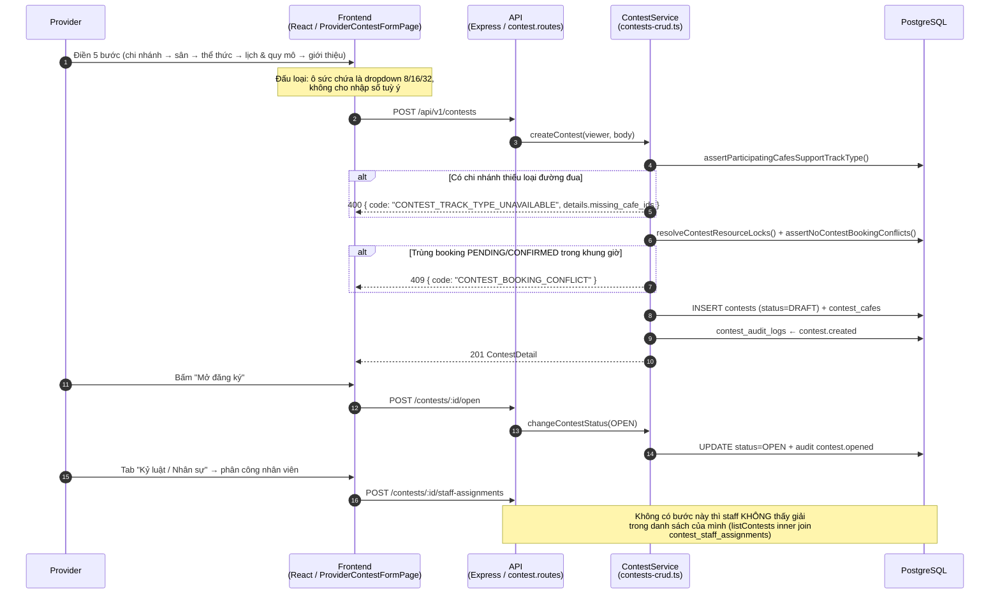
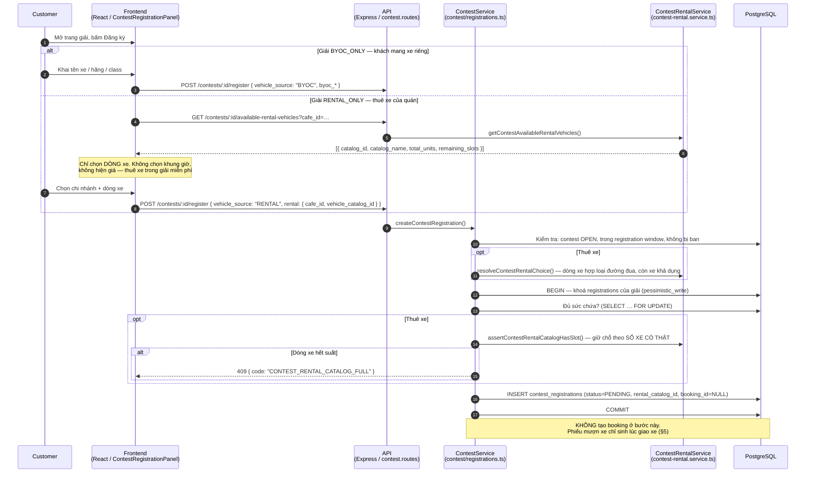
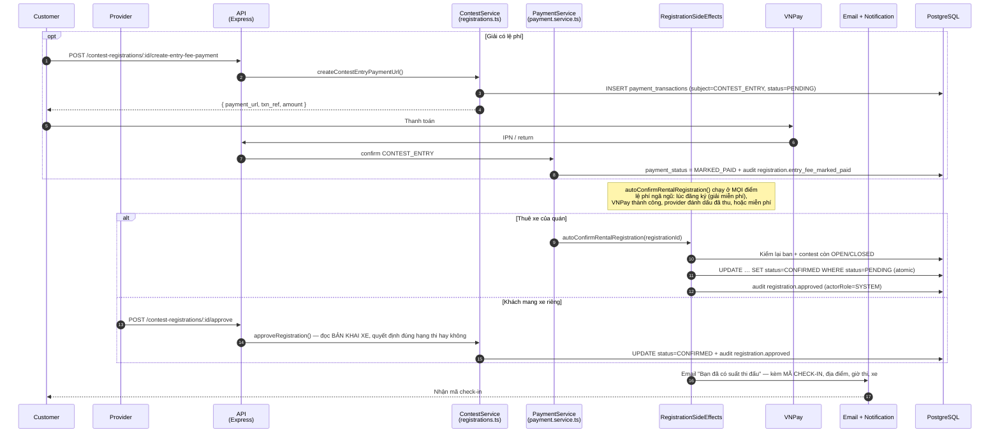
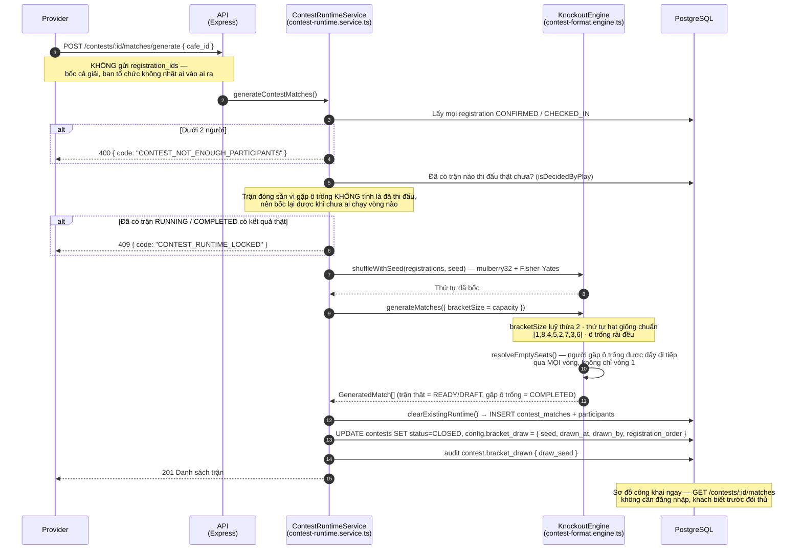
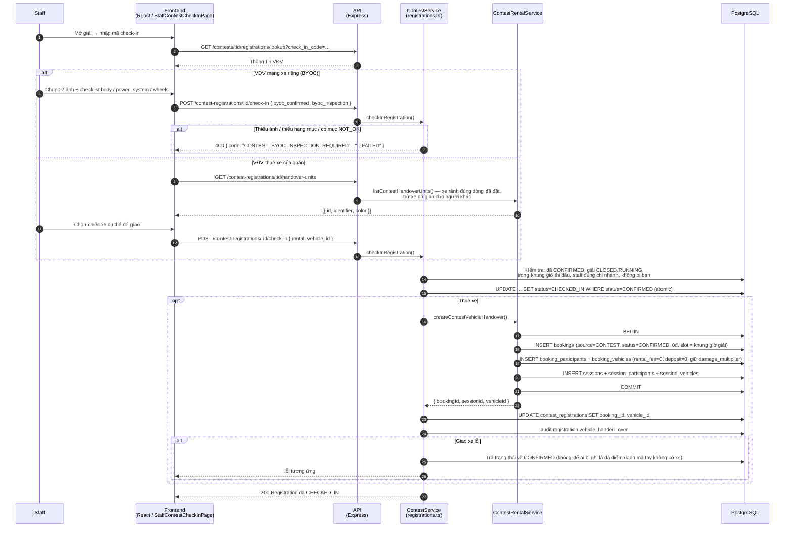
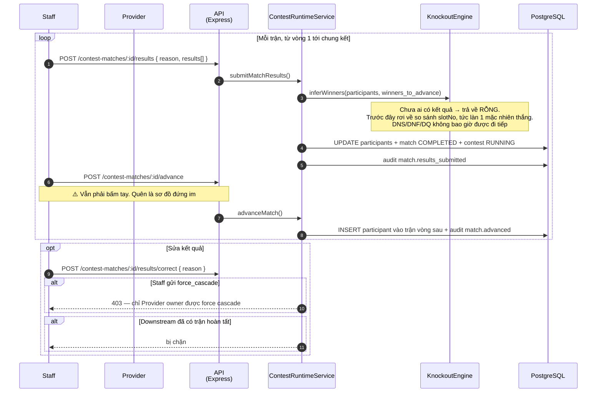
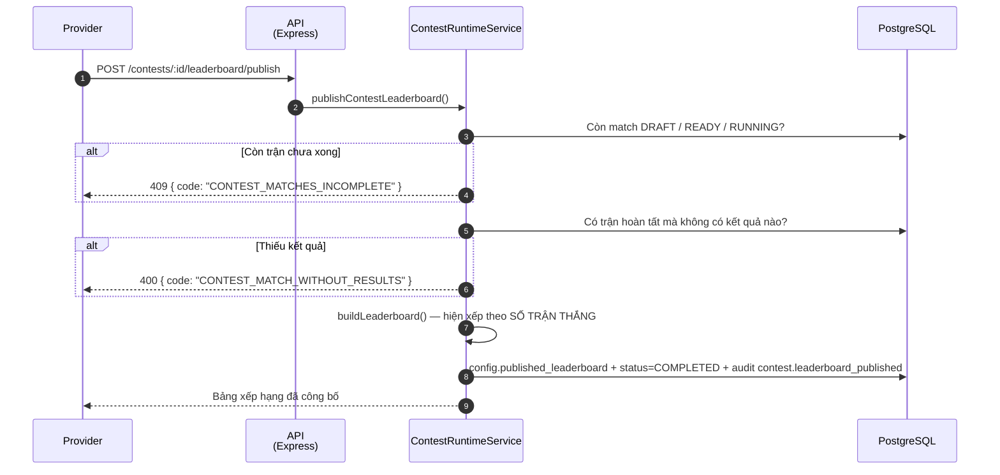
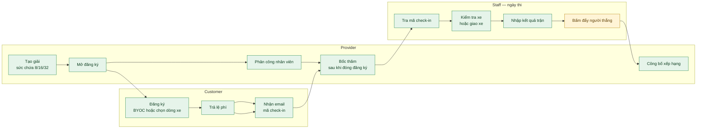

# Sequence Flow: Contest — Đấu loại trực tiếp (Knockout)

**Last updated**: 2026-08-02
**Status**: Bám theo code thật của `rcfeild-be` tại thời điểm cập nhật
**Related**: `docs/developer/contest-delivery/07-contest-flow-audit.md`, `docs/spec/03-contest.md`

Tài liệu mô tả luồng end-to-end của **một** thể thức: đấu loại trực tiếp 1v1, thua là bị loại. Mọi endpoint và tên hàm dưới đây được đối chiếu trực tiếp với source, không suy từ spec — vì bản audit đã chỉ ra spec đang mô tả nhiều thứ khác với code.

> Phần **§9 Chưa làm** liệt kê những gì còn thiếu. Đọc phần đó trước khi coi luồng này là đã hoàn chỉnh.

---

## 0. Identifiers

| Field | Value | Notes |
|---|---|---|
| Thể thức | `contest_formats.code = 'KNOCKOUT'` | Suy ra `config.runtime_format` qua `getRuntimeFormatFromCatalog` |
| Sức chứa | `8 / 16 / 32` | Bắt buộc luỹ thừa của 2; cũng chính là kích thước sơ đồ |
| Trạng thái giải | `DRAFT → OPEN → CLOSED → RUNNING → COMPLETED` | `CANCELLED` là terminal |
| Trạng thái đăng ký | `PENDING → CONFIRMED → CHECKED_IN` | `CANCELLED` cho huỷ/từ chối |
| Trạng thái lệ phí | `NOT_REQUIRED / PENDING_PAYMENT / WAIVED / MARKED_PAID` | `PENDING_REVIEW` không còn dùng cho giải mới |
| Nguồn xe | `vehicle_rule.vehicle_policy` | `BYOC_ONLY` hoặc `RENTAL_ONLY` |
| Lá thăm | `contests.config.bracket_draw` | `{ seed, drawn_at, drawn_by, registration_order }` |
| Phiếu mượn xe | `bookings.source = 'CONTEST'`, `contest_id` | 0đ, sinh lúc giao xe |
| Audit | `contest_audit_logs` | `contest.bracket_drawn`, `registration.vehicle_handed_over`, … |

---

## 1. Tạo giải và mở đăng ký

Provider đi qua wizard 5 bước. Bước cuối mới gọi API — các bước trước chỉ validate phía client.

---

## 2. Khách đăng ký

Hai nhánh hoàn toàn khác nhau tuỳ `vehicle_policy` của giải.

**Trạng thái lệ phí ngay sau khi đăng ký:**

| Lệ phí giải | `payment_status` |
|---|---|
| `> 0` | `PENDING_PAYMENT` |
| `= 0` | `NOT_REQUIRED` |

---

## 3. Lệ phí và xác nhận suất thi đấu

Điểm mấu chốt: **thuê xe không cần ai bấm duyệt**, vì không có gì để duyệt — xe là xe của quán.

---

## 4. Bốc thăm — sau khi đóng đăng ký, trước ngày thi

Đây là bước quyết định hình dạng cả giải.

**Ví dụ 11 người trong sơ đồ 16 suất:**

| Vòng | Số ô trận | Trận phải đấu |
|---|---|---|
| 1 | 8 | 3 (5 suất thắng do ô trống) |
| 2 | 4 | 4 |
| Bán kết | 2 | 2 |
| Chung kết | 1 | 1 |
| **Tổng** | **15** | **10** = 11 − 1 |

---

## 5. Ngày thi — điểm danh và giao xe

Staff làm việc trong màn contest riêng, **không** đi qua module đặt sân.

> Phiếu mượn xe **không** dùng `createBooking`/`startCheckIn` của luồng đặt sân thường: những hàm đó áp luật của khách lẻ — báo trước bao lâu, tối đa 8 slot, và *"quá 30 phút kể từ giờ bắt đầu là hết hạn check-in"*. Giải chạy cả buổi mà VĐV tới muộn 40 phút thì luật đó chặn không cho nhận xe.

---

## 6. Vận hành trận đấu

---

## 7. Công bố kết quả

---

## 8. Bảng quyết định

| Trạng thái / điều kiện | Hành động |
|---|---|
| Giải `OPEN` | Nhận đăng ký. Nút điểm danh của staff bị khoá: *"Còn đang mở đăng ký"* |
| Đăng ký `PENDING` + thuê xe + lệ phí đã xong | Tự chuyển `CONFIRMED`, gửi email mã check-in |
| Đăng ký `PENDING` + BYOC | Chờ provider đọc bản khai xe rồi bấm Duyệt |
| Giải `CLOSED`, chưa tới `starts_at` | Nút điểm danh khoá: *"Chưa tới giờ thi đấu"* |
| Giải `CLOSED/RUNNING`, trong khung giờ | Cho điểm danh và giao xe |
| Trận `COMPLETED` do gặp ô trống | Không tính là đã thi đấu → vẫn bốc lại được |
| Trận `COMPLETED` có kết quả thật | Khoá sơ đồ, không bốc lại được |
| Đã qua `ends_at` | Nút điểm danh khoá: *"Giải đã kết thúc"* |

---

## 9. Chưa làm — đọc trước khi coi là hoàn chỉnh

1. **Không có nút xử thua vắng mặt.** Tới giờ trận mà một bên chưa đến thì không có thao tác nào ghi lại việc đó. Nhân viên phải tự nhập kết quả cho người có mặt; `DNS`/`DNF`/`DQ` có cột trong DB nhưng chưa luồng nào ghi vào.
2. **Người thắng không tự đi tiếp.** Nhập kết quả xong phải bấm thêm nút `advance`. Quên là sơ đồ đứng im giữa giải.
3. **Bảng xếp hạng vẫn đếm số trận thắng** (`KNOCKOUT_WINS`), chưa xếp theo vòng bị loại như đã chốt. Cách đếm hiện tại còn cộng cả trận thắng do gặp ô trống.
4. **Trận tranh hạng 3 mới xong một nửa.** `KnockoutEngine` sinh được match khi `config.third_place_match = true`, nhưng form tạo giải chưa có ô bật/tắt và chưa có logic điền hai người thua bán kết vào trận đó.
5. **Giao diện sơ đồ chưa biết vẽ ô trống.** Trận thắng do gặp ô trống hiện thành một trận đã hoàn tất chỉ có một người — nhìn như lỗi dữ liệu.
6. **Chưa có nút "Bốc thăm" riêng trên giao diện provider**; hiện dùng chung nút tạo nhánh đấu.

---

## 10. Key Files

### Backend — `rcfeild-be`

| Vai trò | Đường dẫn | Ghi chú |
|---|---|---|
| Route | `src/routes/contest.routes.ts` | Toàn bộ endpoint contest |
| Controller | `src/controllers/contest.controller.ts` | Parse + uỷ quyền xuống service |
| Tạo/sửa giải | `src/services/contest/contests-crud.ts` | `createContest`, `listContests`, `changeContestStatus` |
| Đăng ký | `src/services/contest/registrations.ts` | Đăng ký, duyệt, điểm danh, giao xe |
| Hiệu ứng phụ | `src/services/contest/registration-side-effects.ts` | `autoConfirmRentalRegistration`, email |
| Thuê xe | `src/services/contest-rental.service.ts` | Chọn dòng xe, giữ chỗ, phiếu mượn xe |
| Runtime | `src/services/contest-runtime.service.ts` | Bốc thăm, nhập kết quả, advance, publish |
| Engine | `src/services/contest-format.engine.ts` | `KnockoutEngine`, `shuffleWithSeed`, `buildBracketSeedOrder` |
| Khoá tài nguyên | `src/services/contest-lock.service.ts` | Chặn booking thường trùng giờ giải |

### Frontend — `rcfield-fe`

| Vai trò | Đường dẫn |
|---|---|
| Provider tạo giải | `src/pages/provider/contest-form/` (wizard 5 bước) |
| Provider vận hành | `src/pages/provider/contest-runtime/ProviderContestWorkspacePage.tsx` |
| Staff danh sách giải | `src/pages/staff/contest/StaffContestsPage.tsx` |
| Staff điểm danh + giao xe | `src/pages/staff/contest/components/ContestCheckInResultCard.tsx` |
| Khách đăng ký | `src/pages/public/contest-detail/components/ContestRegistrationPanel.tsx` |
| Khách chọn xe | `src/pages/public/contest-detail/components/ContestRentalVehiclePicker.tsx` |

---

## 11. Toàn cảnh

Ô màu vàng là bước còn phải làm tay và dễ quên — xem §9 mục 2.

---

## Reference

### Tài liệu liên quan
- `docs/developer/contest-delivery/07-contest-flow-audit.md` — bản rà soát mâu thuẫn, gồm phần M về các chế độ thi đấu
- `docs/spec/03-contest.md` — spec contest (⚠️ một số mục đã lệch với code, xem audit)
- `docs/spec/business-rules/BR-contest.md` — business rules (⚠️ BR-CT-031/031a/050/080/081/082 đang mô tả luồng đã bị gỡ bỏ)

### Legend
- **Frontend** = `rcfield-fe` (React + Vite + React Query)
- **API** = `rcfeild-be` (Express + TypeScript + TypeORM)
- `->>` gọi / request · `-->>` trả về
- `alt/else` nhánh điều kiện · `opt` bước có thể không xảy ra · `loop` lặp
- ⚠️ = phần chưa hoàn thiện, xem §9

---

*Last updated: 2026-08-02 · Đối chiếu trực tiếp với source `rcfeild-be`, không suy từ spec.*
