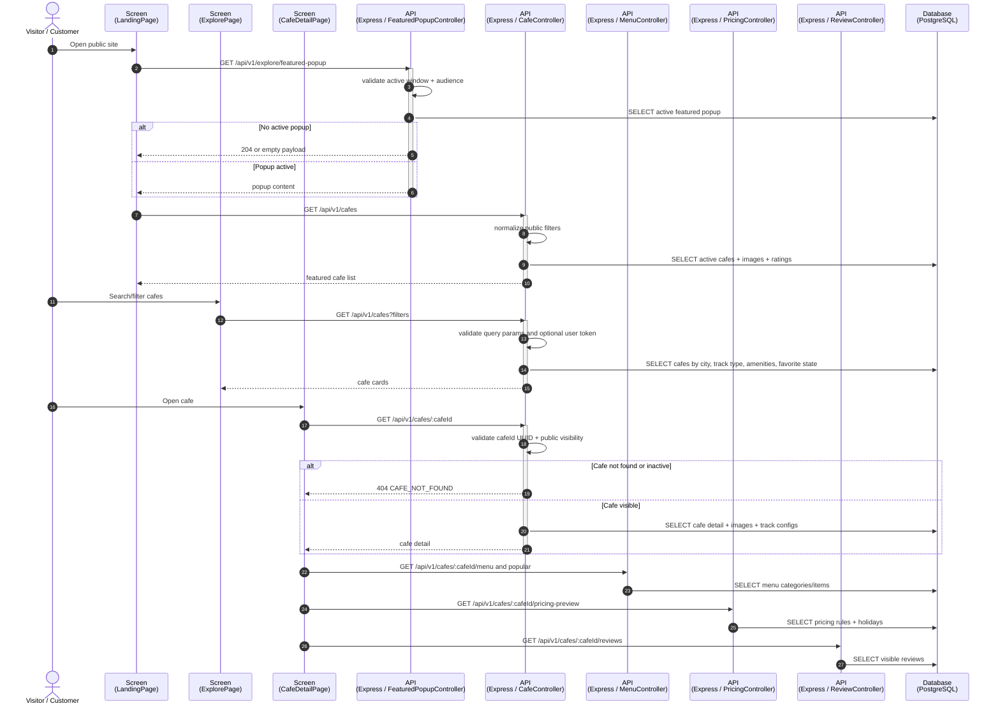
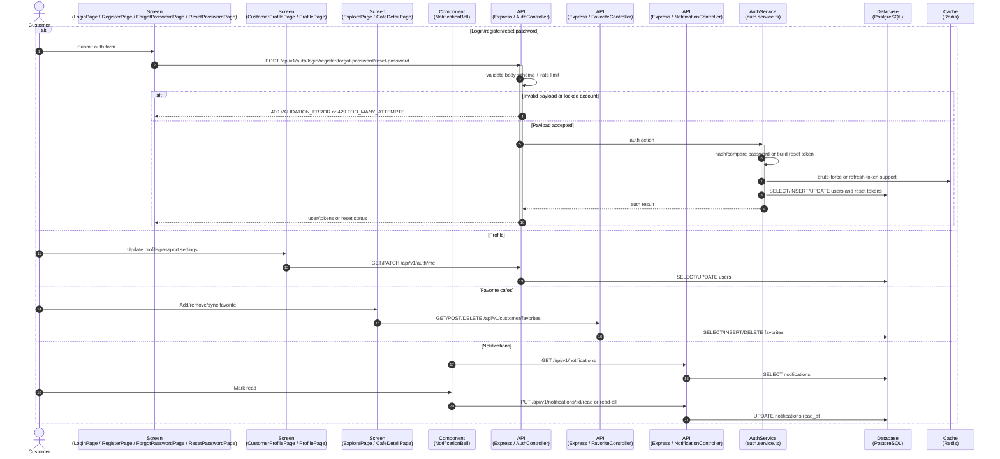
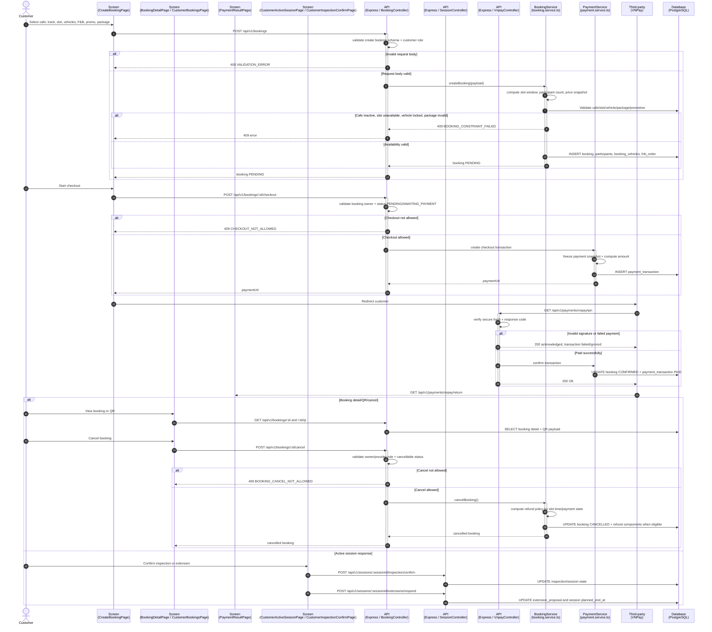
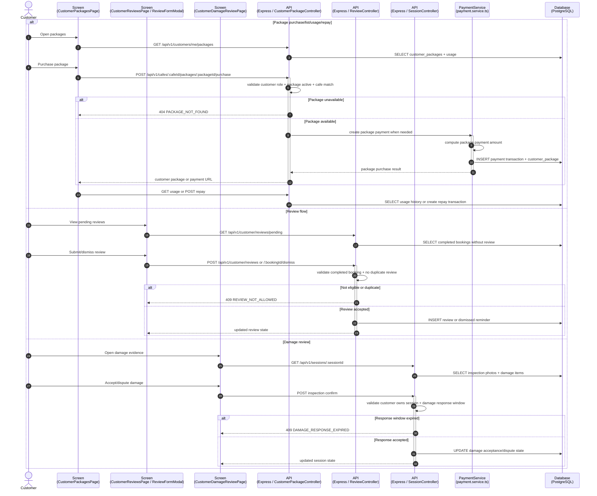
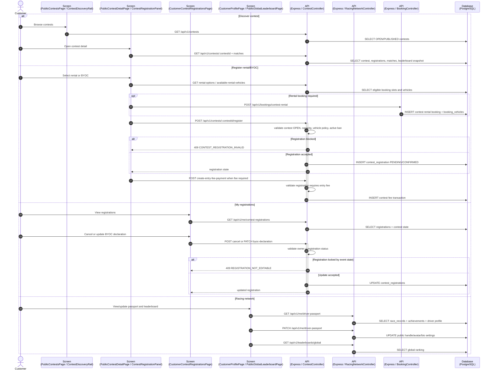
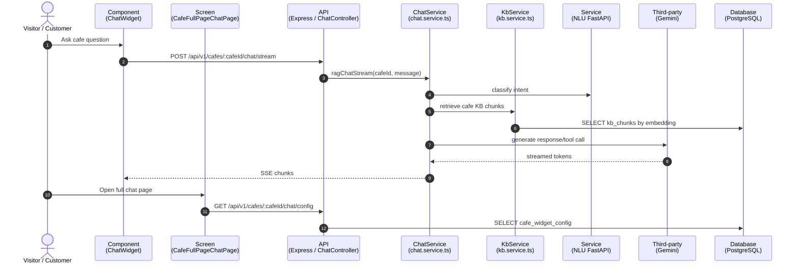

# Sequence Flow: Customer and Public Operations

**Last updated:** 2026-08-06

Coverage theo controller: `auth`, `cafe`, `featured-popup`, `favorite`, `review`, `customer-package`, `booking`, `session`, `vnpay`, `contest`, `racing-network`, `notification`, `chat`, `vehicle`.

---

## 1. Public Home, Explore, Cafe Detail and Featured Popup

---

## 2. Auth, Profile, Favorites and Notifications

---

## 3. Booking, Payment, QR and Active Session Response

---

## 4. Customer Packages, Reviews and Damage Review

---

## 5. Customer Contest, Rental/BYOC Registration and Racing Network

---

## 6. Chat Widget and Full Page Chat

---

## 7. Class Diagram: Customer and Public Operations

```mermaid
classDiagram
    class LandingPage
    class ExplorePage
    class CafeDetailPage
    class LoginPage
    class CustomerProfilePage
    class CreateBookingPage
    class BookingDetailPage
    class CustomerPackagesPage
    class CustomerReviewsPage
    class PublicContestDetailPage
    class CustomerContestRegistrationsPage
    class ChatWidget
    class CafeController
    class AuthController
    class BookingController
    class SessionController
    class CustomerPackageController
    class ReviewController
    class FavoriteController
    class ContestController
    class RacingNetworkController
    class ChatController
    class User
    class Cafe
    class Booking
    class Session
    class CustomerPackage
    class Review
    class Favorite
    class ContestRegistration
    class RaceRecord

    LandingPage --> CafeController
    ExplorePage --> CafeController
    CafeDetailPage --> CafeController
    LoginPage --> AuthController
    CustomerProfilePage --> AuthController
    CreateBookingPage --> BookingController
    BookingDetailPage --> BookingController
    CustomerPackagesPage --> CustomerPackageController
    CustomerReviewsPage --> ReviewController
    PublicContestDetailPage --> ContestController
    CustomerContestRegistrationsPage --> ContestController
    ChatWidget --> ChatController
    User "1" --> "*" Booking
    User "1" --> "*" CustomerPackage
    User "1" --> "*" Review
    User "1" --> "*" Favorite
    User "1" --> "*" ContestRegistration
    User "1" --> "*" RaceRecord
    Cafe "1" --> "*" Booking
    Booking "1" --> "*" Session
```

