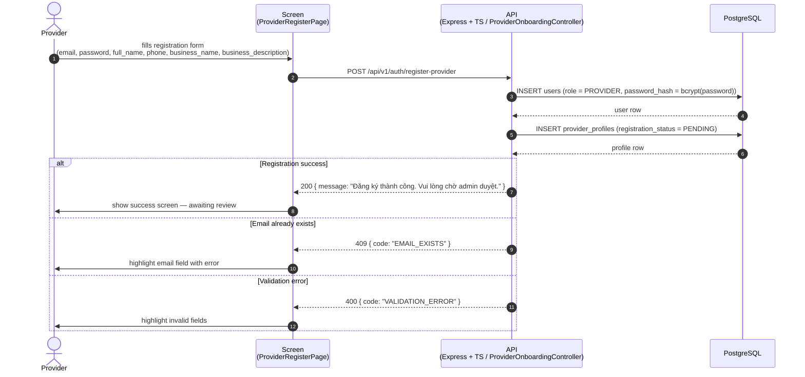
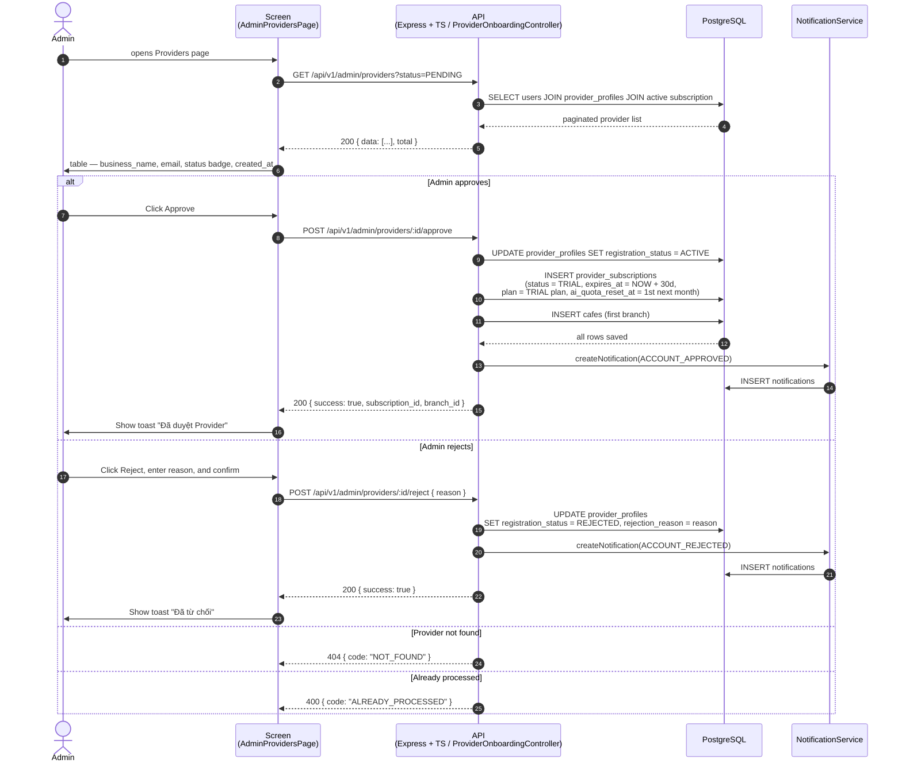
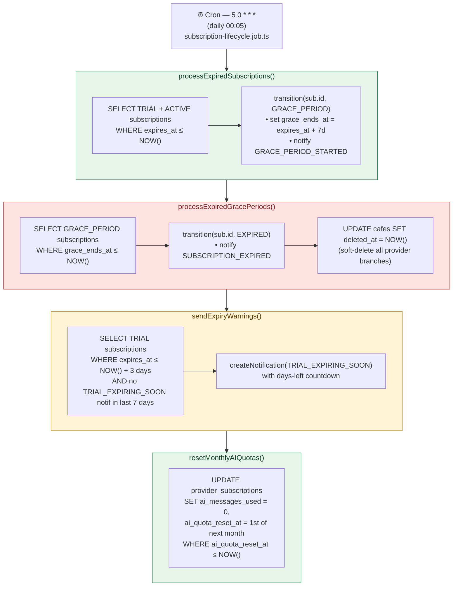
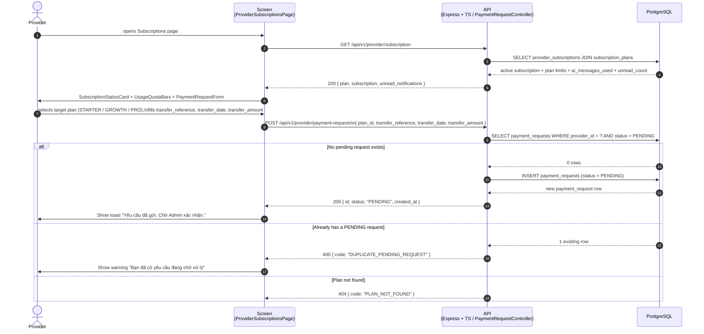
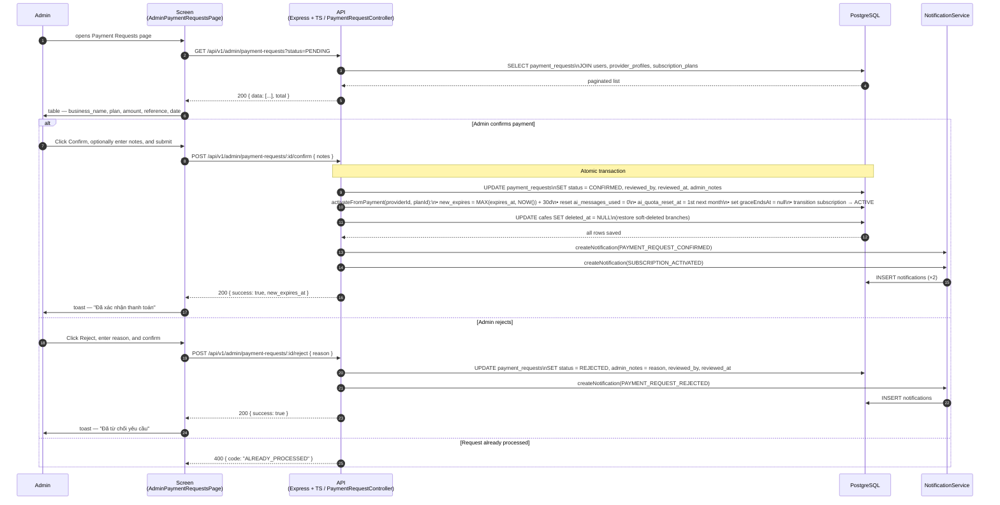
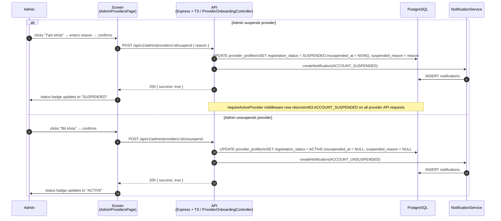
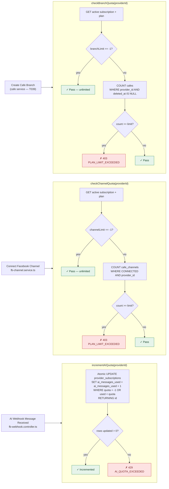
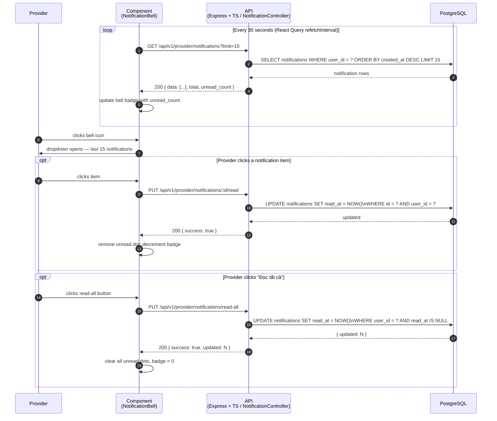
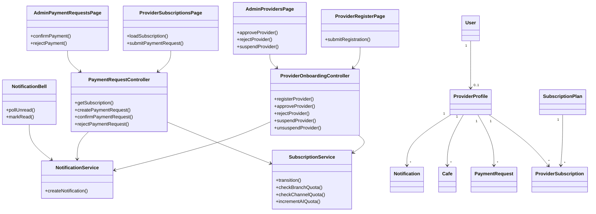

# Sequence Flow: Provider Onboarding & Subscription Management

Full lifecycle of a Provider account from registration through subscription management: onboarding, admin review, trial period, payment, renewal, and quota enforcement. Based on `specs/004-provider-subscription/`.

> See **Reference** at the bottom for related docs and legend.

---

## 0. Identifiers

| Field | Value | Notes |
|-------|-------|-------|
| Enum | `RegistrationStatus` | `PENDING → ACTIVE → SUSPENDED → ACTIVE` |
| Enum | `SubscriptionStatus` | `TRIAL → GRACE_PERIOD → EXPIRED → ACTIVE` |
| Enum | `PaymentRequestStatus` | `PENDING → CONFIRMED / REJECTED` |
| Enum | `NotificationType` | 10 types covering account + subscription events |
| Endpoint | `POST /api/v1/auth/register-provider` | Public — ProviderOnboardingController |
| Endpoint | `POST /api/v1/admin/providers/:id/approve` | Admin — ProviderOnboardingController |
| Endpoint | `POST /api/v1/admin/providers/:id/reject` | Admin — ProviderOnboardingController |
| Endpoint | `POST /api/v1/admin/providers/:id/suspend` | Admin — ProviderOnboardingController |
| Endpoint | `POST /api/v1/admin/providers/:id/unsuspend` | Admin — ProviderOnboardingController |
| Endpoint | `POST /api/v1/provider/payment-requests` | Provider — PaymentRequestController |
| Endpoint | `POST /api/v1/admin/payment-requests/:id/confirm` | Admin — PaymentRequestController |
| Endpoint | `POST /api/v1/admin/payment-requests/:id/reject` | Admin — PaymentRequestController |
| Endpoint | `GET /api/v1/provider/subscription` | Provider — PaymentRequestController |
| Endpoint | `GET /api/v1/provider/notifications` | Provider — NotificationController |
| Endpoint | `PUT /api/v1/provider/notifications/:id/read` | Provider — NotificationController |
| Endpoint | `PUT /api/v1/provider/notifications/read-all` | Provider — NotificationController |
| Cron | `5 0 * * *` (00:05 daily) | `subscription-lifecycle.job.ts` |
| Quota guard | `checkBranchQuota(providerId)` | Called before creating a cafe branch |
| Quota guard | `checkChannelQuota(providerId)` | Called before connecting a Facebook channel |
| Quota guard | `incrementAIQuota(providerId)` | Atomic UPDATE — called on each AI webhook message |

---

## 1. Provider Registration

The provider fills in a public registration form. The account is created with `RegistrationStatus.PENDING` — no subscription is created at this point. An admin must review before access is granted.

---

## 2. Admin Review — Approve or Reject

Admin reviews pending registrations from `AdminProvidersPage`. Approving triggers an atomic transaction: account activated, 30-day TRIAL subscription created, and the provider's first branch inserted.

---

## 3. Subscription Lifecycle — Daily Cron

A `node-cron` job runs **every day at 00:05** (`5 0 * * *`). It executes four functions in sequence: expire active subscriptions into grace period, expire grace periods (soft-deleting all branches), send trial expiry warnings, and reset monthly AI quotas.

---

## 4. Payment Request Submission

When a provider's trial is nearing expiry (or already in GRACE_PERIOD / EXPIRED), they submit a manual bank-transfer payment request. Only one `PENDING` request is allowed at a time.

---

## 5. Admin Payment Confirmation or Rejection

Admin reviews bank-transfer evidence on `AdminPaymentRequestsPage`. Confirming atomically activates the subscription with **stacked expiry** (`MAX(current_expires_at, NOW()) + 30 days`) and restores any soft-deleted branches.

---

## 6. Admin Account Management — Suspend / Unsuspend

Admin can suspend an active provider for policy violations. The `requireActiveProvider` middleware blocks **all** provider API calls when `registration_status = SUSPENDED`.

---

## 7. Quota Enforcement

Three quota guards run inline at the service layer. Each reads the active subscription and its plan limits from PostgreSQL before allowing the operation.

---

## 8. In-App Notification Bell

The `NotificationBell` component in the Provider shell header polls for unread notifications every **30 seconds** using React Query's `refetchInterval`. Clicking a notification marks it read; "Đọc tất cả" bulk-reads all.

---

## 9. Decision Logic Summary

| State / Condition | Action |
|---|---|
| `RegistrationStatus.PENDING` | Provider awaits admin review; no subscription exists yet |
| `RegistrationStatus.ACTIVE` + `SubscriptionStatus.TRIAL` | Full access up to trial limits (1 branch, 500 AI msgs/mo, 1 channel, 30 days) |
| `SubscriptionStatus.TRIAL` within 3 days of expiry | Cron sends `TRIAL_EXPIRING_SOON` notification (deduplicated: 1 per 7 days) |
| `expires_at` passed — `TRIAL` or `ACTIVE` | Cron: transition → `GRACE_PERIOD`; set `grace_ends_at = expires_at + 7d` |
| `SubscriptionStatus.GRACE_PERIOD` | Existing bookings run; no new bookings; provider sees warning banner |
| `grace_ends_at` passed | Cron: transition → `EXPIRED`; all cafe branches soft-deleted (`deleted_at = NOW()`) |
| `RegistrationStatus.SUSPENDED` | `requireActiveProvider` returns `403 ACCOUNT_SUSPENDED` on every provider API call |
| `PaymentRequest.PENDING` already exists | `POST /provider/payment-requests` returns `400 DUPLICATE_PENDING_REQUEST` |
| Admin confirms payment | Stacked expiry: `MAX(current expires_at, NOW()) + 30d`; `ai_messages_used = 0`; soft-deleted cafes restored |
| `plan.branchLimit == -1` | Unlimited branches (PRO) — quota check skipped |
| `plan.aiQuotaPerMonth == -1` | Unlimited AI messages (PRO) — atomic UPDATE always succeeds |
| `incrementAIQuota()` returns 0 rows updated | `429 AI_QUOTA_EXCEEDED` — webhook message not processed |

---

## 10. Key Files

### Backend (`backend/src`)

| Area | Path | Note |
|------|------|------|
| Controller | `controllers/provider-onboarding.controller.ts` | registerProvider, approve, reject, suspend, unsuspend |
| Controller | `controllers/payment-request.controller.ts` | getSubscriptionStatus, submitPaymentRequest, confirmPaymentRequest, rejectPaymentRequest |
| Controller | `controllers/notification.controller.ts` | list, markRead, markAllRead |
| Service | `services/provider-onboarding.service.ts` | Provider registration + state machine transitions |
| Service | `services/subscription.service.ts` | Subscription state machine, createTrial, activateFromPayment, quota guards |
| Service | `services/payment-request.service.ts` | submit, confirm (with activateFromPayment + restore cafes), reject |
| Service | `services/notification.service.ts` | createNotification(), list, markRead, markAllRead |
| Job | `jobs/subscription-lifecycle.job.ts` | Daily cron at 00:05 — 4 lifecycle functions |
| Middleware | `middlewares/auth.middleware.ts` | `requireActiveProvider` — blocks SUSPENDED providers |
| Entity | `models/provider-profile.entity.ts` | RegistrationStatus, suspension fields |
| Entity | `models/provider-subscription.entity.ts` | SubscriptionStatus, AI quota, grace period fields |
| Entity | `models/subscription-plan.entity.ts` | branchLimit, aiQuotaPerMonth, channelLimit (-1 = unlimited) |
| Entity | `models/payment-request.entity.ts` | PaymentRequestStatus, transfer fields, reviewed_by |
| Entity | `models/notification.entity.ts` | NotificationType, read_at |
| Routes | `routes/index.ts` | Mounts all 5 new routers |
| Routes | `routes/provider-onboarding.routes.ts` | POST /auth/register-provider |
| Routes | `routes/admin-provider.routes.ts` | CRUD + status actions on providers |
| Routes | `routes/provider-subscription.routes.ts` | GET /provider/subscription, POST/GET /provider/payment-requests |
| Routes | `routes/admin-payment-request.routes.ts` | GET + confirm/reject payment requests |
| Routes | `routes/notification.routes.ts` | GET list, PUT read, PUT read-all |
| Integration | `services/fb-channel.service.ts` | `handleOAuthCallback` calls `checkChannelQuota()` |
| Integration | `controllers/fb-webhook.controller.ts` | Calls `incrementAIQuota()` per incoming AI message |

### Frontend (`frontend/src`)

| Area | Path | Note |
|------|------|------|
| Page | `pages/auth/ProviderRegisterPage.tsx` | Public registration form |
| Page | `pages/provider/ProviderSubscriptionsPage.tsx` | Subscription status, usage bars, payment history |
| Page | `pages/admin/AdminProvidersPage.tsx` | Provider list — approve / reject / suspend / unsuspend |
| Page | `pages/admin/AdminPaymentRequestsPage.tsx` | Payment request confirm / reject |
| Component | `features/subscriptions/components/SubscriptionStatusCard.tsx` | Status badge, expiry countdown |
| Component | `features/subscriptions/components/UsageQuotaBars.tsx` | Branch / AI / Channel progress bars |
| Component | `features/subscriptions/components/PaymentRequestForm.tsx` | Plan selector + bank transfer fields |
| Component | `features/notifications/components/NotificationBell.tsx` | Bell icon, 30s polling, dropdown, mark-read |
| Shell | `pages/provider/components/ProviderShell.tsx` | NotificationBell added to mobile header |
| Shell | `pages/admin/components/AdminShell.tsx` | "Quản lý Provider" + "Yêu cầu thanh toán" nav items |
| API | `features/subscriptions/api/subscription.api.ts` | All 13 subscription / provider API calls |
| API | `features/notifications/api/notification.api.ts` | list, markRead, markAllRead |
| Types | `features/subscriptions/types/index.ts` | All subscription / provider TypeScript interfaces |
| Types | `features/notifications/types/index.ts` | Notification TypeScript interfaces |
| Router | `app/router/routes.tsx` | ProviderRegisterPage, AdminProvidersPage, AdminPaymentRequestsPage added |
| Router | `app/router/route-paths.ts` | `providerRegister`, `adminProviders`, `adminPaymentRequests` added |

---

## 11. Open Questions

1. **Branch restore on unsuspend**: When a suspended provider is unsuspended, soft-deleted branches are NOT automatically restored (only payment confirmation does that). Is this intentional, or should unsuspend also restore branches if subscription is still active?
2. **T039 — Branch quota wiring**: `checkBranchQuota()` is implemented in `subscription.service.ts` but cannot be wired until the cafe branch creation service exists (separate feature). Flag for the cafe management feature spec.

---

## 12. Application Flow Overview

```mermaid
flowchart LR
    subgraph Reg["Provider\n(Registration)"]
        direction TB
        PR1["Fill registration form"]
        PR2["Show 'Awaiting review'"]
        PR1 --> PR2
    end

    subgraph Review["Admin\n(Review)"]
        direction TB
        AR1["View PENDING list"]
        AR2{"Decision"}
        AR3["Approve\n→ ACTIVE + TRIAL sub\n+ first branch"]
        AR4["Reject\n→ REJECTED"]
        AR1 --> AR2
        AR2 -- approve --> AR3
        AR2 -- reject --> AR4
    end

    subgraph Lifecycle["Cron 00:05\n(Daily Lifecycle)"]
        direction TB
        TL1["TRIAL/ACTIVE\n→ GRACE_PERIOD\n(on expires_at)"]
        TL2["GRACE_PERIOD\n→ EXPIRED\n+ soft-delete branches"]
        TL3["TRIAL_EXPIRING_SOON\nwarning (3 days before)"]
        TL4["Reset AI quota\n(monthly)"]
        TL1 --> TL2
    end

    subgraph Pay["Payment Flow"]
        direction TB
        PF1["Provider submits\nbank transfer proof"]
        PF2{"Admin action"}
        PF3["Confirm → ACTIVE\nstacked +30d\nrestore branches"]
        PF4["Reject → REJECTED"]
        PF1 --> PF2
        PF2 -- confirm --> PF3
        PF2 -- reject --> PF4
    end

    subgraph Quotas["Quota Guards\n(inline checks)"]
        direction TB
        QG1["checkBranchQuota()"]
        QG2["checkChannelQuota()"]
        QG3["incrementAIQuota()"]
    end

    subgraph Notif["Notifications"]
        direction TB
        NB1["NotificationBell\npolls every 30s"]
        NB2["Mark read on click"]
        NB1 --> NB2
    end

    PR1 --> AR1
    AR3 --> Lifecycle
    AR3 --> Quotas
    Lifecycle --> PF1
    PF3 --> Quotas

    Notif -.->|"triggered by\nall state changes"| Review
    Notif -.-> Lifecycle
    Notif -.-> Pay

    classDef happy fill:#e6f4ea,stroke:#1e8449,color:#0d3d1f
    classDef error fill:#fde2e2,stroke:#c0392b,color:#7a1f1f
    classDef wait fill:#fff4d6,stroke:#b8860b,color:#5c3c00
    class AR3,PF3,TL4,QG1,QG2,QG3 happy
    class AR4,PF4,TL2 error
    class TL1,TL3,PF1,NB1,PR2 wait
```

---

## 10. Class Diagram: Provider Onboarding and Subscription

---

## Reference

### Related docs
- `specs/004-provider-subscription/spec.md` — Feature specification
- `specs/004-provider-subscription/data-model.md` — Entity definitions and state transitions
- `specs/004-provider-subscription/contracts/api.md` — All 14 API endpoint contracts
- `specs/004-provider-subscription/research.md` — Technical decisions (cron, quota strategy, state machine)
- `specs/004-provider-subscription/quickstart.md` — Integration scenarios and implementation order

### Legend
- **Frontend** = `frontend/src` (React + Vite + TypeScript)
- **API** = `backend/src` (Express + TypeScript + TypeORM)
- **N** = `NotificationService` — `createNotification()` called as a side-effect on every state transition
- `-->>` = response / async return
- `->>` = request / call
- `opt` = optional step (may or may not occur)
- `alt/else` = conditional branch
- `loop` = polling or retry
- Quota guards (`checkBranchQuota`, `checkChannelQuota`, `incrementAIQuota`) are service-layer inline calls — not shown as separate participants in sequence blocks

---

*Last updated: 2026-05-25 · Based on: specs/004-provider-subscription/contracts/api.md, data-model.md, backend/src/services/subscription.service.ts, backend/src/jobs/subscription-lifecycle.job.ts, backend/src/routes/index.ts*
