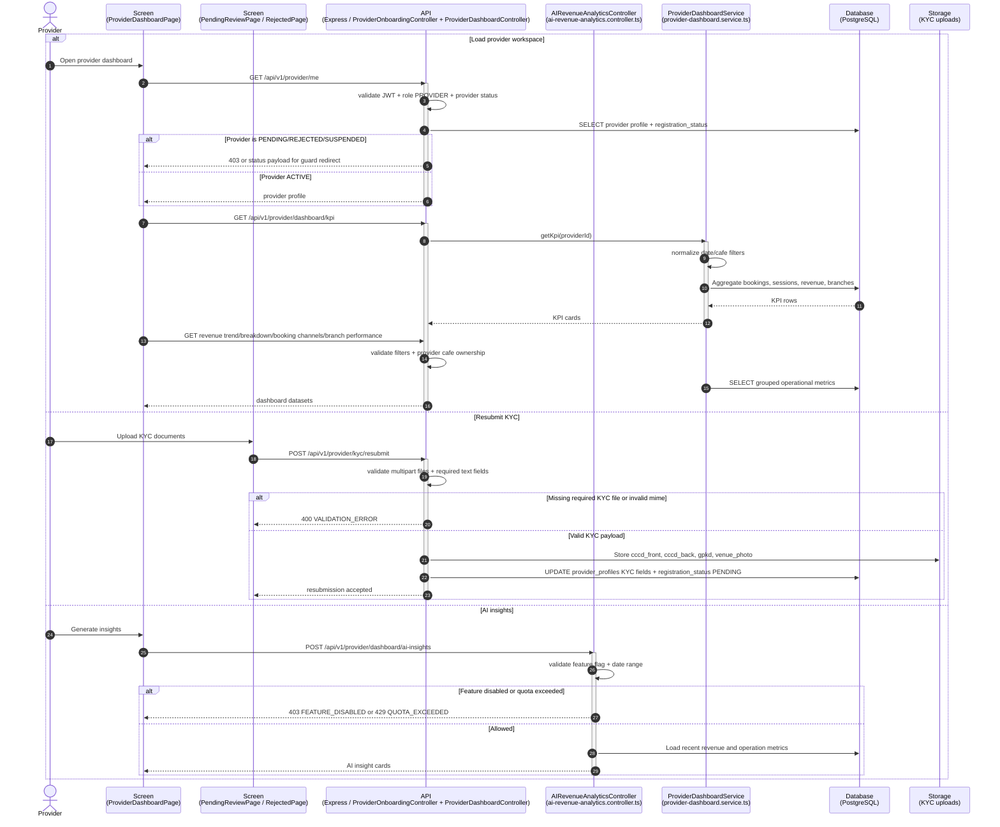
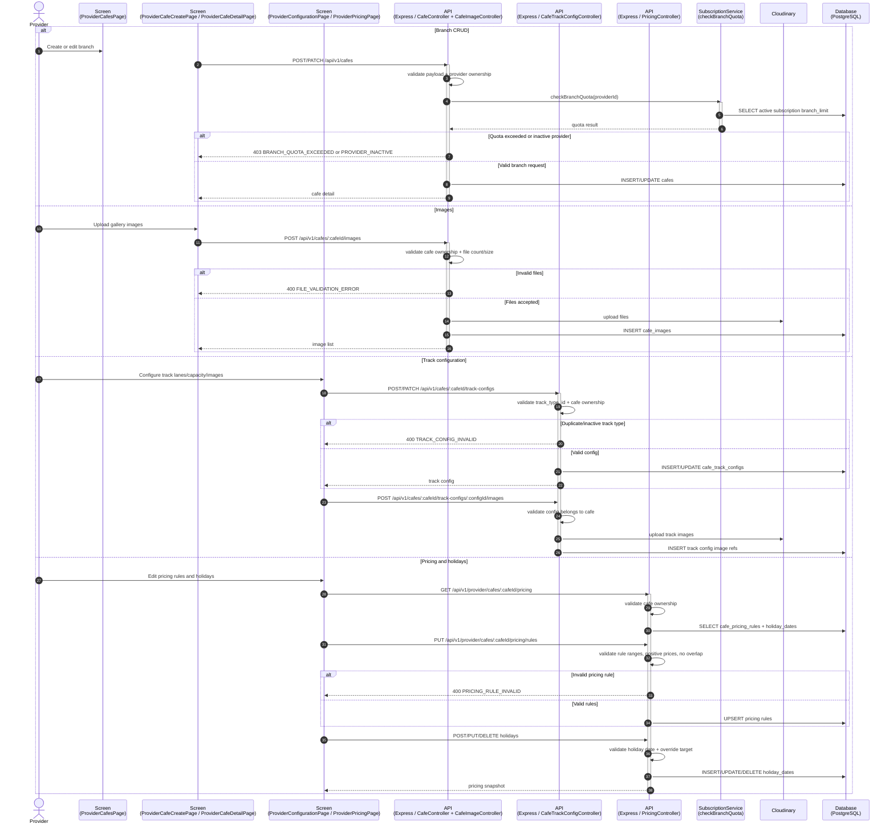
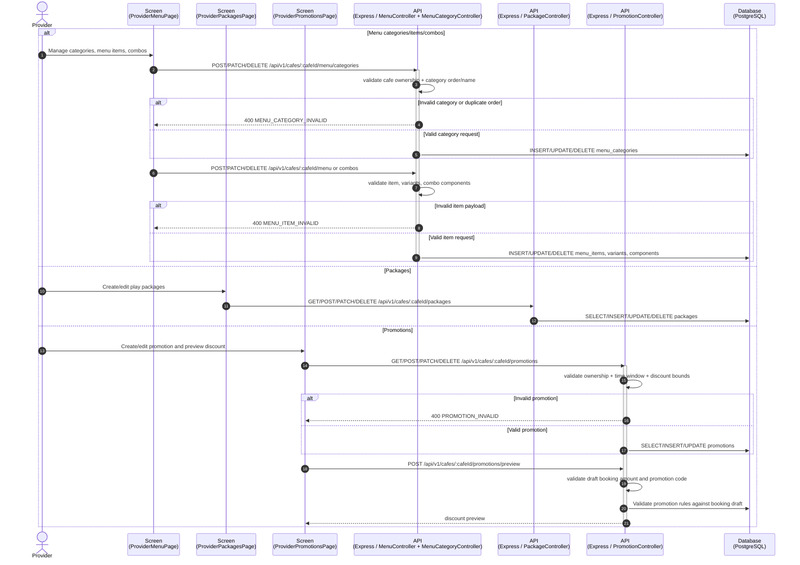
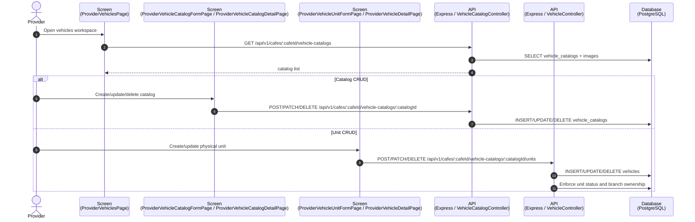
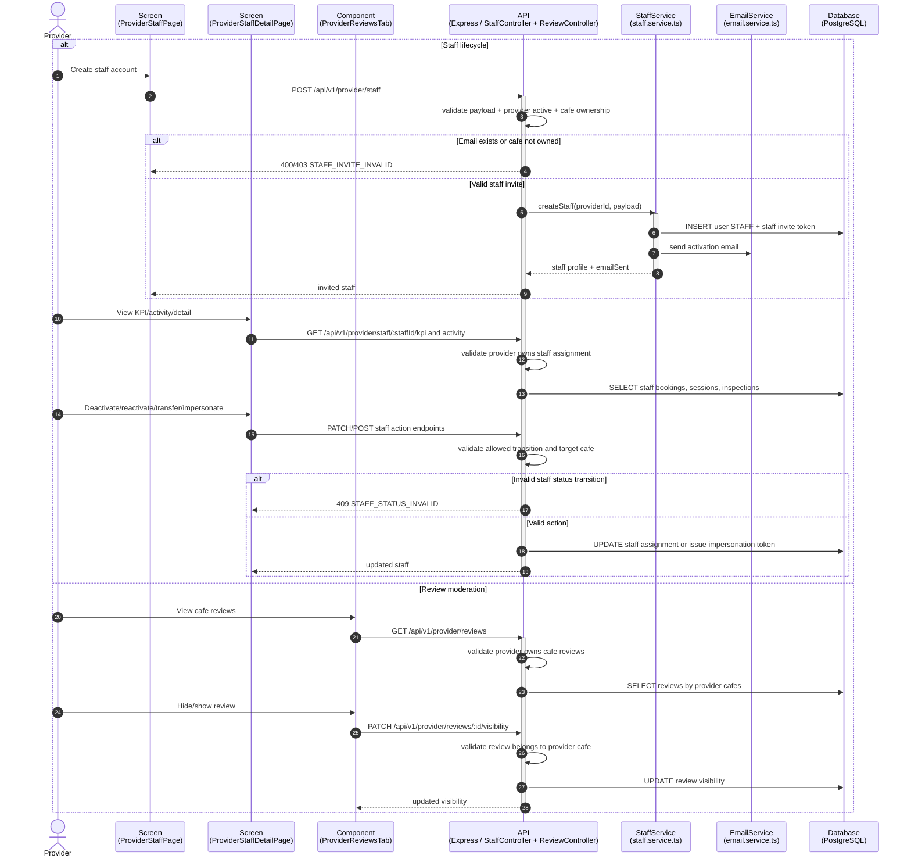
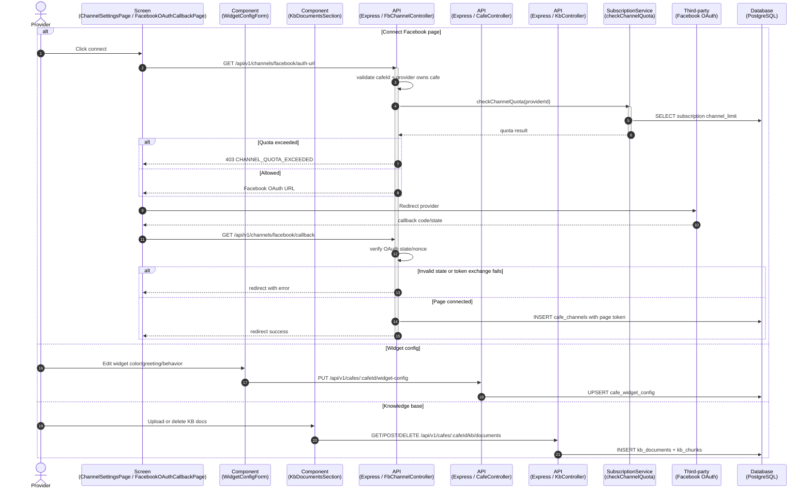
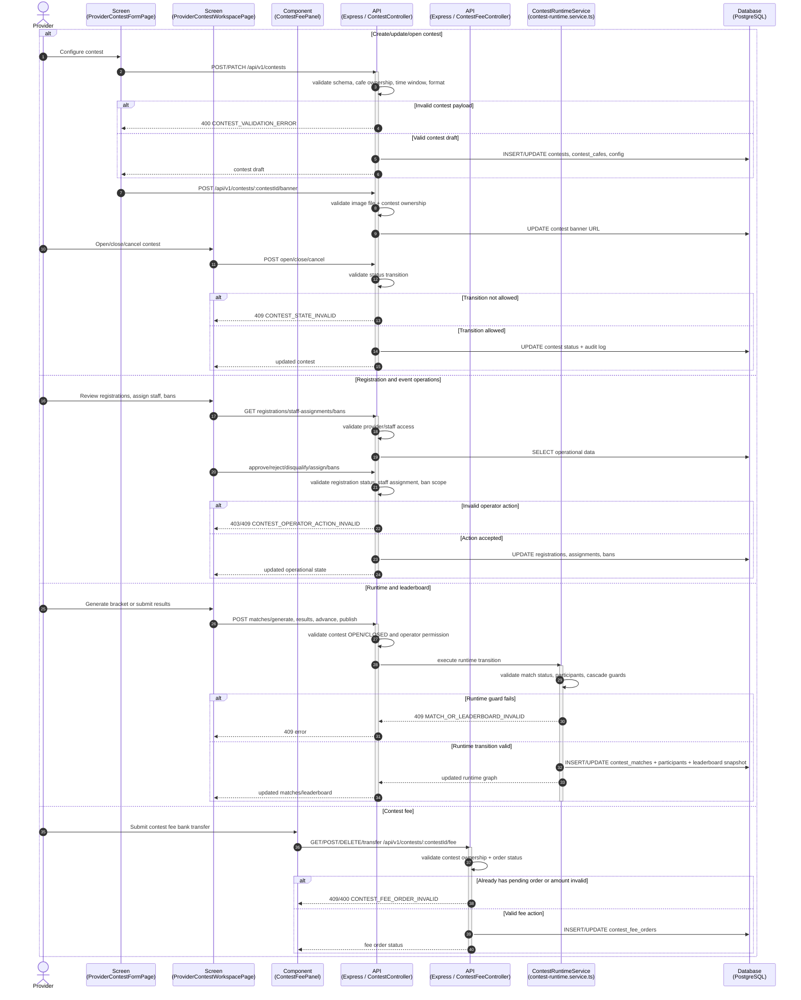

# Sequence Flow: Provider Operations

**Last updated:** 2026-08-06

Coverage theo controller: `provider-onboarding`, `provider-dashboard`, `ai-revenue-analytics`, `cafe`, `cafe-image`, `cafe-track-config`, `pricing`, `menu`, `menu-category`, `package`, `promotion`, `vehicle-catalog`, `vehicle`, `staff`, `fb-channel`, `chat/kb`, `review`, `contest`, `contest-fee`, `payment-request`.

---

## 1. Provider Workspace Load, KYC and Dashboard Analytics

---

## 2. Cafe Branch, Images, Track Configuration and Pricing

---

## 3. Menu, Packages, Promotions and Public Preview

---

## 4. Vehicle Catalog, Units and Maintenance Visibility

---

## 5. Provider Staff, Reviews and Impersonation

---

## 6. Channels, Chat Widget and Knowledge Base

---

## 7. Provider Contest Management and Contest Fee

---

## 8. Class Diagram: Provider Operations

```mermaid
classDiagram
    class ProviderDashboardPage
    class ProviderCafesPage
    class ProviderConfigurationPage
    class ProviderMenuPage
    class ProviderPackagesPage
    class ProviderPromotionsPage
    class ProviderVehiclesPage
    class ProviderStaffPage
    class ChannelSettingsPage
    class ProviderContestWorkspacePage
    class ProviderOnboardingController
    class ProviderDashboardController
    class CafeController
    class PricingController
    class MenuController
    class PackageController
    class PromotionController
    class VehicleCatalogController
    class StaffController
    class FbChannelController
    class ContestController
    class ContestFeeController
    class ProviderProfile
    class Cafe
    class CafeTrackConfig
    class MenuItem
    class Package
    class Promotion
    class VehicleCatalog
    class Vehicle
    class StaffAssignment
    class CafeChannel
    class Contest

    ProviderDashboardPage --> ProviderDashboardController
    ProviderCafesPage --> CafeController
    ProviderConfigurationPage --> PricingController
    ProviderMenuPage --> MenuController
    ProviderPackagesPage --> PackageController
    ProviderPromotionsPage --> PromotionController
    ProviderVehiclesPage --> VehicleCatalogController
    ProviderStaffPage --> StaffController
    ChannelSettingsPage --> FbChannelController
    ProviderContestWorkspacePage --> ContestController
    ProviderProfile "1" --> "*" Cafe
    Cafe "1" --> "*" CafeTrackConfig
    Cafe "1" --> "*" MenuItem
    Cafe "1" --> "*" Package
    Cafe "1" --> "*" Promotion
    Cafe "1" --> "*" VehicleCatalog
    VehicleCatalog "1" --> "*" Vehicle
    ProviderProfile "1" --> "*" StaffAssignment
    Cafe "1" --> "*" CafeChannel
    ProviderProfile "1" --> "*" Contest
```

