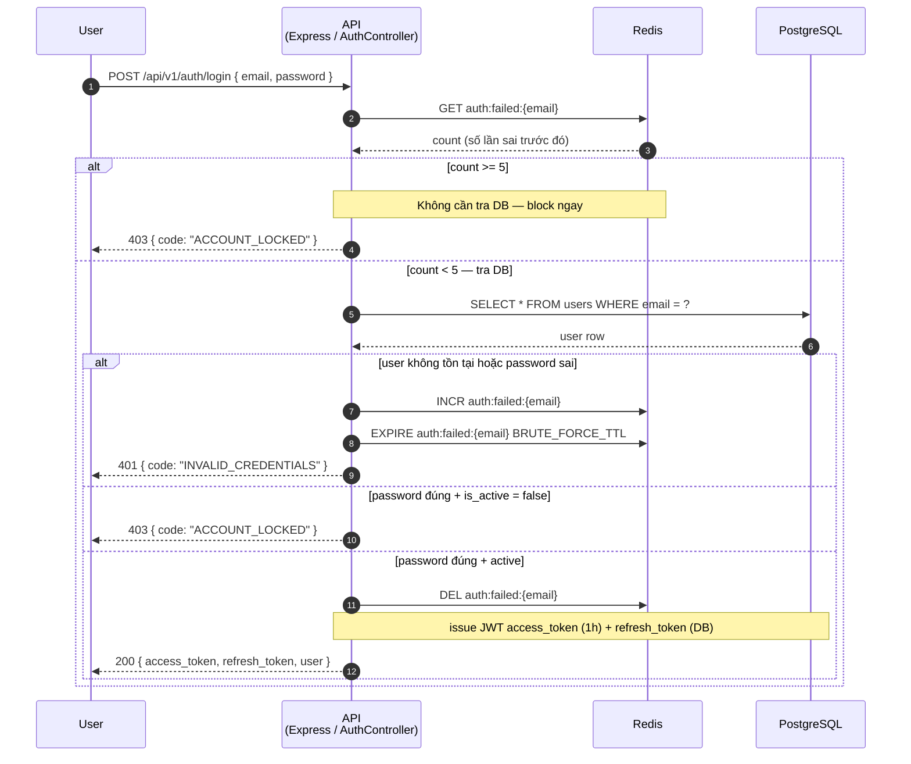
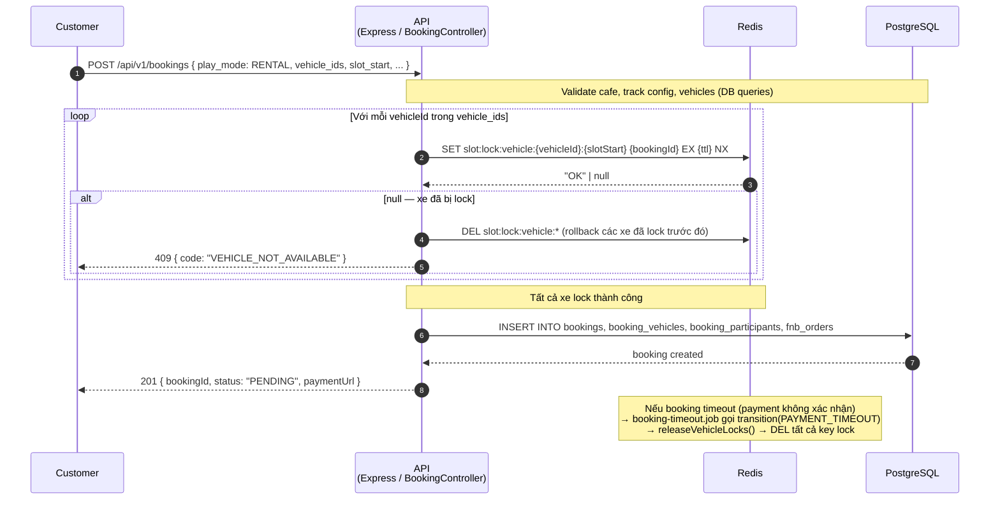
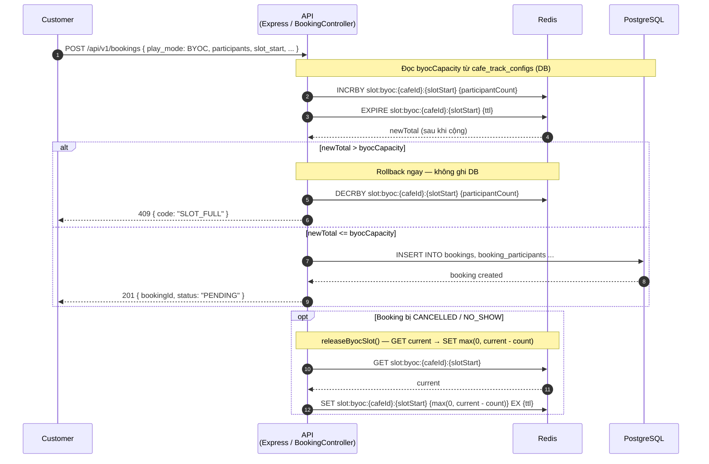
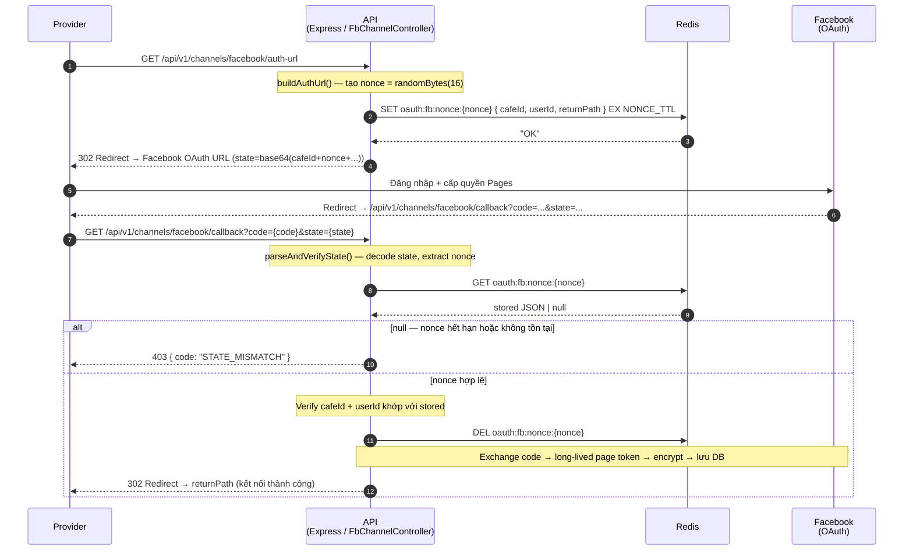
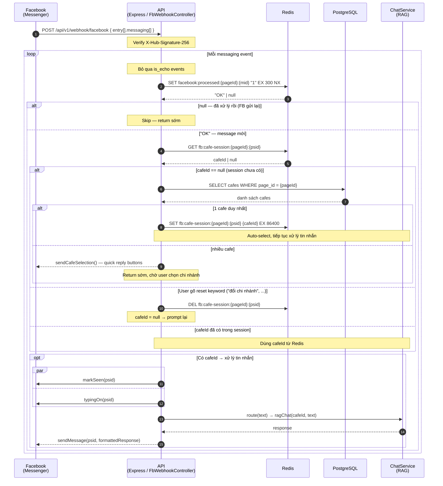
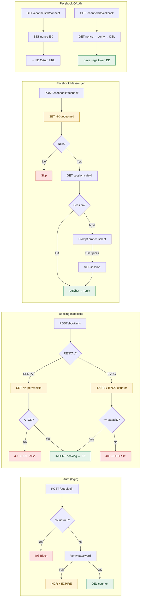
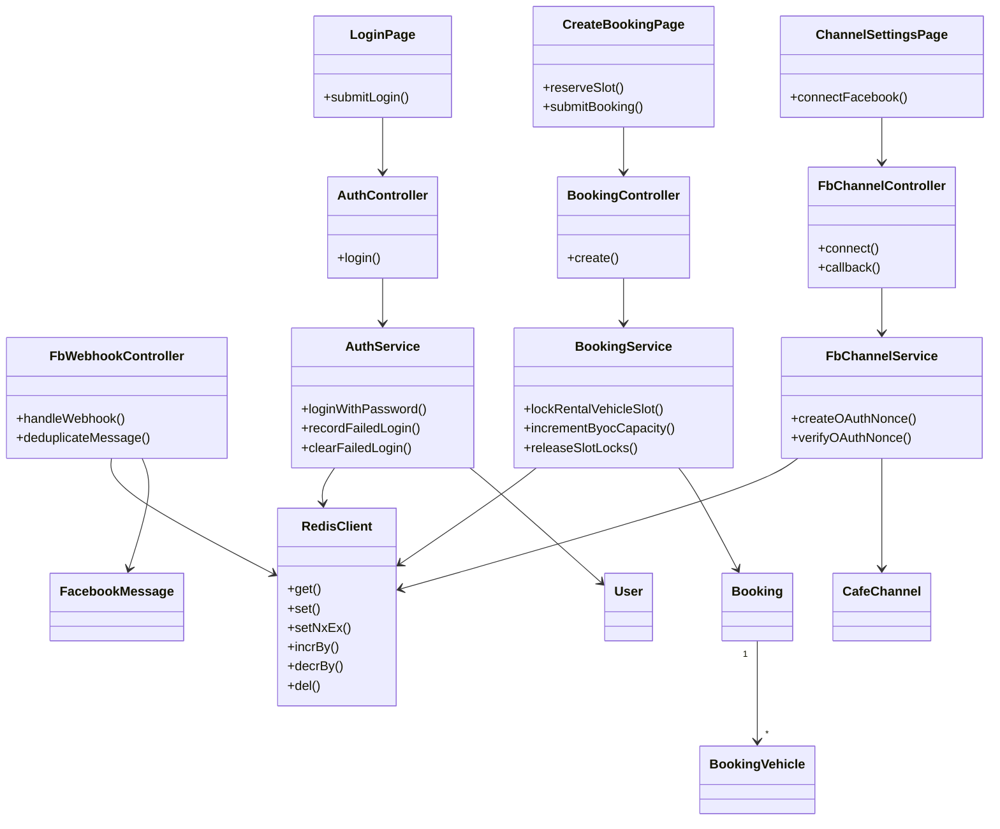

# Sequence Flow: Redis Usage

Mô tả toàn bộ các điểm Redis được sử dụng trong RCField backend — gồm 5 use case: brute-force guard (auth), slot lock xe (RENTAL), BYOC capacity counter, Facebook OAuth nonce, và Facebook Messenger session + dedup.

> Dữ liệu được phân tích từ `src/config/redis.ts`, `src/services/auth.service.ts`, `src/services/booking.service.ts`, `src/services/fb-channel.service.ts`, `src/controllers/fb-webhook.controller.ts`.
> See **Reference** at the bottom for legend.

---

## 0. Identifiers

| Field | Value | Notes |
|-------|-------|-------|
| Key — Auth | `auth:failed:{email}` | Counter, TTL từ `BRUTE_FORCE_TTL`, tự xóa sau login thành công |
| Key — Vehicle lock | `slot:lock:vehicle:{vehicleId}:{slotStart.getTime()}` | SET NX EX, TTL = `env.platform.slotLockTtlSeconds` |
| Key — BYOC counter | `slot:byoc:{cafeId}:{slotStart.getTime()}` | INCRBY/DECRBY counter |
| Key — FB nonce | `oauth:fb:nonce:{nonce}` | TTL = `NONCE_TTL`, xóa ngay sau verify |
| Key — FB session | `fb:cafe-session:{pageId}:{psid}` | TTL = 86400s (24h) |
| Key — FB dedup | `facebook:processed:{pageId}:{mid}` | TTL = 300s, SET NX |
| Endpoint | `POST /api/v1/auth/login` | `auth.controller` → `authService.loginWithPassword` |
| Endpoint | `POST /api/v1/bookings` | `booking.controller` → `createBooking` |
| Endpoint | `GET /api/v1/channels/facebook/auth-url` | `fb-channel.service.buildAuthUrl` |
| Endpoint | `GET /api/v1/channels/facebook/callback` | `fb-channel.service.handleCallback` |
| Endpoint | `POST /api/v1/webhook/facebook` | `fb-webhook.controller.handleWebhook` |
| Brute-force max | `BRUTE_FORCE_MAX = 5` lần sai | Sau đó trả 403 ACCOUNT_LOCKED |

---

## 1. Auth — Brute Force Protection

Mỗi lần đăng nhập sai, Redis tăng counter theo email. Đạt ngưỡng 5 lần → block không cần kiểm tra DB. Đăng nhập thành công → xóa counter.

> **Lưu ý:** Counter tự expire sau `BRUTE_FORCE_TTL` giây → user tự unlock theo thời gian mà không cần admin can thiệp.

---

## 2. Booking — Vehicle Slot Lock (RENTAL mode)

Khi tạo booking RENTAL, mỗi xe được "khóa" trong Redis bằng atomic `SET NX EX`. Nếu xe đã bị lock bởi booking khác cùng slot → từ chối ngay (không cần DB query).

> **Key pattern:** `slot:lock:vehicle:{vehicleId}:{slotStart.getTime()}` — TTL bằng `env.platform.slotLockTtlSeconds`.
> Lock bị xóa khi: (1) booking bị CANCELLED/TIMEOUT, (2) TTL tự hết hạn.

---

## 3. Booking — BYOC Capacity Counter

BYOC (Bring Your Own Car) không lock xe cụ thể mà track tổng số người chơi trên một slot của cafe. Dùng INCRBY/DECRBY atomic để tránh race condition.

> **Lưu ý:** Khác với vehicle lock, BYOC counter dùng `INCRBY` thay vì `SET NX` vì nhiều participant có thể cùng book vào một slot (miễn tổng ≤ capacity).

---

## 4. Facebook Channel — OAuth Nonce

Khi Provider kết nối Facebook Page, backend tạo một `nonce` ngẫu nhiên lưu vào Redis để verify callback. Bảo vệ chống CSRF trong OAuth flow.

> **Security:** Nonce là single-use — bị xóa ngay sau verify đầu tiên, không thể replay.

---

## 5. Facebook Messenger — Session + Message Dedup

Mỗi lần user nhắn tin trên Messenger, backend cần biết họ đang hỏi về chi nhánh nào. Redis lưu mapping `psid → cafeId` 24h. Ngoài ra, dedup bằng `message.mid` để tránh xử lý trùng webhook.

> **Session lifecycle:** 
> - Tạo: lần đầu nhắn tin hoặc sau khi chọn cafe
> - Reset: user gõ "đổi chi nhánh" / "chọn lại chi nhánh" / "change branch" 
> - TTL: tự expire sau 24h idle

---

## 6. Decision Logic Summary

| Tình huống | Redis operation | Kết quả |
|-----------|----------------|---------|
| Login sai lần 1–4 | `INCR auth:failed:{email}` + `EXPIRE` | 401, counter tăng |
| Login sai lần 5+ | `GET` → count ≥ 5 | 403 block, không tra DB |
| Login đúng | `DEL auth:failed:{email}` | Token issued |
| Tạo booking RENTAL, xe available | `SET NX` → "OK" | Lock thành công, tạo booking |
| Tạo booking RENTAL, xe đã bị lock | `SET NX` → null | 409, rollback các lock trước |
| Tạo booking BYOC, còn chỗ | `INCRBY` → ≤ capacity | Tạo booking |
| Tạo booking BYOC, hết chỗ | `INCRBY` → > capacity → `DECRBY` | 409 SLOT_FULL |
| Cancel / NO_SHOW booking | `DEL` vehicle keys hoặc `DECRBY` BYOC | Giải phóng slot |
| Facebook OAuth flow | `SET` nonce → `GET` → `DEL` | Single-use CSRF token |
| Messenger message đầu tiên | `GET session` → null → `SET session` | Session init |
| Messenger message tiếp theo | `GET session` → cafeId | Dùng cache, không tra DB |
| Messenger duplicate webhook | `SET NX dedup` → null | Skip xử lý |
| User reset session | `DEL session` | Prompt chọn chi nhánh lại |

---

## 7. Key Files

### Backend (`rcfeild-be/src`)

| Area | Path | Note |
|------|------|------|
| Config | `src/config/redis.ts` | Export `redis` (ioredis prod / MemoryRedis test) |
| Auth brute-force | `src/services/auth.service.ts` | `loginWithPassword()` lines 119–159 |
| Slot lock | `src/services/booking.service.ts` | `acquireVehicleLock()`, `releaseVehicleLocks()` lines 73–88 |
| BYOC counter | `src/services/booking.service.ts` | `acquireByocSlot()`, `releaseByocSlot()` lines 90–117 |
| FB OAuth nonce | `src/services/fb-channel.service.ts` | `buildAuthUrl()`, `parseAndVerifyState()` |
| FB Webhook | `src/controllers/fb-webhook.controller.ts` | `handleWebhook()` — session + dedup |

---

## 8. Open Questions

1. **Vehicle lock TTL vs booking payment timeout**: `slotLockTtlSeconds` và payment timeout của VNPay cần khớp nhau — nếu TTL Redis ngắn hơn, xe có thể bị unlock trước khi payment confirm.
2. **BYOC counter drift**: Nếu server restart mà Redis mất dữ liệu (non-persistent), counter sẽ reset về 0 → có thể overbooking. Cần đánh giá có cần Redis persistence (`appendonly yes`) không.
3. **`MemoryRedis` thiếu `incrby`/`decrby`**: Class `MemoryRedis` (dùng trong test) không implement `incrby`/`decrby` — BYOC flow trong test environment có thể không cover đầy đủ.

---

## 9. Application Flow Overview

---

## 10. Class Diagram: Redis Usage

---

## Reference

### Source files analyzed (via codegraph)
- `src/config/redis.ts` — cấu hình Redis, `MemoryRedis` fallback cho test
- `src/services/auth.service.ts` — brute-force counter
- `src/services/booking.service.ts` — vehicle lock + BYOC counter
- `src/services/fb-channel.service.ts` — OAuth nonce
- `src/controllers/fb-webhook.controller.ts` — session + message dedup

### Legend
- **B** = `rcfeild-be` Express + TypeScript backend
- **R** = Redis (ioredis in production, `MemoryRedis` in `NODE_ENV=test`)
- **DB** = PostgreSQL via TypeORM
- `-->>` = response / return value
- `-->>`  = async return
- `->>` = request / call
- `NX` = SET only if Not eXists (atomic)
- `EX {n}` = expire in n seconds

---

*Last updated: 2026-06-16 · Based on: codegraph exploration của rcfeild-be codebase*
