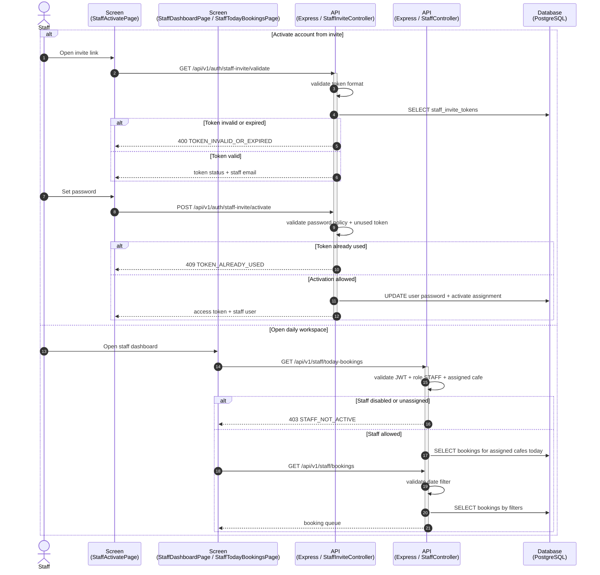
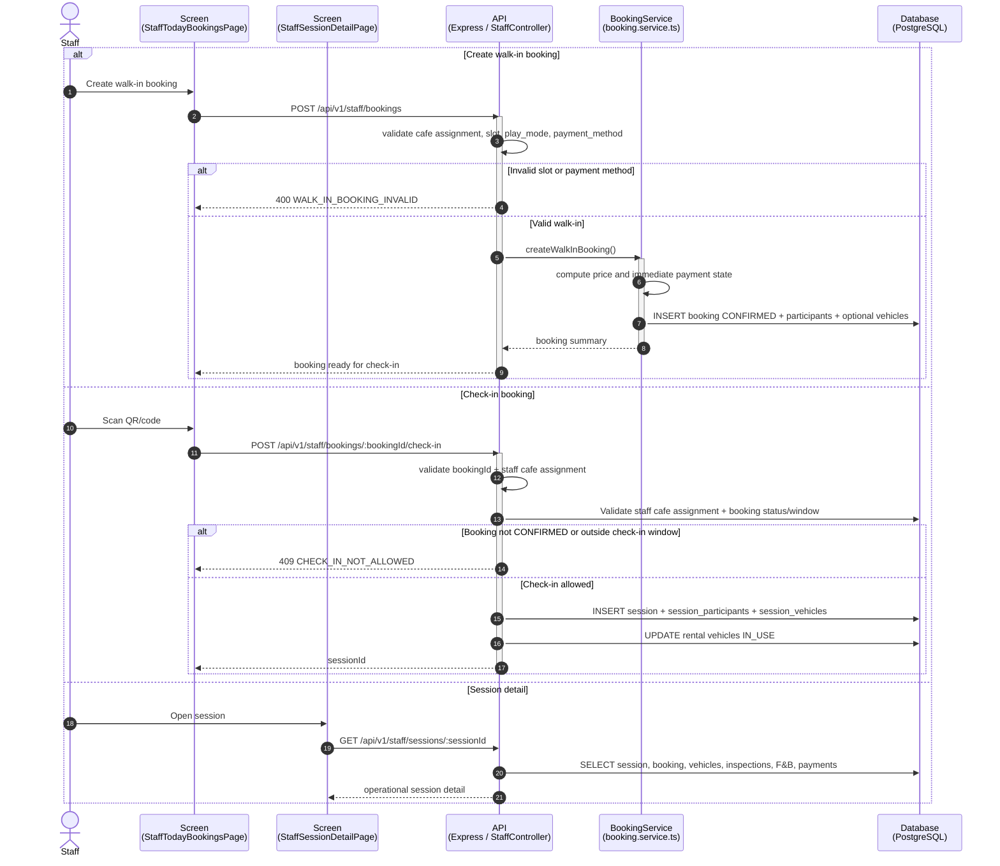
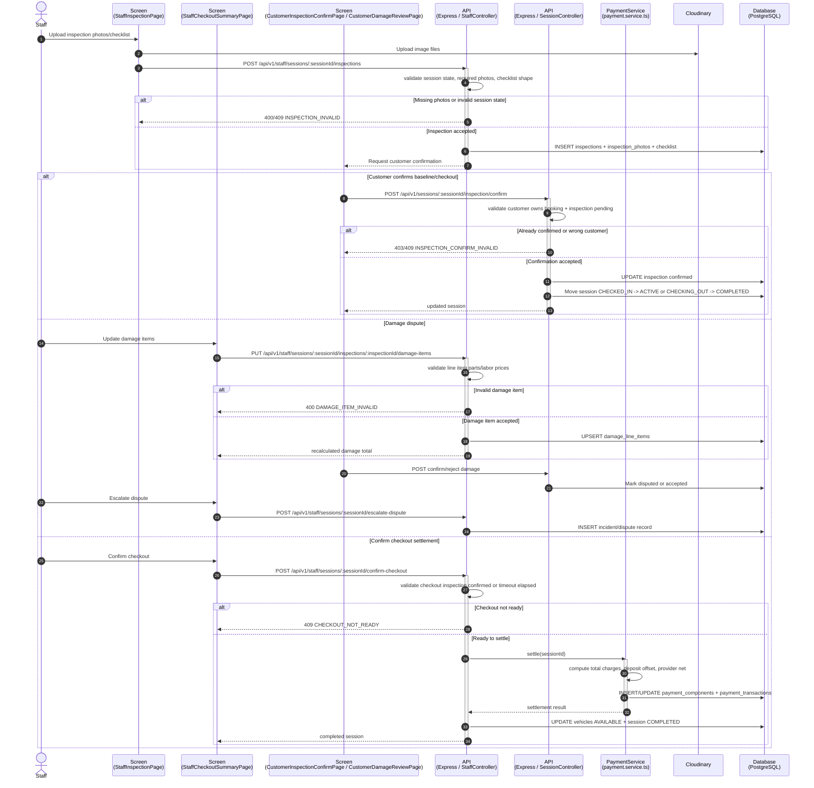
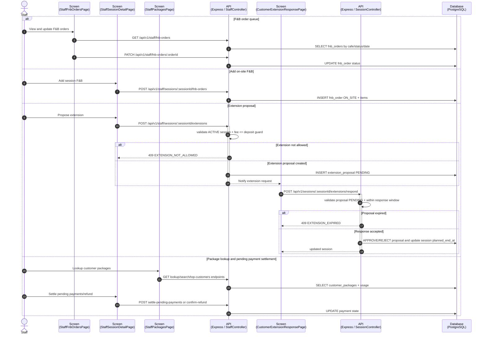
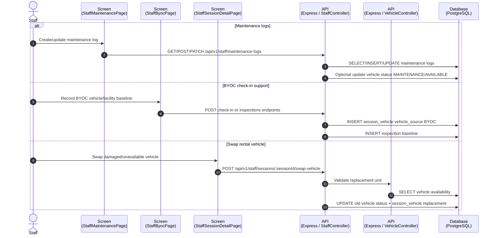
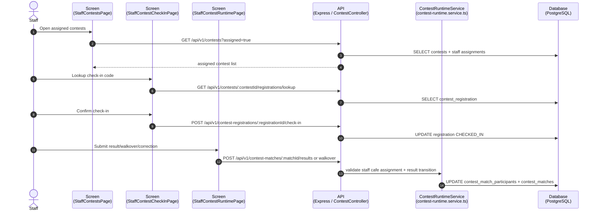
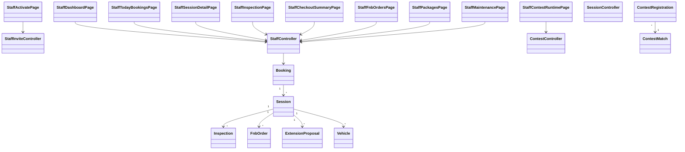

# Sequence Flow: Staff Operations

**Last updated:** 2026-08-06

Coverage theo controller: `staff`, `staff-invite`, `session`, `booking`, `upload`, `contest`, mot phan `vehicle`, `customer-package`, `notification`.

---

## 1. Staff Activation and Daily Workspace

---

## 2. Walk-in Booking, Check-in and Session Detail

---

## 3. Inspection, Damage, Checkout and Customer Confirmation

---

## 4. F&B, Extensions, Packages and Pending Payments

---

## 5. Maintenance, BYOC and Vehicle Swap

---

## 6. Staff Contest Event Day

---

## 7. Class Diagram: Staff Operations

