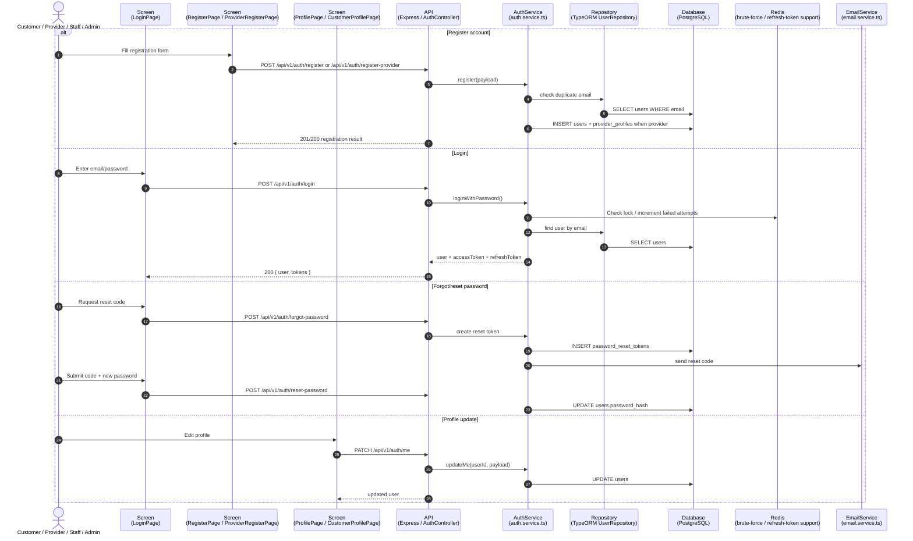
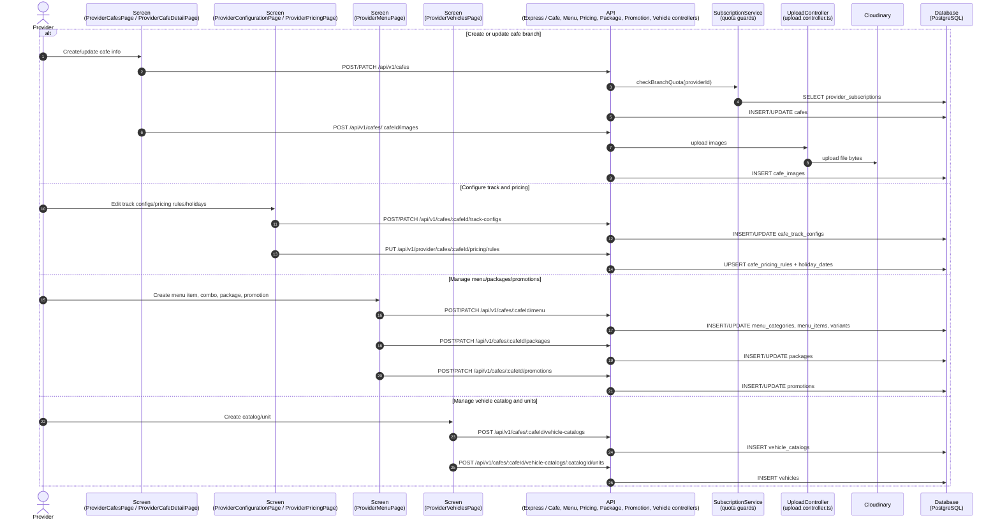
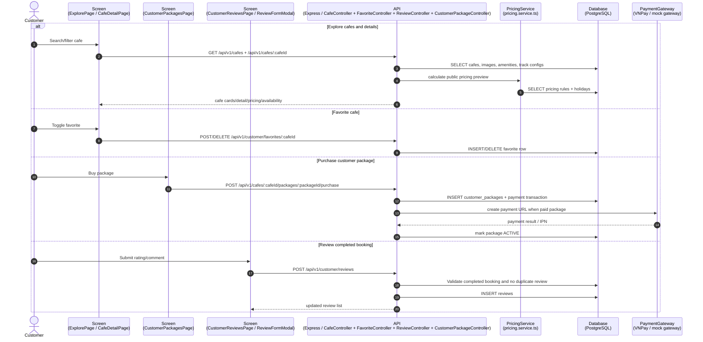
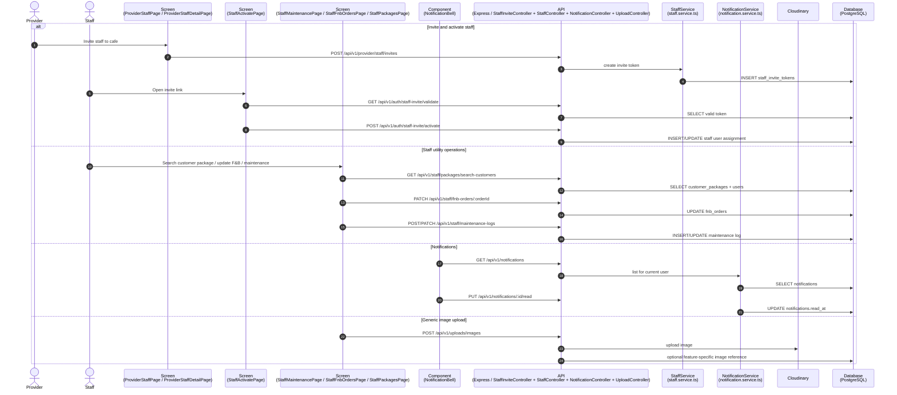

# Sequence Flow: Supporting Operations

**Last updated:** 2026-08-06

Tai lieu nay gom cac flow ho tro dang co trong `rcfield-fe/src/app/router/routes.tsx` va `rcfield-be/src/routes/index.ts` nhung khong duoc tach thanh file rieng vi chu yeu la CRUD/utility. Cac flow lon nhu Booking, Contest, Provider Subscription, RAG Chat, Redis va Revenue nam o cac file sequence rieng.

---

## 1. Auth, Profile and Password Reset

---

## 2. Cafe, Menu, Pricing, Package, Promotion and Vehicle Catalog Management

---

## 3. Customer Discovery, Favorites, Reviews and Packages

---

## 4. Staff Invitation, Operations Utilities, Notifications and Uploads

---

## 5. Class Diagram: Supporting Operations

```mermaid
classDiagram
    class LoginPage
    class ProfilePage
    class ProviderCafesPage
    class ProviderMenuPage
    class ProviderVehiclesPage
    class ExplorePage
    class CustomerPackagesPage
    class ProviderStaffPage
    class StaffActivatePage
    class NotificationBell
    class AuthController
    class CafeController
    class MenuController
    class PricingController
    class VehicleCatalogController
    class FavoriteController
    class ReviewController
    class CustomerPackageController
    class StaffInviteController
    class StaffController
    class NotificationController
    class AuthService
    class SubscriptionService
    class PricingService
    class StaffService
    class NotificationService
    class User
    class Cafe
    class MenuItem
    class Package
    class Promotion
    class VehicleCatalog
    class Vehicle
    class CustomerPackage
    class Review
    class Favorite
    class Notification

    LoginPage --> AuthController
    ProfilePage --> AuthController
    ProviderCafesPage --> CafeController
    ProviderMenuPage --> MenuController
    ProviderVehiclesPage --> VehicleCatalogController
    ExplorePage --> CafeController
    CustomerPackagesPage --> CustomerPackageController
    ProviderStaffPage --> StaffInviteController
    StaffActivatePage --> StaffInviteController
    NotificationBell --> NotificationController
    AuthController --> AuthService
    CafeController --> SubscriptionService
    PricingController --> PricingService
    StaffInviteController --> StaffService
    NotificationController --> NotificationService
    Cafe "1" --> "*" MenuItem
    Cafe "1" --> "*" Package
    Cafe "1" --> "*" Promotion
    Cafe "1" --> "*" VehicleCatalog
    VehicleCatalog "1" --> "*" Vehicle
    User "1" --> "*" CustomerPackage
    User "1" --> "*" Review
    User "1" --> "*" Favorite
    User "1" --> "*" Notification
```

