# Functional Requirements Document: RCField Platform

**Tài liệu Đặc tả Yêu cầu Chức năng**  
**Trạng thái tài liệu:** Active (Hỗ trợ Toàn bộ Hoạt động Hệ thống)  

---

## 3. Functional Requirements

### 3.1 System Functional Overview
The RCField Platform is organized into seven core functional modules. The diagram below illustrates how actors interact with these functional domains:

```mermaid
graph TD
    subgraph Users & System Setup
        FR01["Guest Reg & Provider Onboard"]
        FR02["Permission Evaluation"]
        FR03["Get Permissions Snapshot"]
        FR04["Manage Cafe/Branch Details"]
        FR05["Fleet Vehicle Management"]
        FR06["F&B Menu Management"]
        FR07["Promotion Configuration"]
    end
    subgraph Booking Modes & Payments
        FR08["Create Track Booking Single"]
        FR09["Booking via Package Slots"]
        FR10["Recurring Subscription"]
        FR11["F&B Pre-order Booking"]
        FR12["Payment Gateway VNPay"]
        FR13["Booking Cancellations"]
    end
    subgraph On-Site Field Operations
        FR14["Check-in & Session Init"]
        FR15["Check-in Handover Inspection"]
        FR16["On-site F&B Ordering"]
        FR17["Slot Extension Proposal"]
        FR18["Check-out & Damage Check"]
        FR19["Dispute & Incident Log"]
        FR20["Dispute Admin Arbitration"]
        FR21["Financial Settlement"]
    end
    subgraph Tournament & Contests
        FR22["Create & Configure Contest"]
        FR23["Register & Check-in Contest"]
        FR24["Generate Match Brackets"]
        FR25["Record Results & Advance"]
        FR26["Publish Leaderboard"]
    end
    subgraph Financials & AI
        FR27["Payout Profile Setup"]
        FR28["Revenue & Analytics Dashboard"]
        FR29["Settlement Batch Report"]
        FR30["AI Document Ingestion"]
        FR31["Branch AI Chatbot RAG"]
    end

    Customer --> FR08
    Customer --> FR09
    Customer --> FR10
    Customer --> FR12
    Customer --> FR13
    Customer --> FR17
    Customer --> FR23
    Customer --> FR31

    Staff --> FR14
    Staff --> FR15
    Staff --> FR16
    Staff --> FR17
    Staff --> FR18
    Staff --> FR19
    Staff --> FR23
    Staff --> FR25

    Provider --> FR04
    Provider --> FR05
    Provider --> FR06
    Provider --> FR07
    Provider --> FR22
    Provider --> FR24
    Provider --> FR27
    Provider --> FR28
    Provider --> FR30

    Admin --> FR01
    Admin --> FR02
    Admin --> FR07
    Admin --> FR20
    Admin --> FR29
```



---

### 3.2 Users & System Setup Requirements

#### FR-01: Guest Registration & Provider Onboarding
* **Name:** Guest Registration & Provider Onboarding
* **Actor:** Guest, System Admin
* **Trigger:** A prospective business partner submits an application to register as a Provider on the platform.
* **Description:** Handles user registration, gathers business profile information (tax ID, brand name, primary contacts), and submits it to the System Admin for approval.
* **Pre-condition:**
  * Guest is not logged in or has a basic unassigned account.
* **Normal Flow:**
  1. Guest fills out the "Register as Provider" form (Brand name, Business license number, Contact email, Phone, Bank Account info).
  2. The system validates the inputs and creates a Provider record in `PENDING_ONBOARD` status.
  3. System Admin receives a notification in the Admin dashboard.
  4. System Admin reviews the documentation and clicks "Approve Onboarding".
  5. The system transitions the Provider state to `ACTIVE` and generates their initial Tenant credentials, assigning the user the `PROVIDER_OWNER` role.
* **Alternative Flow:**
  * If the credentials or business documents are invalid, System Admin rejects the application, entering a reason. The system sends a rejection email.
* **Post-condition:**
  * Provider tenant is created, enabling the provider owner to configure branch cafes.
* **Exception:**
  * Duplicate business license number or brand name.
* **Priority:** High
* **Frequency of Use:** Low
* **Assumption:** None.
* **Business Rule:** N/A

#### FR-02: Permission Evaluation Engine
* **Name:** Permission Evaluation
* **Actor:** Guest, Customer, Staff, Provider, System Admin
* **Trigger:** Caller accesses a protected API endpoint or dashboard route.
* **Description:** Evaluates the caller's effective roles and permissions based on JWT claims and RBAC guards to decide whether access should be granted or denied.
* **Pre-condition:**
  * The caller must be authenticated and present a valid JWT.
  * The endpoint has defined authorization requirements.
* **Normal Flow:**
  1. Caller sends a request to a protected endpoint.
  2. The system decodes and validates the caller's JWT token.
  3. The system extracts the user's role and scope (e.g., `cafe_id` or `provider_id`).
  4. The system checks role-permissions tables.
  5. The system compares required permissions with the user's effective permissions.
  6. The system permits access and executes the business logic.
* **Alternative Flow:**
  * If the route/endpoint is public, the permission check is bypassed.
* **Post-condition:**
  * Secure access control is applied consistently; unauthorized requests are rejected with a HTTP 403 Forbidden code.
* **Exception:**
  * Invalid/Expired JWT Token (returns HTTP 401 Unauthorized).
  * Missing cafe assignment for Staff acting in a local branch.
* **Priority:** Critical
* **Frequency of Use:** Very Frequent
* **Assumption:** The RBAC mappings are loaded in memory or cached.
* **Business Rule:** BR-CT-010, BR-CT-011, BR-CT-012

#### FR-03: Get Personal Profile & Permissions Snapshot
* **Name:** Get Personal Profile & Permissions Snapshot
* **Actor:** Customer, Staff, Provider, System Admin
* **Trigger:** The client application requests the authenticated user's profile and permission scope to render the appropriate navigation items and interface.
* **Description:** Retrieves the caller's effective permissions, including associated tenant and branch scopes.
* **Pre-condition:**
  * User is authenticated.
* **Normal Flow:**
  1. User logs in or refreshes the page, triggering the handshake request.
  2. The system resolves the user's roles within the system.
  3. The system lists all specific actions the user is authorized to perform.
  4. If the user is a Staff, the system appends the list of assigned `cafe_id`s.
  5. The system returns a JSON payload containing the user's profile, role, and permission list.
* **Alternative Flow:**
  * None.
* **Post-condition:**
  * The client-side state manager (Zustand) receives and stores the permission snapshot for UI rendering.
* **Exception:**
  * Network failure during API request.
* **Priority:** High
* **Frequency of Use:** Frequent
* **Assumption:** None.
* **Business Rule:** N/A

#### FR-04: Manage Cafe / Branch Details
* **Name:** Manage Cafe / Branch Details
* **Actor:** Provider
* **Trigger:** Provider needs to add a new location or edit an existing cafe's operational parameters.
* **Description:** Allows the Provider to configure local parameters, such as address, operating hours, slot boundaries, track types, track capacities, and BYOC capacity limits.
* **Pre-condition:**
  * Provider status is `ACTIVE`.
* **Normal Flow:**
  1. Provider navigates to "My Cafes" and clicks "Add Cafe".
  2. Provider enters cafe details: Name, Address, Phone, Operating Hours (e.g. 08:00 - 22:00), Slot Duration (e.g. 60 minutes), Track Types (DRIFT, CIRCUIT, OFFROAD), Track Capacity, and BYOC capacity limit.
  3. Provider submits the form.
  4. The system validates configurations and saves the new `Cafe` record.
* **Alternative Flow:**
  * Provider selects an existing cafe, updates parameters (such as temporary closure windows), and saves.
* **Post-condition:**
  * Cafe is added or updated. Booking slots are updated to align with the new capacity and slot duration limits.
* **Exception:**
  * Overlapping operating hours or negative capacity limits.
* **Priority:** High
* **Frequency of Use:** Occasional
* **Assumption:** Slot sizes are standardized in minutes.
* **Business Rule:** BR-BK-000-A to BR-BK-000-I

#### FR-05: Fleet (Rental Vehicle) Management
* **Name:** Fleet (Rental Vehicle) Management
* **Actor:** Provider, Staff
* **Trigger:** Provider registers a new rental vehicle or updates a vehicle's maintenance status.
* **Description:** Manages the branch's fleet list, configuring rental tiers (Standard, Premium, Restricted), hourly rental fee, security deposits, compatible tracks, and status.
* **Pre-condition:**
  * Cafe branch exists.
* **Normal Flow:**
  1. Provider adds a vehicle: Model Name, Scale, Brand, Image, Hourly Rate, Security Deposit, Compatible Tracks, and Asset Tier.
  2. System saves the vehicle in `AVAILABLE` status.
  3. Staff or Provider can toggle the status to `MAINTENANCE` if the car is broken, or `RETIRED` if it is permanently decommissioned.
* **Alternative Flow:**
  * If a vehicle's status is changed to `MAINTENANCE` or `RETIRED`, the system automatically flags any future booking conflicts that rely on this specific vehicle.
* **Post-condition:**
  * Vehicle list is updated. Cars in `MAINTENANCE` or `RETIRED` are immediately blocked from future customer bookings.
* **Exception:**
  * Negative deposit or hourly rates are rejected.
* **Priority:** High
* **Frequency of Use:** Occasional
* **Assumption:** Each vehicle is bound to exactly one Cafe location.
* **Business Rule:** BR-FL-001 to BR-FL-012

#### FR-06: F&B Menu Management
* **Name:** F&B Menu Management
* **Actor:** Provider, Staff
* **Trigger:** Provider wants to update the food and beverage items available for pre-order and on-site purchase at a branch.
* **Description:** Manages the menu catalog for a specific cafe branch, including price, image, category, and availability status.
* **Pre-condition:**
  * Cafe branch exists.
* **Normal Flow:**
  1. Provider opens "F&B Menu Manager" for a cafe.
  2. Provider adds item: Name, Category (Drinks, Snacks, Meals), Price, Image.
  3. System saves the menu item.
  4. Staff can toggle the "Available" switch to temporarily hide items when out of stock.
* **Alternative Flow:**
  * None.
* **Post-condition:**
  * Menu catalog is updated. Deactivated items are hidden from Customer app bookings immediately.
* **Exception:**
  * Negative prices are rejected.
* **Priority:** Medium
* **Frequency of Use:** Occasional
* **Assumption:** None.
* **Business Rule:** BR-FB-008, BR-FB-009

#### FR-07: Promotion / Voucher Code Configuration
* **Name:** Promotion / Voucher Code Configuration
* **Actor:** Provider, Admin
* **Trigger:** Provider or Admin wants to configure a promotion code to incentivize bookings.
* **Description:** Configures discount vouchers with attributes: code, discount type (Percent or Fixed), discount value, validity window, applicable booking modes (ALL, RENTAL, BYOC), minimum subtotal, usage caps, and cafe scope.
* **Pre-condition:**
  * Provider or Admin is authenticated.
* **Normal Flow:**
  1. Provider clicks "Create Promo".
  2. Provider inputs: Code (e.g. SUMMER20), Discount Type (PERCENT), Discount Value (20), Max Discount Amount (100,000 VND), Validity Date Range, Cafe Scope (e.g. Local to Cafe A, or Global [Admin only]), Minimum booking subtotal (e.g. 200,000 VND), Max total uses, and Max uses per customer.
  3. The system saves the promotion as active.
* **Alternative Flow:**
  * Admin creates a Global promotion, leaving `cafe_id` empty. This code can be redeemed at any cafe.
* **Post-condition:**
  * Voucher is saved and ready for customer validation at checkout.
* **Exception:**
  * Duplicate coupon codes are blocked.
* **Priority:** Medium
* **Frequency of Use:** Occasional
* **Assumption:** Promotion discount does not apply to security deposits.
* **Business Rule:** BR-PR-001, BR-PR-002

---

### 3.3 Booking Modes & Payments Requirements

#### FR-08: Create Track Booking (Single Mode)
* **Name:** Create Track Booking (Single Mode)
* **Actor:** Customer, Staff (on behalf of Walk-in)
* **Trigger:** Customer selects a cafe, track type, slot start, duration, vehicle source (Rental or BYOC), and optional F&B.
* **Description:** Validates slot availability, checks customer eligibility, snapshots current prices, and creates a tentative booking record in `PENDING` status.
* **Pre-condition:**
  * Customer has logged in and has an active account.
  * The target cafe's status is `ACTIVE`.
* **Normal Flow:**
  1. Customer selects a track type (Drift, Circuit, Offroad) and target cafe.
  2. Customer selects a slot start and duration (e.g. 2 hours).
  3. Customer selects the vehicle option: Rental (chooses available cars from fleet) or BYOC (enters personal car data).
  4. Customer optionally adds F&B items to pre-order.
  5. The system verifies slot availability and vehicle compatibility.
  6. The system snapshots all pricing information (rates, vehicle fees, deposit values, platform fee percentages).
  7. The system creates a booking in `PENDING` status.
* **Alternative Flow:**
  * **Walk-in Booking:** Staff selects "Manual Booking" at the counter, inputs customer walk-in details, bypasses pre-payment, and directly confirms the booking.
* **Post-condition:**
  * A `Booking` record is saved in the DB, and the slot is locked in Redis for 30 minutes.
* **Exception:**
  * Booking vehicle is already reserved for the same slot (returns slot conflict error).
  * Selected cafe is closed or inactive.
* **Priority:** Critical
* **Frequency of Use:** Very Frequent
* **Assumption:** Pricing configurations do not change during the booking session.
* **Business Rule:** BR-BK-000-A to BR-BK-000-I, BR-BK-001, BR-BK-002, BR-BK-003, BR-BK-004, BR-BK-005, BR-BL-001, BR-BL-002, BR-BL-010

#### FR-09: Booking via Package Slots (Package Mode)
* **Name:** Booking via Package Slots (Package Mode)
* **Actor:** Customer
* **Trigger:** Customer uses a previously purchased prepaid package to book track slots.
* **Description:** Deducts slots from the customer's active package balance, checks slot availability, and creates a booking record.
* **Pre-condition:**
  * Customer owns an active `CustomerPackage` with a status of `ACTIVE` and `remaining_slots >= booking.slot_count`.
  * The current time is within the package validity expiration window.
* **Normal Flow:**
  1. Customer chooses "Book with Package" during checkout.
  2. System locks the `CustomerPackage` row using `SELECT FOR UPDATE` to prevent race conditions.
  3. System validates that the package is local to the cafe branch.
  4. System verifies that the package has not expired.
  5. The system creates a booking, updates `booking_mode = PACKAGE`, inserts a `PackageUsage` log, and deducts the slots: `remaining_slots -= slot_count`.
  6. If the booking requires a security deposit (e.g. for rental cars), the booking status is set to `PENDING` awaiting deposit payment; otherwise, it is set to `CONFIRMED`.
* **Alternative Flow:**
  * If the remaining slots reach 0, the system automatically transitions the package status to `DEPLETED`.
  * If the booking is canceled or payment fails, the system rolls back the deducted slots to the package and marks the `PackageUsage` as void.
* **Post-condition:**
  * Package slots are deducted and a package-linked booking is established.
* **Exception:**
  * Insufficient slots (`PACKAGE_NOT_ENOUGH_SLOTS` error).
* **Priority:** High
* **Frequency of Use:** Frequent
* **Assumption:** A package slot covers the track slot fee only; vehicle rentals, deposits, and F&B must be paid separately.
* **Business Rule:** BR-BL-020 to BR-BL-028

#### FR-10: Recurring Schedule Subscription (Subscription Mode)
* **Name:** Recurring Schedule Subscription (Subscription Mode)
* **Actor:** Customer, Scheduler (System Job)
* **Trigger:** Customer configures a recurring slot subscription; the automated system job generates bookings periodically.
* **Description:** Manages the creation of a recurring subscription schedule and automatically generates bookings based on the frequency rule, handling slot availability checks and conflict alerts.
* **Pre-condition:**
  * Customer has logged in.
* **Normal Flow:**
  1. Customer selects "Fixed Schedule Subscription", choosing a cafe, day of week, hours, track, play mode, and duration (e.g. Saturday 14:00-16:00 for 8 weeks).
  2. The system checks availability of the first occurrence and saves the `Subscription` as `ACTIVE`.
  3. Every day at midnight, the system job queries active subscriptions.
  4. For each subscription, the job calculates the next occurrence date.
  5. The job runs check on cafe operating hours, closures, slot availability, and rental vehicles.
  6. If available, the system creates a `Booking` linked to the subscription in `PENDING` or `CONFIRMED` status.
* **Alternative Flow:**
  * If a slot conflict is detected (slot already booked, track capacity full, or cafe closed), the job cancels the automatic booking generation for that day and pushes an "Action Required" notification, prompting the customer to select an alternative slot.
* **Post-condition:**
  * Recurring bookings are scheduled and tracked under the parent subscription ID.
* **Exception:**
  * Cafe is permanently closed during the subscription window (subscription is suspended).
* **Priority:** Medium
* **Frequency of Use:** Occasional
* **Assumption:** The recurring billing logic is simulated or handled via separate single booking payments.
* **Business Rule:** BR-BL-030 to BR-BL-036

#### FR-11: Booking Pre-orders for F&B
* **Name:** Booking Pre-orders for F&B
* **Actor:** Customer
* **Trigger:** Customer adds items from the F&B menu while making a track booking.
* **Description:** Consolidates track booking fees, rental fees, and pre-ordered food & beverage prices into a single payment transaction.
* **Pre-condition:**
  * Track booking is being created.
* **Normal Flow:**
  1. During the booking step, customer views the cafe's F&B catalog.
  2. Customer selects items and quantities.
  3. The system appends the F&B items to the booking data, generating a `FnbOrder(type=PRE_ORDER)`.
  4. The system calculates the consolidated total: `slot_fee + rental_fee + F&B_preorder_fee + deposit`.
  5. The system generates a single payment transaction.
* **Alternative Flow:**
  * None.
* **Post-condition:**
  * A pre-ordered F&B item list is attached to the booking, ready for fulfillment at check-in.
* **Exception:**
  * Selected F&B item is out of stock (rejected before payment).
* **Priority:** Medium
* **Frequency of Use:** Frequent
* **Assumption:** F&B pre-orders do not incur platform fee commissions (0% commission).
* **Business Rule:** BR-FB-001 to BR-FB-004, BR-BL-040 to BR-BL-042

#### FR-12: Booking Payment Gateway Integration (VNPay)
* **Name:** Booking Payment Gateway Integration (VNPay)
* **Actor:** Customer
* **Trigger:** Customer confirms booking details and initiates payment.
* **Description:** Locks the slot in Redis, redirects the user to VNPay, receives callback, and confirms the booking.
* **Pre-condition:**
  * Booking status is `PENDING`.
  * Current time is within the 30-minute expiration window.
* **Normal Flow:**
  1. The system creates a Redis lock key for the slot (or increments the BYOC counter).
  2. The system generates a VNPay payment URL for the total booking fees plus F&B pre-orders.
  3. Customer pays through VNPay gateway and is redirected back to the Web App.
  4. VNPay sends an Instant Payment Notification (IPN) callback to the Backend API.
  5. The system validates the signature, updates the booking status to `CONFIRMED`, and deletes the Redis lock key.
* **Alternative Flow:**
  * If the payment expires (30 minutes) or is rejected, the system cancels the booking and releases the slot.
* **Post-condition:**
  * Payment components (`SLOT_FEE` [HELD], `RENTAL_FEE` [HELD], `SECURITY_DEPOSIT` [HELD], `FB_PREORDER` [HELD]) are created in the ledger.
* **Exception:**
  * VNPay signature mismatch or network failure during IPN callback.
* **Priority:** Critical
* **Frequency of Use:** Very Frequent
* **Assumption:** VNPay Sandbox/Production credentials are configured correctly.
* **Business Rule:** BR-BK-006, BR-BK-006-B, BR-BK-007, BR-PM-004, BR-PM-004a, BR-PM-017, BR-BL-011

#### FR-13: Handle Booking Cancellations & Refunds
* **Name:** Handle Booking Cancellations & Refunds
* **Actor:** Customer, Provider, Staff, System Admin
* **Trigger:** Customer requests a cancellation or Staff cancels a booking.
* **Description:** Processes refunds based on the time window between the cancellation time and slot start.
* **Pre-condition:**
  * Booking status is `CONFIRMED`.
  * The session has not checked in.
* **Normal Flow:**
  1. Customer requests a booking cancellation.
  2. The system calculates the remaining time to `slot_start`.
  3. If remaining time is > 24 hours, refund 100% of Slot Fee, Rental Fee, and Security Deposit.
  4. If remaining time is 12–24 hours, penalty is 50% of Slot Fee; refund 50% of Slot Fee, 100% of Rental Fee, and 100% of Deposit.
  5. If remaining time is < 12 hours, penalty is 100% of Slot Fee; refund 0% of Slot Fee, 100% of Rental Fee, and 100% of Deposit.
  6. The system issues refund orders via VNPay API and cancels the booking.
* **Alternative Flow:**
  * **Provider Cancellation:** If the Provider or Staff cancels the booking, 100% of all fees and deposits are refunded immediately, regardless of the time window.
  * **No-Show Cancellation:** If a booking remains `CONFIRMED` and the customer does not check in within 30 minutes after `slot_start`, the cron job auto-cancels it, charging 100% of the Slot Fee as a penalty, and refunding the Rental Fee and Deposit.
* **Post-condition:**
  * Booking status is set to `CANCELLED`, and updated ledger entries are recorded.
* **Exception:**
  * Refund API request fails on VNPay gateway.
* **Priority:** High
* **Frequency of Use:** Occasional
* **Assumption:** The server system time is synchronized.
* **Business Rule:** BR-BK-008 to BR-BK-013, BR-PM-010, BR-PM-011, BR-PM-012

---

### 3.4 On-Site Field Operations Requirements

#### FR-14: Staff Check-in & Session Initialization
* **Name:** Staff Check-in & Session Initialization
* **Actor:** Staff
* **Trigger:** Customer arrives at the branch and displays their booking QR code or code.
* **Description:** Scans the QR code, verifies booking eligibility, check-in window compliance, and initializes the playing session record.
* **Pre-condition:**
  * Booking status is `CONFIRMED`.
* **Normal Flow:**
  1. Customer presents the check-in QR code or booking reference.
  2. Staff scans/enters the code in the Staff Portal.
  3. The system checks if the booking belongs to the Staff's assigned Cafe.
  4. The system validates the check-in time window (e.g. within 15 minutes before or up to 30 minutes after slot start).
  5. System validates that booking has not been checked in already.
  6. System creates a `Session` record in `CHECKED_IN` status, listing actual participants.
* **Alternative Flow:**
  * If the check-in is earlier than 15 minutes, the system blocks the action unless overridden by manager access.
  * If check-in is later than 30 minutes, the booking is already auto-canceled as a `NO_SHOW` (FR-13) and check-in is rejected.
* **Post-condition:**
  * A `Session` is created in `CHECKED_IN` status.
* **Exception:**
  * Staff is not assigned to the cafe (returns authorization error).
* **Priority:** Critical
* **Frequency of Use:** Very Frequent
* **Assumption:** None.
* **Business Rule:** BR-BL-003, BR-BL-012, BR-BL-013, BR-BL-080 to BR-BL-083

#### FR-15: Check-in Handover Inspection (Evidence Baseline)
* **Name:** Check-in Handover Inspection (Evidence Baseline)
* **Actor:** Staff, Customer
* **Trigger:** Staff initiates the pre-play vehicle handover check.
* **Description:** Captures exactly 4-angle photos of the rental vehicle, logs pre-existing scratches or issues, and secures customer approval to activate the session.
* **Pre-condition:**
  * Session status is `CHECKED_IN`.
* **Normal Flow:**
  1. Staff inspects the rental vehicle and captures exactly 4 photos (Front, Back, Left, Right).
  2. Staff fills out the checklist (e.g. structural cracks, motor condition, battery secure).
  3. Staff submits the check-in inspection form.
  4. The system uploads photos to Cloudinary and saves the `Inspection` record linked to the session, setting `pre_existing_flag = true` for any identified issues.
  5. The system sends a verification link to the Customer.
  6. Customer reviews the photos/checklist and clicks "Confirm Handover".
  7. The session transitions to `ACTIVE`, and the vehicle status changes to `IN_USE`.
* **Alternative Flow:**
  * **Auto-Confirm Timeout:** If the customer fails to confirm or reject within 15 minutes, the system auto-approves the baseline checklist, starting the session.
  * **BYOC Check-in:** Staff checks that the customer's vehicle meets safety rules (battery strapped, weight limits). No rental vehicle status is changed.
* **Post-condition:**
  * An `ACTIVE` session is initialized with a validated check-in baseline.
* **Exception:**
  * Uploading fewer than 4 photos is blocked.
* **Priority:** Critical
* **Frequency of Use:** Very Frequent
* **Assumption:** Cloudinary is online and responsive.
* **Business Rule:** BR-IN-001 to BR-IN-009, BR-BL-004, BR-BL-014, BR-BL-015

#### FR-16: On-site F&B Ordering
* **Name:** On-site F&B Ordering
* **Actor:** Staff
* **Trigger:** Customer requests additional food or drinks during their session at the cafe.
* **Description:** Staff logs the items in the app to record branch operations. Payment is handled directly between customer and venue (outside the platform ledger).
* **Pre-condition:**
  * Session is in `ACTIVE` or `CHECKING_OUT` status.
* **Normal Flow:**
  1. Customer orders F&B items at the counter.
  2. Staff selects the active session in the app and adds the F&B items.
  3. The system creates a `FnbOrder(type=ON_SITE)` linked to the session and booking.
  4. The system logs the item prices (snapshot).
  5. Customer pays the venue directly (cash or direct bank transfer).
  6. Staff marks the F&B order as `DELIVERED`.
* **Alternative Flow:**
  * None.
* **Post-condition:**
  * On-site F&B order is logged in the operational database for branch analytics, bypassing the platform gateway and platform commission fee.
* **Exception:**
  * Attempting to add an on-site order to a completed or canceled session.
* **Priority:** Medium
* **Frequency of Use:** Frequent
* **Assumption:** None.
* **Business Rule:** BR-FB-005 to BR-FB-007, BR-BL-050, BR-BL-051

#### FR-17: Slot Extension Proposal & Approval
* **Name:** Slot Extension Proposal & Approval
* **Actor:** Staff, Customer
* **Trigger:** Staff proposes a slot extension on behalf of the customer playing on the track.
* **Description:** Requests a session extension, verifies pricing limits, and adjusts the planned end time.
* **Pre-condition:**
  * Session is in `ACTIVE` status.
* **Normal Flow:**
  1. Staff inputs the extension duration (e.g., 30 minutes) and submits the proposal.
  2. The system checks availability of the track and vehicles.
  3. The system calculates the extension fee.
  4. The system validates that `cumulative_extension_fees + new_extension_fee <= 50% * security_deposit`.
  5. The system sets the session status to `EXTENDING` and pushes a request to the Customer.
  6. Customer accepts the proposal.
  7. The system updates `session.planned_end_at` and records the `EXTENSION_FEE` (HELD) in the ledger.
  8. Session status returns to `ACTIVE`.
* **Alternative Flow:**
  * If the Customer rejects the proposal, the session continues to its original end time.
  * **Response Timeout:** If the customer does not respond within 10 minutes, the proposal is automatically rejected and the session returns to `ACTIVE`.
* **Post-condition:**
  * Session planned end time is extended.
* **Exception:**
  * The extension fee exceeds the 50% deposit limit (proposal rejected immediately).
* **Priority:** Medium
* **Frequency of Use:** Frequent
* **Assumption:** The track is not booked by another customer for the extension window.
* **Business Rule:** BR-EX-001 to BR-EX-005, BR-PM-005, BR-BL-060 to BR-BL-063

#### FR-18: Check-out Handover Inspection & Damage Check
* **Name:** Check-out Handover Inspection & Damage Check
* **Actor:** Staff, Customer
* **Trigger:** The slot duration ends, or the customer requests an early checkout, prompting Staff to start the checkout process.
* **Description:** Staff transitions the session to `CHECKING_OUT`, captures 4-angle post-play photos, completes the checklist, and records any new damages.
* **Pre-condition:**
  * Session is in `ACTIVE` status.
* **Normal Flow:**
  1. Staff triggers check-out. Session transitions to `CHECKING_OUT`.
  2. Staff captures exactly 4-angle checkout photos and fills in the checklist.
  3. **Case 1 (No Damage):** Staff submits the form. Customer receives checkout notification. If no objection is raised within 2 hours, the checkout is auto-confirmed, and the session is marked `COMPLETED`.
  4. **Case 2 (New Damage Found):** Staff marks damaged components, enters a description, and estimates the `damage_cost`.
  5. The system calculates: `damage_charge = damage_cost * vehicle.damage_multiplier`.
  6. Customer receives a damage notification with checkout photos and has 24 hours to confirm or file a dispute.
  7. Customer clicks "Confirm Damage Charge"; the session transitions to `COMPLETED`.
* **Alternative Flow:**
  * **Auto-Confirm Damage:** If the customer does not respond within 24 hours, the damage charge is auto-approved, and the session is set to `COMPLETED`.
* **Post-condition:**
  * The session completes and the final charges are ready to be captured.
* **Exception:**
  * Uploading fewer than 4 checkout photos is blocked.
* **Priority:** Critical
* **Frequency of Use:** Very Frequent
* **Assumption:** Photos are saved securely.
* **Business Rule:** BR-IN-010 to BR-IN-014, BR-PM-013, BR-PM-016, BR-BL-090 to BR-BL-094

#### FR-19: Dispute & Incident Logging
* **Name:** Dispute & Incident Logging
* **Actor:** Customer, Staff
* **Trigger:** Customer rejects the checkout damage charge, or an incident occurs during active play.
* **Description:** Logs a formal dispute or incident, frozen/locked payment components, and refers the case to the System Admin.
* **Pre-condition:**
  * Session status is `CHECKING_OUT` (for damage charge disputes) or `ACTIVE` (for active play incidents).
* **Normal Flow:**
  1. Customer clicks "Dispute Charge" on their checkout receipt.
  2. Customer inputs the reason for dispute and attaches any notes or evidence.
  3. The system creates a `Dispute` record linked to the booking and session, setting its status to `OPEN`.
  4. The system flags the related `SECURITY_DEPOSIT` and `DAMAGE_CHARGE` components as `ON_HOLD`.
  5. The system notifies the System Admin dashboard.
* **Alternative Flow:**
  * **Active Play Incident:** If a crash or track issue occurs during play, Staff opens the session, clicks "Log Incident", inputs details, and saves it. If it results in damage, it follows the checkout flow (FR-18).
* **Post-condition:**
  * Dispute is created and the corresponding payment components are locked in `ON_HOLD` state.
* **Exception:**
  * Attempting to open a dispute after the session status is already `COMPLETED`.
* **Priority:** High
* **Frequency of Use:** Occasional
* **Assumption:** Each booking is limited to a maximum of one dispute record.
* **Business Rule:** BR-IR-001 to BR-IR-009, BR-DI-001 to BR-DI-007

#### FR-20: Dispute Admin Arbitration
* **Name:** Dispute Admin Arbitration
* **Actor:** System Admin
* **Trigger:** System Admin opens a dispute from the Admin dashboard.
* **Description:** Allows System Admin to compare check-in and check-out photos, review notes, and make a binding decision to approve or waive the damage charge.
* **Pre-condition:**
  * Dispute record is in `OPEN` or `UNDER_REVIEW` status.
* **Normal Flow:**
  1. Admin opens the dispute detail page, displaying: Check-in photos/checklist vs Check-out photos/checklist.
  2. Admin changes status to `UNDER_REVIEW`.
  3. Admin evaluates the evidence.
  4. **Case 1 (Approve Charge):** Admin determines customer is at fault, inputs the ruling, and clicks "Resolve - Charge Customer". The system confirms the `DAMAGE_CHARGE` component and releases the hold on the remaining deposit.
  5. **Case 2 (Waive Charge):** Admin determines no customer fault (or check-in baseline photos are missing), and clicks "Resolve - Waive Charge". The system deletes the `DAMAGE_CHARGE` component and releases the full deposit for refund.
  6. The system transitions the dispute status to `RESOLVED` and session to `COMPLETED`.
* **Alternative Flow:**
  * None.
* **Post-condition:**
  * Dispute is resolved, session is marked completed, and payment components are updated for settlement.
* **Exception:**
  * System Admin connection failure.
* **Priority:** High
* **Frequency of Use:** Occasional
* **Assumption:** Admin decisions are final.
* **Business Rule:** BR-DI-004 to BR-DI-007

#### FR-21: Financial Settlement & Deposit Release
* **Name:** Financial Settlement & Deposit Release
* **Actor:** System (Payment Engine)
* **Trigger:** Session status changes to `COMPLETED`.
* **Description:** Settle all payment components associated with the session, disbursing revenue to the Provider, collecting the platform fee, and releasing/refunding the security deposit.
* **Pre-condition:**
  * Session status is `COMPLETED`.
* **Normal Flow:**
  1. The system calculates the final total charge:
     $$\text{Total Charges} = \text{SLOT\_FEE} + \text{RENTAL\_FEE} + \text{EXTENSION\_FEE} + \text{FNB\_PREORDER} + \text{DAMAGE\_CHARGE}$$
  2. The system compares the total charge against the locked `SECURITY_DEPOSIT`.
  3. If $\text{Total Charges} < \text{SECURITY\_DEPOSIT}$, the system captures the required amount and refunds the remaining deposit balance via VNPay.
  4. If $\text{Total Charges} \ge \text{SECURITY\_DEPOSIT}$, the system captures 100% of the deposit and generates a payment request for the customer to clear the remaining balance.
  5. The system calculates the platform commission fee:
     $$\text{Platform Fee} = 15\% \times (\text{SLOT\_FEE} + \text{RENTAL\_FEE} + \text{EXTENSION\_FEE} + \text{DAMAGE\_CHARGE})$$
  6. The system transfers the net revenue (disbursements minus platform fee) to the Provider's digital wallet/bank account.
* **Alternative Flow:**
  * If the session ended early, the `SLOT_FEE` is recalculated pro-rata, and the difference is refunded.
* **Post-condition:**
  * All ledger statuses for the session transition to `DISBURSED` or `REFUNDED`.
* **Exception:**
  * Banking/VNPay API gateway timeout during refund/disbursement transfer.
* **Priority:** Critical
* **Frequency of Use:** Very Frequent
* **Assumption:** Payment ledger entries are immutable.
* **Business Rule:** BR-PM-007, BR-PM-008, BR-PM-009, BR-PM-014, BR-PM-015

---

### 3.5 Tournament & Contests Requirements

#### FR-22: Create and Configure Contest
* **Name:** Create and Configure Contest
* **Actor:** Provider
* **Trigger:** Provider opens the contest management dashboard and submits a new tournament form.
* **Description:** Configures a Provider-level contest event, setting rules, formatting structure, participating branches owned by that Provider, capacity, and registration time windows.
* **Pre-condition:**
  * Provider's SaaS subscription plan supports contest management.
* **Normal Flow:**
  1. Provider creates a new contest in `DRAFT` status.
  2. Provider enters basic information (title, rules text, prizes).
  3. Provider selects one or more of their own active cafe branches to host the event.
  4. Provider configures the tournament details: format (Knockout, Multi-driver, Time Attack), driver capacity, vehicle rule (Rental Only, BYOC Only, Mixed), and registration window.
  5. Provider sets the entry fee.
  6. Provider clicks "Publish"; the contest transitions to `OPEN` status and becomes visible to the public.
* **Alternative Flow:**
  * Provider cancels the contest, shifting its state to `CANCELLED` and triggering automatic registration refunds.
* **Post-condition:**
  * Contest record is saved, published, and prepared for customer registrations.
* **Exception:**
  * Missing registration window or past date/time validation checks.
* **Priority:** High
* **Frequency of Use:** Occasional
* **Assumption:** Configuration parameters are saved in JSON format for flexibility.
* **Business Rule:** BR-CT-001, BR-CT-002, BR-CT-003, BR-CT-020

#### FR-23: Register for Contest & Staff Check-in
* **Name:** Register for Contest & Check-in
* **Actor:** Customer, Staff, Provider
* **Trigger:** Customer registers for a published contest online, or Staff checks in a registered driver at the branch.
* **Description:** Processes contest sign-ups, checks vehicle eligibility, generates a registration check-in code, and logs arrival.
* **Pre-condition:**
  * Contest status is `OPEN`.
  * The registration window is open and the driver limit is not reached.
* **Normal Flow:**
  1. Customer selects a contest, enters vehicle source (BYOC or Rental).
  2. Customer pays the entry fee (if applicable).
  3. The system creates a `ContestRegistration` record in `CONFIRMED` status and generates a check-in QR code.
  4. On event day, the driver arrives at the designated cafe.
  5. Staff scans the driver's QR code via the Staff Portal.
  6. The system verifies that the Staff is assigned to the hosting branch.
  7. The system updates the registration status to `CHECKED_IN` and logs the action in the DB audit log.
* **Alternative Flow:**
  * **BYOC Rejection:** If the driver selects BYOC, the registration is initially set to `PENDING`. The Provider reviews the car model. If rejected, the registration is set to `CANCELLED`, and the user is guided to register again using an organizer rental car.
* **Post-condition:**
  * User is marked as `CHECKED_IN` and added to the tournament roster.
* **Exception:**
  * Duplicate registration by the same user (rejected by the system).
* **Priority:** High
* **Frequency of Use:** Frequent during event periods
* **Assumption:** Network connection is active for QR scanning.
* **Business Rule:** BR-CT-030 to BR-CT-035, BR-CT-090 to BR-CT-094

#### FR-24: Tournament Match Bracket Generation
* **Name:** Tournament Match Bracket Generation
* **Actor:** Provider
* **Trigger:** Provider closes registrations and starts the scheduling process.
* **Description:** Generates match brackets based on the checked-in participant list and tournament configuration.
* **Pre-condition:**
  * Contest status is `CLOSED`.
* **Normal Flow:**
  1. Provider opens the Contest detail page and clicks "Generate Schedule".
  2. The system filters checked-in registrations.
  3. Based on the configuration `drivers_per_match` and format (e.g. Knockout 1v1 or Multi-driver heats), the system generates matches (`ContestMatch`).
  4. The system assigns lane/grid positions based on seeding.
  5. The contest transitions to `RUNNING` status.
* **Alternative Flow:**
  * **Manual Reordering:** Provider can drag and drop participants between match slots, updating lane/grid assignments without creating new registration entities.
* **Post-condition:**
  * Matches are initialized and visible in the public bracket visualization.
* **Exception:**
  * Attempting to generate brackets when there are fewer than 2 checked-in participants.
* **Priority:** High
* **Frequency of Use:** Occasional
* **Assumption:** Seeding parameters are stored within each participant match detail.
* **Business Rule:** BR-CT-040, BR-CT-041, BR-CT-042

#### FR-25: Record Match Results & Winner Advancement
* **Name:** Record Match Results & Winner Advancement
* **Actor:** Staff, Provider
* **Trigger:** A tournament match concludes on the track.
* **Description:** Captures match ranking or timing results and automatically advances winners to the next round.
* **Pre-condition:**
  * Contest status is `RUNNING`.
  * Staff/Provider is authorized for the hosting branch.
* **Normal Flow:**
  1. Staff selects the current match from the portal.
  2. Staff inputs results: position rankings, lap times, or DNF status.
  3. Staff submits the form.
  4. The system updates the participant match details and tags the winner (`is_winner = true`).
  5. The system automatically populates the next bracket layer with the advancing winners.
  6. The system audits the results in `ContestAuditLog`.
* **Alternative Flow:**
  * **Result Correction:** If an error was submitted, Provider (only) opens the match, edits the score, and submits. The system recalculates and cascades updates to downstream matches, writing an audit log.
* **Post-condition:**
  * Match status is set to `COMPLETED` and winners advance.
* **Exception:**
  * Attempting to advance a match when previous rounds are incomplete.
* **Priority:** High
* **Frequency of Use:** Frequent on race days
* **Assumption:** Downstream matches are adjusted if corrections cascade.
* **Business Rule:** BR-CT-043, BR-CT-044, BR-CT-093, BR-CT-094

#### FR-26: Publish Leaderboard & Standings
* **Name:** Publish Leaderboard & Standings
* **Actor:** Provider
* **Trigger:** The final match of the contest is completed.
* **Description:** Provider locks the final rankings and publishes the official tournament standings to the contest local leaderboard snapshot.
* **Pre-condition:**
  * All matches in the contest are completed.
* **Normal Flow:**
  1. Provider opens the contest dashboard.
  2. Provider clicks "Publish Leaderboard".
  3. The system compiles final standings, saves the snapshot to `contests.config.leaderboard`, and records `leaderboard.published` in the audit log.
  4. The contest status transitions to `COMPLETED`.
  5. The contest public detail shows the finalized local leaderboard snapshot. Global leaderboard sync is handled by Universal Racing Network in a later phase.
* **Alternative Flow:**
  * **Universal Racing Network Sync:** If the cafe/provider has opted in after the future phase is available, Provider/Admin can sync the published standings to verified `race_records` for global leaderboard use.
* **Post-condition:**
  * Leaderboard is finalized and prizes are displayed (off-platform delivery).
* **Exception:**
  * Blocking the action if any contest match is still in progress or not finished.
* **Priority:** Medium
* **Frequency of Use:** Occasional
* **Assumption:** Leaderboard data is cached for fast public retrieval.
* **Business Rule:** BR-CT-050 to BR-CT-055, BR-CT-095

#### FR-26A: Universal Racing Network Expansion
* **Name:** Universal Racing Network Expansion
* **Actor:** Customer, Staff, Provider, Admin
* **Trigger:** RCField enables the post-contest community racing phase.
* **Description:** Adds Driver Passport, verified race records, global/cafe leaderboards, achievements, Grand Prix Series, and Team War/Clan War without replacing Provider-level contest operations.
* **Pre-condition:**
  * Provider-level contest flow is stable and can publish audited local leaderboards.
  * Cafe/provider explicitly opts in before records appear in public cross-provider leaderboards.
* **Normal Flow:**
  1. Customer creates or views Driver Passport.
  2. Staff scans Passport QR to create a community cafe check-in.
  3. Provider publishes a contest local leaderboard.
  4. Provider/Admin syncs eligible published contest results to `race_records`.
  5. The system exposes only `VERIFIED` race records in global/cafe leaderboards.
  6. Achievement evaluator unlocks badges from distinct cafe visits or verified race records.
  7. Admin can create Grand Prix Series by linking published contests as rounds.
* **Alternative Flow:**
  * **Corrected Result:** If a synced contest result is corrected, the old race record is superseded or re-synced through an audited flow before global standings update.
  * **Team War Deferred:** Team War remains disabled until Driver Passport, verified records, membership approval, and roster lock rules exist.
* **Post-condition:**
  * Global racing data is traceable, verified, and privacy-safe.
* **Exception:**
  * Unverified, self-reported, superseded, or non-opt-in records are hidden from public leaderboards.
* **Priority:** Medium
* **Frequency of Use:** Frequent after community phase launch
* **Assumption:** Universal Racing Network is a future phase; it does not require changing current Provider contest CRUD.
* **Business Rule:** BR-RN-001 to BR-RN-083

---

### 3.6 Financials & AI Requirements

#### FR-27: Payout Profile Setup
* **Name:** Payout Profile Setup
* **Actor:** Provider, System Admin
* **Trigger:** Provider wants to configure bank transfer details to receive net revenue payouts.
* **Description:** Captures bank account details, mask numbers for security, submits to System Admin, and locks the payout configurations.
* **Pre-condition:**
  * Provider is registered.
* **Normal Flow:**
  1. Provider opens "Payout Settings".
  2. Provider inputs: Bank Name, Account Holder Name, Account Number, Tax Code, and Payout Cycle (e.g. WEEKLY).
  3. The system validates formatting and encrypts the bank account number, saving the masked version.
  4. System Admin reviews and approves the profile, setting status to `VERIFIED`.
* **Alternative Flow:**
  * If bank credentials fail validation, Admin rejects the profile, requesting correction.
* **Post-condition:**
  * Payout profile is verified, unlocking weekly/monthly settlement batches.
* **Exception:**
  * Invalid bank routing codes are rejected.
* **Priority:** High
* **Frequency of Use:** Low
* **Assumption:** One active payout profile is maintained per Provider.
* **Business Rule:** BR-RP-040, BR-RP-041

#### FR-28: Revenue & Analytics Dashboard
* **Name:** Revenue & Analytics Dashboard
* **Actor:** Provider
* **Trigger:** Provider reviews business performance metrics.
* **Description:** Aggregates and displays transactional records, breaking down gross revenues, slot utilization rates, popular fleet vehicles, F&B orders, and platform commission fees.
* **Pre-condition:**
  * Provider is authenticated.
* **Normal Flow:**
  1. Provider opens "Analytics Dashboard".
  2. System queries transactional data, filtering by Cafe location or overall chain.
  3. Dashboard renders charts showing: Gross Revenue (grouped by Slot, Rental, F&B pre-orders, Extensions, and Damage charges), Platform Commission fees deducted (15%), Net revenue payout estimations, and Track Slot occupancy rates.
  4. Provider exports the data to CSV.
* **Alternative Flow:**
  * **Staff View:** Staff logs in and views ca/daily operational revenues only for their assigned cafe (excluding platform fees and provider-wide analytics).
* **Post-condition:**
  * Provider gains operational visibility.
* **Exception:**
  * None.
* **Priority:** High
* **Frequency of Use:** Frequent
* **Assumption:** Dashboard aggregations are updated hourly or daily.
* **Business Rule:** BR-RP-020, BR-RP-021, BR-RP-022, BR-RP-030 to BR-RP-032

#### FR-29: Settlement Batch Report Generation
* **Name:** Settlement Batch Report Generation
* **Actor:** System Admin
* **Trigger:** The settlement cycle ends (daily or weekly).
* **Description:** Aggregates all completed sessions, calculates gross amounts, platform fees, refunds, and net payouts, and allows System Admin to log manual bank transfers.
* **Pre-condition:**
  * Sessions are in `COMPLETED` status.
* **Normal Flow:**
  1. System cron job compiles completed sessions into a `SettlementBatch` grouped by Provider.
  2. System Admin opens the batch list.
  3. Admin reviews the payout report: `net_payout = gross_revenue - platform_fee - refunds`.
  4. Admin excludes any bookings currently marked with an active `Dispute`.
  5. Admin processes the bank transfer manually to the Provider's bank account.
  6. Admin enters the bank reference code and clicks "Mark Paid".
  7. The system updates the settlement status to `PAID` and transitions the ledger entries.
* **Alternative Flow:**
  * If a dispute is settled, the affected components are unlocked and added to the next settlement batch.
* **Post-condition:**
  * Payout is completed and recorded with a transfer reference.
* **Exception:**
  * Payment gateway callback failures are logged for manual recovery.
* **Priority:** High
* **Frequency of Use:** Regular (Weekly)
* **Assumption:** Platform fees are calculated at 15% (0% on F&B).
* **Business Rule:** BR-RP-001 to BR-RP-003, BR-RP-050 to BR-RP-052

#### FR-30: AI Document Ingestion & Vector Indexing
* **Name:** AI Document Ingestion & Vector Indexing
* **Actor:** Provider
* **Trigger:** Provider uploads new operational documents (branch rules, schedules, menus) for the chatbot knowledge base.
* **Description:** Parses uploaded text, markdown, or PDF files, splits them into semantic chunks, generates embeddings using `text-embedding-001`, and saves them to the PostgreSQL `pgvector` store, isolated by Cafe ID.
* **Pre-condition:**
  * Cafe branch exists.
* **Normal Flow:**
  1. Provider uploads a PDF or text file containing branch FAQs (e.g. "Quy định an toàn sân Drift").
  2. The system parses the document content.
  3. The system splits the text into chunks with overlapping borders.
  4. The system requests vector embeddings from Google Gemini API.
  5. The system stores the vectors in the database, tagged with the branch `cafe_id`.
* **Alternative Flow:**
  * Provider views and deletes an old document, automatically purging all associated vector rows.
* **Post-condition:**
  * Vector index is updated for the branch.
* **Exception:**
  * Corrupted file formats are rejected with an error message.
* **Priority:** Medium
* **Frequency of Use:** Occasional
* **Assumption:** Knowledge base documents are isolated by branch to prevent cross-tenant leakage.
* **Business Rule:** N/A

#### FR-31: Branch AI Chatbot Interaction
* **Name:** Branch AI Chatbot Interaction
* **Actor:** Customer
* **Trigger:** Customer opens the chatbot widget on a cafe details page and submits a question.
* **Description:** Categorizes customer intent via an NLU model; queries vector embeddings of local documents (RAG) using Gemini to reply, or queries the database to report slot availability.
* **Pre-condition:**
  * The chatbot feature flag is enabled for the branch, and the Provider has sufficient query quota.
* **Normal Flow:**
  1. Customer types a query in Vietnamese (e.g., "Sân bên mình mở cửa mấy giờ và có trống lịch chiều nay không?").
  2. The frontend sends the request to the FastAPI NLU routing service.
  3. **Case 1 (Slot Check Intent):** The NLU identifies the "check_slots" intent, calls the database API to find open slots for the date, formats the list of times, and displays it to the customer.
  4. **Case 2 (Knowledge Query Intent):** The NLU identifies the query as a general question. The system generates embeddings (`text-embedding-001`) for the query.
  5. The system runs a vector search using `pgvector` on the branch's isolated documents to find the top matching chunks.
  6. The system compiles the query and retrieved context, sends them to Gemini (`gemini-2.0-flash`), and streams the response back to the Customer widget with recommended quick replies.
* **Alternative Flow:**
  * If the query is a simple greeting, the system replies immediately using configured welcome prompts.
* **Post-condition:**
  * The customer receives a context-accurate, branch-isolated response.
* **Exception:**
  * Database or Gemini API connection failure (falls back to a standard offline support message).
* **Priority:** Medium
* **Frequency of Use:** Frequent
* **Assumption:** The knowledge base files are parsed and indexed beforehand.
* **Business Rule:** N/A (Based on AI Chat & RAG specifications)

---

## 4. Non-Functional Requirements

### 4.1 External Interfaces

#### 4.1.1 User Interfaces (Giao diện người dùng)
* **Customer Interface (Mobile & Web Client):** 
  * **Branding & Theme:** Conforms to the light-mode warm-orange design system. Core palette uses bright orange (`#FF6B00`) for primary actions, warm grey for background grids, and dark anthracite (`#1F1F1F`) for high-contrast typography.
  * **Responsive Layout:** Developed as a Single Page Application (SPA) using React/Next.js. Viewports must adapt fluidly between small mobile screens (minimum width 320px for iPhone SE layout), standard mobile viewports (375px to 428px), and tablet screens (up to 768px). 
  * **Interactive States:** Interactive elements (buttons, selectors, input fields) must possess explicit hover, focus, active, and disabled visual states with smooth transition animations (minimum 150ms ease-in-out).
  * **Navigation & Flow:** The fast-checkout booking flow must be optimized, requiring a maximum of 3 page/modal view shifts from the initial cafe track selection to the final payment redirect page.
* **Provider Management Portal (Giao diện quản lý đối tác):** 
  * **Viewport Standard:** Optimized for widescreen desktop layouts with a target resolution of 1920x1080 pixels (minimum readable viewport width of 1024px).
  * **Data Presentation:** Leverages collapsible multi-level navigation sidebars, standardized paginated tables (defaulting to 15 rows per page), and data visualization charts (using SVG-based rendering libraries like Recharts or Chart.js) to display complex daily, weekly, and monthly branch financial reports.
* **Staff Portal (Giao diện nhân viên vận hành):** 
  * **Layout Optimization:** Tablet-first and mobile-responsive layout designed for outdoor trackside use under sunlight.
  * **Usability Elements:** Employs high-contrast text and oversized touch targets (minimum size of 48px x 48px with 8px margin spacing) to prevent input errors. The camera viewport for scanning QR codes and taking check-in/check-out inspection photos must launch in-context without page reloads.
* **System Admin Dashboard (Giao diện quản trị hệ thống):**
  * **Functional Focus:** Optimized for desktop administration. Features a clean, grid-based interface layout focusing on high-density data tables, dispute arbitration comparison panels, manual payout batch processing, and audit logs.

#### 4.1.2 Hardware Interfaces (Giao diện phần cứng)
* **Mobile Camera Integration (Tích hợp Camera thiết bị di động):** 
  * **Web API Access:** System connects directly to the mobile device's camera stream via the HTML5 `MediaDevices.getUserMedia()` API in the browser.
  * **Resolution & Format:** Captures checklist photos at a minimum resolution of 1280x720 (720p) in a standard 4:3 or 1:1 aspect ratio. Captured frames must be compressed on-the-fly to JPEG or WebP format with a quality index of 0.8 to reduce bandwidth usage before uploading.
  * **Camera Focus:** The application UI must instruct the staff on framing the vehicle, prompting for exactly four angles (Front, Back, Left, Right) with visual guide overlays.
* **QR Barcode Scanning (Quét mã vạch & QR):** 
  * **Decoding Engine:** Integrates the browser camera feed with client-side QR decoding engines (e.g., `html5-qrcode` library or WebRTC barcode decoder).
  * **Performance Metric:** The scanner must detect and decode standard ISO/IEC 18004 QR Codes containing UUIDv4 booking/contest identifiers within 800 milliseconds under varying ambient light conditions (ranging from 100 to 1000 lux).

#### 4.1.3 Software Interfaces (Giao diện phần mềm)
* **Payment Gateway (VNPay Sandbox/Production APIs):** 
  * **Integration Version:** Connects via HTTP REST to the VNPay Payment API v2.1.0. 
  * **Transaction Flow:** Generates a secure redirect URL containing transaction parameters hashed with `HMAC-SHA512` using the merchant's secret key. 
  * **Webhook Handling:** Asynchronously processes IPN (Instant Payment Notification) callback requests from VNPay. If the local database is locked or returns an error, the system must trigger an automatic retry policy (exponential backoff up to 5 times) before failing.
* **Image Cloud Storage (Cloudinary REST API):** 
  * **Upload Protocol:** Handover photos are uploaded to Cloudinary using HTTPS POST requests with secure signatures.
  * **Storage Structure:** Images must be stored under structured, isolated directory paths: `/inspections/{session_id}/{session_vehicle_id}/{check_in|check_out}/`.
  * **Optimization Rules:** Images are loaded on the client side using Cloudinary's dynamic optimization tags (`f_auto, q_auto`) to automatically deliver optimized WebP/AVIF formats based on client browser compatibility.
* **Caching & Slot Locks (Redis):** 
  * **Distributed Locking:** Relies on Redis v6.2+ running on standard port 6379. Implements slot/vehicle locks using the `SET key value NX PX 1800000` command, ensuring that locked resources are automatically released after 30 minutes (1,800,000 ms) if payment is not completed.
  * **Connection Management:** Backend client pools must maintain active connections to the Redis cluster using automatic reconnection strategies with a 2-second heartbeat interval.
* **Database (PostgreSQL with pgvector):** 
  * **Persistence Engine:** PostgreSQL v15+ database cluster. 
  * **AI Search Extension:** Utilizes the `pgvector` extension. Store 768-dimensional text embeddings in a `vector(768)` data type. Queries to search branch knowledge bases must run using the cosine distance operator (`<=>`) supported by HNSW (Hierarchical Navigable Small World) indexing to guarantee search query response times under 50ms.
* **AI Model Engine (Google Gemini API):** 
  * **Model Endpoint:** Connects to the `gemini-2.0-flash` endpoint using HTTPS REST with an authorized API key.
  * **Query Embeddings:** Uses the `text-embedding-001` model to embed user chat queries.
  * **Tenant Security Context:** Chatbot prompts must inject cafe-specific knowledge constraints at the system prompt level, isolating the context to prevent cross-tenant information leakage.

---

### 4.2 Quality Attributes

#### 4.2.1 Usability (Độ hữu dụng)
* **Training Window:** The staff mobile interface for check-in inspections, checklists, photo uploads, and check-out approvals must be intuitive enough that staff members require less than 15 minutes of training to become fully productive.
* **Operational Handover Speed:** A complete vehicle check-in or check-out inspection process (capturing 4 photos, checking off the checklist, and submitting) must be executable in under 60 seconds of manual operation by the staff.
* **Localization Standard:** 
  * All user interfaces, notification toasts, error messages, and system text must be localized in Vietnamese. 
  * Dates must be formatted as `DD/MM/YYYY`. 
  * Time must be displayed in the 24-hour format `HH:mm` using the GMT+7 (Hanoi) timezone. 
  * Monetary amounts must be formatted with thousands separators and the Vietnamese Dong suffix (e.g., `150.000 đ`).
* **Accessibility Compliance:** Web client pages must comply with the Web Content Accessibility Guidelines (WCAG) 2.1 Level AA standards, ensuring a minimum color contrast ratio of 4.5:1 for normal text, keyboard-focusable elements, and readable alt text on all functional icons.

#### 4.2.2 Reliability (Độ tin cậy)
* **System Availability SLA:** The platform must maintain a minimum uptime SLA of 99.9% during standard operating hours (08:00 AM to 10:00 PM GMT+7 daily). Cumulative unplanned downtime must not exceed 43 minutes per calendar month.
* **Data Backup & Recovery:** 
  * Automated nightly incremental database backups (using `pg_dump` or continuous archiving) must be written to an off-site, read-only cloud storage bucket.
  * Weekly full backups must be retained for at least 30 days to facilitate recovery from catastrophic system failures.
* **Financial Ledger Integrity:** 
  * All ledger entries in `payment_components` and `payment_transactions` must satisfy double-entry accounting rules. 
  * The sum of disbursed, held, and refunded components for any given booking must always exactly match the total charged transaction amount. Floating-point math is strictly prohibited; all currency arithmetic must use arbitrary-precision numeric types.
* **Critical Bug Uptime Threshold:** Any bug that halts core operations (e.g., booking slots, processing payments, executing inspections, or accessing the DB) is classified as a Critical Bug. The allowable threshold of outstanding Critical Bugs in the production environment is 0 (zero).
* **Graceful Failover:** In the event of backend node crashes, container orchestration must spin up a healthy replacement instance and route traffic to it within 30 seconds without dropping active sessions.

#### 4.2.3 Performance (Hiệu năng)
* **API Latency Profiles:**
  * **Read-only APIs:** Standard read requests (fetching cafe lists, slot times, vehicle detail views) must achieve a 95th percentile (P95) latency of under 200ms and a 99th percentile (P99) latency of under 500ms under a load of 100 concurrent requests.
  * **Write/Mutative APIs:** Operations requiring database transactions (creating bookings, saving checklists) must return responses with a P95 latency of under 500ms and a P99 latency of under 1500ms.
  * **RAG Chatbot Latency:** Streamed responses from the Gemini API must achieve a Time-to-First-Token (TTFT) of under 1.0 second and complete the entire query answering within 3.0 seconds.
* **Webhook Hooking Speed:** VNPay IPN webhook calls must be processed, recorded in the transaction logs, and responded to with a success status code in under 2.0 seconds.
* **Database Connection Optimization:** The database connection pool must be configured with a minimum of 20 connections and a maximum of 100 connections per instance. Connection timeouts must occur after 10 seconds of inactivity to reclaim resources.
* **Static Content Delivery:** All static frontend assets (CSS, JS, icons, UI images) must be distributed through a Content Delivery Network (CDN) with nodes in Vietnam, aiming for a cache hit ratio of > 85% and a page load speed under 1.0 second.

#### 4.2.4 Security (Bảo mật)
* **Data in Transit Encryption:** All client-server communications must be encrypted using TLS 1.3 (falling back to TLS 1.2 for legacy clients) over HTTPS. Non-HTTPS requests must be automatically redirected to secure ports.
* **Data at Rest Protection:** 
  * User authentication credentials must be hashed using the `bcrypt` algorithm with a work factor of 10 or greater. 
  * Highly sensitive database columns (e.g., payment keys, bank account numbers, access credentials) must be encrypted using AES-256-GCM.
* **Identity & Access Management:** 
  * Access to protected REST API endpoints requires a valid JSON Web Token (JWT) signature passed in the HTTP Authorization header. Tokens must expire after 1 hour, requiring renewal via secure refresh tokens.
  * Role-Based Access Control (RBAC) must block unauthorized calls before reaching database queries.
* **Tenant & Branch Data Isolation:** 
  * All database queries targeting operational entities (bookings, sessions, invoices) must enforce strict branch scope partitioning by appending explicit `cafe_id` clauses or utilizing database Row Level Security (RLS) policies.
  * Knowledge-base queries for the RAG engine must be strictly filtered by the customer's active `cafe_id`.
* **OWASP Top 10 Protections:**
  * **SQL Injection:** Raw string concatenations in database queries are banned. All interactions must proceed through parameterized Prisma ORM queries.
  * **XSS Prevention:** User inputs and chat queries must be HTML-escaped and sanitized (using libraries like DOMPurify) before rendering on client pages.
  * **CSRF Mitigation:** Secure HTTP-only cookies with `SameSite=Strict` flags must be used to transfer sensitive tokens.

#### 4.2.5 Maintainability & Scalability (Độ bảo trì & Khả năng mở rộng)
* **Containerization:** All platform service components (frontend apps, FastAPI chatbot service, NestJS backend) must be containerized using Docker, using official alpine base images to minimize image footprint and security vulnerabilities.
* **Code Test Coverage:** Key operational business domains (booking engine, payment ledger, inspection states) must be covered by automated unit and integration tests, achieving a minimum coverage target of 80% line coverage.
* **CI/CD Automation:** Every pull request targeting the production repository branch must trigger an automated CI pipeline verifying code linting standards, compilation correctness, and testing suite execution.

---

## 5. Requirement Appendix

### 5.1 Business Rules Tables

This section catalogs all detailed business rules (`BR-*`) governing the RCField platform, organized by functional category:

#### 5.1.1 Booking & Slot Capacity Rules (`BR-BK`)

| ID | Rule Definition |
|---|---|
| **BR-BK-000-A** | — Fixed slots Hệ thống generate sẵn các khung giờ theo `cafe.slot_duration_minutes`: ``` slot_duration = 60 phút → slots: 09:00, 10:00, 11:00, ..., 21:00 slot_duration = 90 phút → slots: 09:00, 10:30, 12:00, ..., 19:30 ``` Customer chỉ được chọn `slot_start` trùng với boundary đó — không tự nhập giờ tự do. |
| **BR-BK-000-B** | — Multi-slot booking Customer chọn giờ bắt đầu + số tiếng (1h / 2h / 3h / 4h): ``` slot_start = 10:00, slot_count = 2 → slot_end = 12:00 ``` Hệ thống check tất cả N slots liên tiếp đều available trước khi cho đặt. |
| **BR-BK-000-C** | — Availability check RENTAL IF: Customer muốn đặt xe X cho sân T trong khung giờ T THEN: Xe X available khi: 1. `vehicle.status = AVAILABLE` 2. Không có `booking_vehicles` nào của xe X thuộc booking `PENDING` hoặc `CONFIRMED` overlap khung giờ T 3. `vehicle.compatible_track_types` rỗng **HOẶC** chứa `booking.track_type` customer chọn |
| **BR-BK-000-D** | — Availability check BYOC IF: Customer muốn đặt BYOC trong khung giờ T THEN: BYOC available khi: 1. Số BYOC booking trong khung giờ T có `status NOT IN ('CANCELLED')` < `cafe.byoc_capacity` 2. `booking.track_type` phải thuộc `cafe.track_types` (sân đó phải tồn tại tại chi nhánh) NOTE: Hệ thống KHÔNG kiểm tra xe của customer có phù hợp sân không — customer tự chịu trách nhiệm |
| **BR-BK-000-E** | — Nhiều khách cùng slot Nhiều customer có thể book cùng 1 khung giờ nếu mỗi người đặt xe khác nhau (RENTAL) hoặc còn chỗ BYOC: ``` Slot 10:00–11:00: Khách A → xe Traxxas Slash   ✅ Khách B → xe Arrma Kraton    ✅ (xe khác, không conflict) Khách C → BYOC               ✅ (nếu byoc_capacity chưa đầy) Khách D → xe Traxxas Slash   ❌ (xe đã bị A đặt) ``` |
| **BR-BK-000-F** | — Track type selection Customer chọn loại sân (`DRIFT` / `CIRCUIT` / `OFFROAD`) trước khi chọn xe: |
| **BR-BK-000-G** | — Multi-vehicle booking (RENTAL) IF: Customer muốn thuê nhiều xe trong 1 booking (`play_mode = MIXED` hoặc 2+ RENTAL vehicles) THEN: Tất cả xe đều phải available trong cùng khung giờ. Mỗi xe tạo 1 row trong `booking_vehicles`. NOTE: Mỗi xe có rental_fee + security_deposit riêng. Xử lý refund/damage per-vehicle độc lập. |
| **BR-BK-000-H** | — Guest participants (không có app) IF: Customer booking cho người khác không có app THEN: Tạo `booking_participant` với `participant_type = WALK_IN_GUEST`, điền tên + SĐT. NOTE: Người đặt chính (`is_primary_responsible = true`) vẫn chịu trách nhiệm tài chính. |
| **BR-BK-000-I** | — MIXED mode booking IF: `play_mode = MIXED` THEN: `booking_vehicles` chỉ chứa xe RENTAL dự kiến; xe BYOC được chốt khi check-in qua `session_vehicles.customer_vehicle_id`. RENTAL vehicles: kiểm tra availability, tính rental_fee + deposit. BYOC vehicles: kiểm tra byoc_capacity, không tính rental_fee/deposit. - Sân phải thuộc `cafe.track_types` - RENTAL: hệ thống chỉ hiển thị xe có `compatible_track_types` rỗng hoặc chứa sân đã chọn - BYOC: hiển thị tất cả sân của cafe, customer tự quyết định |
| **BR-BK-001** | — Snapshot giá tại thời điểm tạo IF: Customer tạo booking THEN: System snapshot toàn bộ giá (slot_fee_rate, rental_fee, security_deposit, damage_multiplier, platform_fee_pct) vào `booking.snapshot` NOTE: Mọi tính toán tiền SAU ĐÓ đều dùng snapshot — không dùng giá hiện tại của Cafe/Vehicle |
| **BR-BK-002** | — Booking mode IF: Customer chọn xe từ fleet của quán THEN: `play_mode = RENTAL` hoặc `MIXED`, tạo một hoặc nhiều row trong `booking_vehicles` IF: Customer mang xe cá nhân THEN: `play_mode = BYOC` hoặc `MIXED`; không lưu xe BYOC trong `booking_vehicles`, chốt xe thực tế ở `session_vehicles` |
| **BR-BK-003** | — Cafe phải ACTIVE IF: Cafe có `status ≠ ACTIVE` THEN: Không cho phép tạo booking tại cafe đó |
| **BR-BK-004** | — Không được đặt trùng slot IF: Xe đã có booking PENDING hoặc CONFIRMED trong khung giờ đó THEN: Từ chối booking mới cho xe đó trong cùng khung giờ |
| **BR-BK-005** | — Booking channels Customer có thể tạo booking qua 3 kênh: - App trực tiếp (Customer tự đặt) - Shareable link (Provider/Staff tạo link → Customer bấm vào đặt) - Staff tạo thủ công (walk-in hoặc gọi điện) |
| **BR-BK-006** | — Slot lock bằng Redis trước khi tạo booking IF: Customer xác nhận đặt lịch THEN: Hệ thống thực hiện theo thứ tự: 1. SET NX Redis key cho slot (RENTAL) hoặc INCR counter (BYOC) — TTL 1800s 2. Nếu Redis báo slot đang bị giữ → từ chối ngay, KHÔNG tạo booking 3. Nếu Redis thành công → tạo booking (status = PENDING) trong DB |
| **BR-BK-006-B** | — Window thanh toán IF: Booking ở status = PENDING THEN: Customer phải hoàn thành thanh toán trong 30 phút (`payment_expires_at = created_at + 30m`) IF: Thanh toán thành công THEN: `booking.status = CONFIRMED`, DEL Redis key IF: Hết 30 phút chưa thanh toán THEN: Redis key hết TTL tự giải phóng slot. Cron cập nhật status = CANCELLED + rollback promo. |
| **BR-BK-007** | — F&B pre-order gộp vào 1 lần thanh toán IF: Customer chọn F&B pre-order khi đặt lịch THEN: Tổng thanh toán = booking fee + F&B pre-order fee (1 transaction duy nhất) |
| **BR-BK-008** | — Customer huỷ trước 24h IF: Customer huỷ và thời điểm huỷ > 24h trước `slot_start` THEN: Hoàn 100% SLOT_FEE + 100% RENTAL_FEE + 100% DEPOSIT |
| **BR-BK-009** | — Customer huỷ 12–24h trước giờ chơi IF: Customer huỷ và thời điểm huỷ trong khoảng 12–24h trước `slot_start` THEN: Hoàn 50% SLOT_FEE + 100% RENTAL_FEE + 100% DEPOSIT |
| **BR-BK-010** | — Customer huỷ dưới 12h trước giờ chơi IF: Customer huỷ và thời điểm huỷ < 12h trước `slot_start` THEN: Hoàn 0% SLOT_FEE + 100% RENTAL_FEE + 100% DEPOSIT |
| **BR-BK-011** | — Provider/Staff huỷ booking IF: Provider hoặc Staff huỷ booking (bất kỳ thời điểm nào) THEN: Hoàn 100% tất cả components. Platform KHÔNG thu phí |
| **BR-BK-012** | — Huỷ sau khi đã check-in IF: Booking đã có session thực tế đang `ACTIVE`, `CHECKING_OUT` hoặc `COMPLETED` THEN: Không thể huỷ booking; xử lý bằng check-out, payment settlement và incident policy nếu có sự cố |
| **BR-BK-013** | — Timeout no-show IF: Booking đang CONFIRMED và Staff không check-in trong vòng 30 phút sau `slot_start` THEN: Auto-cancel - SLOT_FEE: hoàn 0% (phí huỷ muộn) - RENTAL_FEE: hoàn 100% - SECURITY_DEPOSIT: hoàn 100% |
| **BR-BK-014** | — Eligibility BYOC IF: Customer chọn BYOC THEN: Không cần điều kiện đặc biệt về trust_score |
| **BR-BK-015** | — Eligibility RENTAL xe STANDARD IF: Customer muốn thuê xe STANDARD THEN: Cho phép tất cả customer (không phụ thuộc trust_score) |
| **BR-BK-016** | — Eligibility RENTAL xe PREMIUM IF: Customer muốn thuê xe PREMIUM THEN: Cần đủ điều kiện (điều kiện cụ thể TBD — trust_score hoặc lịch sử booking) |
| **BR-BK-017** | — Eligibility RENTAL xe RESTRICTED IF: Customer muốn thuê xe RESTRICTED THEN: Hạn chế, cần xét duyệt (trust_score cao, điều kiện cụ thể TBD) |

#### 5.1.2 Booking Lifecycle Operating Rules (`BR-BL`)

| ID | Rule Definition |
|---|---|
| **BR-BL-001** | [Booking la ke hoach, Session la thuc te]  IF: Customer tao don dat lich THEN: He thong tao `Booking` de giu ke hoach: cafe, slot, mode, participants du kien, rental vehicles du kien, gia snapshot. NOTE: Khong xem Booking la "dang choi". Khach chi thuc su vao san khi Staff check-in va tao `Session`. |
| **BR-BL-002** | [Khong bao gio luu xe thuc te truc tiep tren Booking]  IF: Booking co thue xe cua quan THEN: Xe du kien nam trong `booking_vehicles`. IF: Khach mang xe rieng THEN: Xe BYOC chi duoc chot khi check-in qua `session_vehicles.customer_vehicle_id`. |
| **BR-BL-003** | [Check-in phai qua Staff]  IF: Booking da `CONFIRMED` va customer den quan THEN: Staff quet ma/nhap ma booking, kiem tra booking hop le, tao `Session(status=CHECKED_IN)`, ghi nhan nguoi/xe thuc te, thuc hien inspection dau vao. NOTE: Customer khong tu chuyen booking sang ACTIVE. |
| **BR-BL-004** | [Evidence la dieu kien de tinh damage]  IF: Provider muon tinh `DAMAGE_CHARGE` THEN: Phai co inspection check-in va check-out hop le: anh bat buoc, checklist day du, baseline duoc customer confirm hoac auto-confirm. NOTE: Thieu evidence hop le thi Provider mat co so tinh damage. |
| **BR-BL-005** | [Payment settlement theo Session]  IF: Session hoan tat check-out THEN: `PaymentEngine.settle(sessionId)` xu ly component cua phien do. NOTE: Booking chi chuyen `COMPLETED` khi tat ca sessions cua booking da `COMPLETED`. |
| **BR-BL-006** | [Booking mode khong thay doi session protocol]  IF: Booking da duoc xac nhan du dieu kien vao san THEN: `SINGLE`, `PACKAGE`, `SUBSCRIPTION` deu di qua cung luong Staff check-in -> Session -> inspection -> active -> checkout. |
| **BR-BL-007** | [Availability luon la bat buoc]  IF: Customer dung package hoac lich dinh ky THEN: He thong van phai check slot, rental vehicle, BYOC capacity, cafe closure va operating hours nhu booking binh thuong. NOTE: Mua goi/lap lich truoc khong co nghia la duoc chen vao slot da full. |
| **BR-BL-008** | [Snapshot phai ghi booking mode source]  IF: Tao booking THEN: `booking.snapshot` phai ghi `booking_mode`, gia tai thoi diem tao booking, package/subscription policy neu co, va cac fee khong duoc cover boi goi. |
| **BR-BL-009** | [Payment va entitlement la hai lop rieng]  IF: Customer co quyen dung goi hoac lich co dinh THEN: Quyen dat lich chi xac dinh "co duoc tao booking khong"; deposit, rental fee, F&B, extension, damage van tinh theo policy rieng. |
| **BR-BL-010** | [Dieu kien tao Booking rental]  IF: Customer chon xe rental THEN: Moi xe phai `AVAILABLE`, khong overlap voi booking `PENDING/CONFIRMED`, va compatible voi `track_type` da chon. |
| **BR-BL-011** | [Thanh toan truoc khi den quan]  IF: Booking vua tao THEN: Booking o `PENDING`, slot bi lock toi da 30 phut, payment phai thanh cong de chuyen `CONFIRMED`. NOTE: Spec payment hien tai dung luong 2 buoc: giu/charge deposit khi confirm, cac fee con lai tinh vao checkout. |
| **BR-BL-012** | [QR/code check-in]  IF: Customer den quan THEN: Staff quet QR hoac nhap booking code. System chi cho check-in khi: - Booking thuoc cafe cua Staff. - Booking `status = CONFIRMED`. - Thoi gian hien tai nam trong cua so check-in cho phep. - Chua co session dang `CHECKED_IN`, `ACTIVE`, `EXTENDING`, `CHECKING_OUT` cho cung booking neu chinh sach chi cho mot session dong thoi. |
| **BR-BL-013** | [Tao Session khi check-in]  IF: Staff check-in thanh cong THEN: System tao `sessions(status=CHECKED_IN)`, copy planned participants sang actual participants neu co mat, tao `session_vehicles` tu xe rental thuc te va doi `vehicle.status -> IN_USE`. |
| **BR-BL-014** | [Xe thuc te co the khac xe du kien]  IF: Xe du kien hong, dang bao tri, hoac Staff doi xe cho khach THEN: `session_vehicles.vehicle_id` co the khac `booking_vehicles.vehicle_id`, nhung phai ghi note/audit va xe thay the phai `AVAILABLE`. |
| **BR-BL-015** | [Vao san chi sau khi baseline duoc confirm]  IF: Check-in inspection da du anh/checklist va customer confirm hoac qua timeout 15 phut THEN: Session chuyen `ACTIVE`, customer duoc vao san choi. |
| **BR-BL-020** | [Provider tao package theo chi nhanh]  IF: Provider tao goi slot THEN: `packages.cafe_id` bat buoc thuoc chi nhanh do; customer chi dung goi tai chi nhanh da mua. NOTE: Phase 1 khong nen cho goi dung cross-branch vi se lam phuc tap doanh thu va capacity. |
| **BR-BL-021** | [CustomerPackage la quyen su dung slot]  IF: Customer mua package thanh cong THEN: Tao `customer_packages` voi `remaining_slots = packages.slot_count`, `expires_at = purchased_at + valid_days`, `status = ACTIVE`. |
| **BR-BL-022** | [Dung package tru theo slot_count cua booking]  IF: Customer dung package de dat lich THEN: `used_slots = booking.slot_count`; he thong tru `customer_packages.remaining_slots -= used_slots`. |
| **BR-BL-023** | [Khong du slot trong goi thi tu choi booking]  IF: `remaining_slots < booking.slot_count` THEN: Tu choi tao booking voi loi `PACKAGE_NOT_ENOUGH_SLOTS`. |
| **BR-BL-024** | [Het slot thi goi DEPLETED]  IF: Sau khi tru slot, `remaining_slots = 0` THEN: `customer_packages.status -> DEPLETED`; customer khong dung goi nay de dat booking moi. |
| **BR-BL-025** | [Goi het han thi khong duoc dung]  IF: `now() > customer_packages.expires_at` THEN: `customer_packages.status -> EXPIRED`; khong cho tao booking PACKAGE moi. |
| **BR-BL-026** | [PackageUsage la audit bat buoc]  IF: `booking.booking_mode = PACKAGE` THEN: Phai co mot row `package_usages` lien ket `customer_package_id` va `booking_id`. NOTE: Khong chi update remaining_slots, vi can audit tung lan khach da dung goi. |
| **BR-BL-027** | [Rollback slot goi khi booking khong thanh cong]  IF: Booking PACKAGE fail payment deposit, bi cancel truoc check-in theo policy duoc hoan slot, hoac system rollback transaction THEN: Phai hoan lai `remaining_slots` va mark `package_usages` cancelled/void bang audit note. NOTE: Phase 1 neu chua co status tren `package_usages`, can ghi note hoac tao adjustment usage am trong service. |
| **BR-BL-028** | [Package cover fee can snapshot ro]  IF: Package cover `SLOT_FEE` hoac cover them `RENTAL_FEE` THEN: `booking.snapshot.package_coverage` phai ghi ro component nao duoc cover. NOTE: De giam scope, khuyen nghi Phase 1: goi 10 slot cover `SLOT_FEE`; rental/deposit/F&B/extension/damage tinh rieng. Neu mentor muon goi cover ca rental, can them policy ro tren package snapshot. |
| **BR-BL-030** | [Subscription la rule sinh booking]  IF: Customer tao lich co dinh THEN: Tao row `subscriptions`; khong dung row nay de check-in. Moi lan choi phai co mot `booking` rieng duoc sinh tu subscription. |
| **BR-BL-031** | [Booking sinh tu subscription phai co subscription_id]  IF: Booking duoc sinh boi lich co dinh THEN: `booking.booking_mode = SUBSCRIPTION`, `booking.source = SYSTEM_SUBSCRIPTION`, va `booking.subscription_id` bat buoc co gia tri. |
| **BR-BL-032** | [Scheduler phai check availability tung lan sinh booking]  IF: Scheduler sap sinh occurrence moi THEN: Phai check cafe open, cafe_closures, slot boundary, rental vehicle availability, BYOC capacity va track type. NOTE: Chi check luc tao subscription la chua du, vi tuong lai co the co booking khac, xe maintenance, hoac ngay dong cua. |
| **BR-BL-033** | [Conflict khong duoc tu dong chen lich]  IF: Occurrence bi conflict THEN: Khong tao booking `CONFIRMED`; he thong tao notification/action required de customer/staff chon slot khac. NOTE: Tranh viec lich co dinh lam double-booking. |
| **BR-BL-034** | [Subscription cancellation khong xoa booking da sinh]  IF: Customer cancel/pause subscription THEN: Khong sinh booking moi trong tuong lai; booking da sinh van theo cancellation/no-show rule rieng. |
| **BR-BL-035** | [Subscription payment policy can chot]  IF: Subscription co thu phi truoc theo ky THEN: Snapshot phai ghi ky thanh toan va booking sinh ra co the `CONFIRMED` neu ky da paid. IF: Subscription chi la lich giu cho khach quen THEN: Moi booking sinh ra co the `PENDING` va customer thanh toan trong payment window. NOTE: Khuyen nghi cho team 4 nguoi: Phase 1 de subscription la lich co dinh sinh booking `PENDING/CONFIRMED` theo mock policy, khong lam billing recurring phuc tap. |
| **BR-BL-036** | [Fixed schedule khong thay the package]  IF: Customer vua co package vua muon lich co dinh THEN: Can chot policy: subscription occurrence co the tru package neu customer chon `customer_package_id`, hoac chi dung SINGLE payment. NOTE: De giam scope, Phase 1 nen tach: PACKAGE la dat thu cong bang so slot; SUBSCRIPTION la lich co dinh, payment theo tung booking. |
| **BR-BL-040** | [F&B pre-order gan Booking]  IF: Customer dat mon truoc khi den THEN: `FnbOrder(type=PRE_ORDER)` gan voi `booking_id`, co the tao cung Booking. NOTE: Pre-order la mot phan cua ke hoach dat lich. |
| **BR-BL-041** | [Staff xac nhan pre-order tai check-in]  IF: Booking co F&B pre-order THEN: Man hinh check-in cua Staff phai hien danh sach mon de xac nhan chuan bi/giao cho customer. |
| **BR-BL-042** | [Platform fee tren F&B]  IF: Thanh toan co F&B THEN: Platform fee = 0% tren F&B theo `BR-FnB`; payment engine can tach component de audit ro. |
| **BR-BL-050** | [On-site F&B chi tao trong Session hop le]  IF: Customer order tai quan THEN: Session phai dang `ACTIVE` hoac theo chinh sach van hanh cho phep trong `CHECKING_OUT`. NOTE: Khong tao on-site order cho booking chua check-in. |
| **BR-BL-051** | [On-site F&B khong qua payment gateway platform]  IF: F&B la `ON_SITE` THEN: Customer thanh toan truc tiep cho Provider; platform chi ghi order/audit, khong thu ho va khong tinh platform fee. |
| **BR-BL-060** | [Chi gia han khi Session ACTIVE]  IF: Session khong phai `ACTIVE` THEN: Staff khong duoc tao extension proposal. |
| **BR-BL-061** | [Customer quyet dinh gia han]  IF: Staff de xuat gia han THEN: Customer approve/reject; neu im lang 10 phut thi auto-reject va session quay lai `ACTIVE`. |
| **BR-BL-062** | [Extension fee cap]  IF: Tong extension fee sau khi them lan moi > 50% tong security deposit cua session THEN: Tu choi gia han. |
| **BR-BL-063** | [Extension tinh vao checkout]  IF: Extension duoc approve THEN: Tao `PaymentComponent(type=EXTENSION_FEE)` va tinh vao settlement khi check-out. NOTE: Can chot lai voi team BE: `BR-extension.md` ghi HELD, `03-payment-engine.md` ghi PENDING. De dong bo payment engine, tai lieu nay de xuat `PENDING` cho extension fee cho den checkout. |
| **BR-BL-070** | [BYOC khong co rental fee/deposit xe quan]  IF: Booking `play_mode = BYOC` THEN: Khong tao `booking_vehicles`, khong co rental fee/security deposit cho fleet vehicle. NOTE: Van co slot fee va co the co F&B/pre-order/package/promotion. |
| **BR-BL-071** | [BYOC capacity check khi booking]  IF: Customer dat BYOC THEN: He thong check `cafe.byoc_capacity` theo slot va track type cua cafe. |
| **BR-BL-072** | [BYOC vehicle chot khi check-in]  IF: Customer den quan voi xe ca nhan THEN: Staff chon/tao `customer_vehicle`, tao `session_vehicle(vehicle_source=BYOC)`, thuc hien inspection check-in cho xe BYOC va facility baseline neu can. |
| **BR-BL-073** | [MIXED tach rental va BYOC]  IF: Booking `play_mode = MIXED` THEN: Rental part di qua `booking_vehicles`; BYOC part chi chot o `session_vehicles` tai check-in. Settlement tinh rental/deposit cho rental vehicles, khong tinh rental/deposit cho BYOC vehicles. |
| **BR-BL-080** | [QR/code chi la dinh danh, khong phai quyen vao san]  IF: Customer dua QR/code THEN: Staff scan de tim booking, nhung he thong van phai validate status, cafe, time window, payment va risk flags. |
| **BR-BL-081** | [Time window check-in]  IF: Current time < slot_start tru mot khoang early check-in cho phep THEN: Khong cho start session, hoac can manager override. IF: Current time > slot_start + 30 phut va chua co session THEN: Booking bi xu ly `NO_SHOW`. |
| **BR-BL-082** | [Staff phai thuoc cafe]  IF: Staff khong duoc assign vao cafe cua booking THEN: Khong duoc check-in/check-out booking do. |
| **BR-BL-083** | [Planned vs actual participants]  IF: Nguoi den thuc te khac danh sach dat truoc THEN: Staff cap nhat `session_participants`; khong sua nguoc `booking_participants` tru khi co luong edit booking rieng. |
| **BR-BL-090** | [Check-out bat dau tu Session ACTIVE]  IF: Customer het gio hoac muon dung som THEN: Staff chuyen session `ACTIVE -> CHECKING_OUT` va thuc hien inspection check-out. |
| **BR-BL-091** | [Khong damage]  IF: Check-out inspection khong co damage moi THEN: Customer confirm hoac auto-confirm sau 2 gio; settlement tinh slot/rental/extension/F&B preorder va hoan tat session. |
| **BR-BL-092** | [Co damage]  IF: Staff danh dau damage moi THEN: Staff nhap mo ta, estimate cost; he thong tinh `damage_charge = cost * damage_multiplier`; customer confirm hoac phan doi. NOTE: Im lang 24 gio = auto-confirm damage charge theo state machine. |
| **BR-BL-093** | [Phan doi damage]  IF: Customer khong dong y damage THEN: He thong tao incident/dispute tuy muc do; deposit/payment hold giu theo policy cho den khi resolved/waived. |
| **BR-BL-094** | [Vehicle release]  IF: Session completed va rental vehicle khong can maintenance THEN: `vehicle.status -> AVAILABLE`. IF: Damage can xu ly THEN: Staff/Provider co the dua xe sang `MAINTENANCE`. |

#### 5.1.3 Fleet & Vehicle Status Rules (`BR-FL`)

| ID | Rule Definition |
|---|---|
| **BR-FL-001** | — Phân loại tier Ba tier cho xe trong fleet, theo thứ tự tăng dần về giá trị và rủi ro: |
| **BR-FL-002** | — Giá và deposit per-branch IF: Provider cấu hình xe cho 1 chi nhánh THEN: `hourly_rate` và `security_deposit` là config riêng của chi nhánh đó — các chi nhánh khác có thể khác nhau |
| **BR-FL-003** | — Xe chỉ cho thuê khi AVAILABLE IF: `vehicle.status ≠ AVAILABLE` THEN: Không thể tạo booking RENTAL cho xe đó |
| **BR-FL-004** | — Xe chuyển sang IN_USE khi check-in (session) IF: Staff check-in thành công → tạo session THEN: Với mỗi session_vehicle có `vehicle_source = 'RENTAL'`, `vehicle.status → IN_USE` |
| **BR-FL-005** | — Xe trở về AVAILABLE sau check-out (session) IF: Session COMPLETED (hoặc CANCELLED sau khi đã IN_USE) THEN: Với mỗi session_vehicle có `vehicle_source = 'RENTAL'`, `vehicle.status → AVAILABLE` |
| **BR-FL-006** | — Xe MAINTENANCE không cho thuê IF: Provider/Staff đánh dấu xe cần bảo trì (`status = MAINTENANCE`) THEN: Không thể tạo booking mới cho xe đó cho đến khi status trở về AVAILABLE |
| **BR-FL-007** | — Xe RETIRED IF: `vehicle.status = RETIRED` THEN: Không thể tạo booking. Không thể chuyển về AVAILABLE. Chỉ dùng cho lưu trữ lịch sử. |
| **BR-FL-008** | — Fleet thuộc về chi nhánh Mỗi xe (`Vehicle`) thuộc về đúng 1 `Cafe` (chi nhánh). Xe không thể chia sẻ giữa các chi nhánh. |
| **BR-FL-009** | — Staff chỉ thao tác trong phạm vi vận hành được phép IF: Staff không thuộc phạm vi vận hành cafe X theo account/provider policy Phase 1 THEN: Staff không thể check-in/check-out xe của cafe X NOTE: Bảng `staff_cafe_assignments` chi tiết chuyển sang Phase 2. |
| **BR-FL-010** | — Xe RENTAL gắn với sân cụ thể IF: `vehicle.compatible_track_types` không rỗng (VD: `['DRIFT']`) THEN: Xe đó chỉ available để book khi customer chọn đúng track type đó NOTE: Dùng cho xe chuyên dụng — xe drift chỉ ra sân DRIFT, không dùng sân CIRCUIT hay OFFROAD |
| **BR-FL-011** | — Xe RENTAL dùng được mọi sân IF: `vehicle.compatible_track_types` rỗng (`[]`) THEN: Xe đó available cho tất cả track type mà chi nhánh có |
| **BR-FL-012** | — BYOC không bị giới hạn track IF: `bookings.play_mode = BYOC` hoặc `MIXED` có xe BYOC THEN: Customer chọn bất kỳ sân nào của chi nhánh — hệ thống không kiểm tra tính tương thích NOTE: Customer tự chịu trách nhiệm về xe cá nhân có phù hợp sân không |

#### 5.1.4 Food & Beverage (F&B) Rules (`BR-FB`)

| ID | Rule Definition |
|---|---|
| **BR-FB-001** | — Pre-order khi tạo booking IF: Customer tạo booking THEN: Customer có thể chọn F&B pre-order từ menu của chi nhánh (optional) |
| **BR-FB-002** | — Pre-order gộp 1 lần thanh toán IF: Customer có chọn F&B pre-order THEN: Tổng thanh toán = booking fee + F&B pre-order fee → 1 transaction qua payment gateway NOTE: Không yêu cầu Customer thanh toán 2 lần riêng biệt |
| **BR-FB-003** | — Staff confirm pre-order khi check-in IF: Check-in bắt đầu và booking có F&B pre-order THEN: Staff xác nhận đã chuẩn bị xong F&B pre-order cho Customer |
| **BR-FB-004** | — Menu theo từng chi nhánh Mỗi chi nhánh (Cafe) có menu F&B riêng. Customer chỉ thấy menu của chi nhánh mình đặt lịch. |
| **BR-FB-005** | — Staff ghi order tại quán IF: Customer muốn gọi thêm đồ trong khi chơi THEN: Staff ghi order vào app (FbOrder record) |
| **BR-FB-006** | — Thanh toán trực tiếp cho quán IF: F&B on-site THEN: Customer thanh toán trực tiếp cho Provider (tiền mặt hoặc chuyển khoản) NOTE: Platform KHÔNG làm trung gian, KHÔNG thu tiền F&B on-site |
| **BR-FB-007** | — Platform không thu phí F&B Platform fee = 0% trên toàn bộ F&B (cả pre-order và on-site) |
| **BR-FB-008** | — Provider quản lý menu Provider (hoặc Staff được uỷ quyền) có thể thêm/sửa/xoá item trong menu F&B của từng chi nhánh |
| **BR-FB-009** | — Item có thể bật/tắt Provider có thể tạm ẩn item khi hết hàng mà không cần xoá khỏi menu |

#### 5.1.5 Check-in & Check-out Handover Inspection Rules (`BR-IN`)

| ID | Rule Definition |
|---|---|
| **BR-IN-001** | — 4 ảnh bắt buộc IF: Staff đang submit inspection (check-in hoặc check-out) THEN: Phải upload đủ 4 ảnh: FRONT, BACK, LEFT, RIGHT NOTE: Thiếu 1 trong 4 → không thể submit |
| **BR-IN-002** | — Checklist đầy đủ Tất cả fields trong checklist đều required: `scratches`, `cracks`, `missing_parts`, `notes` String rỗng hợp lệ (= "none"), nhưng không được null |
| **BR-IN-003** | — Pre_existing_flag chỉ có giá trị khi Cả 3 điều kiện phải đúng: 1. 4 ảnh đầy đủ 2. Checklist đầy đủ 3. Customer đã confirm inspection |
| **BR-IN-004** | — Chỉ 1 check-in per session Mỗi session chỉ được có đúng 1 `Inspection` loại `CHECK_IN` |
| **BR-IN-005** | — Staff phải thuộc chi nhánh IF: Staff không được assign vào chi nhánh của session đó (`staff_cafe_assignments`) THEN: Không thể thực hiện check-in |
| **BR-IN-006** | — RENTAL check-in: lấy xe từ fleet IF: `play_mode = RENTAL` hoặc session vehicle có `vehicle_source = RENTAL` THEN: Staff lấy xe → `vehicle.status → IN_USE` → chụp 4 góc xe → checklist |
| **BR-IN-007** | — BYOC check-in: xe của Customer IF: `play_mode = BYOC` hoặc session vehicle có `vehicle_source = BYOC` THEN: Staff chụp 4 góc xe của Customer + ảnh cơ sở vật chất (track, barriers) Checklist an toàn: `battery_secured`, `no_sharp_protrusions`, `weight_compliant`, `notes` |
| **BR-IN-008** | — Customer confirm check-in IF: Inspection CHECK_IN được tạo THEN: Push notification đến Customer → Customer xem ảnh + checklist → confirm Timeout: 15 phút. Nếu không confirm → auto-confirm (log lại) |
| **BR-IN-009** | — Session chuyển ACTIVE sau check-in IF: Customer confirm (hoặc auto-confirm) check-in THEN: `session.status → ACTIVE` |
| **BR-IN-010** | — Check-out bắt đầu từ ACTIVE IF: Staff bắt đầu check-out THEN: `session.status → CHECKING_OUT` ngay lập tức |
| **BR-IN-011** | — Chụp cùng 4 góc như check-in Staff chụp lại 4 góc (FRONT, BACK, LEFT, RIGHT) để so sánh với ảnh check-in |
| **BR-IN-012** | — Staff đánh dấu damage Sau khi so sánh ảnh check-in vs check-out, Staff phải chọn: - "Không có damage" → notify Customer confirm check-out - "Có damage mới" → nhập mô tả + ước tính damage_cost → notify Customer |
| **BR-IN-013** | — Customer confirm không có damage Timeout: 2 giờ. Im lặng = auto-confirm IF: Confirmed → `session.status → COMPLETED` |
| **BR-IN-014** | — Customer nhận damage notification Timeout: 24 giờ. Im lặng = auto-confirm damage charge IF: Customer xác nhận → COMPLETED IF: Customer từ chối → có 2 hướng xử lý: - Tạo `incidents` (incident policy-based): Staff/Admin áp rule, ghi `responsible_party` + `resolution_note` - Mở `disputes` (tranh chấp chính thức): Admin xét xử dựa trên digital evidence từ inspection |
| **BR-IN-015** | — Cloudinary folder convention ``` inspections/{session_id}/{session_vehicle_id}/{check_in\|check_out}/{front\|back\|left\|right} ``` Upload lên Cloudinary → lấy URL về lưu vào `inspection_photos.url`; checklist lưu ở `inspection_checklists`. |
| **BR-IN-016** | — Retention - Tối thiểu 90 ngày sau booking COMPLETED - Nếu có incident: giữ đến 30 ngày sau incident RESOLVED/WAIVED - Nếu có dispute: giữ đến 30 ngày sau dispute RESOLVED |

#### 5.1.6 Session Extension Rules (`BR-EX`)

| ID | Rule Definition |
|---|---|
| **BR-EX-001** | — Chỉ gia hạn khi session ACTIVE IF: `session.status ≠ ACTIVE` THEN: Không thể đề xuất gia hạn NOTE: Đặc biệt — không cho phép gia hạn khi đang ở CHECKING_OUT |
| **BR-EX-002** | — Staff đề xuất, Customer quyết định IF: Staff bấm "Đề xuất gia hạn" THEN: `session.status → EXTENDING` + Push notification đến Customer Customer chọn: Approve → gia hạn \| Reject → tiếp tục session bình thường |
| **BR-EX-003** | — Gần hết giờ → notify IF: Còn X phút trước `session.planned_end_at` (thời gian cụ thể TBD) |
| **BR-EX-004** | — Extension fee cap ``` max_extension_fee = security_deposit × 50% ``` |
| **BR-EX-004** | — Nhiều lần gia hạn Cho phép gia hạn nhiều lần trong 1 session, với điều kiện tổng phí không vượt cap (BR-EX-005) |
| **BR-EX-005** | — Từ chối khi vượt cap IF: `tổng extension_fee tích lũy + extension_fee_mới > max_extension_fee` THEN: Từ chối extension proposal. Notify Customer đã đạt giới hạn gia hạn. |
| **BR-EX-005** | — Slot_end cập nhật IF: Extension được approve THEN: `session.planned_end_at` cập nhật theo thời gian gia hạn mới |
| **BR-EX-007** | — Extension fee là post-paid IF: Extension được approve THEN: Tạo `EXTENSION_FEE` component (HELD). Khoản này trừ vào `SECURITY_DEPOSIT` khi settle. |

#### 5.1.7 Component-based Payment Engine Rules (`BR-PM`)

| ID | Rule Definition |
|---|---|
| **BR-PM-001** | — Snapshot-first Mọi tính toán tiền đều đọc từ `booking.snapshot` — KHÔNG dùng giá hiện tại của Cafe hoặc Vehicle |
| **BR-PM-002** | — Immutable ledger Không được update `amount` của PaymentComponent đã tạo. Nếu cần điều chỉnh → tạo component mới |
| **BR-PM-003** | — Component isolation Mỗi PaymentComponent có vòng đời độc lập (PENDING → HELD → DISBURSED / REFUNDED) |
| **BR-PM-004** | — Components khi booking CONFIRMED IF: Booking chuyển sang CONFIRMED (thanh toán thành công) THEN: Tạo các components sau: - `SLOT_FEE` (HELD) — luôn tạo - `RENTAL_FEE` (HELD) — tạo cho mỗi xe thuê trong `booking_vehicles` - `SECURITY_DEPOSIT` (HELD) — tạo cho mỗi xe thuê trong `booking_vehicles` |
| **BR-PM-004** | [a] — FB_PREORDER component IF: Booking có F&B pre-order THEN: Tạo `FB_PREORDER` (HELD) component, gộp vào 1 lần thanh toán |
| **BR-PM-005** | — Extension fee component IF: Extension được approve (theo session) THEN: Tạo `EXTENSION_FEE` (HELD), liên kết `session_id`; cộng dồn tổng không vượt 50% security_deposit |
| **BR-PM-006** | — Damage charge component IF: Check-out có damage và customer confirm (hoặc auto-confirm) THEN: Tạo `DAMAGE_CHARGE` (HELD → DISBURSED) |
| **BR-PM-007** | — Disburse về Provider (khi session COMPLETED) Khi session COMPLETED, disburse các components sau về Provider cho session đó: - `SLOT_FEE` (toàn bộ hoặc pro-rata nếu early checkout) - `RENTAL_FEE` (từng xe) - `EXTENSION_FEE` - `DAMAGE_CHARGE` (nếu có) |
| **BR-PM-008** | — Hoàn deposit về Customer (khi session COMPLETED) Khi session COMPLETED: - Nếu không có damage: hoàn 100% `SECURITY_DEPOSIT` về Customer - Nếu có damage: hoàn phần còn lại sau khi trừ `DAMAGE_CHARGE` |
| **BR-PM-009** | — Platform fee ``` platform_fee = 15% × tổng amount disbursed về Provider ``` Tính trên: SLOT_FEE + RENTAL_FEE + EXTENSION_FEE + DAMAGE_CHARGE KHÔNG tính trên: SECURITY_DEPOSIT (tiền của Customer, không phải doanh thu) Platform fee = 0% trên F&B (cả pre-order và on-site) |
| **BR-PM-010** | — R1: Customer huỷ (theo thời điểm) |
| **BR-PM-011** | — R2: Provider huỷ IF: Provider huỷ booking THEN: Hoàn 100% tất cả components. Platform KHÔNG thu phí. |
| **BR-PM-012** | — R3: Timeout / No-show IF: Customer no-show (không check-in trong 30 phút sau slot_start) THEN: - SLOT_FEE: hoàn 0% - RENTAL_FEE: hoàn 100% - SECURITY_DEPOSIT: hoàn 100% |
| **BR-PM-013** | — Công thức tính damage ``` damage_charge = base_damage_cost × vehicle.damage_multiplier ``` |
| **BR-PM-014** | — Damage trong giới hạn deposit IF: `damage_charge ≤ security_deposit` THEN: Trừ vào deposit, hoàn phần còn lại về Customer |
| **BR-PM-015** | — Damage vượt deposit IF: `damage_charge > security_deposit` THEN: Trừ toàn bộ deposit. Tạo charge request bổ sung (xử lý thủ công — ngoài scope MVP) |
| **BR-PM-016** | — Pre-existing damage không tính IF: Hư hỏng đã được flag ở check-in (`pre_existing_flag = true`) VÀ customer đã confirm THEN: KHÔNG tính `damage_charge` cho hư hỏng đó |
| **BR-PM-017** | — F&B pre-order: gộp 1 transaction IF: Customer đặt F&B pre-order khi booking THEN: Thanh toán F&B pre-order gộp cùng booking fee vào 1 lần qua gateway |
| **BR-PM-018** | — F&B on-site: ngoài platform IF: Staff ghi F&B order tại quán THEN: Customer trả thẳng Provider (tiền mặt hoặc chuyển khoản). Platform không xử lý khoản này. |

#### 5.1.8 Promotion & Voucher Rules (`BR-PR`)

| ID | Rule Definition |
|---|---|
| **BR-PR-001** | — Scope của mã giảm giá Mỗi promotion có `cafe_id`: |
| **BR-PR-002** | — Ai được tạo mã |
| **BR-PR-003** | — Thứ tự validate (fail nhanh — dừng ngay lỗi đầu tiên) |
| **BR-PR-004** | — Công thức tính giảm giá |
| **BR-PR-005** | — Những gì KHÔNG được discount `security_deposit` không bị ảnh hưởng — đây là tiền giữ, không phải phí. |
| **BR-PR-006** | — Thời điểm lock usage Mã được lock tại thời điểm tạo booking (status = PENDING): |
| **BR-PR-007** | — Rollback khi booking bị huỷ trước khi thanh toán IF: Booking bị auto-cancel do hết 30 phút payment window (status PENDING → CANCELLED) THEN: Cron job xử lý (không dùng Redis — promo rollback là DB operation): ``` UPDATE promotions SET uses_count = uses_count - 1 WHERE id = :promoId; DELETE FROM promotion_usages WHERE booking_id = :bookingId; ``` NOTE: Redis TTL chỉ giải phóng slot (availability). Promo rollback do cron đảm nhiệm sau đó. |
| **BR-PR-008** | — 1 booking chỉ dùng 1 mã `promotion_usages.booking_id` có UNIQUE constraint — không thể áp 2 mã cho 1 booking. |
| **BR-PR-009** | — Platform fee tính trên số tiền sau discount |
| **BR-PR-010** | — Promo phải được ghi vào snapshot tại thời điểm tạo booking |
| **BR-PR-011** | — Hoàn tiền tính trên `total_charge`, không phải `subtotal` |

#### 5.1.9 Dispute & Incident Log Rules (`BR-IR/DI`)

| ID | Rule Definition |
|---|---|
| **BR-DI-001** | — Ai có thể mở dispute - Customer: mở dispute khi không đồng ý với damage charge tại check-out - Customer hoặc Staff: mở dispute bất kỳ lúc nào session đang ACTIVE (sự cố trong khi chơi) |
| **BR-DI-002** | — Không thể mở dispute sau COMPLETED IF: `booking.status = COMPLETED` THEN: Không thể mở dispute — window đã đóng. |
| **BR-DI-003** | — Chỉ 1 dispute per booking Mỗi booking chỉ có tối đa 1 `disputes` record. |
| **BR-DI-004** | — Evidence là inspection Check-in photos + checklist = baseline. Check-out photos + checklist = current state. Admin so sánh để phán quyết. |
| **BR-DI-005** | — Provider mất quyền tính damage nếu thiếu evidence IF: Staff không hoàn thành inspection protocol (thiếu ảnh hoặc checklist) THEN: Provider mất quyền tính `DAMAGE_CHARGE`. |
| **BR-DI-006** | — Pre-existing damage được bảo vệ IF: Hư hỏng đã ghi nhận ở check-in (`pre_existing_flag = true`) VÀ customer đã confirm THEN: Admin KHÔNG tính khoản đó là damage mới khi xét dispute. |
| **BR-DI-007** | — Chỉ Admin xét xử IF: Dispute đang `OPEN` hoặc `UNDER_REVIEW` THEN: Chỉ ADMIN (team RCField) có quyền resolve, ghi `resolution`, `resolution_favor`, `resolved_by`, `resolved_at`. |
| **BR-IR-001** | — Incident là log sự cố vận hành IF: Có hư hỏng, va chạm, mất phụ kiện hoặc sự cố trong session THEN: Tạo `incidents` gắn với `session_id`. |
| **BR-IR-002** | — Evidence dùng inspection IF: Incident liên quan damage THEN: Evidence chính là `inspections`, `inspection_photos`, `inspection_checklists`. |
| **BR-IR-003** | — Không đủ evidence thì không tính phí IF: Thiếu check-in hoặc check-out inspection hợp lệ THEN: Không tạo `DAMAGE_CHARGE`, hoặc set `incidents.status = WAIVED`. |
| **BR-IR-004** | — Rental damage IF: Damage mới trên xe thuê được xác nhận bằng inspection THEN: `responsible_party = CUSTOMER`, `final_amount = min(estimated_amount × damage_multiplier, deposit_cap_policy)`. |
| **BR-IR-005** | — BYOC damage IF: Xe BYOC bị hư hại THEN: Staff/Admin ghi nhận incident; chỉ charge customer nếu evidence cho thấy customer gây thiệt hại cho tài sản quán hoặc xe thuê. |
| **BR-IR-006** | — Staff/facility fault IF: Evidence cho thấy lỗi do staff hoặc cơ sở vật chất THEN: `responsible_party = PROVIDER` hoặc `STAFF`, `final_amount = 0` với customer. |
| **BR-IR-007** | — Shared/unknown responsibility IF: Không đủ bằng chứng phân trách nhiệm rõ ràng THEN: `responsible_party = UNKNOWN` hoặc `SHARED`, `final_amount` do Admin/Staff quyết định. |
| **BR-IR-008** | — Incident hoàn tất khi có đủ: `status = RESOLVED / WAIVED` + `responsible_party` + `final_amount` + `resolution_note` + `resolved_by` + `resolved_at`. |
| **BR-IR-009** | — Payment adjustment không sửa ledger cũ IF: Resolution cần thu phí THEN: Tạo payment component mới (`DAMAGE_CHARGE`) thay vì sửa component cũ. |

#### 5.1.10 Branch Revenue & Provider Payout Rules (`BR-RP`)

| ID | Rule Definition |
|---|---|
| **BR-RP-001** | [Không tạo Customer wallet]  IF: Customer thanh toán booking THEN: Tiền đi qua gateway/payment transaction, không cộng vào ví customer. NOTE: Refund hiển thị là refund transaction hoặc refund record, không phải nạp tiền vào ví. |
| **BR-RP-002** | [Không tạo Provider wallet rút tiền]  IF: Provider có doanh thu THEN: Hệ thống hiển thị doanh thu và khoản phải payout, không tạo balance có thể rút như ví. NOTE: "Provider balance" dễ bị hiểu là ví điện tử/tiền lưu trữ, tăng rủi ro pháp lý và audit. |
| **BR-RP-003** | [Chỉ làm ledger kế toán nội bộ]  IF: Cần minh bạch dòng tiền THEN: Dùng `payment_components`, `payment_transactions`, `settlement_batches` đề xuất, và report. NOTE: Ledger là lịch sử tính toán/audit, không phải tài khoản tiền điện tử. |
| **BR-RP-010** | [Mọi giao dịch phải truy vết được]  IF: Có payment/refund/payout/commission THEN: Phải truy vết được theo `booking_id`, `session_id`, `cafe_id`, `provider_id`, `customer_id`, `component_type`, `transaction_id`. |
| **BR-RP-011** | [Hoa hồng phải hiển thị trước khi settle]  IF: Session sắp settle THEN: Provider/Admin phải xem được gross amount, platform fee, net payout, refund, damage, F&B excluded. |
| **BR-RP-012** | [F&B on-site là dòng tiền ngoài platform]  IF: Customer gọi món tại quán và trả tiền mặt/chuyển khoản trực tiếp THEN: Hệ thống chỉ ghi nhận doanh thu vận hành của chi nhánh, không tính platform fee và không payout. |
| **BR-RP-020** | [Doanh thu thuộc chi nhánh phát sinh đơn]  IF: Booking thuộc `cafe_id = Cafe A` THEN: Tất cả doanh thu slot/rental/F&B/pre-order/extension/damage của booking/session đó được gắn về Cafe A. NOTE: Provider xem tổng chuỗi, nhưng mỗi chi nhánh phải có P&L riêng. |
| **BR-RP-021** | [Provider là owner tổng hợp]  IF: Provider có nhiều cafe THEN: Dashboard provider hiển thị: - Tổng doanh thu toàn provider. - Breakdown theo từng cafe. - Breakdown theo component: slot, rental, extension, damage, F&B. - Commission platform. - Net payout. |
| **BR-RP-022** | [Staff chỉ xem phạm vi chi nhánh]  IF: Staff thuộc Cafe A THEN: Staff chỉ xem booking/session/order của Cafe A; không xem doanh thu Cafe B. |
| **BR-RP-030** | [Customer receipt theo component]  IF: Booking/session completed THEN: Customer receipt phải hiển thị từng component, không chỉ tổng tiền. |
| **BR-RP-031** | [Staff view ưu tiên vận hành]  IF: User role là Staff THEN: UI ưu tiên check-in/out, order, inspection; doanh thu chỉ ở mức ca/ngày của chi nhánh nếu provider cấp quyền. |
| **BR-RP-032** | [Provider drill-down từ tổng về đơn]  IF: Provider thấy doanh thu ngày/tháng THEN: Provider phải drill-down được: Provider total -> Cafe -> Booking -> Session -> PaymentComponent. |
| **BR-RP-040** | [Provider phải cấu hình payout profile]  IF: Provider muốn nhận payout THEN: Provider cần cấu hình payout profile trước khi được mark `ACTIVE` hoặc trước booking đầu tiên. |
| **BR-RP-041** | [Branch payout override là optional]  IF: Provider muốn mỗi chi nhánh nhận tiền vào tài khoản riêng THEN: Cho phép `cafe_payout_profile` override profile provider. NOTE: Phase 1 có thể chưa cần bảng riêng, chỉ cần revenue report theo cafe và payout về provider-level bank. |
| **BR-RP-042** | [Không payout khi còn dispute nghiêm trọng]  IF: Session có dispute/damage chưa resolved THEN: Khoản liên quan giữ ở trạng thái `PENDING_SETTLEMENT` hoặc `ON_HOLD` trong report. |
| **BR-RP-050** | [Settlement report theo chu kỳ]  IF: Đến cuối ngày hoặc cuối tuần THEN: Hệ thống gom các session đã completed thành settlement report theo provider/cafe. |
| **BR-RP-051** | [Payout amount]  ``` gross_revenue = SLOT_FEE + RENTAL_FEE + EXTENSION_FEE + DAMAGE_CHARGE + FNB_PREORDER commission_base = SLOT_FEE + RENTAL_FEE + EXTENSION_FEE + DAMAGE_CHARGE platform_fee = commission_base * platform_fee_pct net_payout = gross_revenue - platform_fee - refunds - provider_penalties ``` |
| **BR-RP-052** | [Payout status]  Mỗi payout/report nên có status: |

#### 5.1.11 Contest & Tournament Rules (`BR-CT`)

| ID | Rule Definition |
|---|---|
| **BR-CT-001** | [Contest không phải booking thường]  IF: Provider tổ chức một giải RC THEN: Tạo `Contest`, `ContestCafe`, `ContestRegistration`, `ContestMatch` thay vì tạo booking giả. |
| **BR-CT-002** | [Một contest phase này là một hạng mục]  IF: Provider muốn tách Beginner/Open/BYOC/Rental Spec trong cùng event THEN: Tạo nhiều contest riêng hoặc đưa multi-class vào backlog. |
| **BR-CT-003** | [Config linh hoạt nằm trong `contests.config`]  IF: Format, rule, prize, leaderboard cần thay đổi theo từng giải THEN: Dùng JSON config, không tạo bảng riêng trừ khi có workflow thật sự cần. |
| **BR-CT-010** | [Provider owner là người sở hữu contest]  IF: User thao tác contest core THEN: `contest.provider_id` phải bằng user id, trừ endpoint staff event-day được phép. |
| **BR-CT-011** | [Staff không xem full provider registration list]  IF: Staff vận hành event-day THEN: Staff dùng lookup bằng check-in code và chỉ thao tác tại cafe staff được assign. |
| **BR-CT-012** | [Staff chỉ thao tác ở cafe tham gia contest]  IF: Staff check-in hoặc nhập result THEN: Staff phải thuộc một cafe trong `contest_cafes`. |
| **BR-CT-020** | [OPEN cần config đủ]  IF: Provider gọi open THEN: Contest phải có cafe tham gia, time range hợp lệ, capacity > 0, registration window, vehicle_rule/config tối thiểu. |
| **BR-CT-021** | [CLOSE khóa registration]  IF: Contest chuyển `OPEN -> CLOSED` THEN: Không nhận registration mới. |
| **BR-CT-022** | [Generate schedule chỉ sau close]  IF: Provider/Staff generate matches THEN: Contest phải ở `CLOSED` hoặc `RUNNING`. |
| **BR-CT-030** | [Chỉ đăng ký khi OPEN]  IF: Contest không ở `OPEN` hoặc ngoài registration window THEN: Reject registration. |
| **BR-CT-031** | [Capacity tính registration active]  IF: Capacity đã full THEN: Reject registration trong phase này. Waitlist là backlog. |
| **BR-CT-032** | [Một user một registration]  IF: User đã có registration chưa cancelled trong contest THEN: Reject duplicate. |
| **BR-CT-033** | [Vehicle source phải theo rule]  IF: Contest `vehicle_rule.vehicle_policy = RENTAL_ONLY` THEN: Reject BYOC. Tương tự cho `BYOC_ONLY`. |
| **BR-CT-034** | [Check-in chỉ cho CONFIRMED]  IF: Registration không ở `CONFIRMED` THEN: Reject check-in. |
| **BR-CT-035** | [Cancel cần reason khi Provider/Staff cancel]  IF: Provider hủy registration THEN: Bắt buộc reason để audit. |
| **BR-CT-040** | [Drivers per match là config]  IF: Provider generate schedule THEN: `drivers_per_match` quyết định số participant tối đa mỗi match, không hard-code 2 người. |
| **BR-CT-041** | [Registration hợp lệ để đưa vào match]  IF: Registration status không phải `CONFIRMED` hoặc `CHECKED_IN` THEN: Không được đưa vào match. |
| **BR-CT-042** | [Drag/drop participants không đổi identity]  IF: Provider/Staff reorder slot/lane/grid THEN: Chỉ update `slot_no`, `lane`, `grid_position`, `seed_no`; không tạo registration mới. |
| **BR-CT-043** | [Result thủ công phải có reason]  IF: Staff submit result THEN: Ghi reason và audit `match.result_submitted`. |
| **BR-CT-044** | [Advance dựa trên winner/finish position]  IF: Advance winner sang next match THEN: Chỉ advance participant có `is_winner=true` hoặc thỏa `advancement_rule`. |
| **BR-CT-050** | [Leaderboard phase này là snapshot trong contest config]  IF: Publish leaderboard THEN: Ghi ordered standings vào `contests.config.leaderboard` và audit `leaderboard.published`. |
| **BR-CT-051** | [Không publish nếu chưa có result hoàn tất]  IF: Không có completed final/result hợp lệ THEN: Reject publish leaderboard. |
| **BR-CT-052** | [Prize chỉ là config hiển thị]  IF: Contest có prize THEN: Lưu trong `contests.config.prizes`; không phát voucher/package tự động trong phase này. |
| **BR-CT-053** | [Cash prize nằm ngoài platform]  IF: Provider trao tiền mặt THEN: Hệ thống chỉ ghi mô tả manual, không xử lý payout/thuế/fraud. |
| **BR-CT-060** | [Audit log nằm trong cùng transaction]  IF: Business mutation ghi DB THEN: Audit row phải được ghi cùng transaction với mutation đó. |
| **BR-CT-061** | [Audit payload nhỏ và hữu ích]  IF: Ghi `before_json`/`after_json` THEN: Chỉ lưu fields thay đổi, không lưu payload quá lớn. |
| **BR-CT-062** | [Logger vẫn cần cho vận hành runtime]  IF: Ghi audit DB THEN: Vẫn log `ContestAudit` bằng logger để debug production. |
| **BR-CT-070** | [Không tạo booking giả cho entry fee]  IF: Contest có `entry_fee > 0` THEN: Phase payment sau phải dùng `CONTEST_ENTRY` subject riêng hoặc `contest_registration_id` nullable trong payment component. |
| **BR-CT-071** | [Schedule block là next phase quan trọng]  IF: Contest chạy thật trong khung giờ sân THEN: Cần block lịch track/cafe để booking thường không trùng. |
| **BR-CT-072** | [BYOC tech-check là next phase]  IF: Contest cho BYOC THEN: Phase sau cần checklist structured; phase này có thể ghi manual note trong registration metadata. |
| **BR-CT-090** | [Rental contest uses Booking/Session, not fake contest rental]  IF: Contest requires organizer rental car (`vehicle_rule.vehicle_policy = RENTAL_ONLY`) or a `MIXED` contest registration chooses `vehicle_source = RENTAL` THEN: Customer must use the normal Booking flow for rental payment, vehicle hold, session check-in/check-out, and inspection. Contest registration stores `booking_id`/`vehicle_id` only as a link to that operational flow. Contest must not create a fake booking or duplicate rental payment/inspection logic. |
| **BR-CT-091** | [BYOC review is per contest registration]  IF: Customer chooses `vehicle_source = BYOC` THEN: Customer must submit/select a `customer_vehicle_id`; the contest registration starts as `PENDING`. Provider or assigned Staff reviews whether that car is acceptable for this contest/track, then approves to `CONFIRMED` or rejects to `CANCELLED` with a reason. This is not a global permanent vehicle certification. |
| **BR-CT-092** | [Rejected BYOC should offer a rental path when allowed]  IF: BYOC is rejected in a `MIXED` contest THEN: UI should show the rejection reason and guide the customer to register again with organizer rental. If contest is `BYOC_ONLY`, UI only shows the rejection reason. |
| **BR-CT-093** | [Staff operation is localized by match cafe]  IF: Staff checks in a registration, reorders match participants, submits results, or corrects results THEN: Staff must be assigned to the exact cafe used by that registration/match. Provider owner can operate across their contest cafes. |
| **BR-CT-094** | [Result correction and leaderboard guard]  IF: A result is corrected after downstream matches are completed THEN: only Provider can force cascade, and the correction must be audit logged. Leaderboard cannot be published while any contest match is still non-terminal (`DRAFT`, `READY`, `RUNNING`). |

### 5.2 Common Requirements
* **Currency Standard:** All prices, deposits, commissions, and transaction values must use Vietnamese Dong (VND).
* **System Time Zone:** The system operates on the GMT+7 (Hanoi) time zone. All slot schedules, timestamps, and validity ranges align to this timezone.
* **Standard Time Representation:** Display times using the 24-hour notation (hh:mm) and dates using the DD/MM/YYYY format.
* **Database Identifiers:** Database entities must utilize UUIDv4 strings for secure, unique identifiers.
* **Validation Standards:**
  * **Email addresses:** Validated against the RFC 5322 standard.
  * **Vietnamese Phone Numbers:** Must start with a valid prefix (03, 05, 07, 08, 09) and contain exactly 10 digits.
  * **Image File Formats:** Cloudinary uploads are restricted to PNG, JPG, JPEG, and WebP, with a maximum file size of 5MB per image.

---

### 5.3 Application Messages List
The following table defines the system-wide message codes, types, and localized content:

| # | Message Code | Message Type | Context | Localized Content (Vietnamese) |
|---|---|---|---|---|
| 1 | `MSG-VAL-001` | Red error text (Under input) | Field is required | Trường này là bắt buộc. |
| 2 | `MSG-VAL-002` | Red error text (Under input) | Text length exceeded | Vượt quá độ dài tối đa là {max_length} ký tự. |
| 3 | `MSG-VAL-003` | Red error text (Under input) | Invalid phone format | Số điện thoại không hợp lệ. Vui lòng nhập số điện thoại Việt Nam (10 chữ số). |
| 4 | `MSG-VAL-004` | Red error text (Under input) | Invalid email format | Địa chỉ email không hợp lệ. Vui lòng kiểm tra lại. |
| 5 | `MSG-AUTH-001` | Inline alert banner | Incorrect login credentials | Tên đăng nhập hoặc mật khẩu không đúng. Vui lòng kiểm tra lại. |
| 6 | `MSG-AUTH-002` | Toast message | Account deactivated | Tài khoản của bạn đã bị khóa. Vui lòng liên hệ Admin. |
| 7 | `MSG-AUTH-003` | Error page | Route permission denied | Bạn không có quyền truy cập vào chức năng này. |
| 8 | `MSG-BK-001` | Toast message | Slot locked successfully | Giữ chỗ thành công! Vui lòng thanh toán để hoàn tất đặt lịch. |
| 9 | `MSG-BK-002` | Inline error message | Track slot is unavailable | Khung giờ hoặc xe đã chọn hiện không khả dụng. Vui lòng chọn giờ khác. |
| 10 | `MSG-BK-003` | Toast message | Booking success | Đặt lịch chơi thành công. Hóa đơn điện tử đã được gửi tới email của bạn. |
| 11 | `MSG-BK-004` | Toast message | Cancellation success | Hủy đặt lịch thành công. Tiền hoàn trả đã được chuyển về ví tài khoản. |
| 12 | `MSG-BK-005` | Modal popup warning | Expiration warning | Lịch chơi của bạn sẽ tự động hủy nếu không thanh toán trong 30 phút. |
| 13 | `MSG-INSP-001` | Toast message | Inspection check-in sent | Đã gửi yêu cầu xác nhận bàn giao xe tới khách hàng. |
| 14 | `MSG-INSP-002` | Inline validation error | 4-photo validation failed | Bạn phải chụp đầy đủ 4 bức ảnh (Trước, Sau, Trái, Phải) để gửi báo cáo. |
| 15 | `MSG-INSP-003` | Toast message | Checkout completed | Đã hoàn tất quy trình check-out và trả xe thành công. |
| 16 | `MSG-INSP-004` | Toast message | Damage flag saved | Đã ghi nhận hư hại mới trên xe. Báo cáo chi tiết đã được gửi tới khách hàng. |
| 17 | `MSG-EX-001` | Toast message | Extension request sent | Yêu cầu gia hạn slot chơi đã được gửi tới điện thoại của khách hàng. |
| 18 | `MSG-EX-002` | Toast message | Extension confirmed | Xác nhận gia hạn slot chơi thành công. Thời gian kết thúc đã được cập nhật. |
| 19 | `MSG-DISP-001` | Toast message | Dispute created | Đã mở khiếu nại tranh chấp thành công. Admin đã được thông báo để xử lý. |
| 20 | `MSG-DISP-002` | Toast message | Dispute resolved | Tranh chấp đã được xử lý thành công bởi Admin. Trạng thái đặt lịch đã hoàn tất. |
| 21 | `MSG-CT-001` | Toast message | Contest registration success | Bạn đã đăng ký tham gia giải đấu thành công! |
| 22 | `MSG-CT-002` | Toast message | Brackets created | Đã tự động tạo nhánh đấu và phân bổ thí sinh thành công. |
| 23 | `MSG-CT-003` | Toast message | Results recorded | Đã lưu kết quả thi đấu của trận đấu. |
| 24 | `MSG-AI-001` | Chatbot bubble response | Database connection issue | Hiện tại kết nối dữ liệu chi nhánh đang gián đoạn. Bạn có câu hỏi nào khác không? |

---

### 5.4 Other Requirements
* **Browser Compatibility:**
  * **Desktop:** Chrome (v100+), Safari (v15+), Firefox (v98+), Microsoft Edge (v100+).
  * **Mobile/Tablet:** Chrome Mobile, Safari iOS (v15+).
* **Mobile operating systems support:** iOS 15.0+ and Android 10.0+ for running the web application wrapping shell.
* **Deployment constraints:**
  * Containerized microservices using Docker.
  * Local database runs on PostgreSQL 15+ with the `pgvector` extension enabled.
  * Redis version 6.2+ for session cache and distributed slot locking.

