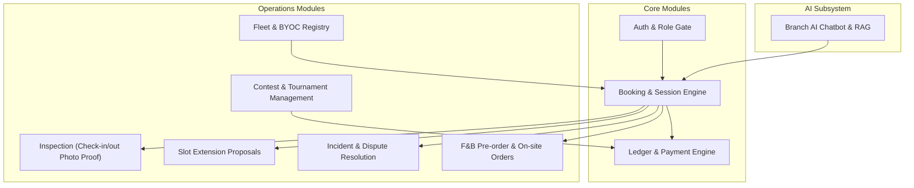

# Product Overview: RCField Platform

**Tên dự án:** RCField – RC Car Field Operations & Booking Platform  
**Tên tiếng Việt:** Nền tảng Số hóa Vận hành và Đặt lịch Sân Xe RC  
**Trạng thái tài liệu:** Active (Hỗ trợ Phase 1 - Core Operations)  

---

## 1. Giới thiệu & Bối cảnh (Background & Context)

### English Version
The RC Car Field Operations & Booking Platform (RCField) is a Software-as-a-Service (SaaS) system designed to help radio-controlled (RC) car cafes and track providers operate, manage, and scale their businesses more efficiently. The platform leverages an evidence-based digital inspection flow, a component-based payment engine, and an AI-powered retrieval-augmented generation (RAG) chatbot to streamline track bookings, rental vehicle handover checks, and customer support.

In Vietnam, the RC car hobby and entertainment business is growing rapidly. However, venue operations are currently plagued by manual scheduling (via social media or phone) leading to double-bookings, inefficient fleet tracking, and severe damage disputes due to a lack of structured physical evidence during vehicle handovers. The RCField platform addresses these operational pain points by allowing customers to book tracks and pre-order F&B online, while enabling staff to conduct mandatory 4-angle photo inspections at check-in and check-out to eliminate disputes. Furthermore, providers can manage multiple branches, organize competitive tournaments with dedicated audit logs, and deploy localized AI chatbots trained on their own knowledge bases to assist customers. The platform supports multiple user roles, including customers, branch staff, providers, and platform administrators, and is designed as a multi-tenant web application to ensure secure, isolated tenant operations through a responsive web-based interface.

### Vietnamese Version
Nền tảng Số hóa Vận hành và Đặt lịch Sân Xe RC (RCField) là hệ thống phần mềm dưới dạng dịch vụ (SaaS) được thiết kế nhằm giúp các quán cafe và nhà cung cấp sân xe điều khiển từ xa (RC car) vận hành, quản lý và mở rộng hoạt động kinh doanh hiệu quả hơn. Nền tảng tận dụng quy trình kiểm tra số hóa dựa trên bằng chứng thực tế, công cụ thanh toán phân rã thành phần và chatbot thông minh ứng dụng RAG (truy vấn tri thức tăng cường) để tối ưu hóa quy trình đặt sân, bàn giao xe thuê và hỗ trợ khách hàng.

Tại Việt Nam, mô hình giải trí trải nghiệm sân xe RC đang phát triển mạnh mẽ. Tuy nhiên, việc vận hành hiện tại đang gặp nhiều trở ngại do đặt lịch thủ công (qua mạng xã hội hoặc điện thoại) gây trùng lịch, quản lý đội xe thiếu hiệu quả và các tranh chấp hư hỏng nghiêm trọng do thiếu bằng chứng bàn giao thực tế. Hệ thống RCField giải quyết triệt để các vấn đề này bằng cách cho phép khách hàng đặt sân và gọi món trực tuyến, đồng thời bắt buộc nhân viên thực hiện chụp ảnh xe 4 góc khi check-in/out để làm bằng chứng số loại bỏ tranh chấp. Ngoài ra, chủ sân có thể quản lý chuỗi chi nhánh, tổ chức giải đấu với nhật ký kiểm toán riêng và triển khai chatbot AI được đào tạo trên tài liệu của quán để hỗ trợ khách hàng. Hệ thống hỗ trợ nhiều vai trò người dùng (khách hàng, nhân viên, chủ sân, quản trị viên) và được xây dựng dưới dạng ứng dụng web đa người thuê (multi-tenant) bảo mật.

---

## 2. Yêu cầu Người dùng & Các Tác nhân (User Requirements & Actors)

Bảng dưới đây mô tả chi tiết các tác nhân (Actors) tham gia vào hệ thống và vai trò/yêu cầu cụ thể của họ:

| # | Tác nhân (Actor) | Mô tả chi tiết (Description) |
| :--- | :--- | :--- |
| 1 | **Guest** (Khách vãng lai) | The Guest actor represents unregistered visitors who access the platform. Guests can view publicly available cafe/branch listings, track configurations, operating hours, rental vehicle catalogs, and general pricing plans. Guests can register to become Customers or apply to onboard as Providers. |
| 2 | **Customer** (Khách hàng) | The Customer actor represents registered individuals who have logged into the platform. Customers can manage their profiles, register their personal vehicles (BYOC), book slots and rental vehicles, pre-order F&B, make secure online payments via VNPay, complete check-in/check-out confirmations, approve or reject slot extension proposals, rate cafes, view contest information, and interact with the branch's AI Chatbot. |
| 3 | **Staff** (Nhân viên) | The Staff actor represents employees assigned to a specific cafe branch. Staff are responsible for daily operations, including verifying check-ins, performing check-in and check-out inspections (capturing 4-angle photos, completing checklists), proposing slot extensions, recording on-site F&B orders, logging operational incidents, and managing/submitting local contest match results. |
| 4 | **Provider** (Chủ sân xe) | The Provider actor represents business owners who manage one or multiple cafe branches. Providers have administrative control over their tenant workspace, including configuring branch settings, operating hours, managing the vehicle fleet, designing F&B menus, offering packages/subscriptions, generating promotions, reviewing customer BYOC registrations, hosting and generating schedule/seeding for contests, and viewing sales/performance analytics. |
| 5 | **System Admin** (Quản trị hệ thống) | The System Admin actor represents platform administrators who manage the SaaS ecosystem. System Admins are responsible for onboarding new Providers, configuring global SaaS subscription plans, reviewing manual payment requests, monitoring platform usage, auditing logs, and acting as an arbitrator to resolve official disputes between customers and providers. |
| 6 | **AI (External System)** (Hệ thống AI trợ lý) | The AI actor represents the artificial intelligence service integrated into the platform to provide localized branch chatbot assistance. The AI processes natural language queries using pgvector similarity search and Gemini models to retrieve branch knowledge bases (FAQs, rules, policies), answer customer queries, recommend quick replies, and check slot availability without autonomous control over database state. |
| 7 | **Payment Gateway (External System)** (Cổng thanh toán VNPay) | The Payment Gateway actor represents the external payment provider (VNPay) integrated into the platform. The gateway handles secure online transactions, processes initial security deposit holds (pre-authorization) during booking confirmation, and executes captures/refunds during the session checkout settlement phase. |
| 8 | **Cloudinary (External System)** (Dịch vụ lưu trữ Cloudinary) | The Cloudinary actor represents the external media storage service. It securely stores and delivers the 4-angle inspection photos uploaded by staff during check-in/out, providing immutable digital evidence URLs stored in the system database for dispute resolution. |

---

## 3. Các Phân hệ Tính năng Cốt lõi (Core Modules - Phase 1)

Nền tảng RCField được thiết kế dạng mô-đun hóa, tập trung hoàn toàn vào core vận hành thực tế tại các chi nhánh cafe xe RC:

### 3.1. Đặt lịch & Phiên chơi thực tế (Booking & Session Separation)
Đây là nguyên tắc thiết kế dữ liệu quan trọng của RCField nhằm phản ánh chính xác thực tế vận hành:
* **Booking (Dữ liệu dự kiến):** Lưu thông tin kế hoạch đặt sân, khung giờ đặt (`slot_start`, `slot_end`), và danh sách xe thuê dự kiến. Giá và chính sách tại thời điểm đặt được khóa lại thành một bản sao bất biến (`snapshot`).
* **Session (Dữ liệu thực tế):** Khi khách hàng đến chi nhánh và làm thủ tục check-in, một hoặc nhiều `Session` thực tế sẽ được khởi tạo từ `Booking`. Session theo dõi chính xác thời gian chơi thực tế, người chơi thực tế, xe thực tế (cho phép đổi xe khi đang chơi nếu xe hỏng hoặc khách muốn đổi).

### 3.2. Quy trình Kiểm tra Bàn giao Dựa trên Bằng chứng Số (Evidence-based Handover)
Để giải quyết triệt để tranh chấp hư hại tài sản giữa quán và khách hàng, quy trình bàn giao được số hóa nghiêm ngặt:
* **Khi Check-in:** Nhân viên bắt buộc phải chụp **đầy đủ 4 góc xe** (Front, Back, Left, Right) đối với xe thuê, hoặc chụp ảnh xe cá nhân (BYOC) cùng cơ sở vật chất. Đồng thời, hoàn tất checklist tình trạng xe (vết xước, nứt, thiếu phụ kiện). Nếu có hư hỏng sẵn, nhân viên đánh dấu `pre_existing_flag = true`. Khách hàng nhận được thông báo trên điện thoại và bấm xác nhận biên bản bàn giao trong vòng 15 phút.
* **Khi Check-out:** Nhân viên chụp lại 4 góc xe và thực hiện checklist kiểm tra. Hệ thống so sánh đối chiếu tự động trạng thái đầu vào - đầu ra.
  * Nếu phát sinh hư hại mới, nhân viên nhập ước tính chi phí đền bù (`damage_cost`). Hệ thống tính toán khoản phạt đền bù (`damage_charge = damage_cost * damage_multiplier`). Khách hàng có 24h để xác nhận hoặc khiếu nại.
  * Nếu không có hư hại, hệ thống tự động giải phóng cọc sau 2h nếu khách không thao tác.

> [!IMPORTANT]
> Nếu nhân viên không hoàn tất đúng quy trình kiểm tra (thiếu ảnh hoặc thiếu checklist), Provider sẽ mất quyền yêu cầu bồi thường hư hại (`DAMAGE_CHARGE`).

### 3.3. Cơ chế Thanh toán & Quyết toán (Payment Engine & Settlement)
Hệ thống sử dụng cơ chế **Component-based Ledger** (sổ cái thành phần bất biến). Mỗi khoản phí (phí sân, phí thuê xe, cọc giữ xe, F&B, phí gia hạn, phí đền bù) là một component độc lập giúp việc đối soát và hoàn tiền cực kỳ minh bạch.

Luồng thanh toán 2 bước qua cổng **VNPay**:
1. **Bước 1 (Khi Booking Confirm):** Khách hàng thực hiện thanh toán. Khoản tiền đặt cọc giữ xe (`SECURITY_DEPOSIT`) được chuyển sang trạng thái tạm khóa (**HELD**). Các khoản phí dự kiến như phí sân (`SLOT_FEE`), phí thuê xe (`RENTAL_FEE`) ở trạng thái **PENDING**.
2. **Bước 2 (Khi Session Completed - Quyết toán):**
   $$\text{Total Charges} = \text{SLOT\_FEE} + \text{RENTAL\_FEE} + \text{EXTENSION\_FEE} + \text{FNB\_PREORDER} + \text{DAMAGE\_CHARGE}$$
   $$\text{Checkout Amount} = \text{Total Charges} - \text{SECURITY\_DEPOSIT}$$
   * Nếu $\text{Checkout Amount} > 0$: Khách hàng thanh toán thêm phần chênh lệch (CAPTURE).
   * Nếu $\text{Checkout Amount} < 0$: Hệ thống tự động hoàn lại phần cọc dư cho khách hàng.
   * Hệ thống tự động trích thu phí nền tảng (**Platform Fee 15%**) trên tổng doanh thu thực tế phát sinh của Provider (không tính trên cọc và F&B preorder).

### 3.4. Quản lý Giải đua (Contest Module)
RCField cung cấp công cụ tổ chức giải đua xe điều khiển từ xa ngay tại các chi nhánh:
* **Cấu hình giải đấu:** Cho phép Provider tạo giải đấu, quy định thể thức (Knockout loại trực tiếp, Multi-driver Heat đua vòng loại, hoặc Time Attack tính giờ), thiết lập giới hạn xe (`RENTAL_ONLY`, `BYOC_ONLY`, hoặc `MIXED`).
* **Quản lý thi đấu:** Đăng ký trực tuyến, nhân viên thực hiện check-in thí sinh bằng mã QR (`check_in_code`) tại đúng chi nhánh được phân công. Tự động sinh lịch thi đấu (`ContestMatch`), cập nhật kết quả trận đấu, xử lý tự động các trận đấu có vận động viên đặc cách (bye round) và công bố bảng xếp hạng local của giải. Leaderboard liên tỉnh/toàn quốc thuộc Universal Racing Network phase sau và chỉ đọc từ `race_records` đã xác thực.
* **Tính năng Audit:** Mọi thay đổi về lịch thi đấu, kết quả trận đấu hoặc sửa đổi điểm số đều phải ghi lại trong `ContestAuditLog` kèm lý do nhằm đảm bảo tính công bằng cao nhất.
* **Mở rộng cộng đồng:** Sau khi contest ổn định, hệ thống có thể mở Universal Racing Network gồm Driver Passport, global leaderboard, achievements, Grand Prix Series và Team War/Clan War.

### 3.5. Trợ lý AI và Cơ sở Tri thức (Branch AI Chatbot & RAG)
Mỗi chi nhánh cafe xe RC sở hữu một widget chatbot AI thông minh riêng biệt hỗ trợ khách hàng:
* **Truy vấn Tri thức (RAG):** Hệ thống tự động phân tích (parse), chia nhỏ (chunk), tạo vector nhúng (vector embedding) các tài liệu nội quy sân, hướng dẫn kỹ thuật, câu hỏi thường gặp FAQ (PDF/DOCX/TXT) do Provider tải lên.
* **Xử lý Ngôn ngữ Tự nhiên:** Dịch vụ NLU (FastAPI) phân tích câu hỏi tiếng Việt của khách hàng để phân loại ý định (intent):
  * Nếu là câu hỏi thông thường hoặc chào hỏi → Chatbot phản hồi nhanh dựa trên cấu hình Widget.
  * Nếu muốn kiểm tra lịch trống → Chatbot tự động truy vấn database phòng máy để trả về các khung giờ trống của chi nhánh.
  * Nếu là các câu hỏi chuyên sâu → AI sử dụng kỹ thuật RAG, truy vấn cơ sở tri thức (vector similarity search qua `pgvector`) và gửi ngữ cảnh phù hợp cho mô hình lớn **Gemini** để sinh câu trả lời chính xác, kèm đề xuất câu hỏi nhanh (Quick Replies).

---

## 4. Kiến trúc & Công nghệ (Tech Stack & Infrastructure)

Hệ thống được phát triển trên kiến trúc Monorepo hiện đại nhằm đồng bộ tốt nhất giữa Backend và Frontend:

* **Backend (`apps/api`):**
  * **Runtime:** Node.js (v20+) kết hợp Express.js.
  * **Ngôn ngữ:** TypeScript Strict Mode.
  * **ORM & Database:** TypeORM và PostgreSQL (lưu trữ toàn bộ dữ liệu cấu trúc và dữ liệu vector thông qua extension `pgvector`).
  * **Caching & Queue:** Redis.
  * **Storage:** Cloudinary (dịch vụ lưu trữ và xử lý hình ảnh bàn giao xe).
  * **Cron Jobs:** `node-cron` xử lý các quy tắc tự động hủy booking quá hạn, tự động check-out/phạt no-show.
  * **NLU Service:** FastAPI (Python) phục vụ xử lý ý định chatbot cục bộ.

* **Frontend (`apps/web`):**
  * **Framework:** ReactJS (Vite build).
  * **Styling:** Tailwind CSS (thiết kế Responsive, tối ưu hóa giao diện Mobile-first cho khách hàng và nhân viên sân).
  * **State Management:** Zustand (Client-state) và React Query (Server-state / API Caching).
  * **HTTP Client:** Axios.

* **External Integrations:**
  * **VNPay Gateway:** Xử lý các giao dịch thanh toán trực tuyến qua ngân hàng hoặc ví điện tử.
  * **Google Gemini API:** Sử dụng mô hình `gemini-2.0-flash` (cho câu hỏi đơn giản/gợi ý nhanh) và `gemini-2.5-pro` (cho câu hỏi phức tạp cần suy luận cao) phối hợp cùng `text-embedding-001`.

---

## 5. Các Quy tắc Vận hành Quan trọng (Operational Business Rules)

1. **Khóa dữ liệu (Snapshot Rule):** Không bao giờ lấy giá trực tiếp tại thời điểm quyết toán; tất cả tính toán dòng tiền phải dựa trên bản sao giá (`booking.snapshot`) được tạo ra ngay lúc khách bấm đặt lịch.
2. **Quy tắc Hủy đặt lịch (Refund Policy):**
   * Hủy trước giờ chơi > 24h: Hoàn cọc 100%, không thu phí sân và phí xe.
   * Hủy từ 12 - 24h trước giờ chơi: Phạt 50% phí sân, giải phóng cọc.
   * Hủy < 12h trước giờ chơi: Phạt 100% phí sân, giải phóng cọc.
   * Nhận phòng trễ quá 30 phút mà không check-in: Đánh dấu `NO_SHOW`, phạt 100% phí sân, giải phóng cọc, xe trả về trạng thái sẵn sàng cho khách khác thuê.
3. **Giới hạn Gia hạn Sân (Extension Cap):** Khách hàng chỉ được đề xuất gia hạn chơi thêm giờ khi tổng phí gia hạn tích lũy không vượt quá 50% giá trị của khoản tiền đặt cọc giữ xe (`securityDeposit`).
4. **Cô lập dữ liệu AI (Knowledge Base Isolation):** Cơ sở tri thức chatbot được phân tách độc lập tuyệt đối theo `cafe_id` nhằm tránh rò rỉ thông tin nội bộ giữa các chi nhánh hoặc giữa các Provider đối thủ.
