# 06 — Database Specification

**Last updated**: 2026-08-06

> Đọc `01-domain-model.md` để hiểu entity relationships trước khi đọc file này.  
> File này là nguồn sự thật cho schema Phase 1 Operational Core.

---

## 1. Conventions

| Convention | Quy tắc |
|-----------|---------|
| Tên bảng | `snake_case`, số nhiều (`users`, `bookings`) |
| Primary key | `id uuid DEFAULT gen_random_uuid()` |
| Foreign key | `{entity}_id uuid` |
| Timestamps | Bảng nghiệp vụ có `created_at`, `updated_at`; audit/log có thể chỉ có `created_at` |
| Tiền tệ | `numeric(15,2)`, không dùng `float` |
| JSON | `jsonb` cho snapshot/config/payload linh hoạt |
| Timezone | `timestamptz`, lưu UTC |
| Soft delete | `deleted_at timestamptz`, NULL = active |

---

## 2. ERD Tổng Quan — Operational Core

```mermaid
erDiagram
    users ||--o{ cafes : "provider owns"
    users ||--o{ bookings : "customer makes"
    users ||--o{ customer_vehicles : "owns BYOC"
    cafes ||--o{ cafe_images : "images"
    cafes ||--o{ bookings : "receives"
    cafes ||--o{ sessions : "runs"
    cafes ||--o{ packages : "offers"
    cafes ||--o{ subscriptions : "supports"

    %% Vehicle Catalog and Physical Units
    cafes ||--o{ vehicle_catalogs : "has catalogs"
    vehicle_catalogs ||--o{ vehicles : "physical units"
    vehicle_catalogs ||--o{ vehicle_catalog_images : "catalog images"
    vehicles ||--o{ vehicle_maintenance_logs : "maintenance"
    vehicles ||--o{ booking_vehicles : "planned"
    vehicles ||--o{ session_vehicles : "actual use"
    customer_vehicles ||--o{ session_vehicles : "BYOC use"

    %% Bookings & Sessions
    bookings ||--o{ booking_participants : "planned people"
    bookings ||--o{ booking_vehicles : "planned rental vehicles"
    bookings ||--o{ sessions : "actual sessions"
    bookings ||--o{ payment_components : "payment ledger"
    bookings ||--o{ payment_transactions : "gateway logs"
    bookings ||--o{ fnb_orders : "food orders"
    bookings ||--o{ package_usages : "package usage"
    bookings ||--o{ reviews : "review"

    sessions ||--o{ session_participants : "actual people"
    sessions ||--o{ session_vehicles : "actual vehicles"
    sessions ||--o{ inspections : "inspections"
    sessions ||--o{ extension_proposals : "extensions"
    sessions ||--o{ incidents : "incidents"

    inspections ||--o{ inspection_photos : "photos"
    inspections ||--o{ inspection_checklists : "checklists"
    fnb_orders ||--o{ fnb_order_items : "items"
    menu_items ||--o{ fnb_order_items : "menu item"
    packages ||--o{ customer_packages : "purchased"
    customer_packages ||--o{ package_usages : "usage history"
    subscriptions ||--o{ bookings : "generates"

    %% Contests
    cafes ||--o{ contests : "hosts event"
    contests ||--o{ contest_cafes : "participating branches"
    cafes ||--o{ contest_cafes : "hosts event"
    contests ||--o{ contest_registrations : "registrations"
    contests ||--o{ contest_matches : "matches"
    contest_matches ||--o{ contest_match_participants : "match participants"
    contest_registrations ||--o{ contest_match_participants : "participates"
    contests ||--o{ contest_audit_logs : "logs"

    %% Promotions
    cafes ||--o{ promotions : "promotions"
    promotions ||--o{ promotion_usages : "usage history"
    bookings ||--o| promotion_usages : "applies promo"

    %% Identity & Notifications
    users ||--o{ refresh_tokens : "sessions"
    users ||--o{ password_reset_tokens : "resets"
    users ||--o{ notification_logs : "notifications logs"
    users ||--o{ trust_score_logs : "trust audit"
    bookings ||--o{ trust_score_logs : "triggered by"
    sessions ||--o{ trust_score_logs : "triggered by"

    users ||--o| provider_profiles : "has profile"
    users ||--o{ provider_subscriptions : "subscription"
    users ||--o{ payment_requests : "payment requests"
    users ||--o{ notifications : "notifications"
    provider_subscriptions ||--o{ subscription_plans : "plan"
    payment_requests ||--o{ subscription_plans : "plan"

    %% Staff & Scheduling (New)
    cafes ||--o{ staff_cafe_assignments : "has staff"
    users ||--o{ staff_cafe_assignments : "assigned as staff"
    cafes ||--o{ staff_invite_tokens : "invites staff"
    cafes ||--o{ shift_positions : "defines positions"
    cafes ||--o{ shift_time_presets : "defines presets"
    cafes ||--o{ staff_shifts : "has shifts"
    users ||--o{ staff_shifts : "staff shifts"
    shift_positions ||--o{ staff_shifts : "shift position"
    shift_time_presets ||--o{ staff_shifts : "shift preset"

    %% Track configurations & Bookings (New)
    track_types ||--o{ cafe_track_configs : "configured tracks"
    cafes ||--o{ cafe_track_configs : "track configs"
    bookings ||--o{ cafe_track_configs : "uses track config"

    %% AI / KB & Widgets (New)
    cafes ||--o{ kb_documents : "has KB docs"
    kb_documents ||--o{ kb_chunks : "chunked into"
    cafes ||--o| cafe_widget_configs : "has widget config"
    cafes ||--o{ cafe_channels : "has channels"
    cafes ||--o{ amenity_catalog : "has amenities"

    %% Holiday overrides (New)
    cafes ||--o{ cafe_holiday_overrides : "holiday overrides"
    holiday_dates ||--o{ cafe_holiday_overrides : "overridden dates"
    cafes ||--o{ cafe_pricing_rules : "pricing rules"

    %% Customer Package integration (New)
    bookings ||--o{ customer_packages : "uses package"
    payment_transactions ||--o{ customer_packages : "pays for package"
```



> **Bảng backend-only bổ sung ngoài diagram:** `menu_categories`, `menu_item_variants`, `menu_item_components`, `contest_formats`, `contest_types`, `contest_templates`, `contest_staff_assignments`, `contest_bans`, `contest_fee_plans`, `contest_fee_orders`, `damage_line_items`, `ai_analysis_logs`, `featured_popups`, `push_tokens`. Các bảng trong diagram cần phân biệt ba nhóm:
>
> - **Đã bị xoá khỏi database**: `subscriptions`, `package_usages`, `promotion_usages`,
>   `notification_logs`, `trust_score_logs`, `incidents`, `customer_vehicles`,
>   `disputes`, `cafe_announcements`.
> - **Chưa bao giờ được xây**: `shift_positions`, `shift_time_presets`, `staff_shifts`,
>   `cafe_closures`, `cafe_widget_configs`.
> - **Đang chạy nhưng không có entity TypeORM** (truy cập bằng raw SQL):
>   `feature_flags`, `staff_cafe_assignments`, `vehicle_maintenance_logs`.

---

## 3. Schema Scope — 70 Bảng Đang Chạy

Danh sách dưới đây được đối chiếu trực tiếp với `pg_tables` của database, không
phải mục tiêu thiết kế. Bảng `migrations` của TypeORM không tính.

> **Đã gỡ khỏi scope.** Bảy bảng từng nằm trong bản thiết kế đầu nhưng **chưa bao
> giờ được xây**: `cafe_closures`, `cafe_widget_configs`, `driver_profiles`,
> `driver_cafe_checkins`, `staff_shifts`, `shift_positions`, `shift_time_presets`.
>
> Bảy bảng khác **đã tồn tại rồi bị xoá** vì không luồng nghiệp vụ nào đi qua:
> `cafe_announcements`, `notification_logs`, `package_usages`, `promotion_usages`,
> `disputes`, `incidents`, `trust_score_logs` — cùng `subscriptions` và
> `customer_vehicles` bị thay thế bởi `provider_subscriptions` và `vehicles`.

| # | Bảng | Mô tả | Entity TypeORM |
|---|------|-------|----------------|
| 1 | `achievement_definitions` | Danh mục huy hiệu của mạng lưới tay đua | `achievement-definition.entity.ts` |
| 2 | `ai_analysis_logs` | Nhật ký các lần chạy phân tích doanh thu bằng AI | `ai-analysis-log.entity.ts` |
| 3 | `amenity_catalog` | Danh mục các tiện ích của chi nhánh | `amenity-catalog.entity.ts` |
| 4 | `bank_transactions` | Giao dịch chuyển khoản đối soát qua webhook ngân hàng | `bank-transaction.entity.ts` |
| 5 | `booking_participants` | Người chơi dự kiến | `booking-participant.entity.ts` |
| 6 | `booking_vehicles` | Xe thuê dự kiến | `booking-vehicle.entity.ts` |
| 7 | `bookings` | Đơn đặt lịch dự kiến | `booking.entity.ts` |
| 8 | `cafe_channels` | Cấu hình kênh liên lạc (Facebook, Zalo...) | `cafe-channel.entity.ts` |
| 9 | `cafe_holiday_overrides` | Cấu hình hoạt động chi nhánh vào ngày lễ | `cafe-holiday-override.entity.ts` |
| 10 | `cafe_images` | Gallery ảnh chi nhánh | `cafe-image.entity.ts` |
| 11 | `cafe_payment_settings` | Cấu hình nhận tiền của chi nhánh (VietQR, VNPay riêng) | `cafe-payment-setting.entity.ts` |
| 12 | `cafe_pricing_rules` | Cấu hình quy tắc định giá chi tiết theo khung giờ/ngày | `cafe-pricing-rule.entity.ts` |
| 13 | `cafe_track_configs` | Cấu hình đường đua cụ thể của chi nhánh | `cafe-track-config.entity.ts` |
| 14 | `cafes` | Chi nhánh/sân RC | `cafe.entity.ts` |
| 15 | `contest_audit_logs` | Business audit log của contest | `contest-audit-log.entity.ts` |
| 16 | `contest_bans` | Danh sách cấm thi đấu | `contest-ban.entity.ts` |
| 17 | `contest_cafes` | Chi nhánh tham gia contest | `contest-cafe.entity.ts` |
| 18 | `contest_fee_orders` | Đơn phí tổ chức của từng giải, kèm thông tin chuyển khoản và kết quả đối soát | `contest-fee-order.entity.ts` |
| 19 | `contest_fee_plans` | Gói phí tổ chức giải Provider trả cho nền tảng | `contest-fee-plan.entity.ts` |
| 20 | `contest_formats` | Thể thức thi đấu và cờ năng lực (bracket, time attack) | `contest-format.entity.ts` |
| 21 | `contest_ledger_entries` | Sổ thu chi của một giải | `contest-ledger-entry.entity.ts` |
| 22 | `contest_match_participants` | Người tham gia trong từng match | `contest-match-participant.entity.ts` |
| 23 | `contest_matches` | Match/heat/lượt chạy/final linh hoạt | `contest-match.entity.ts` |
| 24 | `contest_registrations` | Đăng ký giải đua | `contest-registration.entity.ts` |
| 25 | `contest_staff_assignments` | Phân công nhân sự điều hành giải | `contest-staff-assignment.entity.ts` |
| 26 | `contest_templates` | Mẫu cấu hình giải: gộp thể thức + loại + default_config | `contest-template.entity.ts` |
| 27 | `contest_types` | Loại giải (nhãn phân loại) | `contest-type.entity.ts` |
| 28 | `contests` | Giải đua/sự kiện do Provider tạo | `contest.entity.ts` |
| 29 | `customer_packages` | Gói khách đã mua | `customer-package.entity.ts` |
| 30 | `damage_line_items` | Từng hạng mục hư hỏng: tiền phụ tùng và tiền công | `damage-line-item.entity.ts` |
| 31 | `extension_proposals` | Đề xuất gia hạn | `extension-proposal.entity.ts` |
| 32 | `feature_flags` | Bật/tắt module, config Phase 2 | **chưa có entity** — truy cập bằng raw SQL |
| 33 | `featured_popups` | Popup quảng bá giải trên trang khám phá | `featured-popup.entity.ts` |
| 34 | `fnb_order_items` | Line items F&B | `fnb-order-item.entity.ts` |
| 35 | `fnb_orders` | Đơn F&B | `fnb-order.entity.ts` |
| 36 | `holiday_dates` | Danh sách các ngày lễ chính thức | `holiday-date.entity.ts` |
| 37 | `inspection_checklists` | Checklist inspection | `inspection-checklist.entity.ts` |
| 38 | `inspection_photos` | Ảnh inspection | `inspection-photo.entity.ts` |
| 39 | `inspections` | Biên bản kiểm tra | `inspection.entity.ts` |
| 40 | `kb_chunks` | Các đoạn dữ liệu text cắt nhỏ từ KB document | `kb-chunk.entity.ts` |
| 41 | `kb_documents` | Tài liệu Knowledge Base AI | `kb-document.entity.ts` |
| 42 | `menu_categories` | Nhóm món trong thực đơn chi nhánh | `menu-category.entity.ts` |
| 43 | `menu_item_components` | Thành phần của món combo | `menu-item-component.entity.ts` |
| 44 | `menu_item_variants` | Biến thể món (size, mức đá…) | `menu-item-variant.entity.ts` |
| 45 | `menu_items` | Menu F&B | `menu-item.entity.ts` |
| 46 | `notifications` | In-app notifications cho Provider | `notification.entity.ts` |
| 47 | `packages` | Định nghĩa gói chơi | `package.entity.ts` |
| 48 | `password_reset_tokens` | Reset password tokens | `password-reset-token.entity.ts` |
| 49 | `payment_components` | Ledger thanh toán | `payment-component.entity.ts` |
| 50 | `payment_requests` | Yêu cầu thanh toán thủ công (chuyển khoản) | `payment-request.entity.ts` |
| 51 | `payment_transactions` | Log gateway | `payment-transaction.entity.ts` |
| 52 | `promotions` | Mã khuyến mãi | `promotion.entity.ts` |
| 53 | `provider_profiles` | Hồ sơ đăng ký Provider, trạng thái duyệt | `provider-profile.entity.ts` |
| 54 | `provider_subscriptions` | Subscription đang active của từng Provider, quota AI | `provider-subscription.entity.ts` |
| 55 | `push_tokens` | Token thiết bị để gửi thông báo đẩy | `push-token.entity.ts` |
| 56 | `race_records` | Kết quả chạy dùng cho bảng xếp hạng | `race-record.entity.ts` |
| 57 | `refresh_tokens` | Refresh token sessions | `refresh-token.entity.ts` |
| 58 | `reviews` | Đánh giá | `review.entity.ts` |
| 59 | `session_participants` | Người chơi thực tế | `session-participant.entity.ts` |
| 60 | `session_vehicles` | Xe thực tế dùng trong session | `session-vehicle.entity.ts` |
| 61 | `sessions` | Phiên chơi thực tế | `session.entity.ts` |
| 62 | `staff_cafe_assignments` | Staff assign vào chi nhánh | **chưa có entity** — truy cập bằng raw SQL |
| 63 | `staff_invite_tokens` | Token mời nhân viên qua email | `staff-invite-token.entity.ts` |
| 64 | `subscription_plans` | Định nghĩa các gói: Trial, Starter, Growth, Pro | `subscription-plan.entity.ts` |
| 65 | `track_types` | Các loại đường đua (Drift, Circuit, Offroad...) | `track-type.entity.ts` |
| 66 | `users` | Tài khoản và role | `user.entity.ts` |
| 67 | `vehicle_catalog_images` | Ảnh danh mục xe | `vehicle-catalog-image.entity.ts` |
| 68 | `vehicle_catalogs` | Danh mục xe thuê | `vehicle-catalog.entity.ts` |
| 69 | `vehicle_maintenance_logs` | Lịch sử bảo trì/sửa chữa xe | **chưa có entity** — truy cập bằng raw SQL |
| 70 | `vehicles` | Xe thuê vật lý của quán | `vehicle.entity.ts` |

Các nghiệp vụ bị loại khỏi schema Phase 1:

- AI job/detail tables nâng cao (trừ tính năng chatbot AI / Knowledge Base cơ bản ở trên).
- Analytics nâng cao, dynamic pricing nâng cao, loyalty và native mobile app.

---

## 4. Enum Chuẩn

Khối dưới đây **trích thẳng từ `rcfeild-be/src/types/index.ts`** — 72 enum, đúng
với mã đang chạy. Chỗ nào giá trị TypeScript khác chuỗi lưu xuống DB thì ghi rõ
dạng `KEY='giá_trị_db'`.

> Bản trước liệt kê 59 enum viết tay và lệch 37 chỗ so với code: 18 enum không hề
> tồn tại (`PlayMode`, `TrackType`, `VehicleTier`, `IncidentType`, `TeamWarStatus`…)
> và 19 enum sai giá trị. Đáng chú ý nhất là `BookingMode`: spec ghi
> `SINGLE/PACKAGE/SUBSCRIPTION` (đúng với cột `bookings.booking_mode`), còn enum
> TypeScript cùng tên lại chứa `RENTAL/BYOC` — tức là nó ứng với cột
> `bookings.play_mode`. Hai thứ khác nhau dùng chung một tên; đọc kỹ tên cột
> trước khi dùng.

```typescript
enum AssetTier { STANDARD, PREMIUM, RESTRICTED }
enum AuthProvider { LOCAL, GOOGLE }
enum BankTransactionGateway { SEPAY, SANDBOX }
enum BankTransactionMatchReason { OVERPAID, NO_REF_CODE, REF_NOT_FOUND, SHORT_PAID, ALREADY_PAID, SESSION_REPLACED, BOOKING_EXPIRED, UNKNOWN_ACCOUNT }
enum BankTransactionMatchStatus { MATCHED, NEEDS_REVIEW, IGNORED }
enum BookingMode { RENTAL, BYOC }
enum BookingParticipantType { BOOKER, REGISTERED_USER, WALK_IN_GUEST }
enum BookingSource { APP, STAFF_MANUAL, CONTEST }
enum BookingStatus { PENDING, CONFIRMED, NO_SHOW, AWAITING_PAYMENT, COMPLETED, CANCELLED }
enum CafePaymentMethod { VNPAY, BANK_TRANSFER }
enum CafeStatus { PENDING, ACTIVE, SUSPENDED }
enum ChannelStatus { CONNECTED, DISCONNECTED }
enum ChannelType { FACEBOOK_MESSENGER }
enum ContestBanScopeType { CONTEST, PROVIDER }
enum ContestEntryFeePaymentMethod { ONLINE, CASH, TRANSFER }
enum ContestEntryFeePaymentStatus { NOT_REQUIRED, PENDING_PAYMENT, PENDING_REVIEW, WAIVED, MARKED_PAID }
enum ContestFeeOrderStatus { PENDING_PAYMENT, PENDING_REVIEW, PAID, REJECTED, CANCELLED }
enum ContestLedgerDirection { IN, OUT }
enum ContestLedgerExpenseCategory { PRIZE_CASH, PRIZE_ITEM, VENUE, STAFF, MARKETING, FNB, OTHER }
enum ContestLedgerIncomeCategory { ENTRY_FEE_ADJUSTMENT, SPONSORSHIP, TICKET, FNB, OTHER }
enum ContestMatchStatus { DRAFT, READY, RUNNING, COMPLETED, CANCELLED }
enum ContestMatchType { HEAD_TO_HEAD, MULTI_DRIVER, TIME_ATTACK, FINAL }
enum ContestParticipantStatus { READY, STARTED, FINISHED, DNS, DNF, DQ }
enum ContestRegistrationStatus { PENDING, CONFIRMED, CANCELLED, CHECKED_IN }
enum ContestResourceScope { FULL_BRANCH, SELECTED_TRACKS }
enum ContestStatus { DRAFT, OPEN, CLOSED, RUNNING, COMPLETED, CANCELLED }
enum CustomerPackageStatus { PENDING_PAYMENT, ACTIVE, EXHAUSTED, EXPIRED }
enum DamagePartType { TIRE_WHEEL, SPOILER, CHASSIS, MOTOR, SHELL, SERVO, REMOTE, OTHER }
enum DiscountType { PERCENT, FIXED }
enum DisputeStatus { OPEN, UNDER_REVIEW, RESOLVED }
enum ExtensionProposalStatus { PENDING, APPROVED, REJECTED, EXPIRED, CANCELLED }
enum FeaturedPopupAudienceScope { ALL }
enum FeaturedPopupPlacement { EXPLORE }
enum FeaturedPopupReviewStatus { PENDING, APPROVED, REJECTED }
enum FnbOrderStatus { PENDING, CONFIRMED, DELIVERED, CANCELLED }
enum FnbOrderType { PRE_ORDER, ON_SITE }
enum HolidayType { SYSTEM, CUSTOM }
enum InspectionItemStatus { OK, SCRATCHED, BROKEN, MISSING, DIRTY, NEEDS_REVIEW }
enum InspectionSubjectType { RENTAL_VEHICLE, BYOC_VEHICLE }
enum InspectionType { CHECK_IN, CHECK_OUT }
enum KbContentType { POLICY, FAQ, ANNOUNCEMENT, CUSTOM }
enum KbDocumentStatus { PENDING, INDEXED, FAILED }
enum KycBusinessType { INDIVIDUAL, BUSINESS }
enum KycDocumentType { CCCD_FRONT, CCCD_BACK, GPKD, REPRESENTATIVE_ID, VENUE_PHOTO }
enum NotificationChannel { PUSH, SMS, EMAIL }
enum NotificationType { SYSTEM, VEHICLE_MAINTENANCE_CREATED, MAINTENANCE_LOG_UPDATED, ACCOUNT_APPROVED, ACCOUNT_REJECTED, ACCOUNT_SUSPENDED, ACCOUNT_UNSUSPENDED, TRIAL_EXPIRING_SOON, GRACE_PERIOD_STARTED, SUBSCRIPTION_EXPIRED, SUBSCRIPTION_ACTIVATED, PAYMENT_REQUEST_CONFIRMED, PAYMENT_REQUEST_REJECTED, SESSION_CHECKIN_INSPECTION, SESSION_CHECKOUT_INSPECTION, SESSION_EXTENSION_PROPOSED, SESSION_FNB_ORDER_ADDED, FNB_ORDER_READY_FOR_PREP, FNB_ORDER_SERVED, SESSION_OVERDUE_ALERT, CUSTOMER_CHECKIN_CONFIRMED, CUSTOMER_CHECKOUT_CONFIRMED, CUSTOMER_INSPECTION_DISPUTED, CUSTOMER_EXTENSION_APPROVED, CUSTOMER_EXTENSION_REJECTED, CUSTOMER_PAYMENT_CONFIRMED, BOOKING_REVIEW_REQUEST, CONTEST_REGISTRATION_CREATED, CONTEST_REGISTRATION_APPROVED, CONTEST_REGISTRATION_REJECTED, CONTEST_REGISTRATION_CANCELLED, CONTEST_CHECKIN_CONFIRMED, CONTEST_REMINDER, BOOKING_CANCELLED }
enum PackageBillingPeriod { WEEK, MONTH }
enum PackageStatus { ACTIVE, INACTIVE, ARCHIVED }
enum ParticipantRole { DRIVER, PLAYER, SPECTATOR, GUARDIAN }
enum PaymentComponentStatus { PENDING, HELD, DISBURSED, PENDING_REFUND, REFUNDED, PARTIALLY_REFUNDED }
enum PaymentComponentType { SLOT_FEE, RENTAL_FEE, SECURITY_DEPOSIT, EXTENSION_FEE, DAMAGE_CHARGE, FB_PREORDER='FNB_PREORDER', FNB_ON_SITE, PACKAGE_PURCHASE, CONTEST_ENTRY_FEE }
enum PaymentRequestStatus { PENDING, CONFIRMED, REJECTED }
enum PaymentTransactionStatus { PENDING, SUCCESS, FAILED }
enum PaymentTransactionSubjectType { BOOKING, CONTEST_ENTRY, CUSTOMER_PACKAGE }
enum PaymentTransactionType { PAYMENT, REFUND }
enum PhotoAngle { FRONT, BACK, LEFT, RIGHT, TOP, BOTTOM, DETAIL, OTHER }
enum PlanName { TRIAL, STARTER, GROWTH, PRO }
enum PricingRuleType { WEEKEND, PEAK_HOURS }
enum PromoApplicableTo { ALL, RENTAL, BYOC }
enum PromotionScheduleMode { ONCE, DAILY, WEEKLY }
enum ProviderStatus { PENDING, ACTIVE, REJECTED, SUSPENDED }
enum RaceRecordSourceType { CONTEST, SESSION_TIME_ATTACK, ADMIN_IMPORT }
enum RaceRecordVerificationStatus { PENDING, VERIFIED, REJECTED, SUPERSEDED }
enum ReviewStatus { VISIBLE, HIDDEN }
enum SessionStatus { CHECKED_IN, ACTIVE, EXTENDING, CHECKING_OUT, COMPLETED, CANCELLED }
enum SessionVehicleStatus { ASSIGNED, IN_USE, RETURNED, DAMAGED }
enum SubscriptionStatus { TRIAL, ACTIVE, GRACE_PERIOD, EXPIRED }
enum TrustScoreReason { NO_SHOW, DAMAGE_CONFIRMED, DISPUTE_LOST, BOOKING_STREAK, ADMIN_ADJUSTMENT }
enum UserRole { CUSTOMER, PROVIDER, STAFF, ADMIN }
enum VehicleSource { RENTAL, BYOC }
enum VehicleStatus { AVAILABLE, IN_USE, MAINTENANCE, RETIRED }
enum WidgetPosition { BOTTOM_RIGHT, BOTTOM_LEFT }
```

**Enum có trong spec cũ nhưng KHÔNG tồn tại trong backend** — giữ lại chú thích của
đợt đối chiếu trước để khỏi ai đi tìm:

```typescript
// TrackType là bảng (track_types), không phải enum.
// enum TrackType { DRIFT, CIRCUIT, OFFROAD }        // KHÔNG DÙNG
// enum VehicleTier { STANDARD, PREMIUM, RESTRICTED } // KHÔNG DÙNG; thay bằng AssetTier
// enum PlayMode { RENTAL, BYOC, MIXED }              // KHÔNG DÙNG (cột play_mode dùng enum DB)
// enum IncidentType { ... }                          // KHÔNG DÙNG: bảng incidents đã bị xoá

// Enum Phase 2 / chưa có bảng backend:
// enum DisputeStatus { OPEN, UNDER_REVIEW, RESOLVED }
// enum DisputeFavor { CUSTOMER, PROVIDER }
// enum MaintenanceType { SCHEDULED, REPAIR, INSPECTION }
// enum TeamMemberStatus { PENDING, ACTIVE, LEFT, REMOVED }
// enum TeamWarStatus { DRAFT, OPEN, LOCKED, RUNNING, COMPLETED, CANCELLED }

---

## 5. Bảng Chi Tiết

> ⚠️ **Mục này chưa đầy đủ.** 23/70 bảng đang chạy chưa có mô tả chi tiết ở đây.
> Với những bảng đó, đọc entity trong `rcfeild-be/src/models/` hoặc migration tương ứng.
>
> Chưa có mô tả: `achievement_definitions`, `ai_analysis_logs`, `bank_transactions`, `cafe_payment_settings`, `contest_bans`, `contest_fee_orders`, `contest_fee_plans`, `contest_formats`, `contest_ledger_entries`, `contest_staff_assignments`, `contest_templates`, `contest_types`, `customer_packages`, `damage_line_items`, `featured_popups`, `fnb_order_items`, `fnb_orders`, `menu_categories`, `menu_item_components`, `menu_item_variants`, `menu_items`, `packages`, `push_tokens`

### 5.1 Identity

#### `users`

Email không có ràng buộc UNIQUE trong entity backend; `google_id` là UNIQUE.

| Column | Type | Constraints | Ghi chú |
|--------|------|-------------|---------|
| `id` | `uuid` | PK |  |
| `email` | `varchar(255)` | NOT NULL |  |
| `full_name` | `varchar(255)` | NOT NULL |  |
| `phone` | `varchar(20)` |  | NULL |
| `avatar_url` | `text` |  | NULL; OAuth/profile |
| `password_hash` | `text` |  | NULL nếu OAuth |
| `auth_provider` | `AuthProvider` | NOT NULL, DEFAULT AuthProvider.LOCAL |  |
| `google_id` | `varchar(255)` | NULL, UNIQUE | OAuth |
| `role` | `UserRole` | NOT NULL |  |
| `trust_score` | `numeric(5,2)` | NOT NULL, DEFAULT 100 |  |
| `is_active` | `boolean` | NOT NULL, DEFAULT true |  |
| `last_active_at` | `timestamptz` |  | NULL |
| `favorite_cafe_ids` | `uuid[]` | NOT NULL, DEFAULT {} |  |
| `racing_profile` | `jsonb` | NOT NULL, DEFAULT {} | Driver passport / URN |
| `created_at` | `timestamptz` |  |  |
| `updated_at` | `timestamptz` |  |  |
| `deleted_at` | `timestamptz` |  | soft delete |


#### `refresh_tokens`

| Column | Type | Constraints | Ghi chú |
|--------|------|-------------|---------|
| `id` | `uuid` | PK |  |
| `user_id` | `uuid` | NOT NULL, FK -> users(id) ON DELETE CASCADE |  |
| `token` | `text` | NOT NULL |  |
| `expires_at` | `timestamptz` | NOT NULL |  |
| `created_at` | `timestamptz` |  |  |


#### `password_reset_tokens`

| Column | Type | Constraints | Ghi chú |
|--------|------|-------------|---------|
| `id` | `uuid` | PK |  |
| `user_id` | `uuid` | NOT NULL, FK -> users(id) ON DELETE CASCADE |  |
| `token` | `text` | NOT NULL |  |
| `expires_at` | `timestamptz` | NOT NULL |  |
| `used_at` | `timestamptz` |  | NULL |
| `created_at` | `timestamptz` |  |  |

#### `push_tokens`

| Column | Type | Constraints | Ghi chú |
|--------|------|-------------|---------|
| `id` | `uuid` | PK |  |
| `user_id` | `uuid` | NOT NULL, FK -> users(id) ON DELETE CASCADE |  |
| `token` | `text` | NOT NULL |  |
| `platform` | `varchar(30)` |  | NULL |
| `device_id` | `varchar(255)` |  | NULL |
| `device_name` | `varchar(255)` |  | NULL |
| `app_version` | `varchar(50)` |  | NULL |
| `last_seen_at` | `timestamptz` | NOT NULL |  |
| `revoked_at` | `timestamptz` |  | NULL |
| `created_at` | `timestamptz` |  |  |
| `updated_at` | `timestamptz` |  |  |


### 5.2 Cafe

#### `cafes`

| Column | Type | Constraints | Ghi chú |
|--------|------|-------------|---------|
| `id` | `uuid` | PK |  |
| `provider_id` | `uuid` | NOT NULL, FK -> users(id) |  |
| `name` | `varchar(255)` | NOT NULL |  |
| `slug` | `varchar(100)` | NOT NULL, UNIQUE |  |
| `description` | `text` |  | NULL |
| `phone` | `varchar(20)` |  | NULL |
| `status` | `CafeStatus` | NOT NULL |  |
| `cover_image_url` | `text` |  | NULL |
| `address` | `text` | NOT NULL |  |
| `district` | `varchar(100)` | NOT NULL |  |
| `city` | `varchar(100)` | NOT NULL |  |
| `latitude` | `numeric(10,7)` |  | NULL |
| `longitude` | `numeric(10,7)` |  | NULL |
| `operating_hours` | `jsonb` | NOT NULL, DEFAULT {} |  |
| `track_types` | `uuid[]` | NOT NULL, DEFAULT {} | FK mảng tham chiếu track_types |
| `slot_duration_minutes` | `int` | NOT NULL, DEFAULT 60 |  |
| `slot_fee_rate` | `numeric(15,2)` | NOT NULL |  |
| `max_concurrent_bookings` | `int` | NOT NULL, DEFAULT 10 |  |
| `min_booking_notice_minutes` | `int` | NOT NULL, DEFAULT 60 |  |
| `max_advance_booking_days` | `int` | NOT NULL, DEFAULT 30 |  |
| `byoc_capacity` | `int` | NOT NULL, DEFAULT 5 |  |
| `amenity_ids` | `uuid[]` | NOT NULL, DEFAULT {} | Thay thế bảng liên kết riêng |
| `rules` | `text[]` | NOT NULL, DEFAULT {} |  |
| `widget_config` | `jsonb` | NOT NULL | Cấu hình widget lưu trong bảng cafes |
| `created_at` | `timestamptz` |  |  |
| `updated_at` | `timestamptz` |  |  |
| `deleted_at` | `timestamptz` |  | soft delete |


#### `cafe_images`

| Column | Type | Constraints | Ghi chú |
|--------|------|-------------|---------|
| `id` | `uuid` | PK |  |
| `cafe_id` | `uuid` | NOT NULL, FK -> cafes(id) ON DELETE CASCADE |  |
| `public_id` | `text` |  | NULL; Cloudinary public_id |
| `url` | `text` | NOT NULL |  |
| `sort_order` | `int` | NOT NULL, DEFAULT 0 |  |
| `created_at` | `timestamptz` |  |  |


#### `track_types`

| Column | Type | Constraints | Ghi chú |
|--------|------|-------------|---------|
| `id` | `uuid` | PK |  |
| `code` | `varchar(50)` | NOT NULL, UNIQUE |  |
| `name` | `varchar(100)` | NOT NULL |  |
| `description` | `text` |  | NULL |
| `is_active` | `boolean` | NOT NULL, DEFAULT true |  |
| `sort_order` | `int` | NOT NULL, DEFAULT 0 |  |
| `created_at` | `timestamptz` |  |  |
| `updated_at` | `timestamptz` |  |  |


#### `cafe_track_configs`

| Column | Type | Constraints | Ghi chú |
|--------|------|-------------|---------|
| `id` | `uuid` | PK |  |
| `cafe_id` | `uuid` | NOT NULL, FK -> cafes(id) ON DELETE CASCADE |  |
| `track_type_id` | `uuid` | NOT NULL, FK -> track_types(id) |  |
| `max_concurrent` | `int` | NOT NULL, DEFAULT 10 |  |
| `byoc_capacity` | `int` | NOT NULL |  |
| `images` | `text[]` | NOT NULL, DEFAULT {} |  |
| `description` | `text` |  | NULL |
| `sort_order` | `int` | NOT NULL, DEFAULT 0 |  |
| `is_active` | `boolean` | NOT NULL, DEFAULT true |  |
| `created_at` | `timestamptz` |  |  |
| `updated_at` | `timestamptz` |  |  |
| `deleted_at` | `timestamptz` |  | soft delete |


#### `cafe_widget_configs`

> ⛔ **CHƯA ĐƯỢC XÂY.** Bảng này không tồn tại trong database. Phần mô tả dưới đây là thiết kế dự kiến, giữ lại để tham khảo nếu sau này làm.
>
> Cấu hình widget hiện lưu trong cột `cafes.widget_config` (jsonb), định nghĩa bởi
> interface `WidgetConfigData`. Bảng liên kết `cafes` ↔ `amenity_catalog` cũng không
> tồn tại; `cafes.amenity_ids` là mảng uuid trỏ tới `amenity_catalog.id`.

| Column | Type | Constraints | Ghi chú |
|--------|------|-------------|---------|
| `id` | `uuid` | PK | |
| `cafe_id` | `uuid` | NOT NULL, UNIQUE, FK -> cafes(id) ON DELETE CASCADE | 1:1 với cafes |
| `greeting_message` | `text` | NULL | Tin nhắn chào |
| `welcome_message` | `text` | NULL | Tin nhắn mở đầu hội thoại |
| `position` | `varchar(20)` | NOT NULL, DEFAULT `'bottom-right'` | Vị trí hiển thị bong bóng chat |
| `primary_color` | `varchar(20)` | NOT NULL, DEFAULT `'#111827'` | Tông màu chủ đạo widget |
| `avatar_url` | `text` | NULL | Ảnh đại diện chatbot |
| `quick_replies` | `jsonb` | NOT NULL, DEFAULT `'[]'` | Câu trả lời nhanh định sẵn |
| `is_enabled` | `boolean` | NOT NULL, DEFAULT `true` | Trạng thái bật/tắt widget |
| `created_at`, `updated_at` | `timestamptz` | | |

#### `amenity_catalog`

Bảng catalog toàn cục; không có cột cafe_id.

| Column | Type | Constraints | Ghi chú |
|--------|------|-------------|---------|
| `id` | `uuid` | PK |  |
| `title` | `varchar(100)` | NOT NULL |  |
| `description` | `text` |  | NULL |
| `icon` | `varchar(50)` | NOT NULL |  |
| `sort_order` | `int` | NOT NULL, DEFAULT 0 |  |
| `created_at` | `timestamptz` |  |  |
| `updated_at` | `timestamptz` |  |  |


#### `cafe_channels`

| Column | Type | Constraints | Ghi chú |
|--------|------|-------------|---------|
| `id` | `uuid` | PK |  |
| `cafe_id` | `uuid` | NOT NULL, FK -> cafes(id) ON DELETE CASCADE |  |
| `channel_type` | `varchar(50)` | NOT NULL | ChannelType |
| `status` | `varchar(20)` | NOT NULL, DEFAULT ChannelStatus.CONNECTED |  |
| `page_id` | `varchar(100)` | NOT NULL |  |
| `page_name` | `varchar(255)` | NOT NULL |  |
| `encrypted_page_token` | `text` | NOT NULL |  |
| `connected_at` | `timestamptz` | NOT NULL |  |
| `created_at` | `timestamptz` |  |  |
| `updated_at` | `timestamptz` |  |  |
| `deleted_at` | `timestamptz` |  | soft delete |

#### `featured_popups`

| Column | Type | Constraints | Ghi chú |
|--------|------|-------------|---------|
| `id` | `uuid` | PK |  |
| `title` | `varchar(255)` | NOT NULL |  |
| `subtitle` | `text` |  | NULL |
| `image_url` | `text` |  | NULL |
| `cta_label` | `varchar(80)` | NOT NULL |  |
| `cta_url` | `text` |  | NULL |
| `contest_id` | `uuid` |  | NULL |
| `placement` | `varchar(40)` | NOT NULL, DEFAULT FeaturedPopupPlacement.EXPLORE |  |
| `audience_scope` | `varchar(40)` | NOT NULL, DEFAULT FeaturedPopupAudienceScope.ALL |  |
| `starts_at` | `timestamptz` | NOT NULL |  |
| `ends_at` | `timestamptz` | NOT NULL |  |
| `is_active` | `boolean` | NOT NULL, DEFAULT true |  |
| `review_status` | `varchar(20)` | NOT NULL, DEFAULT FeaturedPopupReviewStatus.APPROVED |  |
| `contest_fee_order_id` | `uuid` |  | NULL |
| `review_notes` | `text` |  | NULL |
| `priority` | `integer` | NOT NULL, DEFAULT 100 |  |
| `created_by` | `uuid` | NOT NULL |  |
| `updated_by` | `uuid` |  | NULL |
| `created_at` | `timestamptz` |  |  |
| `updated_at` | `timestamptz` |  |  |


#### `holiday_dates`

Có thể thuộc về một cafe (NULL = ngày lễ chung toàn hệ thống).

| Column | Type | Constraints | Ghi chú |
|--------|------|-------------|---------|
| `id` | `uuid` | PK |  |
| `cafe_id` | `uuid` |  | NULL = global/system |
| `holiday_date` | `date` | NOT NULL |  |
| `name` | `varchar(255)` | NOT NULL |  |
| `multiplier` | `numeric(5,2)` | NOT NULL |  |
| `holiday_type` | `HolidayType` | NOT NULL | SYSTEM / CUSTOM |
| `created_at` | `timestamptz` |  |  |
| `updated_at` | `timestamptz` |  |  |
| `deleted_at` | `timestamptz` |  | soft delete |


#### `cafe_holiday_overrides`

Backend chỉ lưu multiplier; không lưu is_closed/operating_hours.

| Column | Type | Constraints | Ghi chú |
|--------|------|-------------|---------|
| `id` | `uuid` | PK |  |
| `cafe_id` | `uuid` | NOT NULL, FK -> cafes(id) ON DELETE CASCADE |  |
| `holiday_date_id` | `uuid` | NOT NULL, FK -> holiday_dates(id) ON DELETE CASCADE |  |
| `multiplier` | `numeric(5,2)` | NOT NULL |  |
| `created_at` | `timestamptz` |  |  |
| `updated_at` | `timestamptz` |  |  |


#### `cafe_pricing_rules`

Backend đơn giản hóa: chỉ còn rule_type + multiplier + khung giờ cao điểm.

| Column | Type | Constraints | Ghi chú |
|--------|------|-------------|---------|
| `id` | `uuid` | PK |  |
| `cafe_id` | `uuid` | NOT NULL, FK -> cafes(id) ON DELETE CASCADE |  |
| `rule_type` | `PricingRuleType` | NOT NULL | WEEKEND / PEAK_HOURS |
| `multiplier` | `numeric(5,2)` | NOT NULL |  |
| `peak_start_time` | `time` |  | NULL |
| `peak_end_time` | `time` |  | NULL |
| `is_active` | `boolean` | NOT NULL, DEFAULT true |  |
| `created_at` | `timestamptz` |  |  |
| `updated_at` | `timestamptz` |  |  |
| `deleted_at` | `timestamptz` |  | soft delete |


### 5.3 Fleet & BYOC

#### `vehicle_catalogs`

| Column | Type | Constraints | Ghi chú |
|--------|------|-------------|---------|
| `id` | `uuid` | PK |  |
| `cafe_id` | `uuid` | NOT NULL, FK -> cafes(id) |  |
| `name` | `varchar(255)` | NOT NULL |  |
| `description` | `text` |  | NULL |
| `tier` | `AssetTier` | NOT NULL | thay thế VehicleTier |
| `hourly_rate` | `numeric(15,2)` | NOT NULL |  |
| `security_deposit` | `numeric(15,2)` | NOT NULL |  |
| `damage_multiplier` | `numeric(4,2)` | NOT NULL, DEFAULT 1.00 |  |
| `compatible_track_types` | `uuid[]` | NOT NULL, DEFAULT {} |  |
| `cover_image_url` | `text` |  | NULL |
| `created_at` | `timestamptz` |  |  |
| `updated_at` | `timestamptz` |  |  |
| `deleted_at` | `timestamptz` |  | soft delete |


#### `vehicles`

| Column | Type | Constraints | Ghi chú |
|--------|------|-------------|---------|
| `id` | `uuid` | PK |  |
| `cafe_id` | `uuid` | NOT NULL, FK -> cafes(id) |  |
| `catalog_id` | `uuid` | NOT NULL, FK -> vehicle_catalogs(id) |  |
| `status` | `VehicleStatus` | NOT NULL, DEFAULT VehicleStatus.AVAILABLE |  |
| `last_maintenance_at` | `timestamptz` |  | NULL |
| `identifier` | `varchar(255)` |  | NULL |
| `color` | `varchar(100)` |  | NULL |
| `distinctive_image_url` | `text` |  | NULL |
| `notes` | `text` |  | NULL |
| `metadata` | `jsonb` |  | NULL |
| `created_at` | `timestamptz` |  |  |
| `updated_at` | `timestamptz` |  |  |
| `deleted_at` | `timestamptz` |  | soft delete |


#### `vehicle_catalog_images`

| Column | Type | Constraints | Ghi chú |
|--------|------|-------------|---------|
| `id` | `uuid` | PK |  |
| `catalog_id` | `uuid` | NOT NULL, FK -> vehicle_catalogs(id) ON DELETE CASCADE |  |
| `url` | `text` | NOT NULL |  |
| `sort_order` | `int` | NOT NULL, DEFAULT 0 |  |
| `created_at` | `timestamptz` |  |  |


#### `customer_vehicles`

> ⛔ **ĐÃ XOÁ KHỎI DATABASE** — xe của khách nay đi theo `vehicles`. Phần mô tả dưới đây chỉ để đọc dữ liệu cũ hoặc hiểu lịch sử.
>
> Nếu sau này làm lại BYOC registry, đồng bộ với thiết kế gồm `name`, `scale`,
> `chassis_type`, `frequency`, `status`, `image_url`, `metadata` mô tả ở cuối file.

| Column | Type | Constraints | Ghi chú |
|--------|------|-------------|---------|
| `id` | `uuid` | PK | |
| `customer_id` | `uuid` | NOT NULL, FK -> users(id) | |
| `brand` | `varchar(100)` | NULL | |
| `model` | `varchar(100)` | NULL | |
| `serial_number` | `varchar(100)` | NULL | |
| `description` | `text` | NULL | |
| `notes` | `text` | NULL | |
| `created_at`, `updated_at`, `deleted_at` | `timestamptz` | | |

#### `vehicle_maintenance_logs`

> Chưa có entity backend trong Phase 1. Cột dưới đây là thiết kế dự phòng; schema thực tế sẽ được cập nhật khi implement entity bảo trì xe.

| Column | Type | Constraints | Ghi chú |
|--------|------|-------------|---------|
| `id` | `uuid` | PK | |
| `vehicle_id` | `uuid` | NOT NULL, FK -> vehicles(id) | |
| `type` | `MaintenanceType` | NOT NULL | `SCHEDULED`, `REPAIR`, `INSPECTION` |
| `description` | `text` | NOT NULL | |
| `cost` | `decimal(15,2)` | NULL | |
| `performed_by` | `uuid` | NULL, FK -> users(id) | Staff hoặc NULL nếu gửi ngoài |
| `performed_at` | `timestamptz` | NOT NULL | |
| `next_scheduled_at` | `timestamptz` | NULL | |
| `related_session_id` | `uuid` | NULL, FK -> sessions(id) | Nếu phát sinh từ session |
| `created_at` | `timestamptz` | NOT NULL | |

---

### 5.4 Booking Layer

#### `bookings`

> `booking_mode` (SINGLE/PACKAGE/SUBSCRIPTION) không được implement trong backend. Thay vào đó `play_mode` dùng enum `BookingMode` (RENTAL/BYOC) và `customer_package_id` / `contest_id` xử lý các luồng đặc biệt.

| Column | Type | Constraints | Ghi chú |
|--------|------|-------------|---------|
| `id` | `uuid` | PK |  |
| `customer_id` | `uuid` | NOT NULL, FK -> users(id) |  |
| `cafe_id` | `uuid` | NOT NULL, FK -> cafes(id) |  |
| `track_type_id` | `uuid` | NOT NULL, FK -> track_types(id) | thay thế cột track_type text |
| `track_config_id` | `uuid` |  | NULL, FK -> cafe_track_configs(id) |
| `play_mode` | `BookingMode` | NOT NULL | RENTAL / BYOC; PlayMode đã gộp |
| `source` | `BookingSource` | NOT NULL, DEFAULT BookingSource.APP |  |
| `status` | `BookingStatus` | NOT NULL, DEFAULT BookingStatus.PENDING |  |
| `slot_start` | `timestamptz` | NOT NULL |  |
| `slot_end` | `timestamptz` | NOT NULL |  |
| `slot_count` | `int` | NOT NULL, DEFAULT 1 |  |
| `payment_expires_at` | `timestamptz` | NOT NULL |  |
| `snapshot` | `jsonb` |  | NULL |
| `promotion_id` | `uuid` |  | NULL, FK -> promotions(id) |
| `contest_id` | `uuid` |  | NULL |
| `discount_amount` | `numeric(15,2)` | NOT NULL, DEFAULT 0 |  |
| `customer_package_id` | `uuid` |  | NULL, FK -> customer_packages(id) |
| `cancellation_reason` | `text` |  | NULL |
| `cancelled_by` | `uuid` |  | NULL, FK -> users(id) |
| `cancelled_at` | `timestamptz` |  | NULL |
| `completed_at` | `timestamptz` |  | NULL |
| `review_dismissed_at` | `timestamptz` |  | NULL |
| `created_at` | `timestamptz` |  |  |
| `updated_at` | `timestamptz` |  |  |
| `deleted_at` | `timestamptz` |  | soft delete |


#### `booking_participants`

| Column | Type | Constraints | Ghi chú |
|--------|------|-------------|---------|
| `id` | `uuid` | PK |  |
| `booking_id` | `uuid` | NOT NULL, FK -> bookings(id) ON DELETE CASCADE |  |
| `user_id` | `uuid` |  | NULL, FK -> users(id) |
| `participant_type` | `BookingParticipantType` | NOT NULL |  |
| `is_primary_responsible` | `boolean` | NOT NULL, DEFAULT false |  |
| `guest_name` | `varchar(255)` |  | NULL |
| `guest_phone` | `varchar(20)` |  | NULL |
| `created_at` | `timestamptz` |  |  |
| `updated_at` | `timestamptz` |  |  |


#### `booking_vehicles`

| Column | Type | Constraints | Ghi chú |
|--------|------|-------------|---------|
| `id` | `uuid` | PK |  |
| `booking_id` | `uuid` | NOT NULL, FK -> bookings(id) ON DELETE CASCADE |  |
| `vehicle_id` | `uuid` | NOT NULL, FK -> vehicles(id) |  |
| `hourly_rate_snapshot` | `numeric(15,2)` | NOT NULL |  |
| `rental_fee_snapshot` | `numeric(15,2)` | NOT NULL |  |
| `security_deposit_snapshot` | `numeric(15,2)` | NOT NULL |  |
| `damage_multiplier_snapshot` | `numeric(4,2)` | NOT NULL |  |
| `created_at` | `timestamptz` |  |  |
| `updated_at` | `timestamptz` |  |  |


### 5.5 Session Layer

#### `sessions`

| Column | Type | Constraints | Ghi chú |
|--------|------|-------------|---------|
| `id` | `uuid` | PK |  |
| `booking_id` | `uuid` | NOT NULL, FK -> bookings(id) |  |
| `cafe_id` | `uuid` | NOT NULL, FK -> cafes(id) |  |
| `status` | `SessionStatus` | NOT NULL, DEFAULT SessionStatus.CHECKED_IN |  |
| `checked_in_by` | `uuid` | NOT NULL, FK -> users(id) | Staff |
| `checked_out_by` | `uuid` |  | NULL, FK -> users(id) |
| `actual_start_at` | `timestamptz` | NOT NULL |  |
| `actual_end_at` | `timestamptz` |  | NULL |
| `planned_end_at` | `timestamptz` | NOT NULL |  |
| `actual_total_amount` | `numeric(15,2)` | NOT NULL, DEFAULT 0 |  |
| `notes` | `text` |  | NULL |
| `created_at` | `timestamptz` |  |  |
| `updated_at` | `timestamptz` |  |  |


#### `session_participants`

| Column | Type | Constraints | Ghi chú |
|--------|------|-------------|---------|
| `id` | `uuid` | PK |  |
| `session_id` | `uuid` | NOT NULL, FK -> sessions(id) ON DELETE CASCADE |  |
| `booking_participant_id` | `uuid` |  | NULL, FK -> booking_participants(id) |
| `user_id` | `uuid` |  | NULL, FK -> users(id) |
| `display_name` | `varchar(255)` |  | NULL |
| `phone` | `varchar(20)` |  | NULL |
| `role` | `ParticipantRole` | NOT NULL |  |
| `is_primary_responsible` | `boolean` | NOT NULL, DEFAULT false |  |
| `checked_in_at` | `timestamptz` | NOT NULL |  |
| `created_at` | `timestamptz` |  |  |
| `updated_at` | `timestamptz` |  |  |


#### `session_vehicles`

| Column | Type | Constraints | Ghi chú |
|--------|------|-------------|---------|
| `id` | `uuid` | PK |  |
| `session_id` | `uuid` | NOT NULL, FK -> sessions(id) ON DELETE CASCADE |  |
| `booking_vehicle_id` | `uuid` |  | NULL, FK -> booking_vehicles(id) |
| `vehicle_source` | `VehicleSource` | NOT NULL |  |
| `vehicle_id` | `uuid` |  | NULL, FK -> vehicles(id) |
| `customer_vehicle_id` | `uuid` |  | NULL, FK -> customer_vehicles(id) |
| `assigned_to_participant_id` | `uuid` |  | NULL, FK -> session_participants(id) |
| `status` | `SessionVehicleStatus` | NOT NULL, DEFAULT SessionVehicleStatus.ASSIGNED |  |
| `started_at` | `timestamptz` |  | NULL |
| `returned_at` | `timestamptz` |  | NULL |
| `notes` | `text` |  | NULL |
| `created_at` | `timestamptz` |  |  |
| `updated_at` | `timestamptz` |  |  |


### 5.6 Payment

#### `payment_components`

| Column | Type | Constraints | Ghi chú |
|--------|------|-------------|---------|
| `id` | `uuid` | PK |  |
| `booking_id` | `uuid` | NOT NULL, FK -> bookings(id) |  |
| `booking_vehicle_id` | `uuid` |  | NULL |
| `type` | `PaymentComponentType` | NOT NULL |  |
| `amount` | `numeric(15,2)` | NOT NULL |  |
| `status` | `PaymentComponentStatus` | NOT NULL, DEFAULT PaymentComponentStatus.PENDING |  |
| `refunded_amount` | `numeric(15,2)` | NOT NULL, DEFAULT 0 |  |
| `disbursed_at` | `timestamptz` |  | NULL |
| `refunded_at` | `timestamptz` |  | NULL |
| `created_at` | `timestamptz` |  |  |
| `updated_at` | `timestamptz` |  |  |


#### `payment_transactions`

| Column | Type | Constraints | Ghi chú |
|--------|------|-------------|---------|
| `id` | `uuid` | PK |  |
| `booking_id` | `uuid` |  | NULL |
| `customer_package_id` | `uuid` |  | NULL |
| `contest_registration_id` | `uuid` |  | NULL |
| `subject_type` | `PaymentTransactionSubjectType` | NOT NULL, DEFAULT PaymentTransactionSubjectType.BOOKING |  |
| `type` | `PaymentTransactionType` | NOT NULL |  |
| `gateway` | `varchar(20)` | NOT NULL, DEFAULT VNPAY |  |
| `txn_ref` | `varchar(100)` | NOT NULL, UNIQUE |  |
| `amount` | `numeric(15,2)` | NOT NULL |  |
| `status` | `PaymentTransactionStatus` | NOT NULL, DEFAULT PaymentTransactionStatus.PENDING |  |
| `raw_request` | `jsonb` |  | NULL |
| `raw_response` | `jsonb` |  | NULL |
| `created_at` | `timestamptz` |  |  |
| `updated_at` | `timestamptz` |  |  |


### 5.7 Inspection

#### `inspections`

| Column | Type | Constraints | Ghi chú |
|--------|------|-------------|---------|
| `id` | `uuid` | PK |  |
| `session_id` | `uuid` | NOT NULL, FK -> sessions(id) |  |
| `session_vehicle_id` | `uuid` |  | NULL, FK -> session_vehicles(id) |
| `type` | `InspectionType` | NOT NULL |  |
| `subject_type` | `InspectionSubjectType` | NOT NULL |  |
| `performed_by` | `uuid` | NOT NULL, FK -> users(id) | Staff |
| `pre_existing_flag` | `boolean` | NOT NULL, DEFAULT false |  |
| `damage_noted` | `boolean` | NOT NULL, DEFAULT false |  |
| `damage_description` | `text` |  | NULL |
| `damage_cost_estimate` | `numeric(15,2)` |  | NULL |
| `ai_analysis_json` | `jsonb` |  | NULL |
| `customer_confirmed` | `boolean` | NOT NULL, DEFAULT false |  |
| `customer_confirmed_at` | `timestamptz` |  | NULL |
| `created_at` | `timestamptz` |  |  |
| `updated_at` | `timestamptz` |  |  |


#### `inspection_photos`

| Column | Type | Constraints | Ghi chú |
|--------|------|-------------|---------|
| `id` | `uuid` | PK |  |
| `inspection_id` | `uuid` | NOT NULL, FK -> inspections(id) ON DELETE CASCADE |  |
| `angle` | `PhotoAngle` | NOT NULL |  |
| `url` | `text` | NOT NULL |  |
| `uploaded_by` | `uuid` | NOT NULL, FK -> users(id) |  |
| `metadata` | `jsonb` |  | NULL |
| `created_at` | `timestamptz` |  |  |


#### `inspection_checklists`

| Column | Type | Constraints | Ghi chú |
|--------|------|-------------|---------|
| `id` | `uuid` | PK |  |
| `inspection_id` | `uuid` | NOT NULL, FK -> inspections(id) ON DELETE CASCADE |  |
| `item_key` | `varchar(100)` | NOT NULL |  |
| `item_label` | `varchar(255)` | NOT NULL |  |
| `status` | `InspectionItemStatus` | NOT NULL |  |
| `note` | `text` |  | NULL |
| `created_at` | `timestamptz` |  |  |
| `updated_at` | `timestamptz` |  |  |

#### `damage_line_items`

| Column | Type | Constraints | Ghi chú |
|--------|------|-------------|---------|
| `id` | `uuid` | PK |  |
| `inspection_id` | `uuid` | NOT NULL, FK -> inspections(id) |  |
| `part_type` | `DamagePartType` | NOT NULL |  |
| `custom_part_name` | `varchar(255)` |  | NULL |
| `parts_price` | `numeric(15,2)` | NOT NULL |  |
| `labor_price` | `numeric(15,2)` | NOT NULL, DEFAULT 0 |  |
| `created_at` | `timestamptz` |  |  |
| `updated_at` | `timestamptz` |  |  |
| `deleted_at` | `timestamptz` |  | soft delete |


### 5.8 Extension, Promotion, Audit

#### `extension_proposals`

| Column | Type | Constraints | Ghi chú |
|--------|------|-------------|---------|
| `id` | `uuid` | PK |  |
| `session_id` | `uuid` | NOT NULL, FK -> sessions(id) |  |
| `proposed_by` | `uuid` | NOT NULL, FK -> users(id) |  |
| `duration_minutes` | `integer` | NOT NULL |  |
| `fee_amount` | `numeric(15,2)` | NOT NULL |  |
| `status` | `ExtensionProposalStatus` | NOT NULL, DEFAULT ExtensionProposalStatus.PENDING |  |
| `responded_by` | `uuid` |  | NULL, FK -> users(id) |
| `responded_at` | `timestamptz` |  | NULL |
| `created_at` | `timestamptz` |  |  |
| `updated_at` | `timestamptz` |  |  |


#### `promotions`

| Column | Type | Constraints | Ghi chú |
|--------|------|-------------|---------|
| `id` | `uuid` | PK |  |
| `code` | `varchar(50)` | NOT NULL |  |
| `description` | `text` |  | NULL |
| `discount_type` | `DiscountType` | NOT NULL |  |
| `discount_value` | `numeric(15,2)` | NOT NULL |  |
| `max_discount_amount` | `numeric(15,2)` |  | NULL |
| `min_order_amount` | `numeric(15,2)` |  | NULL |
| `max_uses` | `int` |  | NULL |
| `max_uses_per_user` | `int` | NOT NULL, DEFAULT 1 |  |
| `uses_count` | `int` | NOT NULL, DEFAULT 0 |  |
| `applicable_to` | `PromoApplicableTo` | NOT NULL, DEFAULT PromoApplicableTo.ALL |  |
| `cafe_id` | `uuid` |  | NULL, FK -> cafes(id); NULL = global/platform |
| `starts_at` | `timestamptz` | NOT NULL |  |
| `expires_at` | `timestamptz` |  | NULL |
| `schedule_mode` | `PromotionScheduleMode` | NOT NULL, DEFAULT PromotionScheduleMode.ONCE |  |
| `schedule_start_time` | `time` |  | NULL |
| `schedule_end_time` | `time` |  | NULL |
| `schedule_weekdays` | `text[]` | NOT NULL, DEFAULT {} |  |
| `is_active` | `boolean` | NOT NULL, DEFAULT true |  |
| `show_on_cafe_page` | `boolean` | NOT NULL, DEFAULT true |  |
| `created_by` | `uuid` | NOT NULL, FK -> users(id) |  |
| `created_at` | `timestamptz` |  |  |
| `updated_at` | `timestamptz` |  |  |


#### `promotion_usages`

> ⛔ **ĐÃ XOÁ KHỎI DATABASE** — đếm lượt dùng ngay trên `promotions`. Phần mô tả dưới đây chỉ để đọc dữ liệu cũ hoặc hiểu lịch sử.

| Column | Type | Constraints |
|--------|------|-------------|
| `id` | `uuid` | PK |
| `promotion_id` | `uuid` | NOT NULL, FK -> promotions(id) |
| `booking_id` | `uuid` | NOT NULL, UNIQUE, FK -> bookings(id) |
| `user_id` | `uuid` | NOT NULL, FK -> users(id) |
| `discount_amount` | `numeric(15,2)` | NOT NULL |
| `created_at` | `timestamptz` | NOT NULL |

#### `reviews`

| Column | Type | Constraints | Ghi chú |
|--------|------|-------------|---------|
| `id` | `uuid` | PK |  |
| `booking_id` | `uuid` | NOT NULL, UNIQUE, FK -> bookings(id) |  |
| `cafe_id` | `uuid` | NOT NULL, FK -> cafes(id) |  |
| `customer_id` | `uuid` | NOT NULL, FK -> users(id) |  |
| `rating` | `int` | NOT NULL |  |
| `vehicle_score` | `smallint` |  | NULL |
| `staff_score` | `smallint` |  | NULL |
| `facility_score` | `smallint` |  | NULL |
| `note` | `text` |  | NULL; thay thế comment |
| `status` | `ReviewStatus` | NOT NULL, DEFAULT ReviewStatus.VISIBLE |  |
| `created_at` | `timestamptz` |  |  |


#### `notification_logs`

> ⛔ **ĐÃ XOÁ KHỎI DATABASE** — bị `notifications` thay thế. Phần mô tả dưới đây chỉ để đọc dữ liệu cũ hoặc hiểu lịch sử.

| Column | Type | Constraints |
|--------|------|-------------|
| `id` | `uuid` | PK |
| `user_id` | `uuid` | NOT NULL, FK -> users(id) |
| `booking_id` | `uuid` | NULL, FK -> bookings(id) |
| `session_id` | `uuid` | NULL, FK -> sessions(id) |
| `type` | `varchar(100)` | NOT NULL |
| `channel` | `NotificationChannel` | NOT NULL |
| `title` | `varchar(255)` | NOT NULL |
| `body` | `text` | NOT NULL |
| `status` | `NotificationStatus` | NOT NULL, DEFAULT `PENDING` |
| `error` | `text` | NULL |
| `sent_at` | `timestamptz` | NULL |
| `created_at` | `timestamptz` | NOT NULL |

#### `trust_score_logs`

> ⛔ **ĐÃ XOÁ KHỎI DATABASE** — chưa bao giờ nối vào luồng nghiệp vụ. Phần mô tả dưới đây chỉ để đọc dữ liệu cũ hoặc hiểu lịch sử.

| Column | Type | Constraints |
|--------|------|-------------|
| `id` | `uuid` | PK |
| `user_id` | `uuid` | NOT NULL, FK -> users(id) |
| `booking_id` | `uuid` | NULL, FK -> bookings(id) |
| `session_id` | `uuid` | NULL, FK -> sessions(id) |
| `delta` | `numeric(5,2)` | NOT NULL |
| `score_before` | `numeric(5,2)` | NOT NULL |
| `score_after` | `numeric(5,2)` | NOT NULL |
| `reason` | `TrustScoreReason` | NOT NULL |
| `note` | `text` | NULL |
| `created_by` | `uuid` | NULL, FK -> users(id) |
| `created_at` | `timestamptz` | NOT NULL |

#### `feature_flags`

| Column | Type | Constraints | Ghi chú |
|--------|------|-------------|---------|
| `id` | `uuid` | PK | |
| `key` | `varchar(100)` | NOT NULL, UNIQUE | |
| `description` | `text` | NULL | |
| `is_enabled` | `boolean` | NOT NULL, DEFAULT `false` | |
| `config` | `jsonb` | NOT NULL, DEFAULT `{}` | Phase 2/SaaS-ready |
| `created_at`, `updated_at` | `timestamptz` | | |

---

### 5.9 F&B

| Bảng | Cột chính | Ghi chú |
|------|----------|---------|
| `menu_categories` | cafe_id, name, display_order, deleted_at | Danh mục do provider tự tạo |
| `menu_items` | cafe_id, name, price, category_id, is_combo, is_available, deleted_at | Menu theo chi nhánh |
| `menu_item_variants` | menu_item_id, name, price, display_order, is_available | Lựa chọn size/hương vị |
| `menu_item_components` | combo_id, item_id, variant_id, quantity | Thành phần combo |
| `fnb_orders` | booking_id, session_id, order_type, status, total_amount, created_by, confirmed_by, confirmed_at |  |
| `fnb_order_items` | fnb_order_id, menu_item_id, menu_item_variant_id, quantity, unit_price, subtotal, item_name_snapshot, variant_name_snapshot |  |

Rules:

- `menu_categories` do provider tự tạo cho từng chi nhánh; món không có `category_id` = "Chưa phân loại".
- `menu_items.is_combo = true` kết hợp với `menu_item_components` để định nghĩa combo.
- `menu_item_variants` lưu các lựa chọn size/hương vị với giá bán cuối (không phải delta).
- `fnb_order_items.menu_item_variant_id` cho phép ghi variant đã chọn.
- `fnb_order_items` cũng có `subtotal`, `item_name_snapshot`, `variant_name_snapshot`, `notes`.
- Trạng thái F&B trong backend: `PENDING`, `CONFIRMED`, `DELIVERED`, `CANCELLED` (không có `PREPARING`).

#### `menu_categories`

| Column | Type | Constraints | Ghi chú |
|--------|------|-------------|---------|
| `id` | `uuid` | PK |  |
| `cafe_id` | `uuid` | NOT NULL, FK -> cafes(id) |  |
| `name` | `varchar(50)` | NOT NULL |  |
| `display_order` | `int` | NOT NULL, DEFAULT 0 |  |
| `created_at` | `timestamptz` |  |  |
| `updated_at` | `timestamptz` |  |  |
| `deleted_at` | `timestamptz` |  | soft delete |

#### `menu_items`

| Column | Type | Constraints | Ghi chú |
|--------|------|-------------|---------|
| `id` | `uuid` | PK |  |
| `cafe_id` | `uuid` | NOT NULL, FK -> cafes(id) |  |
| `name` | `varchar(255)` | NOT NULL |  |
| `description` | `text` |  | NULL |
| `price` | `numeric(15,2)` | NOT NULL |  |
| `category_id` | `uuid` |  | NULL, FK -> menu_categories(id) |
| `is_combo` | `boolean` | NOT NULL, DEFAULT false |  |
| `image_url` | `text` |  | NULL |
| `is_available` | `boolean` | NOT NULL, DEFAULT true |  |
| `created_at` | `timestamptz` |  |  |
| `updated_at` | `timestamptz` |  |  |
| `deleted_at` | `timestamptz` |  | soft delete |

#### `menu_item_variants`

| Column | Type | Constraints | Ghi chú |
|--------|------|-------------|---------|
| `id` | `uuid` | PK |  |
| `menu_item_id` | `uuid` | NOT NULL, FK -> menu_items(id) |  |
| `name` | `varchar(80)` | NOT NULL |  |
| `price` | `numeric(15,2)` | NOT NULL |  |
| `display_order` | `int` | NOT NULL, DEFAULT 0 |  |
| `is_available` | `boolean` | NOT NULL, DEFAULT true |  |
| `created_at` | `timestamptz` |  |  |
| `updated_at` | `timestamptz` |  |  |

#### `menu_item_components`

| Column | Type | Constraints | Ghi chú |
|--------|------|-------------|---------|
| `id` | `uuid` | PK |  |
| `combo_id` | `uuid` | NOT NULL, FK -> menu_items(id) | combo parent |
| `item_id` | `uuid` | NOT NULL, FK -> menu_items(id) | component item |
| `variant_id` | `uuid` |  | NULL, FK -> menu_item_variants(id) |
| `quantity` | `smallint` | NOT NULL, DEFAULT 1 |  |
| `created_at` | `timestamptz` |  |  |

#### `fnb_orders`

| Column | Type | Constraints | Ghi chú |
|--------|------|-------------|---------|
| `id` | `uuid` | PK |  |
| `booking_id` | `uuid` | NOT NULL, FK -> bookings(id) |  |
| `session_id` | `uuid` |  | NULL |
| `order_type` | `FnbOrderType` | NOT NULL | PRE_ORDER / ON_SITE |
| `total_amount` | `numeric(15,2)` | NOT NULL, DEFAULT 0 |  |
| `status` | `FnbOrderStatus` | NOT NULL, DEFAULT FnbOrderStatus.PENDING | PENDING/CONFIRMED/DELIVERED/CANCELLED (không có PREPARING) |
| `created_by` | `uuid` | NOT NULL |  |
| `confirmed_by` | `uuid` |  | NULL |
| `confirmed_at` | `timestamptz` |  | NULL |
| `notes` | `text` |  | NULL |
| `created_at` | `timestamptz` |  |  |
| `updated_at` | `timestamptz` |  |  |

#### `fnb_order_items`

| Column | Type | Constraints | Ghi chú |
|--------|------|-------------|---------|
| `id` | `uuid` | PK |  |
| `fnb_order_id` | `uuid` |  | NULL, FK -> fnb_orders(id) |
| `menu_item_id` | `uuid` |  | NULL, FK -> menu_items(id) |
| `menu_item_variant_id` | `uuid` |  | NULL, FK -> menu_item_variants(id) |
| `quantity` | `int` | NOT NULL |  |
| `unit_price` | `numeric(15,2)` | NOT NULL |  |
| `subtotal` | `numeric(15,2)` |  | NULL |
| `item_name_snapshot` | `varchar(255)` |  | NULL |
| `variant_name_snapshot` | `varchar(80)` |  | NULL |
| `notes` | `text` |  | NULL |
| `created_at` | `timestamptz` |  |  |


### 5.10 Packages, Subscriptions & Contests

| Bảng | Cột chính | Ghi chú |
|------|----------|---------|
| `packages` | cafe_id, code, name, slot_count, price, valid_days, billing_period, benefits, applicable_play_modes, status, deleted_at | Định nghĩa gói chơi |
| `customer_packages` | package_id, customer_id, cafe_id, slots_total, slots_remaining, expires_at, status, purchased_price, package_name_snapshot | Gói khách đã mua |
| `contests` | cafe_id, provider_id, name, track_type_id, contest_type_id, contest_format_id, contest_template_id, registration_*, capacity, entry_fee, status, config | Event chính |
| `contest_cafes` | contest_id, cafe_id, role, capacity_override, check_in_enabled, display_order | Chi nhánh tham gia contest |
| `contest_registrations` | contest_id, user_id, vehicle_source, rental_catalog_id, rental_cafe_id, booking_id, status, payment_status, entry_fee_* | Đăng ký giải đua |
| `contest_matches` | contest_id, cafe_id, track_config_id, round_no, match_no, match_type, status, next_match_id, result_summary | Match/heat/lượt chạy/final |
| `contest_match_participants` | match_id, registration_id, slot_no, status, score, best_lap_seconds, total_time_seconds, is_winner | Người tham gia và result |
| `contest_audit_logs` | contest_id, registration_id, match_id, actor_id, event_type, before_json, after_json | Business audit log |
| `contest_formats` | code, name, supports_bracket, supports_time_attack, supports_multi_round, is_active, is_released | Thể thức thi đấu |
| `contest_types` | code, name, is_active, sort_order | Loại hình giải đấu |
| `contest_templates` | contest_type_id, contest_format_id, code, name, default_config, vehicle_policy_options | Mẫu giải đấu |
| `contest_staff_assignments` | contest_id, staff_id, assigned_by, assigned_at | Phân công staff cho giải |
| `contest_bans` | provider_id, contest_id, user_id, scope_type, reason, evidence | Cấm VĐV |
| `contest_fee_plans` | `code`, `name`, `description`, `price`, `featured_days`, `display_order`, `is_active` | Bảng gói phí tổ chức; `featured_days = 0` là gói không kèm quảng bá |
| `contest_fee_orders` | `contest_id`, `provider_id`, `plan_id`, `status`, `amount`, `featured_days`, `transfer_reference`, `transfer_date`, `transfer_amount`, `admin_notes`, `reviewed_by`, `reviewed_at` | Đơn phí của từng giải; `amount`/`featured_days` chốt cứng lúc đặt |

Rules:

- `bookings.customer_package_id` xác định gói được sử dụng; số slot còn lại được trừ trực tiếp vào `customer_packages.remaining_slots`. Bảng `package_usages` **đã bị xoá khỏi database**.
- `subscriptions` **đã bị xoá khỏi database**; gói thuê bao của Provider dùng `provider_subscriptions`.
- `promotion_usages` chưa có entity backend; lịch sử khuyến mãi có thể suy diễn từ `bookings.promotion_id` và `discount_amount`.
- Contest chỉ do `PROVIDER` tạo; `STAFF` không tạo contest.
- Contest có thể gắn nhiều chi nhánh qua `contest_cafes`; mọi chi nhánh phải thuộc cùng `provider_id` và đang `ACTIVE`.
- Customer đăng ký ở cấp contest chung, không chọn chi nhánh trong MVP. Capacity mặc định tính theo `contests.capacity`.
- Check-in ghi `checked_in_cafe_id`; cafe đó bắt buộc nắm trong `contest_cafes`.
- Staff chỉ check-in/update match/result nếu được assign vào một cafe tham gia contest (`contest_staff_assignments`) hoặc là `staff_cafe_assignments` (khi bảng này được implement).
- Không nhận registration mới sau `OPEN -> CLOSED`.
- Schedule generation chỉ dùng registration `CONFIRMED` hoặc `CHECKED_IN`; registration `CANCELLED` bị reject.
- Leaderboard phase này lưu trong `contests.config.leaderboard`, không có bảng snapshot riêng.
- Prize phase này lưu trong `contests.config.prizes`, không phát voucher/reward claim tự động.
- Mọi mutation nghiệp vụ contest phải ghi `contest_audit_logs`.
- Phí tổ chức giải (`contest_fee_orders`) và suất quảng bá (`featured_popups`) là tính năng backend mới, tách biệt với subscription SaaS.
- Một contest chỉ được có tối đa một `contest_fee_orders` ở nhóm còn hiệu lực (`PENDING_PAYMENT`, `PENDING_REVIEW`, `PAID`) — ràng buộc bằng unique index từng phần, để đơn `REJECTED`/`CANCELLED` không chặn provider đặt lại.
- `DRAFT -> OPEN` yêu cầu đơn phí `PAID`; các chuyển trạng thái khác không bị chặn.
- `contest_formats.is_released` quyết định thể thức có tạo giải được hay không, tách khỏi `is_active` (còn hiện trong catalog hay không).

#### `contests`

| Column | Type | Constraints | Ghi chú |
|--------|------|-------------|---------|
| `id` | `uuid` | PK |  |
| `cafe_id` | `uuid` | NOT NULL, FK -> cafes(id) |  |
| `provider_id` | `uuid` |  | NULL |
| `name` | `varchar(255)` | NOT NULL |  |
| `description` | `text` |  | NULL |
| `track_type` | `varchar(50)` |  | NULL; legacy |
| `track_type_id` | `uuid` |  | NULL, FK -> track_types(id) |
| `contest_type_id` | `uuid` |  | NULL, FK -> contest_types(id) |
| `contest_format_id` | `uuid` |  | NULL, FK -> contest_formats(id) |
| `contest_template_id` | `uuid` |  | NULL, FK -> contest_templates(id) |
| `registration_opens_at` | `timestamptz` |  | NULL |
| `registration_closes_at` | `timestamptz` |  | NULL |
| `vehicle_rule` | `jsonb` | NOT NULL, DEFAULT {} |  |
| `banner_image_url` | `text` |  | NULL |
| `config` | `jsonb` | NOT NULL, DEFAULT {} |  |
| `starts_at` | `timestamptz` | NOT NULL |  |
| `ends_at` | `timestamptz` | NOT NULL |  |
| `capacity` | `integer` |  | NULL |
| `entry_fee` | `numeric(15,2)` | NOT NULL, DEFAULT 0 |  |
| `status` | `ContestStatus` | NOT NULL, DEFAULT ContestStatus.DRAFT |  |
| `created_by` | `uuid` | NOT NULL, FK -> users(id) |  |
| `created_at` | `timestamptz` |  |  |
| `updated_at` | `timestamptz` |  |  |
| `deleted_at` | `timestamptz` |  | soft delete |


#### `contest_cafes`

| Column | Type | Constraints | Ghi chú |
|--------|------|-------------|---------|
| `id` | `uuid` | PK |  |
| `contest_id` | `uuid` | NOT NULL, FK -> contests(id) ON DELETE CASCADE |  |
| `cafe_id` | `uuid` | NOT NULL, FK -> cafes(id) |  |
| `role` | `varchar(30)` | NOT NULL, DEFAULT HOST |  |
| `capacity_override` | `int` |  | NULL |
| `check_in_enabled` | `boolean` | NOT NULL, DEFAULT true |  |
| `display_order` | `int` | NOT NULL, DEFAULT 0 |  |
| `created_at` | `timestamptz` |  |  |
| `updated_at` | `timestamptz` |  |  |


#### `contest_registrations`

| Column | Type | Constraints | Ghi chú |
|--------|------|-------------|---------|
| `id` | `uuid` | PK |  |
| `contest_id` | `uuid` | NOT NULL, FK -> contests(id) ON DELETE CASCADE |  |
| `user_id` | `uuid` | NOT NULL, FK -> users(id) | UNIQUE (contest_id, user_id) |
| `participant_role_snapshot` | `varchar(30)` | NOT NULL, DEFAULT CUSTOMER |  |
| `vehicle_source` | `VehicleSource` | NOT NULL |  |
| `vehicle_id` | `uuid` |  | NULL |
| `customer_vehicle_id` | `uuid` |  | NULL |
| `rental_catalog_id` | `uuid` |  | NULL; Dòng xe mượn lúc đăng ký |
| `rental_cafe_id` | `uuid` |  | NULL; Chi nhánh thi đấu/nhận xe |
| `booking_id` | `uuid` |  | NULL; Phiếu mượn 0đ sinh lúc check-in |
| `status` | `ContestRegistrationStatus` | NOT NULL, DEFAULT ContestRegistrationStatus.PENDING |  |
| `check_in_code` | `varchar(64)` |  | NULL; UNIQUE |
| `checked_in_cafe_id` | `uuid` |  | NULL |
| `checked_in_by` | `uuid` |  | NULL |
| `checked_in_at` | `timestamptz` |  | NULL |
| `cancelled_by` | `uuid` |  | NULL |
| `cancelled_at` | `timestamptz` |  | NULL |
| `cancellation_reason` | `text` |  | NULL |
| `payment_status` | `ContestEntryFeePaymentStatus` | NOT NULL, DEFAULT ContestEntryFeePaymentStatus.NOT_REQUIRED |  |
| `entry_fee_amount` | `numeric(15,2)` |  | NULL |
| `entry_fee_due_at` | `timestamptz` |  | NULL |
| `entry_fee_marked_paid_by` | `uuid` |  | NULL |
| `entry_fee_marked_paid_at` | `timestamptz` |  | NULL |
| `metadata` | `jsonb` | NOT NULL, DEFAULT {} |  |
| `created_at` | `timestamptz` |  |  |
| `updated_at` | `timestamptz` |  |  |


#### `contest_matches`

| Column | Type | Constraints | Ghi chú |
|--------|------|-------------|---------|
| `id` | `uuid` | PK |  |
| `contest_id` | `uuid` | NOT NULL, FK -> contests(id) ON DELETE CASCADE |  |
| `cafe_id` | `uuid` | NOT NULL, FK -> cafes(id) |  |
| `track_config_id` | `uuid` |  | NULL |
| `round_no` | `int` | NOT NULL |  |
| `match_no` | `int` | NOT NULL |  |
| `name` | `varchar(120)` |  | NULL |
| `match_type` | `ContestMatchType` | NOT NULL |  |
| `status` | `ContestMatchStatus` | NOT NULL, DEFAULT ContestMatchStatus.DRAFT |  |
| `scheduled_at` | `timestamptz` |  | NULL |
| `started_at` | `timestamptz` |  | NULL |
| `ended_at` | `timestamptz` |  | NULL |
| `next_match_id` | `uuid` |  | NULL |
| `advancement_rule` | `jsonb` | NOT NULL, DEFAULT {} |  |
| `result_summary` | `jsonb` | NOT NULL, DEFAULT {} |  |
| `metadata` | `jsonb` | NOT NULL, DEFAULT {} |  |
| `created_by` | `uuid` |  | NULL |
| `decided_by` | `uuid` |  | NULL |
| `decided_at` | `timestamptz` |  | NULL |
| `created_at` | `timestamptz` |  |  |
| `updated_at` | `timestamptz` |  |  |


#### `contest_match_participants`

| Column | Type | Constraints | Ghi chú |
|--------|------|-------------|---------|
| `id` | `uuid` | PK |  |
| `match_id` | `uuid` | NOT NULL, FK -> contest_matches(id) ON DELETE CASCADE |  |
| `registration_id` | `uuid` | NOT NULL, FK -> contest_registrations(id) |  |
| `slot_no` | `int` | NOT NULL |  |
| `lane` | `varchar(20)` |  | NULL |
| `grid_position` | `int` |  | NULL |
| `seed_no` | `int` |  | NULL |
| `status` | `ContestParticipantStatus` | NOT NULL, DEFAULT ContestParticipantStatus.READY |  |
| `score` | `numeric(10,2)` |  | NULL |
| `finish_position` | `int` |  | NULL |
| `best_lap_ms` | `int` |  | NULL; legacy |
| `total_time_ms` | `int` |  | NULL; legacy |
| `best_lap_seconds` | `numeric(10,3)` |  | NULL |
| `total_time_seconds` | `numeric(10,3)` |  | NULL |
| `is_winner` | `boolean` | NOT NULL, DEFAULT false |  |
| `result_note` | `text` |  | NULL |
| `metadata` | `jsonb` | NOT NULL, DEFAULT {} |  |
| `created_at` | `timestamptz` |  |  |
| `updated_at` | `timestamptz` |  |  |


#### `contest_audit_logs`

| Column | Type | Constraints | Ghi chú |
|--------|------|-------------|---------|
| `id` | `uuid` | PK |  |
| `contest_id` | `uuid` | NOT NULL, FK -> contests(id) ON DELETE CASCADE |  |
| `registration_id` | `uuid` |  | NULL, FK -> contest_registrations(id) |
| `match_id` | `uuid` |  | NULL, FK -> contest_matches(id) |
| `actor_id` | `uuid` |  | NULL, FK -> users(id) |
| `actor_role` | `varchar(30)` |  | NULL |
| `event_type` | `varchar(80)` | NOT NULL |  |
| `before_json` | `jsonb` |  | NULL |
| `after_json` | `jsonb` |  | NULL |
| `reason` | `text` |  | NULL |
| `metadata` | `jsonb` | NOT NULL, DEFAULT {} |  |
| `created_at` | `timestamptz` | NOT NULL |  |

#### `contest_formats`

| Column | Type | Constraints | Ghi chú |
|--------|------|-------------|---------|
| `id` | `uuid` | PK |  |
| `code` | `varchar(80)` | NOT NULL, UNIQUE |  |
| `name` | `varchar(160)` | NOT NULL |  |
| `description` | `text` |  | NULL |
| `supports_bracket` | `boolean` | NOT NULL, DEFAULT false |  |
| `supports_time_attack` | `boolean` | NOT NULL, DEFAULT false |  |
| `supports_multi_round` | `boolean` | NOT NULL, DEFAULT false |  |
| `is_active` | `boolean` | NOT NULL, DEFAULT true |  |
| `is_released` | `boolean` | NOT NULL, DEFAULT true |  |
| `sort_order` | `int` | NOT NULL, DEFAULT 0 |  |
| `metadata` | `jsonb` | NOT NULL, DEFAULT {} |  |
| `created_at` | `timestamptz` |  |  |
| `updated_at` | `timestamptz` |  |  |

#### `contest_types`

| Column | Type | Constraints | Ghi chú |
|--------|------|-------------|---------|
| `id` | `uuid` | PK |  |
| `code` | `varchar(80)` | NOT NULL, UNIQUE |  |
| `name` | `varchar(160)` | NOT NULL |  |
| `description` | `text` |  | NULL |
| `is_active` | `boolean` | NOT NULL, DEFAULT true |  |
| `sort_order` | `int` | NOT NULL, DEFAULT 0 |  |
| `metadata` | `jsonb` | NOT NULL, DEFAULT {} |  |
| `created_at` | `timestamptz` |  |  |
| `updated_at` | `timestamptz` |  |  |

#### `contest_templates`

| Column | Type | Constraints | Ghi chú |
|--------|------|-------------|---------|
| `id` | `uuid` | PK |  |
| `contest_type_id` | `uuid` | NOT NULL, FK -> contest_types(id) |  |
| `contest_format_id` | `uuid` | NOT NULL, FK -> contest_formats(id) |  |
| `code` | `varchar(100)` | NOT NULL, UNIQUE |  |
| `name` | `varchar(160)` | NOT NULL |  |
| `description` | `text` |  | NULL |
| `default_config` | `jsonb` | NOT NULL, DEFAULT {} |  |
| `vehicle_policy_options` | `jsonb` | NOT NULL, DEFAULT [] |  |
| `feature_flags` | `jsonb` | NOT NULL, DEFAULT {} |  |
| `is_active` | `boolean` | NOT NULL, DEFAULT true |  |
| `sort_order` | `int` | NOT NULL, DEFAULT 0 |  |
| `created_at` | `timestamptz` |  |  |
| `updated_at` | `timestamptz` |  |  |

#### `contest_staff_assignments`

| Column | Type | Constraints | Ghi chú |
|--------|------|-------------|---------|
| `id` | `uuid` | PK |  |
| `contest_id` | `uuid` | NOT NULL, FK -> contests(id) |  |
| `staff_id` | `uuid` | NOT NULL, FK -> users(id) |  |
| `assigned_by` | `uuid` | NOT NULL, FK -> users(id) |  |
| `assigned_at` | `timestamptz` | NOT NULL, DEFAULT () => NOW() |  |
| `created_at` | `timestamptz` |  |  |
| `updated_at` | `timestamptz` |  |  |

#### `contest_bans`

| Column | Type | Constraints | Ghi chú |
|--------|------|-------------|---------|
| `id` | `uuid` | PK |  |
| `provider_id` | `uuid` | NOT NULL, FK -> users(id) |  |
| `contest_id` | `uuid` |  | NULL, FK -> contests(id) |
| `user_id` | `uuid` | NOT NULL, FK -> users(id) |  |
| `scope_type` | `varchar(20)` | NOT NULL, DEFAULT CONTEST | CONTEST / PROVIDER |
| `reason` | `text` | NOT NULL |  |
| `evidence` | `jsonb` | NOT NULL, DEFAULT {} |  |
| `created_by` | `uuid` | NOT NULL, FK -> users(id) |  |
| `created_at` | `timestamptz` |  |  |
| `expires_at` | `timestamptz` |  | NULL |
| `lifted_at` | `timestamptz` |  | NULL |
| `lifted_by` | `uuid` |  | NULL |
| `lift_reason` | `text` |  | NULL |

#### `contest_fee_plans`

| Column | Type | Constraints | Ghi chú |
|--------|------|-------------|---------|
| `id` | `uuid` | PK |  |
| `code` | `varchar(40)` | NOT NULL, UNIQUE |  |
| `name` | `varchar(120)` | NOT NULL |  |
| `description` | `text` |  | NULL |
| `price` | `numeric(12,2)` | NOT NULL |  |
| `featured_days` | `integer` | NOT NULL, DEFAULT 0 |  |
| `display_order` | `integer` | NOT NULL, DEFAULT 0 |  |
| `is_active` | `boolean` | NOT NULL, DEFAULT true |  |
| `created_at` | `timestamptz` |  |  |
| `updated_at` | `timestamptz` |  |  |

#### `contest_fee_orders`

| Column | Type | Constraints | Ghi chú |
|--------|------|-------------|---------|
| `id` | `uuid` | PK |  |
| `contest_id` | `uuid` | NOT NULL, FK -> contests(id) |  |
| `provider_id` | `uuid` | NOT NULL, FK -> users(id) |  |
| `plan_id` | `uuid` | NOT NULL, FK -> contest_fee_plans(id) |  |
| `status` | `ContestFeeOrderStatus` | NOT NULL, DEFAULT ContestFeeOrderStatus.PENDING_PAYMENT |  |
| `amount` | `numeric(12,2)` | NOT NULL |  |
| `featured_days` | `integer` | NOT NULL, DEFAULT 0 |  |
| `transfer_reference` | `varchar(255)` |  | NULL |
| `transfer_date` | `date` |  | NULL |
| `transfer_amount` | `numeric(12,2)` |  | NULL |
| `admin_notes` | `text` |  | NULL |
| `reviewed_by` | `uuid` |  | NULL |
| `reviewed_at` | `timestamptz` |  | NULL |
| `created_at` | `timestamptz` |  |  |
| `updated_at` | `timestamptz` |  |  |


### 5.11 Incidents & Policy Resolution

| Bảng | Cột chính | Ghi chú |
|------|----------|---------|
| ~~`incidents`~~ | — | ⛔ **ĐÃ XOÁ KHỎI DATABASE.** Hư hỏng ghi qua `damage_line_items` trên inspection check-out |

Rules:

- Incident là log sự cố và kết quả xử lý theo policy.
- Phase 1 không tách dispute thành nhiều bảng. Nếu khách phản đối, staff/admin cập nhật `incidents.status`, `resolution_note`, `responsible_party`, `final_amount`.
- Evidence dùng lại `inspections`, `inspection_photos`, `inspection_checklists`. Upload evidence riêng và dispute nhiều bên là Phase 2.

---

### 5.12 Staff, Disputes & Cafe Operations

#### `staff_cafe_assignments`

> 1 Staff chỉ thuộc đúng 1 chi nhánh tại một thời điểm.

| Column | Type | Constraints | Ghi chú |
|--------|------|-------------|---------|
| `id` | `uuid` | PK | |
| `staff_id` | `uuid` | NOT NULL, UNIQUE, FK -> users(id) | UNIQUE enforce 1 staff → 1 cafe |
| `cafe_id` | `uuid` | NOT NULL, FK -> cafes(id) | |
| `assigned_at` | `timestamptz` | NOT NULL, DEFAULT now() | |
| `assigned_by` | `uuid` | NOT NULL, FK -> users(id) | PROVIDER hoặc ADMIN |

**Indexes:**
```sql
CREATE UNIQUE INDEX idx_staff_cafe_staff_id ON staff_cafe_assignments(staff_id);
CREATE INDEX idx_staff_cafe_cafe_id ON staff_cafe_assignments(cafe_id);
```

#### `staff_invite_tokens`

Backend liên kết với `user_id` được mời; không có `cafe_id`, `email`, `status`, `created_by` như thiết kế cũ.

| Column | Type | Constraints | Ghi chú |
|--------|------|-------------|---------|
| `id` | `uuid` | PK |  |
| `user_id` | `uuid` | NOT NULL, FK -> users(id) |  |
| `token` | `text` | NOT NULL |  |
| `expires_at` | `timestamptz` | NOT NULL |  |
| `used_at` | `timestamptz` |  | NULL |
| `created_at` | `timestamptz` |  |  |


#### `shift_positions`

> ⛔ **CHƯA ĐƯỢC XÂY.** Bảng này không tồn tại trong database. Phần mô tả dưới đây là thiết kế dự kiến, giữ lại để tham khảo nếu sau này làm.

| Column | Type | Constraints | Ghi chú |
|--------|------|-------------|---------|
| `id` | `uuid` | PK | |
| `cafe_id` | `uuid` | NOT NULL, FK -> cafes(id) ON DELETE CASCADE | |
| `name` | `varchar(100)` | NOT NULL | Vị trí làm việc (Lễ tân, Kỹ thuật...) |
| `description` | `text` | NULL | |
| `created_at`, `updated_at` | `timestamptz` | | |

#### `shift_time_presets`

> ⛔ **CHƯA ĐƯỢC XÂY.** Bảng này không tồn tại trong database. Phần mô tả dưới đây là thiết kế dự kiến, giữ lại để tham khảo nếu sau này làm.

| Column | Type | Constraints | Ghi chú |
|--------|------|-------------|---------|
| `id` | `uuid` | PK | |
| `cafe_id` | `uuid` | NOT NULL, FK -> cafes(id) ON DELETE CASCADE | |
| `name` | `varchar(100)` | NOT NULL | Tên ca định sẵn (Ca sáng, Ca chiều...) |
| `start_time`, `end_time` | `time` | NOT NULL | Khung giờ làm việc |
| `created_at`, `updated_at` | `timestamptz` | | |

#### `staff_shifts`

> ⛔ **CHƯA ĐƯỢC XÂY.** Bảng này không tồn tại trong database. Phần mô tả dưới đây là thiết kế dự kiến, giữ lại để tham khảo nếu sau này làm.

| Column | Type | Constraints | Ghi chú |
|--------|------|-------------|---------|
| `id` | `uuid` | PK | |
| `cafe_id` | `uuid` | NOT NULL, FK -> cafes(id) ON DELETE CASCADE | |
| `staff_id` | `uuid` | NOT NULL, FK -> users(id) ON DELETE CASCADE | |
| `position_id` | `uuid` | NOT NULL, FK -> shift_positions(id) | Vị trí làm việc của ca này |
| `shift_date` | `date` | NOT NULL | Ngày làm việc |
| `time_preset_id` | `uuid` | NULL, FK -> shift_time_presets(id) | Tham chiếu ca định sẵn (nếu có) |
| `start_time`, `end_time` | `time` | NOT NULL | Khung giờ làm việc thực tế |
| `notes` | `text` | NULL | |
| `created_at`, `updated_at` | `timestamptz` | | |

---

#### `disputes`

> ⛔ **ĐÃ XOÁ KHỎI DATABASE** — chưa bao giờ nối vào luồng nghiệp vụ. Phần mô tả dưới đây chỉ để đọc dữ liệu cũ hoặc hiểu lịch sử.

| Column | Type | Constraints | Ghi chú |
|--------|------|-------------|---------|
| `id` | `uuid` | PK | |
| `booking_id` | `uuid` | NOT NULL, UNIQUE, FK -> bookings(id) | Mỗi booking max 1 dispute |
| `opened_by` | `uuid` | NOT NULL, FK -> users(id) | Customer hoặc Staff |
| `reason` | `text` | NOT NULL | |
| `evidence_photos` | `text[]` | NOT NULL, DEFAULT '{}' | Cloudinary URLs |
| `status` | `DisputeStatus` | NOT NULL, DEFAULT `OPEN` | |
| `resolution` | `text` | NULL | Admin ghi quyết định |
| `resolution_favor` | `DisputeFavor` | NULL | `CUSTOMER` hoặc `PROVIDER` |
| `resolved_by` | `uuid` | NULL, FK -> users(id) | Admin |
| `resolved_at` | `timestamptz` | NULL | |
| `created_at`, `updated_at` | `timestamptz` | NOT NULL | |

**Indexes:**
```sql
CREATE UNIQUE INDEX idx_disputes_booking_id ON disputes(booking_id);
CREATE INDEX idx_disputes_status ON disputes(status);
```

---

#### `cafe_closures`

> ⛔ **CHƯA ĐƯỢC XÂY.** Bảng này không tồn tại trong database. Phần mô tả dưới đây là thiết kế dự kiến, giữ lại để tham khảo nếu sau này làm.

> Ngày đóng cửa đặc biệt — block booking cho ngày đó.

| Column | Type | Constraints | Ghi chú |
|--------|------|-------------|---------|
| `id` | `uuid` | PK | |
| `cafe_id` | `uuid` | NOT NULL, FK -> cafes(id) | |
| `closed_date` | `date` | NOT NULL | Chỉ ngày, không có giờ |
| `reason` | `varchar(255)` | NULL | VD: "Nghỉ Tết", "Bảo trì sân" |
| `created_by` | `uuid` | NOT NULL, FK -> users(id) | PROVIDER hoặc ADMIN |
| `created_at` | `timestamptz` | NOT NULL, DEFAULT now() | |

**Indexes:**
```sql
CREATE UNIQUE INDEX idx_cafe_closures_date ON cafe_closures(cafe_id, closed_date);
CREATE INDEX idx_cafe_closures_cafe_id ON cafe_closures(cafe_id);
```

---

#### `cafe_announcements`

> ⛔ **ĐÃ XOÁ KHỎI DATABASE** — không luồng nghiệp vụ nào đi qua. Phần mô tả dưới đây chỉ để đọc dữ liệu cũ hoặc hiểu lịch sử.

> Thông báo/banner hiển thị trên web của chi nhánh.

| Column | Type | Constraints | Ghi chú |
|--------|------|-------------|---------|
| `id` | `uuid` | PK | |
| `cafe_id` | `uuid` | NOT NULL, FK -> cafes(id) | |
| `title` | `varchar(255)` | NOT NULL | |
| `content` | `text` | NULL | |
| `image_url` | `text` | NULL | Cloudinary URL |
| `starts_at` | `timestamptz` | NOT NULL, DEFAULT now() | |
| `ends_at` | `timestamptz` | NULL | NULL = hiển thị mãi |
| `is_active` | `boolean` | NOT NULL, DEFAULT true | |
| `created_by` | `uuid` | NOT NULL, FK -> users(id) | PROVIDER hoặc STAFF |
| `created_at`, `updated_at` | `timestamptz` | NOT NULL | |

**Indexes:**
```sql
CREATE INDEX idx_cafe_announcements_cafe_id ON cafe_announcements(cafe_id, is_active, starts_at DESC);
```

---

### 5.13 Provider Subscription

#### `provider_profiles`

| Column | Type | Constraints | Ghi chú |
|--------|------|-------------|---------|
| `id` | `uuid` | PK |  |
| `user_id` | `uuid` | NOT NULL, UNIQUE, FK -> users(id) ON DELETE CASCADE |  |
| `business_name` | `varchar(255)` | NOT NULL |  |
| `business_description` | `text` |  | NULL |
| `registration_status` | `ProviderStatus` | NOT NULL, DEFAULT ProviderStatus.PENDING |  |
| `rejection_reason` | `text` |  | NULL |
| `suspended_at` | `timestamptz` |  | NULL |
| `suspended_reason` | `text` |  | NULL |
| `business_type` | `KycBusinessType` |  | NULL |
| `kyc_documents` | `jsonb` | NOT NULL, DEFAULT [] |  |
| `kyc_submitted_at` | `timestamptz` |  | NULL |
| `created_at` | `timestamptz` |  |  |
| `updated_at` | `timestamptz` |  |  |
| `deleted_at` | `timestamptz` |  | soft delete |


#### `subscription_plans`

Seeded, read-only. `-1` = unlimited.

| Column | Type | Constraints | Ghi chú |
|--------|------|-------------|---------|
| `id` | `uuid` | PK |  |
| `name` | `PlanName` | NOT NULL, UNIQUE |  |
| `branch_limit` | `int` | NOT NULL | -1 = unlimited |
| `ai_quota_per_month` | `int` | NOT NULL | -1 = unlimited |
| `channel_limit` | `int` | NOT NULL | -1 = unlimited |
| `price_per_month` | `decimal(12,2)` | NOT NULL |  |
| `is_trial` | `boolean` | NOT NULL, DEFAULT false |  |
| `created_at` | `timestamptz` |  |  |
| `updated_at` | `timestamptz` |  |  |


#### `provider_subscriptions`

| Column | Type | Constraints | Ghi chú |
|--------|------|-------------|---------|
| `id` | `uuid` | PK |  |
| `provider_id` | `uuid` | NOT NULL, FK -> users(id) ON DELETE CASCADE |  |
| `plan_id` | `uuid` | NOT NULL, FK -> subscription_plans(id) |  |
| `status` | `SubscriptionStatus` | NOT NULL |  |
| `started_at` | `timestamptz` | NOT NULL |  |
| `expires_at` | `timestamptz` | NOT NULL |  |
| `grace_ends_at` | `timestamptz` |  | NULL |
| `ai_messages_used` | `int` | NOT NULL, DEFAULT 0 |  |
| `ai_quota_reset_at` | `timestamptz` | NOT NULL |  |
| `created_at` | `timestamptz` |  |  |
| `updated_at` | `timestamptz` |  |  |
| `deleted_at` | `timestamptz` |  | soft delete |


#### `payment_requests`

| Column | Type | Constraints | Ghi chú |
|--------|------|-------------|---------|
| `id` | `uuid` | PK |  |
| `provider_id` | `uuid` | NOT NULL, FK -> users(id) ON DELETE CASCADE |  |
| `plan_id` | `uuid` | NOT NULL, FK -> subscription_plans(id) |  |
| `status` | `PaymentRequestStatus` | NOT NULL, DEFAULT PaymentRequestStatus.PENDING |  |
| `transfer_reference` | `varchar(255)` | NOT NULL |  |
| `transfer_date` | `date` | NOT NULL |  |
| `transfer_amount` | `decimal(12,2)` | NOT NULL |  |
| `admin_notes` | `text` |  | NULL |
| `reviewed_by` | `uuid` |  | NULL, FK -> users(id) |
| `reviewed_at` | `timestamptz` |  | NULL |
| `created_at` | `timestamptz` |  |  |
| `updated_at` | `timestamptz` |  |  |
| `deleted_at` | `timestamptz` |  | soft delete |


#### `notifications`

| Column | Type | Constraints | Ghi chú |
|--------|------|-------------|---------|
| `id` | `uuid` | PK |  |
| `user_id` | `uuid` | NOT NULL, FK -> users(id) ON DELETE CASCADE |  |
| `type` | `varchar(255)` | NOT NULL | NotificationType |
| `title` | `varchar(255)` | NOT NULL |  |
| `message` | `text` | NOT NULL | thay thế body |
| `data` | `jsonb` |  | NULL |
| `read_at` | `timestamptz` |  | NULL |
| `created_at` | `timestamptz` |  |  |
| `updated_at` | `timestamptz` |  |  |


### 5.14 Knowledge Base (AI)

#### `kb_documents`

| Column | Type | Constraints | Ghi chú |
|--------|------|-------------|---------|
| `id` | `uuid` | PK |  |
| `cafe_id` | `uuid` | NOT NULL, FK -> cafes(id) ON DELETE CASCADE |  |
| `title` | `varchar(200)` | NOT NULL |  |
| `original_filename` | `varchar(500)` | NOT NULL |  |
| `content_type` | `KbContentType` | NOT NULL, DEFAULT KbContentType.CUSTOM |  |
| `raw_content` | `text` |  | NULL |
| `status` | `KbDocumentStatus` | NOT NULL, DEFAULT KbDocumentStatus.PENDING |  |
| `created_by` | `uuid` | NOT NULL, FK -> users(id) |  |
| `created_at` | `timestamptz` |  |  |
| `updated_at` | `timestamptz` |  |  |
| `deleted_at` | `timestamptz` |  | soft delete |


#### `kb_chunks`

| Column | Type | Constraints | Ghi chú |
|--------|------|-------------|---------|
| `id` | `uuid` | PK |  |
| `cafe_id` | `uuid` | NOT NULL, FK -> cafes(id) ON DELETE CASCADE |  |
| `document_id` | `uuid` | NOT NULL, FK -> kb_documents(id) ON DELETE CASCADE |  |
| `chunk_text` | `text` | NOT NULL |  |
| `chunk_index` | `int` | NOT NULL |  |
| `embedding` | `text` |  | NULL; vector lưu dạng text, select=false |
| `created_at` | `timestamptz` |  |  |
| `updated_at` | `timestamptz` |  |  |

#### `ai_analysis_logs`

| Column | Type | Constraints | Ghi chú |
|--------|------|-------------|---------|
| `id` | `uuid` | PK |  |
| `provider_id` | `uuid` | NOT NULL |  |
| `cafe_id` | `uuid` |  | NULL |
| `period_from` | `date` | NOT NULL |  |
| `period_to` | `date` | NOT NULL |  |
| `status` | `AiAnalysisStatus` | NOT NULL | SUCCESS, FAILED, QUOTA_EXCEEDED, INSUFFICIENT_DATA |
| `tokens_used` | `int` |  | NULL |
| `duration_ms` | `int` |  | NULL |
| `requested_at` | `timestamptz` | NOT NULL, DEFAULT () => now() |  |
| `created_at` | `timestamptz` |  |  |


## 6. Redis — Slot Locking

Redis chỉ giữ slot tạm trong checkout. DB là nguồn sự thật sau khi booking được tạo.

### RENTAL / MIXED

Mỗi xe thuê trong `booking_vehicles` cần một lock riêng:

```text
Key:   slot:rental:{cafeId}:{vehicleId}:{date}:{slotStart}
Value: {userId}:{checkoutSessionId}
TTL:   1800s
Cmd:   SET NX EX
```

Nếu thuê nhiều xe, phải acquire đủ lock. Nếu một lock fail, rollback các lock đã acquire.

### BYOC / MIXED

```text
Key:   slot:byoc:{cafeId}:{trackType}:{date}:{slotStart}
Value: counter
TTL:   1800s
Cmd:   INCR -> check <= byoc_capacity, nếu vượt thì DECR + từ chối
```

### DB conflict query

Kiểm tra xe thuê qua `booking_vehicles`, không qua cột xe trực tiếp trên `bookings`:

```sql
SELECT 1
FROM booking_vehicles bv
JOIN bookings b ON b.id = bv.booking_id
WHERE bv.vehicle_id = :vehicle_id
  AND b.status IN ('PENDING', 'CONFIRMED')
  AND tstzrange(b.slot_start, b.slot_end, '[)') && tstzrange(:slot_start, :slot_end, '[)');
```

---

## 7. Contest Backlog — Không Tạo Bảng Trong Phase Hiện Tại

Phase hiện tại đã gộp competition flow vào `contest_matches` và `contest_match_participants`. Các bảng advanced cũ dưới đây **không tạo entity/migration/runtime API** trong phase này để tránh phình scope:

| Bảng cũ | Lý do không dùng phase này | Thay thế hiện tại |
|---|---|---|
| `contest_classes` | Multi-class làm một contest có nhiều hạng mục, chưa cần cho đồ án hiện tại | Một contest = một hạng mục; rule nằm trong `contests.config` |
| `contest_rounds` | Round riêng làm tăng bảng và join | `contest_matches.round_no` |
| `contest_heats`, `contest_heat_entries` | Heat là một dạng match | `contest_matches`, `contest_match_participants` |
| `contest_results` | Result riêng quá nặng cho manual flow | Result nằm trên `contest_match_participants` + `contest_matches.result_summary` |
| `contest_result_audits` | Audit result riêng chưa cần | `contest_audit_logs` với event `match.result_submitted` |
| `contest_leaderboard_snapshots` | Snapshot table riêng chưa cần | `contests.config.leaderboard` |
| `contest_rewards`, `contest_reward_claims` | Reward lifecycle/voucher issue quá lớn | `contests.config.prizes` hiển thị manual prize |
| `contest_bracket_matches` | Bracket A/B cứng, không hỗ trợ multi-driver tốt | `contest_matches.next_match_id` + participants linh hoạt |

Backlog chỉ quay lại khi thật sự cần:

| Nhu cầu | Có thể thêm sau |
|---|---|
| Multi-class trong một contest | `contest_classes`, `contest_entries` |
| Live timing/lap-by-lap | `contest_laps`, transponder import |
| Protest/result correction formal | `contest_protests`, result audit chuyên biệt |
| Reward claim lifecycle | `contest_rewards`, `contest_reward_claims` hoặc voucher integration |
| Series/championship | `league_series`, `league_rounds`, `league_standings` trong Universal Racing Network |
| Official roles nâng cao | `contest_officials` |

## 8. Universal Racing Network — Minimal Current Implementation

Đợt hiện tại đã implement bản tối giản để bám codebase và đủ demo capstone. Không tách subsystem lớn; chỉ thêm đúng các phần cần để có Driver Passport, achievements từ DB và global leaderboard sync từ contest đã publish.

### Current minimal tables / columns

| Bảng | Trạng thái | Ghi chú |
|------|------------|---------|
| `users.racing_profile jsonb` | Đã implement | Lưu passport state, current title, unlocked achievements, stats cache |
| `race_records` | Đã implement | Source of truth cho global leaderboard phase hiện tại |
| `achievement_definitions` | Đã implement | Badge catalog/rule source of truth trong DB |

### Phase B — Driver Passport + Race Records

#### `driver_profiles`

> ⛔ **CHƯA ĐƯỢC XÂY.** Bảng không tồn tại trong database; thiết kế dự kiến cho Universal Racing Network.

| Column | Type | Constraints | Ghi chú |
|--------|------|-------------|---------|
| `id` | `uuid` | PK | |
| `user_id` | `uuid` | NOT NULL, UNIQUE, FK -> users(id) ON DELETE CASCADE | Customer owner |
| `driver_handle` | `varchar(80)` | NOT NULL, UNIQUE | Public handle, case-insensitive unique |
| `display_name` | `varchar(120)` | NOT NULL | Tên hiển thị public |
| `home_cafe_id` | `uuid` | NULL, FK -> cafes(id) | Cafe ruột optional |
| `avatar_url` | `text` | NULL | |
| `level` | `integer` | NOT NULL, DEFAULT 1 | |
| `xp` | `integer` | NOT NULL, DEFAULT 0 | |
| `public_profile_enabled` | `boolean` | NOT NULL, DEFAULT true | |
| `leaderboard_opt_in` | `boolean` | NOT NULL, DEFAULT true | |
| `metadata` | `jsonb` | NOT NULL, DEFAULT `{}` | |
| `created_at`, `updated_at`, `deleted_at` | `timestamptz` | | |

```sql
CREATE UNIQUE INDEX idx_driver_profiles_handle_lower ON driver_profiles(lower(driver_handle)) WHERE deleted_at IS NULL;
CREATE UNIQUE INDEX idx_driver_profiles_user ON driver_profiles(user_id) WHERE deleted_at IS NULL;
```

#### `driver_cafe_checkins`

> ⛔ **CHƯA ĐƯỢC XÂY.** Bảng không tồn tại trong database; thiết kế dự kiến cho Universal Racing Network.

| Column | Type | Constraints | Ghi chú |
|--------|------|-------------|---------|
| `id` | `uuid` | PK | |
| `driver_profile_id` | `uuid` | NOT NULL, FK -> driver_profiles(id) | |
| `user_id` | `uuid` | NOT NULL, FK -> users(id) | Denormalized query field |
| `cafe_id` | `uuid` | NOT NULL, FK -> cafes(id) | |
| `checked_in_by` | `uuid` | NULL, FK -> users(id) | Staff/Provider/Admin |
| `source` | `DriverCheckinSource` | NOT NULL | QR_SCAN, STAFF_MANUAL, CONTEST_CHECKIN |
| `checked_in_at` | `timestamptz` | NOT NULL | |
| `metadata` | `jsonb` | NOT NULL, DEFAULT `{}` | |
| `created_at` | `timestamptz` | NOT NULL | |

```sql
CREATE INDEX idx_driver_checkins_driver_time ON driver_cafe_checkins(driver_profile_id, checked_in_at DESC);
CREATE INDEX idx_driver_checkins_cafe_time ON driver_cafe_checkins(cafe_id, checked_in_at DESC);
CREATE INDEX idx_driver_checkins_distinct_cafe ON driver_cafe_checkins(driver_profile_id, cafe_id);
```

#### `race_records`

Phiên bản tối giản trong Phase 1: không có `driver_profile_id`; `user_id` đóng vai trò chủ sở hữu record.

| Column | Type | Constraints | Ghi chú |
|--------|------|-------------|---------|
| `id` | `uuid` | PK |  |
| `user_id` | `uuid` | NOT NULL, FK -> users(id) |  |
| `provider_id` | `uuid` | NOT NULL, FK -> users(id) |  |
| `cafe_id` | `uuid` | NOT NULL, FK -> cafes(id) |  |
| `track_config_id` | `uuid` |  | NULL, FK -> cafe_track_configs(id) |
| `contest_id` | `uuid` |  | NULL, FK -> contests(id) |
| `match_id` | `uuid` |  | NULL, FK -> contest_matches(id) |
| `contest_match_participant_id` | `uuid` |  | NULL, FK -> contest_match_participants(id) |
| `session_id` | `uuid` |  | NULL, FK -> sessions(id) |
| `vehicle_source` | `VehicleSource` | NOT NULL |  |
| `source_type` | `RaceRecordSourceType` | NOT NULL |  |
| `verification_status` | `RaceRecordVerificationStatus` | NOT NULL, DEFAULT RaceRecordVerificationStatus.PENDING |  |
| `best_lap_ms` | `int` |  | NULL; legacy |
| `total_time_ms` | `int` |  | NULL; legacy |
| `score` | `numeric(10,2)` |  | NULL |
| `finish_position` | `int` |  | NULL |
| `recorded_at` | `timestamptz` | NOT NULL |  |
| `verified_at` | `timestamptz` |  | NULL |
| `verified_by` | `uuid` |  | NULL |
| `metadata` | `jsonb` | NOT NULL, DEFAULT {} |  |
| `created_at` | `timestamptz` |  |  |
| `updated_at` | `timestamptz` |  |  |


### Phase C — Achievements

| Bảng | Cột chính | Ghi chú |
|------|----------|---------|
| `achievement_definitions` | `code`, `name`, `description`, `badge_icon_url`, `rule_code`, `rule_config`, `is_active`, `sort_order` | Badge catalog |
| `driver_achievements` | `driver_profile_id`, `achievement_definition_id`, `unlocked_at`, `source_type`, `source_id`, `metadata` | Badge đã unlock |

Indexes tối thiểu:

```sql
CREATE UNIQUE INDEX idx_achievement_definitions_code ON achievement_definitions(code);
CREATE UNIQUE INDEX idx_driver_achievements_unique ON driver_achievements(driver_profile_id, achievement_definition_id);
```

### Phase D — Grand Prix Series

| Bảng | Cột chính | Ghi chú |
|------|----------|---------|
| `league_series` | `name`, `description`, `status`, `starts_at`, `ends_at`, `point_rule`, `created_by` | Chuỗi giải |
| `league_rounds` | `series_id`, `contest_id`, `round_no`, `point_multiplier`, `status` | Mỗi round link tới contest đã publish |
| `league_standings` | `series_id`, `driver_profile_id`, `points`, `rank`, `round_results`, `calculated_at` | Standing snapshot |

### Phase E — Team War / Clan War

| Bảng | Cột chính | Ghi chú |
|------|----------|---------|
| `racing_teams` | `name`, `slug`, `home_cafe_id`, `captain_id`, `status`, `metadata` | Team/clan |
| `racing_team_members` | `team_id`, `driver_profile_id`, `role`, `status`, `joined_at`, `approved_by` | Membership |
| `team_wars` | `home_team_id`, `away_team_id`, `status`, `scheduled_at`, `roster_locked_at`, `rules_config` | Challenge |
| `team_war_results` | `team_war_id`, `team_id`, `driver_profile_id`, `race_record_id`, `points`, `metadata` | Result từ verified records |

## 10. General Phase 2 Backlog — Not Part Of Phase 1 Schema

Các bảng dưới đây chỉ là backlog thiết kế cho Phase 2. Không tạo migration, entity hoặc API bắt buộc cho các bảng này trong Phase 1.

| Nhóm | Bảng |
|------|------|
| Advanced dispute | `incident_participants`, `dispute_evidences`, `dispute_parties` |
| AI | `ai_analysis_jobs`, `ai_damage_detections`, `ai_recommendations` |
| Advanced analytics | analytics aggregate/cache tables nếu cần |
| Loyalty/dynamic pricing | loyalty points, price rules, campaign optimization |
| Universal Racing Network | `driver_profiles`, `driver_cafe_checkins`, `race_records`, `achievement_definitions`, `driver_achievements`, `league_series`, `league_rounds`, `league_standings`, `racing_teams`, `racing_team_members`, `team_wars`, `team_war_results` |

## Reference

- `docs/spec/00-overview.md` — Scope và roadmap
- `docs/spec/01-domain-model.md` — Entity definitions, enums
- `docs/spec/02-state-machine.md` — Booking/session status transitions
- `docs/spec/03-payment-engine.md` — Payment component rules
- `docs/spec/04-inspection-flow.md` — Inspection protocol

---

*Last updated: 2026-08-06 · 65 Phase 1 tables plus 14 backend-only entities added; scope table đã đánh dấu trạng thái entity backend.*

### Contest Vehicle Flow Schema Notes

- `customer_vehicles` is the customer's BYOC registry. It keeps Phase 1 ownership through `customer_id` and adds contest-friendly RC fields: `name`, `scale`, `chassis_type`, `frequency`, `status`, `image_url`, `metadata`.
- `contest_registrations.booking_id` links rental contest participation to a normal booking. Rental payment, vehicle hold, session check-in/check-out and inspection remain owned by booking/session tables.
- `contest_registrations.customer_vehicle_id` is required for BYOC registration, but approval is stored on the contest registration status (`PENDING -> CONFIRMED/CANCELLED`) rather than as a global approval on the vehicle.
- `contest_matches.cafe_id` and `contest_matches.track_config_id` localize staff operations. Staff match mutations must be scoped to `staff_cafe_assignments.cafe_id = contest_matches.cafe_id`.

### Bank Transfer Payment Schema Notes

Feature `019-cafe-bank-payment` thêm 2 bảng và 1 cột.

- **`cafe_payment_settings`** — tài khoản nhận tiền của một chi nhánh, unique
  `cafe_id` khi `deleted_at IS NULL`. `is_verified` chỉ bật khi chủ quán tự quét
  mã QR mẫu và xác nhận; chưa xác minh thì chi nhánh vẫn dùng cổng chung. Tách
  bảng riêng thay vì thêm cột vào `cafes` vì `cafes` là bảng đọc nhiều nhất hệ
  thống và dữ liệu ngân hàng cần vòng đời riêng.
- **`bank_transactions`** — sổ đối soát với sao kê ngân hàng. Ghi MỌI thông báo
  tiền về, kể cả khoản không khớp booking hay vào tài khoản lạ (`cafe_id` NULL).
  Chống trùng bằng unique `(gateway, external_id) WHERE deleted_at IS NULL`;
  `external_id` là mã giao dịch do ngân hàng cấp. `match_status` (3 giá trị) tách
  khỏi `match_reason` (8 giá trị) để hàng đợi của nhân viên lọc bằng một điều kiện.
  **Không phải `PaymentComponent`** — nó đứng trước và độc lập với việc ghi nhận
  doanh thu; một hàng `NEEDS_REVIEW` có tiền thật nhưng không sinh component nào.
- **`payment_transactions.payment_ref_code`** — mã 8 ký tự (`RCF` + 5 Crockford
  base32) nhúng vào nội dung chuyển khoản, unique khi khác NULL. Cố ý đặt trên
  transaction chứ không trên booking: `createCheckoutUrl` tạo transaction mới và
  đánh dấu cái cũ FAILED mỗi lần khách đổi phương thức, nên một mã QR đã in ra tự
  hết hiệu lực theo. Gắn ở booking thì mã sống dai hơn phiên thanh toán và khách
  có thể bị thu hai lần.

Ba bảng dùng `varchar` + `CHECK` thay vì native enum, theo tiền lệ
`contest_ledger_entries` — thêm giá trị mới không cần `ALTER TYPE`.
