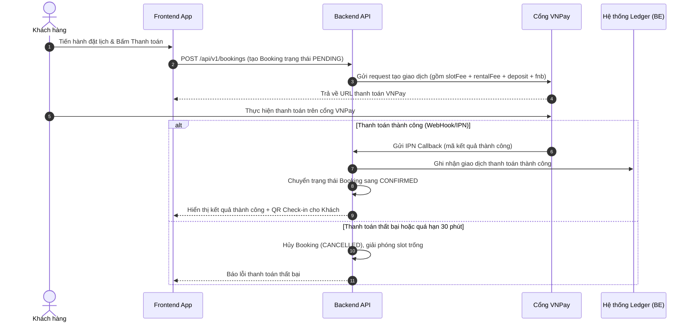

# 10 — Kế hoạch cho Analytics & Dashboard (Admin, Provider & Payment Flows)

Tài liệu này đặc tả chi tiết thiết kế hệ thống báo cáo số liệu (Analytics), mô tả các thành phần hiện tại trên **Admin Dashboard**, **Provider Dashboard**, giải nghĩa chi tiết các nguồn tiền trong hệ thống và định hình luồng xử lý thanh toán (Payment Flow) sẽ được tích hợp trong tương lai.

---

## 1. Dashboard của Admin Hiện Tại

Admin Dashboard đóng vai trò là trung tâm giám sát toàn bộ hoạt động của nền tảng RCField ở mức vĩ mô (Multi-tenant Platform). Các dữ liệu được tổng hợp từ tất cả các cơ sở/chi nhánh của mọi nhà cung cấp (Providers).

### 1.1. Các Chỉ số KPI Chính (Metrics)
Trên giao diện Admin hiện tại hiển thị 4 thẻ KPI cơ bản:
*   **Tổng số cơ sở (Total Cafes):** Tổng số lượng chi nhánh RC Cafe đã đăng ký trên hệ thống (bao gồm cả các chi nhánh đang chờ duyệt, đã duyệt và đang hoạt động).
*   **Tổng số người dùng (Total Users):** Tổng số tài khoản khách hàng (Customer), nhân viên (Staff) và chủ cửa hàng (Provider) đã đăng ký trong hệ thống.
*   **Doanh thu hàng tháng (Monthly Revenue):** Tổng doanh thu ước tính mà nền tảng thu được trong tháng (chủ yếu là phí đăng ký gói SaaS từ các Provider).
*   **Phiên chơi đang hoạt động (Active Sessions):** Số lượng ca chơi xe RC đang diễn ra trực tiếp tại tất cả các sân ở thời điểm hiện tại.

### 1.2. Các Biểu đồ Phân tích (Analytics Charts)
*   **Sự tăng trưởng của Đối tác (Cafe Growth Trend):** Biểu đồ dạng đường thẳng (Line Chart) thể hiện xu hướng số lượng chi nhánh mới đăng ký theo từng tháng (dữ liệu 6 tháng gần nhất).
*   **Doanh thu theo gói SaaS (SaaS Revenue by Plan):** Biểu đồ cột (Bar Chart) phân tích nguồn thu của Admin đến từ các gói dịch vụ phần mềm nào (ví dụ: Gói Basic, Standard, Premium) mà các Provider đăng ký mua.
*   **Lượng truy cập Sân chơi (Active Sessions Last 7 Days):** Biểu đồ vùng (Area Chart) theo dõi tổng lượng phiên chơi thực tế chạy hàng ngày trong 7 ngày gần nhất để đánh giá tần suất sử dụng dịch vụ.

### 1.3. Danh sách Đối tác Đăng ký Gần Đây (Recent Onboarding Table)
*   Bảng hiển thị danh sách các chi nhánh vừa tạo tài khoản cần Admin rà soát thông tin và phê duyệt hoạt động.
*   Các trường thông tin: `ID Cơ sở`, `Tên cơ sở`, `Chủ sở hữu (Provider)`, `Gói SaaS đăng ký`, `Trạng thái duyệt (Pending/Approved/Rejected)`, và `Ngày đăng ký`.

---

## 2. Dashboard của Provider Hiện Tại

Provider Dashboard cung cấp cái nhìn chi tiết và cụ thể về tình hình kinh doanh, dòng tiền và quản lý tài sản (đội xe) của một nhà cung cấp cụ thể (có thể chọn lọc theo từng chi nhánh hoặc xem toàn chuỗi).

### 2.1. Các Chỉ số KPI Chính (Metrics)
*   **Tổng doanh thu (Total Revenue):** Tổng lượng tiền phát sinh từ các dịch vụ (đã thu và đang giữ tạm tính - Held).
*   **Tổng lượt đặt (Total Bookings):** Số lượng đơn đặt lịch (ở tất cả các trạng thái: Pending, Confirmed, Completed, Cancelled).
*   **Tỷ lệ xe hoạt động (Vehicle Utilization Rate):** Tỷ lệ xe đang được thuê chơi thực tế trên tổng số xe sẵn có của chi nhánh (`Số xe đang chạy / Tổng số xe`).
*   **Khách hàng mới (New Customers):** Số lượng khách hàng lần đầu tiên đặt sân/thuê xe tại cửa hàng trong kỳ báo cáo.

### 2.2. Các Biểu đồ Phân tích (Analytics Charts)
*   **Xu hướng doanh thu (Revenue Trend):** Biểu đồ vùng chồng (Stacked Area Chart) phân tách chi tiết doanh thu theo thời gian (ngày/tuần/tháng) dựa trên 4 nguồn thu chính:
    1.  *Phí sân (Slot Fee)*
    2.  *Phí thuê xe (Rental Fee)*
    3.  *Phí F&B đặt trước (F&B Preorder)*
    4.  *Tiền đặt cọc giữ xe (Security Deposit)*
*   **Phân bổ doanh thu (Revenue Breakdown):** Biểu đồ hình tròn (Pie Chart) thể hiện tỷ trọng phần trăm đóng góp của từng nguồn thu vào tổng doanh thu của Provider.
*   **Hiệu suất chi nhánh (Branch Performance):** Biểu đồ cột ngang so sánh doanh thu và số lượng booking giữa các chi nhánh khác nhau thuộc cùng một Provider quản lý.
*   **Tình trạng đội xe (Fleet Status):** Thống kê trực quan số lượng xe theo trạng thái thực tế:
    *   *Sẵn sàng hoạt động (Available)*
    *   *Đang cho thuê trên sân (In Use)*
    *   *Đang bảo trì / sửa chữa (Maintenance)*

### 2.3. Danh sách Booking Gần Đây (Recent Bookings)
*   Bảng hiển thị thông tin nhanh của 8 lượt đặt sân mới nhất.
*   Các cột thông tin: `Chi nhánh`, `Tên khách hàng`, `Chế độ chơi (RENTAL / BYOC)`, `Thời gian bắt đầu slot`, `Trạng thái booking` và `Tổng tiền hóa đơn`.

---

## 3. Giải Nghĩa Chi Tiết các Nguồn Tiền (Financial Fields)

Để tránh hiểu nhầm và đảm bảo tính minh bạch tài chính trong hệ thống Ledger, dưới đây là bảng định nghĩa chi tiết cho từng trường tiền hiển thị trên giao diện và bản chất nghiệp vụ của chúng:

| Tên trường trên UI | Tên biến trong Code | Bản chất nguồn tiền (Ý nghĩa nghiệp vụ) | Phân loại kế toán |
| :--- | :--- | :--- | :--- |
| **Phí sân** | `slotFee` | Số tiền khách hàng trả để thuê làn đua/đường chạy (Track) trong các khung giờ đã chọn. Phí này tính theo Block thời gian (ví dụ: 30 phút/slot). | **Doanh thu thực tế** |
| **Phí thuê xe** | `rentalFee` | Phí thuê xe RC của cửa hàng để chơi. Được tính dựa trên giá thuê theo giờ của xe nhân với thời gian đặt chỗ. Xe thường được phân loại theo Tier (Thường, Cao cấp). | **Doanh thu thực tế** |
| **F&B Đặt trước** | `fnbPreorder` | Tiền đồ ăn, thức uống khách chọn mua kèm trong quá trình đặt lịch trực tuyến. Khoản tiền này sẽ được khóa lại và nhà bếp/lễ tân chuẩn bị sẵn khi khách đến. | **Doanh thu thực tế** |
| **Tiền đặt cọc** | `securityDeposit` | Khoản tiền cọc an toàn bắt buộc khi khách hàng chọn thuê xe của quán (nhằm bảo đảm nếu xảy ra va chạm, hư hại nặng). Khoản tiền này sẽ được **Hoàn trả lại** (Refund) cho khách sau khi Check-out nếu xe không bị hư hại gì. | **Tiền tạm giữ (Hold)** - *Không tính vào doanh thu thực tế trừ khi xảy ra đền bù.* |
| **Phí gia hạn** *(Sau này)* | `extensionFee` | Khoản phát sinh khi khách đang chơi và muốn gia hạn thêm giờ (được Staff đề xuất và khách đồng ý). Tiền này sẽ được tính và thanh toán lúc kết thúc phiên chơi (Settlement). | **Doanh thu thực tế** |
| **Phí đền bù hư hại** *(Sau này)* | `damageFee` | Số tiền khấu trừ trực tiếp từ Tiền đặt cọc (`securityDeposit`) nếu xe bị hỏng hóc trong phiên chơi dựa trên biên bản Check-out Inspection. Khoản này sẽ được chuyển cho Provider để sửa chữa xe. | **Doanh thu đền bù** / Chi phí khấu trừ |
| **Phí dịch vụ nền tảng** *(Sau này)* | `platformFee` / `commission` | Khoản hoa hồng (ví dụ: 2% đến 5%) trích từ tổng số tiền giao dịch thành công của Provider để trả cho Admin nền tảng RCField. | **Doanh thu của Admin** / Chi phí vận hành của Provider |
| **Thực nhận Provider** *(Sau này)* | `netPayout` | Số tiền thực tế Provider sẽ nhận được sau khi lấy Tổng doanh thu trừ đi Phí dịch vụ nền tảng (`platformFee`) và các khoản hoàn tiền/hủy lịch (`refunds`). | **Lợi nhuận ròng của đối tác** |

---

## 4. Luồng Thanh Toán & Đối Soát trong Tương Lai (Future Payment Flow)

Khi triển khai thực tế tích hợp cổng thanh toán (ví dụ: VNPay), hệ thống sẽ vận hành theo luồng tự động để đảm bảo tính an toàn dữ liệu và đồng bộ trạng thái Booking/Session.

### 4.1. Sơ đồ Luồng Thanh Toán Tổng Quát

### 4.2. Danh sách các API/Webhook cần gọi
Khi xây dựng module thanh toán, Backend và Frontend cần triển khai các API sau:

1.  **API Tạo đơn đặt và yêu cầu thanh toán:**
    *   **Endpoint:** `POST /api/v1/bookings`
    *   **Chức năng:** Tạo bản ghi Booking mới ở trạng thái `PENDING`. Tính toán tổng số tiền cần thanh toán tạm tính (Tổng tiền = Phí sân + Phí thuê xe + Tiền cọc giữ xe + F&B). Trả về liên kết cổng thanh toán VNPay.
2.  **API Xử lý kết quả VNPay trả về trực tiếp trên trình duyệt (Return URL):**
    *   **Endpoint:** `GET /api/v1/payments/vnpay-return`
    *   **Chức năng:** FE hứng kết quả từ redirect của VNPay để hiển thị giao diện thông báo cho người dùng (Thành công / Thất bại).
3.  **API Webhook của cổng thanh toán (IPN URL):**
    *   **Endpoint:** `GET/POST /api/v1/payments/vnpay-ipn`
    *   **Chức năng:** BE xử lý ngầm (Server-to-Server) để xác thực chữ ký số từ VNPay, ghi nhận tiền vào Ledger, cập nhật trạng thái Booking thành `CONFIRMED`.
4.  **API Quyết toán kết thúc ca chơi (Settle Session):**
    *   **Endpoint:** `POST /api/v1/sessions/:sessionId/settle`
    *   **Chức năng:** Gọi khi Staff tiến hành check-out cho khách. Hệ thống tự động so sánh:
        *   Nếu **không có hư hại** và **không phát sinh gia hạn/F&B phụ**: Tự động tạo lệnh hoàn cọc (`securityDeposit`) về tài khoản khách hàng.
        *   Nếu **có phát sinh** (tiền phạt hỏng xe `damageFee`, tiền chơi thêm `extensionFee`): Khấu trừ khoản phát sinh trực tiếp từ `securityDeposit`. Hoàn trả phần còn lại. Nếu phát sinh vượt quá tiền cọc, yêu cầu khách quét mã thanh toán thêm tại quầy.
5.  **API Yêu cầu giải ngân doanh thu cho Provider (Payout Request):**
    *   **Endpoint:** `POST /api/v1/provider/payout-requests`
    *   **Chức năng:** Cho phép Provider yêu cầu rút tiền từ tài khoản tích lũy (sau khi đã trừ đi Commission của nền tảng) về tài khoản ngân hàng của họ.
