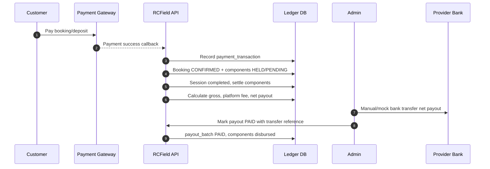
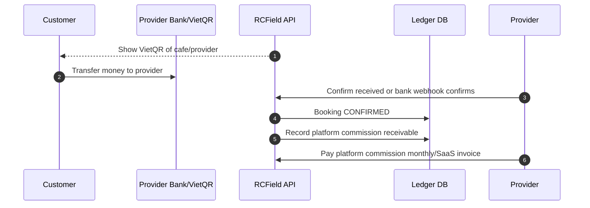
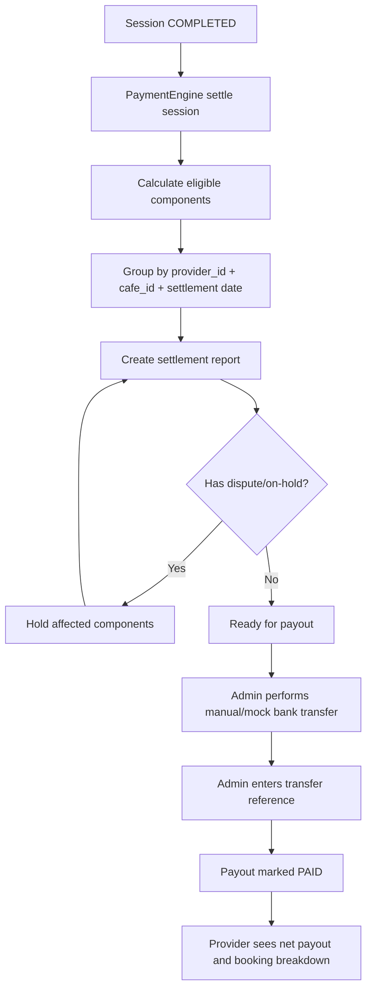

# BR-Revenue Payment Provider — Doanh thu chi nhánh, dòng tiền và payout

**Last updated**: 2026-06-04  
**Status**: Draft for mentor review  
**Owner**: Product/Backend/Finance Operations

> Tài liệu này phân tích các luồng tiền của RCField khi một Provider có nhiều
> chi nhánh, mỗi chi nhánh có đơn đặt riêng, doanh thu riêng và cần báo cáo
> minh bạch cho Customer, Staff, Provider và Admin.
>
> Mục tiêu Phase 1: đủ rõ để làm đồ án 4 người, có ledger minh bạch, nhưng
> không biến hệ thống thành ví điện tử hoặc trung gian thanh toán phức tạp.

---

## 1. Kết luận đề xuất cho team 4 người

**Đề xuất Phase 1:** Không làm ví nội bộ. Không giữ "số dư ví" cho Customer hoặc Provider.

Nên làm theo mô hình:

1. Customer thanh toán booking qua payment gateway hoặc mock gateway.
2. Hệ thống ghi nhận `payment_transactions` và `payment_components`.
3. Khi session completed, hệ thống tính:
   - doanh thu gross theo chi nhánh,
   - platform commission,
   - net amount phải chuyển cho Provider,
   - các khoản refund/damage/deposit.
4. Admin/Provider xem bảng settlement report.
5. Payout cho Provider ở Phase 1 là "manual bank transfer recorded by Admin" hoặc mock payout, không cần tự động chuyển tiền thật.

Lý do phù hợp:

| Tiêu chí | Vì sao nên làm ledger + manual/mock payout |
|---|---|
| Scope đồ án | 4 người vẫn làm được: booking, payment record, revenue report, payout status |
| Minh bạch | Mọi khoản tiền có component, transaction, branch, booking, session rõ ràng |
| Giảm rủi ro pháp lý | Không quảng bá là ví điện tử, không cho customer/provider giữ balance để rút |
| Dễ demo | Mentor thấy được luồng tiền end-to-end, doanh thu từng chi nhánh và hoa hồng |
| Dễ mở rộng | Sau này đổi sang VNPay/MoMo/VietQR/sub-merchant payout vẫn giữ ledger cũ |

---

## 2. Không nên làm ví nội bộ trong Phase 1

**BR-RP-001 — Không tạo Customer wallet**  
IF: Customer thanh toán booking  
THEN: Tiền đi qua gateway/payment transaction, không cộng vào ví customer.  
NOTE: Refund hiển thị là refund transaction hoặc refund record, không phải nạp tiền vào ví.

**BR-RP-002 — Không tạo Provider wallet rút tiền**  
IF: Provider có doanh thu  
THEN: Hệ thống hiển thị doanh thu và khoản phải payout, không tạo balance có thể rút như ví.  
NOTE: "Provider balance" dễ bị hiểu là ví điện tử/tiền lưu trữ, tăng rủi ro pháp lý và audit.

**BR-RP-003 — Chỉ làm ledger kế toán nội bộ**  
IF: Cần minh bạch dòng tiền  
THEN: Dùng `payment_components`, `payment_transactions`, `settlement_batches` đề xuất, và report.  
NOTE: Ledger là lịch sử tính toán/audit, không phải tài khoản tiền điện tử.

---

## 3. Ranh giới pháp lý và minh bạch dòng tiền

Phần này không phải tư vấn pháp lý chính thức, nhưng là phân tích rủi ro để chọn scope đồ án.

| Mô hình | Mô tả | Rủi ro | Khuyến nghị |
|---|---|---|---|
| Ví nội bộ | Customer nạp tiền, Provider có số dư, có rút tiền | Cao: dễ giống ví điện tử/trung gian thanh toán | Không làm Phase 1 |
| Platform thu hộ và chuyển lại | Customer trả vào tài khoản/platform gateway, platform settle cho provider | Trung bình: cần minh bạch, hợp đồng, đối soát | Có thể mock/manual trong đồ án |
| Customer trả thẳng Provider | VietQR/bank của từng chi nhánh/provider | Thấp hơn về giữ tiền, nhưng khó tự động thu commission | Có thể dùng cho F&B on-site hoặc fallback |
| Licensed PSP/sub-merchant | PSP xử lý split/payout cho từng provider | Tốt nhất production, phức tạp tích hợp | Ghi là future enhancement |

**BR-RP-010 — Mọi giao dịch phải truy vết được**  
IF: Có payment/refund/payout/commission  
THEN: Phải truy vết được theo `booking_id`, `session_id`, `cafe_id`, `provider_id`, `customer_id`, `component_type`, `transaction_id`.

**BR-RP-011 — Hoa hồng phải hiển thị trước khi settle**  
IF: Session sắp settle  
THEN: Provider/Admin phải xem được gross amount, platform fee, net payout, refund, damage, F&B excluded.

**BR-RP-012 — F&B on-site là dòng tiền ngoài platform**  
IF: Customer gọi món tại quán và trả tiền mặt/chuyển khoản trực tiếp  
THEN: Hệ thống chỉ ghi nhận doanh thu vận hành của chi nhánh, không tính platform fee và không payout.

---

## 4. Doanh thu theo Provider và từng chi nhánh

### 4.1 Nguyên tắc phân bổ

**BR-RP-020 — Doanh thu thuộc chi nhánh phát sinh đơn**  
IF: Booking thuộc `cafe_id = Cafe A`  
THEN: Tất cả doanh thu slot/rental/F&B/pre-order/extension/damage của booking/session đó được gắn về Cafe A.  
NOTE: Provider xem tổng chuỗi, nhưng mỗi chi nhánh phải có P&L riêng.

**BR-RP-021 — Provider là owner tổng hợp**  
IF: Provider có nhiều cafe  
THEN: Dashboard provider hiển thị:
- Tổng doanh thu toàn provider.
- Breakdown theo từng cafe.
- Breakdown theo component: slot, rental, extension, damage, F&B.
- Commission platform.
- Net payout.

**BR-RP-022 — Staff chỉ xem phạm vi chi nhánh**  
IF: Staff thuộc Cafe A  
THEN: Staff chỉ xem booking/session/order của Cafe A; không xem doanh thu Cafe B.

### 4.2 Ví dụ Provider có 2 chi nhánh

Provider `RC Speed VN` có:

| Cafe | Thành phố | Ghi chú |
|---|---|---|
| Cafe A - Quận 1 | HCM | đông khách rental |
| Cafe B - Thủ Đức | HCM | nhiều BYOC |

Ngày 2026-06-04:

| Booking | Cafe | Customer | Components | Gross | Platform fee | Net provider |
|---|---|---|---|---:|---:|---:|
| BK-001 | Cafe A | Minh | Slot 100k + Rental 300k + Ext 50k | 450k | 0 | 450k |
| BK-002 | Cafe A | An | Slot 100k + F&B preorder 60k | 160k | 0 | 160k |
| BK-003 | Cafe B | Khoa | Slot 120k BYOC | 120k | 0 | 120k |

Ghi chú tính phí:

- Platform fee bằng **0** trên mọi component. Provider nhận trọn số tiền khách trả.
- Nền tảng thu tiền của Provider qua **phí thuê bao SaaS** và **phí tổ chức giải**,
  hai khoản này nằm ngoài dòng tiền booking.

Tổng ngày:

| Cafe | Gross revenue | Platform fee | Net payout | F&B direct/preorder |
|---|---:|---:|---:|---:|
| Cafe A | 610k | 0 | 610k | 60k |
| Cafe B | 120k | 0 | 120k | 0 |
| Provider total | 730k | 0 | 730k | 60k |

---

## 5. Quản lý chi tiết từng đơn cho từng actor

### 5.1 Customer view

Customer cần thấy "tôi đã trả gì, còn phải trả gì, vì sao bị trừ tiền".

| Màn hình | Thông tin |
|---|---|
| Booking detail | Cafe, slot, xe thuê, F&B preorder, trạng thái booking |
| Payment detail | Deposit, slot fee, rental fee, F&B, promotion, tổng đã thanh toán |
| Session detail | Check-in time, xe thực tế, extension, check-out evidence |
| Final receipt | Tổng phí, deposit applied/refunded, damage nếu có, refund nếu có |

**BR-RP-030 — Customer receipt theo component**  
IF: Booking/session completed  
THEN: Customer receipt phải hiển thị từng component, không chỉ tổng tiền.

Ví dụ receipt customer:

```text
Booking BK-001 - Cafe A
Slot fee:          100,000
Rental fee:        300,000
Extension fee:      50,000
F&B preorder:        0
Damage charge:       0
Promotion:           0
-------------------------
Total charge:       450,000
Deposit paid:       300,000
Checkout paid:      150,000
Final paid:         450,000
```

### 5.2 Staff/Cafe view

Staff cần thao tác đơn, không cần thấy toàn bộ tài chính provider.

| Màn hình | Thông tin |
|---|---|
| Today bookings | Booking code, customer, slot, mode, status |
| Check-in queue | Booking confirmed, QR/code, xe cần chuẩn bị |
| Active sessions | Session active, planned end, extension/F&B |
| Checkout queue | Xe cần inspect, damage, amount due |
| Cafe order list | F&B preorder và on-site của chi nhánh |

**BR-RP-031 — Staff view ưu tiên vận hành**  
IF: User role là Staff  
THEN: UI ưu tiên check-in/out, order, inspection; doanh thu chỉ ở mức ca/ngày của chi nhánh nếu provider cấp quyền.

### 5.3 Provider view

Provider cần quản lý chuỗi và từng chi nhánh.

| Màn hình | Thông tin |
|---|---|
| Provider dashboard | Tổng booking, gross, fee, net payout, dispute, refund |
| Branch dashboard | Doanh thu từng cafe, top vehicles, F&B, utilization |
| Settlement report | Các booking đã settle, fee, net payout |
| Payout profile | Tài khoản ngân hàng nhận tiền |
| Booking drilldown | Xem từng đơn, session, evidence, payment breakdown |

**BR-RP-032 — Provider drill-down từ tổng về đơn**  
IF: Provider thấy doanh thu ngày/tháng  
THEN: Provider phải drill-down được: Provider total -> Cafe -> Booking -> Session -> PaymentComponent.

### 5.4 Admin view

Admin cần đối soát và xử lý rủi ro.

| Màn hình | Thông tin |
|---|---|
| Payment transactions | Gateway status, raw ref, amount |
| Settlement queue | Session completed chờ payout |
| Payout batches | Batch theo provider/cafe/cycle |
| Dispute/incident | Evidence, damage charge, final amount |
| Audit log | Ai thay đổi payout/status/refund |

---

## 6. Các luồng payment có thể chọn

### Option A — Customer trả vào platform, platform settle cho Provider



Ưu điểm:

- Demo đẹp: hệ thống kiểm soát được end-to-end.
- Tính commission tự động rõ.
- Provider xem được net payout.

Nhược điểm:

- Production cần pháp lý/hợp đồng/PSP rõ vì platform đang thu hộ.

**Khuyến nghị:** Dùng Option A ở mức mock/manual cho đồ án.

### Option B — Customer trả thẳng vào tài khoản Provider/chi nhánh



Ưu điểm:

- Platform không giữ tiền khách.
- Dễ giải thích pháp lý hơn.

Nhược điểm:

- Khó tự động thu commission.
- Provider có thể quên/chậm trả commission.
- Cần đối soát chuyển khoản.

**Khuyến nghị:** Dùng làm fallback hoặc cho F&B on-site, không phải luồng chính nếu muốn demo commission rõ.

### Option C — Licensed PSP/sub-merchant payout

Payment gateway hỗ trợ split settlement hoặc marketplace payout cho từng provider.

Ưu điểm:

- Production tốt nhất.
- Platform không tự xử lý chuyển tiền thủ công.

Nhược điểm:

- Tích hợp phức tạp, cần hồ sơ merchant/sub-merchant, KYC.
- Quá nặng cho team đồ án 4 người.

**Khuyến nghị:** Ghi là future enhancement.

---

## 7. Provider payout config

**BR-RP-040 — Provider phải cấu hình payout profile**  
IF: Provider muốn nhận payout  
THEN: Provider cần cấu hình payout profile trước khi được mark `ACTIVE` hoặc trước booking đầu tiên.

Thông tin đề xuất:

| Field | Mô tả |
|---|---|
| `provider_id` | Provider owner |
| `default_bank_name` | Ngân hàng nhận tiền |
| `default_bank_account_no_masked` | Số tài khoản đã mask khi hiển thị |
| `default_bank_account_holder` | Tên chủ tài khoản |
| `tax_code` | MST nếu có |
| `settlement_cycle` | MANUAL, DAILY, WEEKLY |
| `payout_method` | MANUAL_BANK_TRANSFER, MOCK_GATEWAY |
| `verification_status` | PENDING, VERIFIED, REJECTED |
| `verified_by`, `verified_at` | Admin xác minh |

**BR-RP-041 — Branch payout override là optional**  
IF: Provider muốn mỗi chi nhánh nhận tiền vào tài khoản riêng  
THEN: Cho phép `cafe_payout_profile` override profile provider.  
NOTE: Phase 1 có thể chưa cần bảng riêng, chỉ cần revenue report theo cafe và payout về provider-level bank.

**BR-RP-042 — Không payout khi còn dispute nghiêm trọng**  
IF: Session có dispute/damage chưa resolved  
THEN: Khoản liên quan giữ ở trạng thái `PENDING_SETTLEMENT` hoặc `ON_HOLD` trong report.

---

## 8. Luồng payout đề xuất Phase 1



**BR-RP-050 — Settlement report theo chu kỳ**  
IF: Đến cuối ngày hoặc cuối tuần  
THEN: Hệ thống gom các session đã completed thành settlement report theo provider/cafe.

**BR-RP-051 — Payout amount**  
```
gross_revenue = SLOT_FEE + RENTAL_FEE + EXTENSION_FEE + DAMAGE_CHARGE
              + FNB_PREORDER + FNB_ON_SITE + CONTEST_ENTRY_FEE
platform_fee = 0                      ← platform_fee_pct đặt cứng bằng 0
net_payout = gross_revenue - refunds - provider_penalties
```

NOTE: F&B on-site không nằm trong `net_payout` vì customer trả trực tiếp tại quán.

**BR-RP-052 — Payout status**  
Mỗi payout/report nên có status:

```text
DRAFT -> READY -> PAID
                 -> ON_HOLD
                 -> CANCELLED
```

---

## 9. Ví dụ luồng tiền end-to-end

### Case 1 — Rental bình thường, không damage

Customer đặt ở Cafe A:

| Component | Amount | Commission? |
|---|---:|---|
| Slot fee | 100,000 | Yes |
| Rental fee | 300,000 | Yes |
| Security deposit | 300,000 | No |
| Extension fee | 50,000 | Yes |
| F&B preorder | 60,000 | No |

Khi checkout không damage:

```text
gross_revenue = 100,000 + 300,000 + 50,000 + 60,000 = 510,000
commission_base = 100,000 + 300,000 + 50,000 = 450,000
platform_fee = 450,000 * 15% = 67,500
net_payout_to_provider = 510,000 - 67,500 = 442,500
security_deposit = released/applied theo payment engine, không tính doanh thu
```

### Case 2 — BYOC chỉ đặt sân

Customer đặt Cafe B, mang xe riêng:

| Component | Amount | Commission? |
|---|---:|---|
| Slot fee | 120,000 | Yes |
| Rental fee | 0 | No |
| Security deposit | 0 | No |
| F&B preorder | 0 | No |

```text
gross_revenue = 120,000
platform_fee = 120,000 * 15% = 18,000
net_payout_to_provider = 102,000
```

### Case 3 — F&B on-site trong lúc chơi

Customer gọi nước 80,000 tại Cafe A và trả tiền mặt cho Staff.

```text
platform_payment = 0
platform_fee = 0
payout = 0
cafe_operational_revenue += 80,000
```

NOTE: Vẫn nên ghi vào `fnb_orders` để provider thấy doanh thu thật của chi nhánh,
nhưng không đưa vào settlement/payout.

### Case 4 — Damage có tranh chấp

Customer bị đánh dấu damage 300,000 nhưng phản đối.

```text
damage_component = not disbursed yet
related deposit/payment = ON_HOLD
incident/dispute = OPEN
payout report = hold only affected booking/session
other bookings of same provider = still payout normally
```

Sau khi Admin resolve:

- Provider win: tạo/confirm `DAMAGE_CHARGE`, đưa vào commission base.
- Customer win: waive damage, không tính damage, release affected hold.

---

## 10. Data model đề xuất thêm nếu làm sâu hơn

Spec hiện tại có `payment_components`, `payment_transactions`, `disbursed_to`,
`disbursed_at`. Để báo cáo/payout rõ hơn, có thể thêm trong Phase 1 hoặc Phase 1.5:

### `provider_payout_profiles`

```text
id
provider_id
bank_name
bank_account_no_encrypted
bank_account_no_last4
bank_account_holder
tax_code
settlement_cycle
payout_method
verification_status
verified_by
verified_at
created_at / updated_at
```

### `settlement_batches`

```text
id
provider_id
cafe_id nullable
period_start
period_end
gross_amount
commission_amount
refund_amount
net_payout_amount
status
transfer_reference
paid_at
created_by
created_at / updated_at
```

### `settlement_items`

```text
id
settlement_batch_id
booking_id
session_id
payment_component_id
component_type
gross_amount
commission_amount
net_amount
status
created_at
```

Nếu team muốn giữ scope nhỏ hơn, có thể không tạo 3 bảng này ngay. Thay vào đó:

- Dùng query/report từ `payment_components`.
- Thêm `disbursed_to`, `disbursed_at`, `note`.
- Admin export report và mark thủ công.

---

## 11. Scope khuyến nghị cho đồ án 4 người

### Must-have

| Module | Mục tiêu |
|---|---|
| Payment component ledger | Tạo component theo booking/session |
| Payment transaction log | Ghi gateway/mock payment |
| Branch revenue report | Gross, fee, net theo cafe |
| Provider dashboard | Tổng provider và drill-down chi nhánh |
| Customer receipt | Chi tiết component từng đơn |
| Manual/mock payout | Admin mark payout paid với transfer ref |

### Should-have

| Module | Mục tiêu |
|---|---|
| Provider payout profile | Provider cấu hình tài khoản ngân hàng |
| Settlement batch | Gom payout theo ngày/tuần |
| Dispute hold | Hold booking có dispute, không block toàn provider |

### Not-now

| Module | Lý do |
|---|---|
| Customer wallet | Rủi ro pháp lý, nặng scope |
| Provider wallet withdraw | Dễ thành ví/rút tiền, cần compliance |
| Auto bank payout thật | Cần PSP/bank API, KYC, bảo mật cao |
| Split payment production | Cần gateway hỗ trợ marketplace/sub-merchant |
| Tax invoice nâng cao | Có thể để phase sau |

---

## 12. Luồng trình bày với mentor

Nên trình bày theo thứ tự:

1. RCField không làm ví, chỉ làm payment ledger và settlement report.
2. Booking/session nào phát sinh ở chi nhánh nào thì doanh thu thuộc chi nhánh đó.
3. Provider xem tổng chuỗi, drill-down từng chi nhánh và từng đơn.
4. Platform fee tính trên slot/rental/extension/damage, không tính deposit và F&B.
5. Payout Phase 1 là manual/mock bank transfer để phù hợp đồ án.
6. Production có thể nâng cấp sang PSP/sub-merchant payout mà không đổi booking/session core.

Thông điệp chính:

```text
RCField ưu tiên minh bạch dòng tiền hơn là làm ví.
Mọi khoản tiền được audit bằng component ledger.
Mỗi chi nhánh có doanh thu riêng, Provider nhận báo cáo tổng và payout theo chu kỳ.
```
