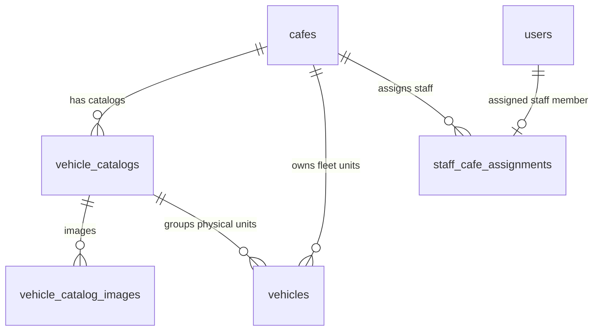

# Data Model: Vehicle Catalogs & Physical Units

**Date**: 2026-05-30

---

## Table of Contents

1. [vehicle_catalogs](#1-vehicle_catalogs)
2. [vehicle_catalog_images](#2-vehicle_catalog_images)
3. [vehicles](#3-vehicles)
4. [staff_cafe_assignments](#4-staff_cafe_assignments)
5. [Relationships](#5-relationships)

---

## 1. `vehicle_catalogs`

Represents the catalog of vehicle models that a cafe owns. Users rent a catalog model, not a specific unit.

### Fields

| Column | Type | Constraints | Notes |
|--------|------|-------------|-------|
| `id` | `UUID` | PK, DEFAULT gen_random_uuid() | |
| `cafe_id` | `UUID` | FK → `cafes.id`, NOT NULL | |
| `name` | `VARCHAR(255)` | NOT NULL | |
| `description` | `TEXT` | NULLABLE | |
| `tier` | `VARCHAR(50)` | NOT NULL, DEFAULT `STANDARD` | STANDARD, PRO, etc. |
| `hourly_rate` | `DECIMAL(15,2)` | NOT NULL | |
| `security_deposit` | `DECIMAL(15,2)` | NOT NULL | |
| `damage_multiplier` | `DECIMAL(3,2)` | NOT NULL, DEFAULT 1.0 | |
| `compatible_track_types` | `TEXT[]` | NOT NULL, DEFAULT '{}'::text[] | |
| `cover_image_url` | `TEXT` | NULLABLE | |
| `created_at` | `TIMESTAMPTZ` | NOT NULL, DEFAULT now() | |
| `updated_at` | `TIMESTAMPTZ` | NOT NULL, DEFAULT now() | |
| `deleted_at` | `TIMESTAMPTZ` | NULLABLE | Soft delete |

---

## 2. `vehicle_catalog_images`

Stores catalog detail images. Renamed from `vehicle_images` to distinguish it from physical vehicle assets.

### Fields

| Column | Type | Constraints | Notes |
|--------|------|-------------|-------|
| `id` | `UUID` | PK, DEFAULT gen_random_uuid() | |
| `catalog_id` | `UUID` | FK → `vehicle_catalogs.id`, NOT NULL | Cascade delete |
| `url` | `TEXT` | NOT NULL | |
| `sort_order` | `INT` | NOT NULL, DEFAULT 0 | |
| `created_at` | `TIMESTAMPTZ` | NOT NULL, DEFAULT now() | |

---

## 3. `vehicles` (Physical Units)

Represents individual physical vehicles (units) in the field. Tracks operation metrics (color, status, distinctive images, notes, maintenance dates).

### Fields

| Column | Type | Constraints | Notes |
|--------|------|-------------|-------|
| `id` | `UUID` | PK, DEFAULT gen_random_uuid() | |
| `cafe_id` | `UUID` | FK → `cafes.id`, NOT NULL | |
| `catalog_id` | `UUID` | FK → `vehicle_catalogs.id`, NOT NULL | |
| `status` | `ENUM` | NOT NULL, DEFAULT `AVAILABLE` | See enum values below |
| `last_maintenance_at` | `TIMESTAMPTZ` | NULLABLE | |
| `identifier` | `VARCHAR(100)` | NULLABLE | Unique ID/Plate on the vehicle |
| `color` | `VARCHAR(50)` | NULLABLE | |
| `distinctive_image_url`| `TEXT` | NULLABLE | Distinctive unit-level image |
| `notes` | `TEXT` | NULLABLE | Operation notes: "new motor", "scratched body" |
| `metadata` | `JSONB` | NULLABLE, DEFAULT '{}'::jsonb | Extensible fields (motor type, body shell) |
| `created_at` | `TIMESTAMPTZ` | NOT NULL, DEFAULT now() | |
| `updated_at` | `TIMESTAMPTZ` | NOT NULL, DEFAULT now() | |
| `deleted_at` | `TIMESTAMPTZ` | NULLABLE | Soft delete |

### Enum: `VehicleStatus`

```typescript
enum VehicleStatus {
  AVAILABLE   = 'AVAILABLE',
  IN_USE      = 'IN_USE',
  MAINTENANCE = 'MAINTENANCE',
  RETIRED     = 'RETIRED',
}
```

### State Transitions

```
AVAILABLE ─────(Requires repair)──────► MAINTENANCE
MAINTENANCE ───(Repair completed)─────► AVAILABLE
AVAILABLE ─────(Rented by Customer)───► IN_USE
IN_USE ────────(Returned)─────────────► AVAILABLE
AVAILABLE ─────(Retired/Damaged)──────► RETIRED
```

---

## 4. `staff_cafe_assignments`

Links `STAFF` users to cafes. Enables authorization where Staff can perform operations for vehicles in their assigned cafe.

### Fields

| Column | Type | Constraints | Notes |
|--------|------|-------------|-------|
| `id` | `UUID` | PK | |
| `staff_id` | `UUID` | FK → `users.id`, UNIQUE, NOT NULL | One staff to one cafe at a time |
| `cafe_id` | `UUID` | FK → `cafes.id`, NOT NULL | |
| `assigned_at` | `TIMESTAMPTZ` | NOT NULL, DEFAULT now() | |
| `assigned_by` | `UUID` | FK → `users.id`, NOT NULL | PROVIDER or ADMIN |

---

## 5. Relationships


