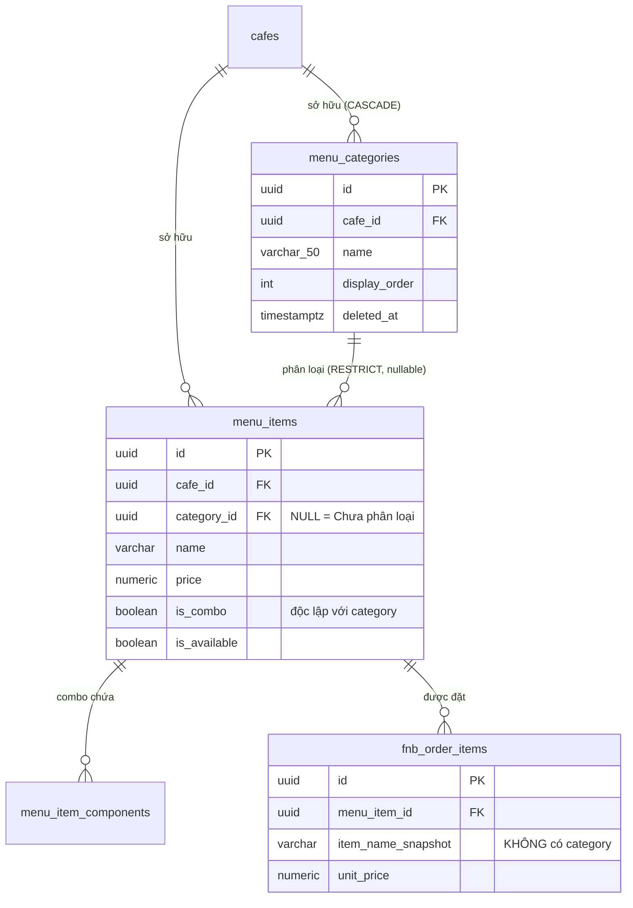

# Data Model — Danh mục F&B do Provider tự tạo

**Feature**: `specs/017-custom-menu-categories` | **Date**: 2026-07-25

---

## 1. Bảng mới: `menu_categories`

| Cột | Kiểu | Ràng buộc | Ý nghĩa |
|---|---|---|---|
| `id` | `UUID` | PK, `DEFAULT gen_random_uuid()` | Định danh danh mục |
| `cafe_id` | `UUID` | `NOT NULL`, FK → `cafes(id)` `ON DELETE CASCADE` | Chi nhánh sở hữu. Danh mục **luôn** thuộc đúng một chi nhánh (FR-005) |
| `name` | `VARCHAR(50)` | `NOT NULL` | Tên hiển thị do Provider nhập (FR-008: ≤50 ký tự) |
| `display_order` | `INT` | `NOT NULL`, `DEFAULT 0` | Thứ tự hiển thị, nhỏ hơn đứng trước (FR-004) |
| `created_at` | `TIMESTAMPTZ` | `NOT NULL`, `DEFAULT now()` | Bắt buộc theo Constitution |
| `updated_at` | `TIMESTAMPTZ` | `NOT NULL`, `DEFAULT now()` | Bắt buộc theo Constitution |
| `deleted_at` | `TIMESTAMPTZ` | `NULL` | Xóa mềm, bắt buộc theo Constitution |

### Index

```sql
-- Truy vấn chính: liệt kê danh mục của một chi nhánh theo thứ tự
CREATE INDEX "IDX_menu_categories_cafe_id" ON "menu_categories" ("cafe_id");

-- Chống trùng tên trong phạm vi chi nhánh, BỎ QUA bản ghi đã xóa mềm.
-- Mệnh đề WHERE là bắt buộc: nếu thiếu, Provider sẽ không tạo lại được
-- danh mục vừa xóa cùng tên (vi phạm FR-006 + acceptance scenario US1-8).
CREATE UNIQUE INDEX "UQ_menu_categories_cafe_name"
  ON "menu_categories" ("cafe_id", lower(btrim("name")))
  WHERE "deleted_at" IS NULL;
```

`lower(btrim(name))` thực thi trực tiếp quy tắc so sánh của FR-006: không phân biệt hoa/thường, bỏ khoảng trắng thừa hai đầu.

### Entity TypeORM

```typescript
// rcfeild-be/src/models/menu-category.entity.ts
@Entity('menu_categories')
@Index(['cafeId'])
export class MenuCategory {
  @PrimaryGeneratedColumn('uuid')
  id: string;

  @Column({ name: 'cafe_id', type: 'uuid' })
  cafeId: string;

  @Column({ type: 'varchar', length: 50 })
  name: string;

  @Column({ name: 'display_order', type: 'int', default: 0 })
  displayOrder: number;

  @CreateDateColumn({ name: 'created_at', type: 'timestamptz' })
  createdAt: Date;

  @UpdateDateColumn({ name: 'updated_at', type: 'timestamptz' })
  updatedAt: Date;

  @DeleteDateColumn({ name: 'deleted_at', type: 'timestamptz' })
  deletedAt: Date | null;
}
```

> Không cần đăng ký entity thủ công — `src/config/database.ts:19` glob sẵn `models/**/*.entity.{ts,js}`.

---

## 2. Bảng sửa: `menu_items`

| Thay đổi | Trước | Sau |
|---|---|---|
| Cột phân loại | `category` kiểu `fnb_category_enum` (nullable) | `category_id` kiểu `UUID` (nullable), FK → `menu_categories(id)` `ON DELETE RESTRICT` |
| Type Postgres | `fnb_category_enum` tồn tại | **Đã DROP** |

```sql
ALTER TABLE "menu_items"
  ADD COLUMN "category_id" UUID NULL,
  ADD CONSTRAINT "FK_menu_items_category"
    FOREIGN KEY ("category_id") REFERENCES "menu_categories"("id")
    ON DELETE RESTRICT;

CREATE INDEX "IDX_menu_items_category_id" ON "menu_items" ("category_id");
```

**⚠️ `ON DELETE RESTRICT` KHÔNG thực thi FR-015.** Xóa danh mục trong luồng nghiệp vụ là **xóa mềm** — `UPDATE ... SET deleted_at = now()`, không phải `DELETE` (xem cơ chế hiện hành ở `menu.service.ts:182`). `RESTRICT` chỉ kích hoạt trên `DELETE` thật, nên nó **không bao giờ chạy** khi Provider bấm xóa danh mục. Giá trị thật của nó chỉ là chặn thao tác xóa cứng ngoài luồng (script dọn dữ liệu, sửa tay trên DB) làm mồ côi `menu_items.category_id`.

**Thực thi FR-015 hoàn toàn nằm ở tầng service**: đếm món rồi trả `409 CATEGORY_NOT_EMPTY`. Không có lớp dự phòng nào ở DB — đây là lý do test T014 không được nới lỏng.

### Entity sau khi sửa

```typescript
// rcfeild-be/src/models/menu-item.entity.ts — phần thay đổi
// BỎ:  @Column({ type: 'enum', enum: FnbCategory, nullable: true })
//      category: FnbCategory | null;
// THÊM:
@Column({ name: 'category_id', type: 'uuid', nullable: true })
categoryId: string | null;
```

Cờ `is_combo` **giữ nguyên không đổi** — nó là thuộc tính độc lập với danh mục (FR-014), phục vụ hiển thị thành phần combo và luật cấm lồng combo.

---

## 3. Migration

**File**: `rcfeild-be/src/migrations/1784500000000-CustomMenuCategories.ts`

### `up()` — thứ tự bắt buộc

```sql
-- 1. Tạo bảng danh mục
CREATE TABLE "menu_categories" (
  "id"            UUID NOT NULL DEFAULT gen_random_uuid(),
  "cafe_id"       UUID NOT NULL,
  "name"          VARCHAR(50) NOT NULL,
  "display_order" INT NOT NULL DEFAULT 0,
  "created_at"    TIMESTAMP WITH TIME ZONE NOT NULL DEFAULT now(),
  "updated_at"    TIMESTAMP WITH TIME ZONE NOT NULL DEFAULT now(),
  "deleted_at"    TIMESTAMP WITH TIME ZONE NULL,
  CONSTRAINT "PK_menu_categories" PRIMARY KEY ("id"),
  CONSTRAINT "FK_menu_categories_cafe"
    FOREIGN KEY ("cafe_id") REFERENCES "cafes"("id") ON DELETE CASCADE
);

CREATE INDEX "IDX_menu_categories_cafe_id" ON "menu_categories" ("cafe_id");

CREATE UNIQUE INDEX "UQ_menu_categories_cafe_name"
  ON "menu_categories" ("cafe_id", lower(btrim("name")))
  WHERE "deleted_at" IS NULL;

-- 2. Thêm khóa ngoại trên menu_items
ALTER TABLE "menu_items"
  ADD COLUMN "category_id" UUID NULL,
  ADD CONSTRAINT "FK_menu_items_category"
    FOREIGN KEY ("category_id") REFERENCES "menu_categories"("id")
    ON DELETE RESTRICT;

CREATE INDEX "IDX_menu_items_category_id" ON "menu_items" ("category_id");

-- 3. Bỏ cột enum cũ. KHÔNG map dữ liệu — mọi món về "Chưa phân loại" (FR-025).
ALTER TABLE "menu_items" DROP COLUMN "category";

-- 4. Bỏ type enum. An toàn vì đã xác minh chỉ menu_items.category tham chiếu nó.
DROP TYPE IF EXISTS "fnb_category_enum";
```

### `down()` — có mất mát dữ liệu

```sql
CREATE TYPE "fnb_category_enum" AS ENUM ('FOOD','DRINK','SNACK','DESSERT','COMBO','OTHER');
ALTER TABLE "menu_items" ADD COLUMN "category" "fnb_category_enum" NULL;
ALTER TABLE "menu_items" DROP CONSTRAINT "FK_menu_items_category";
DROP INDEX IF EXISTS "IDX_menu_items_category_id";
ALTER TABLE "menu_items" DROP COLUMN "category_id";
DROP TABLE IF EXISTS "menu_categories";
```

> ⚠️ **Rollback không khôi phục được phân loại.** Cột `category` được tạo lại với toàn bộ giá trị `NULL`, và mọi danh mục Provider đã tạo sẽ mất cùng bảng `menu_categories`. Đây là hệ quả không tránh được của quyết định không giữ dữ liệu cũ; phải ghi rõ trong mô tả PR.

---

## 4. Quy tắc nghiệp vụ trên dữ liệu

| Quy tắc | Nguồn | Thực thi ở đâu |
|---|---|---|
| Tên không rỗng, 1–50 ký tự sau khi trim | FR-007, FR-008 | zod (`validate/index.ts`) + `VARCHAR(50) NOT NULL` |
| Không trùng tên trong chi nhánh (bỏ qua bản ghi đã xóa) | FR-006 | Partial unique index + kiểm tra trước ở service để trả lỗi tiếng Việt |
| Tối đa 30 danh mục mỗi chi nhánh | FR-008 | Service đếm bản ghi chưa xóa trước khi INSERT |
| Danh mục phải cùng chi nhánh với món | FR-012 | Service kiểm tra `category.cafeId === item.cafeId` |
| Không xóa danh mục còn món | FR-015 | Service đếm (409) + `ON DELETE RESTRICT` |
| Đếm món khi chặn xóa **không** lọc `is_available` | FR-015 | `WHERE category_id = :id AND deleted_at IS NULL` |
| Danh mục mới rơi xuống cuối | Assumptions | Service gán `display_order = COALESCE(MAX(display_order), -1) + 1` |
| Chỉ Provider sở hữu chi nhánh được ghi | FR-009 | Middleware router + `getManagedCafeOrThrow` |

---

## 5. Quy tắc truy vấn

**Sắp xếp menu** (thay cho `ORDER BY item.is_combo, item.category NULLS LAST, item.name` hiện tại ở `menu.service.ts:121-123`):

```sql
ORDER BY
  (mc.id IS NULL) ASC,        -- danh mục có tên trước, "Chưa phân loại" cuối (FR-019)
  mc.display_order ASC,        -- theo thứ tự Provider đặt (FR-018)
  mc.created_at ASC,           -- ổn định khi trùng display_order
  mi.name ASC
```

**Lọc theo danh mục** (thay `WHERE item.category = :category` ở `menu.service.ts:111`):

| Giá trị `category_id` | Điều kiện |
|---|---|
| bỏ trống | không lọc |
| uuid hợp lệ | `mi.category_id = :categoryId` |
| `none` | `mi.category_id IS NULL` |

Giá trị `none` là bắt buộc: ngay sau khi triển khai, **toàn bộ** món của mọi chi nhánh nằm trong nhóm "Chưa phân loại" (FR-025), nên Provider cần lọc đúng nhóm này để gán lại.

**Ẩn danh mục rỗng khỏi màn hình khách** (FR-021): không lọc ở SQL mà nhóm ở tầng hiển thị — danh mục không có món nào trong tập kết quả thì không sinh ra nhóm. Cách này xử lý đúng cả FR-021 (khách không thấy danh mục rỗng) lẫn edge case "Chưa phân loại rỗng thì ẩn", mà không cần truy vấn riêng.

---

## 6. Sơ đồ quan hệ



Quan hệ `menu_items → fnb_order_items` trong sơ đồ minh họa lý do FR-024 thành lập: đơn đã phát sinh chụp lại tên món và giá, không tham chiếu danh mục, nên mọi thay đổi danh mục dừng lại ở `menu_items`.

---

## 7. Thực thể không đổi

- `menu_item_components` — quan hệ combo ↔ thành phần, không liên quan danh mục.
- `fnb_orders`, `fnb_order_items` — **không sửa cột nào**. Đây là điều kiện để FR-024 và SC-005 thành lập.
- `cafes` — không thêm cột; quan hệ một-nhiều nằm ở phía `menu_categories`.
